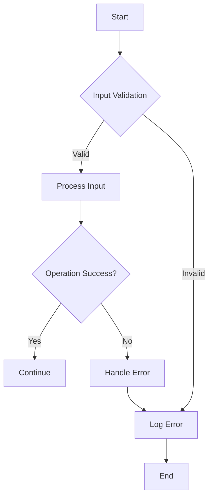

## 11.9 Error Handling in Systems Programming

Error handling is a critical aspect of systems programming, where the stability and reliability of software are paramount. In this section, we will delve into the intricacies of error handling in the D programming language, focusing on strategies that ensure robust and maintainable systems. We will explore the trade-offs between exceptions and error codes, the principles of defensive programming, and the importance of logging and diagnostics.

### Exceptions vs. Error Codes

#### Trade-offs

In systems programming, choosing between exceptions and error codes is a fundamental decision that impacts the design and performance of your application. Let's explore the trade-offs involved:

- **Exceptions**: 
  - **Pros**: Simplify error propagation, separate error handling from regular code, and provide stack unwinding.
  - **Cons**: Can introduce overhead, complicate control flow, and are not always suitable for low-level systems programming.
  
- **Error Codes**:
  - **Pros**: Offer predictable performance, are explicit, and can be used in `nothrow` functions.
  - **Cons**: Can clutter code, require manual propagation, and increase the risk of unhandled errors.

#### `nothrow` Functions

In D, you can declare functions as `nothrow` to guarantee that they do not throw exceptions. This is particularly useful in systems programming, where performance and predictability are crucial.

```d
nothrow int divide(int a, int b) {
    if (b == 0) {
        return -1; // Error code for division by zero
    }
    return a / b;
}
```

In this example, the `divide` function uses an error code to handle division by zero, ensuring that it remains `nothrow`.

### Defensive Programming

Defensive programming is a proactive approach to error handling that involves anticipating potential issues and designing systems to handle them gracefully.

#### Validating Inputs

Input validation is the first line of defense against errors. By ensuring that inputs meet expected criteria, you can prevent many errors from occurring.

```d
void processInput(string input) {
    if (input.length == 0) {
        throw new Exception("Input cannot be empty");
    }
    // Further processing
}
```

#### Fail-Safe Mechanisms

Designing fail-safe mechanisms involves creating systems that can recover from errors without catastrophic failure. This may include fallback procedures or redundancy.

```d
void readFile(string filename) {
    try {
        auto file = File(filename, "r");
        // Read file contents
    } catch (Exception e) {
        // Fallback to default configuration
        logError("Failed to read file: " ~ e.msg);
    }
}
```

### Logging and Diagnostics

Effective logging and diagnostics are essential for identifying and resolving issues in systems programming.

#### Event Logging

Event logging involves recording significant events and errors to facilitate troubleshooting and auditing.

```d
void logError(string message) {
    import std.datetime;
    auto timestamp = Clock.currTime.toISOExtString();
    writeln("ERROR [", timestamp, "]: ", message);
}
```

#### Debugging Aids

Incorporating diagnostic checks and assertions can help catch errors early in the development process.

```d
void calculate(int value) {
    assert(value >= 0, "Value must be non-negative");
    // Perform calculations
}
```

### Use Cases and Examples

#### Robust Services

Building robust services requires a combination of error handling strategies to ensure stability under adverse conditions.

```d
void startService() {
    try {
        initializeResources();
        runServiceLoop();
    } catch (Exception e) {
        logError("Service encountered an error: " ~ e.msg);
        // Attempt to restart service
    }
}
```

#### Debugging Complex Issues

Facilitating easier troubleshooting involves providing detailed error messages and maintaining comprehensive logs.

```d
void complexOperation() {
    try {
        // Perform complex operation
    } catch (Exception e) {
        logError("Complex operation failed: " ~ e.msg);
        // Additional diagnostic information
    }
}
```

### Visualizing Error Handling Strategies

To better understand the flow of error handling in systems programming, let's visualize the process using a flowchart.



**Figure 1**: This flowchart illustrates a typical error handling process, starting with input validation, followed by processing, and error handling if necessary.

### References and Links

For further reading on error handling in systems programming, consider the following resources:

- [D Programming Language Documentation](https://dlang.org/)
- [Effective C++: 55 Specific Ways to Improve Your Programs and Designs](https://www.amazon.com/Effective-Specific-Improve-Programs-Designs/dp/0321334876)
- [The Pragmatic Programmer: Your Journey To Mastery](https://www.amazon.com/Pragmatic-Programmer-journey-mastery-Anniversary/dp/0135957052)

### Knowledge Check

To reinforce your understanding of error handling in systems programming, consider the following questions:

1. What are the main trade-offs between using exceptions and error codes in systems programming?
2. How can `nothrow` functions improve performance and predictability in D?
3. Why is input validation important in defensive programming?
4. What role does logging play in error handling and diagnostics?
5. How can fail-safe mechanisms enhance the robustness of a system?

### Embrace the Journey

Remember, mastering error handling in systems programming is a journey. As you continue to explore and experiment with different strategies, you'll develop a deeper understanding of how to build robust and reliable systems. Keep learning, stay curious, and enjoy the process!

## Quiz Time!



### What is a key advantage of using exceptions over error codes?

- [x] Simplifies error propagation
- [ ] Reduces code size
- [ ] Increases performance
- [ ] Eliminates the need for error handling

> **Explanation:** Exceptions simplify error propagation by separating error handling from regular code flow.

### What is the primary benefit of `nothrow` functions in D?

- [x] They guarantee that no exceptions are thrown
- [ ] They improve code readability
- [ ] They enhance error messages
- [ ] They reduce code complexity

> **Explanation:** `nothrow` functions guarantee that no exceptions are thrown, which is crucial for performance and predictability.

### Why is input validation crucial in defensive programming?

- [x] It prevents many errors from occurring
- [ ] It simplifies code logic
- [ ] It enhances code readability
- [ ] It eliminates the need for error handling

> **Explanation:** Input validation prevents many errors by ensuring that inputs meet expected criteria before processing.

### What is the purpose of event logging in systems programming?

- [x] To record significant events and errors for troubleshooting
- [ ] To improve code performance
- [ ] To enhance user experience
- [ ] To reduce code complexity

> **Explanation:** Event logging records significant events and errors, facilitating troubleshooting and auditing.

### How do fail-safe mechanisms contribute to system robustness?

- [x] By allowing systems to recover from errors without catastrophic failure
- [ ] By eliminating the need for error handling
- [ ] By simplifying code logic
- [ ] By enhancing code readability

> **Explanation:** Fail-safe mechanisms allow systems to recover from errors gracefully, enhancing robustness.

### What is a common disadvantage of using error codes?

- [x] They can clutter code and require manual propagation
- [ ] They simplify error handling
- [ ] They improve code performance
- [ ] They eliminate the need for exceptions

> **Explanation:** Error codes can clutter code and require manual propagation, increasing the risk of unhandled errors.

### How can assertions aid in debugging?

- [x] By catching errors early in the development process
- [ ] By improving code performance
- [ ] By enhancing code readability
- [ ] By reducing code complexity

> **Explanation:** Assertions catch errors early, helping developers identify and fix issues during development.

### What is a key consideration when designing robust services?

- [x] Combining multiple error handling strategies
- [ ] Eliminating all error handling
- [ ] Simplifying code logic
- [ ] Enhancing code readability

> **Explanation:** Designing robust services involves combining multiple error handling strategies to ensure stability.

### What is the role of detailed error messages in troubleshooting?

- [x] They facilitate easier troubleshooting by providing context
- [ ] They improve code performance
- [ ] They enhance user experience
- [ ] They reduce code complexity

> **Explanation:** Detailed error messages provide context, making it easier to troubleshoot and resolve issues.

### True or False: Defensive programming eliminates the need for error handling.

- [ ] True
- [x] False

> **Explanation:** Defensive programming does not eliminate the need for error handling; it complements it by anticipating potential issues.


