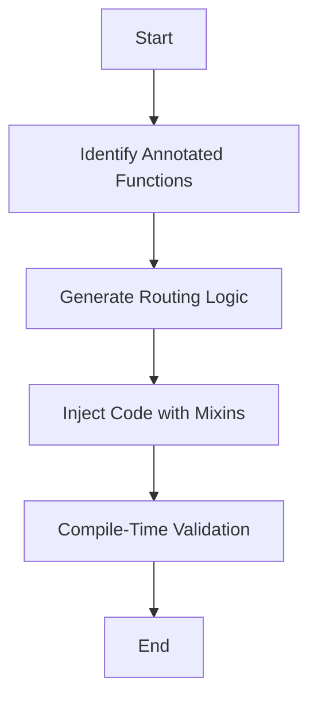
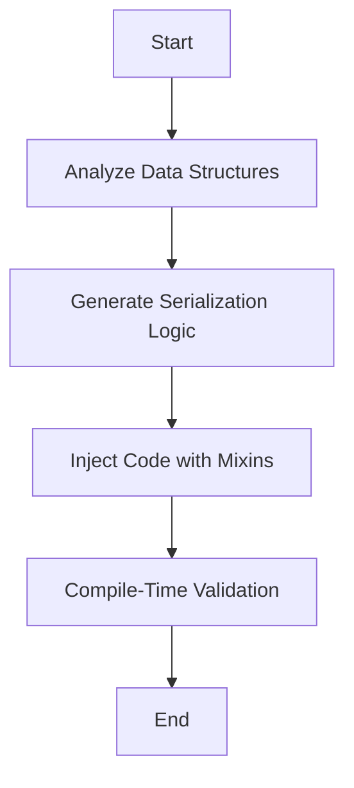

## 12.10 Case Studies in Metaprogramming

Metaprogramming in the D programming language offers powerful capabilities for creating efficient, maintainable, and scalable software systems. In this section, we delve into real-world case studies that demonstrate the practical applications of metaprogramming in D. We will explore how metaprogramming is utilized in web frameworks and serialization libraries, discuss the successes and challenges encountered, and derive best practices to guide future projects.

### Real-World Examples

#### Web Frameworks: Generating Routing Tables and Handlers at Compile Time

Web frameworks are essential for building modern web applications, and metaprogramming can significantly enhance their performance and flexibility. In this case study, we examine how a web framework leverages D's metaprogramming features to generate routing tables and handlers at compile time.

**Concept Overview**

In traditional web frameworks, routing tables are often defined at runtime, which can introduce overhead and complexity. By using metaprogramming, we can generate these tables at compile time, reducing runtime overhead and improving performance.

**Implementation Details**

1. **Compile-Time Reflection**: Utilize D's compile-time reflection capabilities to inspect and generate routing tables based on annotated functions.

2. **Mixins for Code Generation**: Use mixins to inject generated code into the application, creating efficient routing handlers.

3. **Templates for Flexibility**: Implement templates to allow developers to define custom routing logic while maintaining type safety.

**Code Example**

```d
import std.meta;
import std.traits;

// Define a route attribute
struct Route(string path) {}

// Example of a handler function with a route
@Route("/home")
void homeHandler() {
    // Handle the home route
}

// Compile-time function to generate routing table
mixin(generateRoutingTable!(__traits(allMembers, __traits(parent))));

template generateRoutingTable(string[] members) {
    static foreach (member; members) {
        static if (isFunction!(__traits(getMember, __traits(parent), member))) {
            static if (__traits(getAttributes, __traits(getMember, __traits(parent), member)).length > 0) {
                // Generate routing logic based on attributes
                mixin("void " ~ member ~ "Router() { " ~ member ~ "(); }");
            }
        }
    }
}
```

**Benefits Achieved**

- **Performance Improvement**: By generating routing tables at compile time, the framework reduces runtime overhead, leading to faster request handling.
- **Type Safety**: Compile-time generation ensures that routing logic is type-safe and free from runtime errors.
- **Flexibility**: Developers can easily define custom routes using templates and annotations.

#### Serialization Libraries: Automatically Handling Various Data Formats

Serialization is a common requirement in software systems, and metaprogramming can simplify the process of handling multiple data formats. This case study explores how a serialization library uses D's metaprogramming features to automate serialization and deserialization.

**Concept Overview**

Serialization libraries often need to support various data formats, such as JSON, XML, and binary. Metaprogramming allows us to automatically generate serialization code based on data structures, reducing boilerplate and improving maintainability.

**Implementation Details**

1. **Compile-Time Introspection**: Use compile-time introspection to analyze data structures and generate serialization code.

2. **String Mixins for Code Injection**: Employ string mixins to inject serialization logic into data structures.

3. **Template Constraints**: Utilize template constraints to ensure that only serializable types are processed.

**Code Example**

```d
import std.traits;
import std.conv;

// Define a serializable attribute
struct Serializable {}

// Example of a serializable struct
@Serializable
struct User {
    string name;
    int age;
}

// Compile-time function to generate serialization code
mixin(generateSerialization!(__traits(allMembers, __traits(parent))));

template generateSerialization(string[] members) {
    static foreach (member; members) {
        static if (isAggregateType!(__traits(getMember, __traits(parent), member))) {
            static if (__traits(getAttributes, __traits(getMember, __traits(parent), member)).length > 0) {
                // Generate serialization logic
                mixin("string serialize" ~ member ~ "() { return to!string(" ~ member ~ "); }");
            }
        }
    }
}
```

**Benefits Achieved**

- **Reduced Boilerplate**: Automatically generating serialization code reduces the need for repetitive boilerplate code.
- **Maintainability**: Changes to data structures automatically propagate to serialization logic, improving maintainability.
- **Format Flexibility**: The library can easily support new data formats by extending the metaprogramming logic.

### Lessons Learned

#### Successes

1. **Efficiency Gains**: Both case studies demonstrate significant efficiency gains by leveraging compile-time code generation, reducing runtime overhead, and improving performance.

2. **Enhanced Maintainability**: Metaprogramming reduces boilerplate code, making the codebase easier to maintain and extend.

3. **Type Safety**: Compile-time checks ensure that generated code is type-safe, reducing the likelihood of runtime errors.

#### Challenges

1. **Complexity**: Metaprogramming can introduce complexity, making the code harder to understand for developers unfamiliar with the techniques.

2. **Debugging Difficulties**: Debugging compile-time generated code can be challenging, requiring specialized tools and techniques.

3. **Learning Curve**: Developers need to invest time in learning metaprogramming concepts and techniques to effectively utilize them.

**Resolution Strategies**

- **Documentation and Training**: Provide comprehensive documentation and training to help developers understand and apply metaprogramming techniques.

- **Tooling Support**: Invest in tooling and debugging support to simplify the development and debugging of metaprogramming code.

- **Incremental Adoption**: Encourage incremental adoption of metaprogramming techniques, allowing developers to gradually build expertise.

### Best Practices Derived

#### Generalizing Learnings

1. **Start Small**: Begin with small, well-defined metaprogramming tasks to build confidence and expertise.

2. **Leverage D's Features**: Fully utilize D's metaprogramming features, such as templates, mixins, and compile-time reflection, to maximize benefits.

3. **Focus on Maintainability**: Prioritize maintainability by minimizing complexity and providing clear documentation.

4. **Encourage Collaboration**: Foster collaboration and knowledge sharing among team members to spread expertise and best practices.

5. **Continuous Learning**: Stay updated with the latest developments in metaprogramming and the D language to continuously improve skills and techniques.

### Try It Yourself

To deepen your understanding of metaprogramming in D, try modifying the code examples provided in this section. Experiment with different annotations, data structures, and serialization formats to see how the metaprogramming logic adapts. Consider implementing additional features, such as custom error handling or support for new data formats, to further enhance the functionality.

### Visualizing Metaprogramming Concepts

To better understand the flow of metaprogramming in D, let's visualize the process of generating routing tables and serialization code using Mermaid.js diagrams.

#### Routing Table Generation Flow



**Description**: This diagram illustrates the flow of generating routing tables at compile time. It starts with identifying annotated functions, generating routing logic, injecting code with mixins, and validating at compile time.

#### Serialization Code Generation Flow



**Description**: This diagram represents the process of generating serialization code. It involves analyzing data structures, generating serialization logic, injecting code with mixins, and validating at compile time.

### References and Links

- [D Language Metaprogramming](https://dlang.org/spec/template.html)
- [Compile-Time Function Execution in D](https://dlang.org/spec/expression.html#ctfe)
- [Mixins in D Programming](https://dlang.org/spec/template-mixin.html)
- [Reflection and Traits in D](https://dlang.org/phobos/std_traits.html)

### Knowledge Check

To reinforce your understanding of metaprogramming in D, consider the following questions and challenges:

1. How can metaprogramming improve the performance of web frameworks?
2. What are the benefits of using compile-time reflection in serialization libraries?
3. Describe a scenario where metaprogramming might introduce complexity.
4. How can you ensure maintainability when using metaprogramming techniques?
5. What strategies can help overcome the challenges of debugging metaprogramming code?

### Embrace the Journey

Remember, mastering metaprogramming in D is a journey. As you experiment with the techniques and concepts discussed in this section, you'll gain valuable insights and skills that will enhance your software development capabilities. Keep exploring, stay curious, and enjoy the process of learning and growing as a developer.

## Quiz Time!



### How does metaprogramming improve the performance of web frameworks?

- [x] By generating routing tables at compile time
- [ ] By increasing runtime overhead
- [ ] By adding more runtime checks
- [ ] By reducing compile-time checks

> **Explanation:** Metaprogramming improves performance by generating routing tables at compile time, reducing runtime overhead.

### What is a key benefit of using compile-time reflection in serialization libraries?

- [x] It reduces boilerplate code
- [ ] It increases runtime errors
- [ ] It complicates the codebase
- [ ] It limits data format support

> **Explanation:** Compile-time reflection reduces boilerplate code by automatically generating serialization logic.

### What challenge might arise when using metaprogramming?

- [x] Increased complexity
- [ ] Simplified debugging
- [ ] Reduced learning curve
- [ ] Decreased code maintainability

> **Explanation:** Metaprogramming can introduce complexity, making the code harder to understand.

### How can maintainability be ensured when using metaprogramming techniques?

- [x] By providing clear documentation
- [ ] By avoiding documentation
- [ ] By increasing code complexity
- [ ] By using runtime checks

> **Explanation:** Clear documentation helps ensure maintainability when using metaprogramming techniques.

### What strategy can help overcome the challenges of debugging metaprogramming code?

- [x] Investing in tooling support
- [ ] Avoiding tooling support
- [ ] Increasing code complexity
- [ ] Reducing compile-time checks

> **Explanation:** Tooling support simplifies the development and debugging of metaprogramming code.

### What is a benefit of using templates in web frameworks?

- [x] They allow for custom routing logic
- [ ] They increase runtime errors
- [ ] They limit flexibility
- [ ] They reduce type safety

> **Explanation:** Templates allow for custom routing logic while maintaining type safety.

### What is a key advantage of using mixins for code generation?

- [x] They inject generated code efficiently
- [ ] They complicate the codebase
- [ ] They increase runtime overhead
- [ ] They reduce compile-time checks

> **Explanation:** Mixins efficiently inject generated code into the application.

### How can developers gradually build expertise in metaprogramming?

- [x] By starting with small tasks
- [ ] By avoiding metaprogramming
- [ ] By increasing code complexity
- [ ] By reducing documentation

> **Explanation:** Starting with small tasks helps developers gradually build expertise in metaprogramming.

### What is a common use of compile-time introspection in serialization libraries?

- [x] Analyzing data structures
- [ ] Increasing runtime errors
- [ ] Complicating the codebase
- [ ] Limiting data format support

> **Explanation:** Compile-time introspection is used to analyze data structures and generate serialization logic.

### True or False: Metaprogramming can reduce the need for repetitive boilerplate code.

- [x] True
- [ ] False

> **Explanation:** Metaprogramming reduces the need for repetitive boilerplate code by automating code generation.




