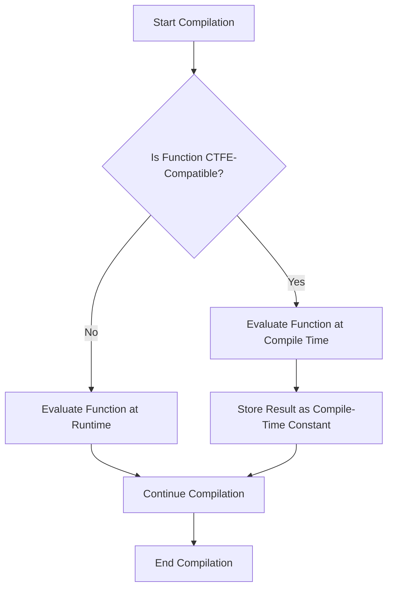

## 12.2 Compile-Time Function Execution (CTFE)

Compile-Time Function Execution (CTFE) is a powerful feature of the D programming language that allows certain functions to be evaluated at compile time. This capability can lead to more efficient and safer code by allowing computations to be performed during compilation rather than at runtime. In this section, we will explore the mechanics of CTFE, its limitations, practical applications, and provide use cases and examples to illustrate its utility in advanced systems programming.

### CTFE Mechanics

#### Evaluating Functions at Compile Time

CTFE in D allows functions to be executed during the compilation process, enabling the creation of compile-time constants and the performance of complex computations without runtime overhead. To leverage CTFE, a function must adhere to certain constraints:

- **Pure Functions**: Functions must be pure, meaning they do not have side effects and depend only on their input parameters.
- **No I/O Operations**: Functions cannot perform input/output operations as these are inherently runtime activities.
- **No Runtime Constructs**: Functions cannot use runtime constructs such as dynamic memory allocation or exceptions.

**Example: A Simple Compile-Time Function**

```d
// A simple function to compute the factorial of a number at compile time
int factorial(int n) {
    return n <= 1 ? 1 : n * factorial(n - 1);
}

enum int fiveFactorial = factorial(5); // Computed at compile time
```

In this example, the `factorial` function is evaluated at compile time, and the result is stored in the `fiveFactorial` enum, making it a compile-time constant.

#### Limitations of CTFE

While CTFE is a powerful tool, it has its limitations:

- **Complexity and Recursion Depth**: Deep recursion or complex computations may exceed the compiler's capabilities, leading to errors.
- **Memory Usage**: The memory available for CTFE is limited compared to runtime, which can restrict the size of data structures used.
- **Language Features**: Not all language features are available during CTFE, such as certain standard library functions that rely on runtime behavior.

### Practical Applications

#### Static Initialization

CTFE is particularly useful for static initialization, where complex data structures or constants need to be initialized at compile time. This can lead to significant performance improvements by eliminating runtime initialization overhead.

**Example: Compile-Time Array Initialization**

```d
// Function to generate a compile-time array of squares
int[] generateSquares(int n) {
    int[] squares = new int[n];
    for (int i = 0; i < n; ++i) {
        squares[i] = i * i;
    }
    return squares;
}

enum int[] squaresArray = generateSquares(10); // Array initialized at compile time
```

In this example, the `generateSquares` function creates an array of squares at compile time, which can be used as a static constant throughout the program.

#### Compile-Time Assertions

Compile-time assertions are a powerful way to enforce conditions during compilation, ensuring that certain assumptions hold true before the program is even run.

**Example: Compile-Time Assertion**

```d
// Compile-time assertion to ensure a condition is met
static assert(factorial(5) == 120, "Factorial calculation is incorrect!");
```

This assertion checks that the factorial of 5 is correctly computed at compile time, providing an error message if the condition is not met.

### Use Cases and Examples

#### Embedded Systems

In embedded systems, where resources are limited, CTFE can be used to precompute values and reduce runtime computation, leading to more efficient code execution.

**Example: Precomputing Lookup Tables**

```d
// Function to generate a sine lookup table at compile time
double[] generateSineTable(int size) {
    double[] table = new double[size];
    foreach (i; 0 .. size) {
        table[i] = sin(2 * PI * i / size);
    }
    return table;
}

enum double[] sineTable = generateSineTable(256); // Precomputed sine table
```

By precomputing a sine lookup table at compile time, we can avoid costly trigonometric calculations during runtime, which is especially beneficial in performance-critical embedded applications.

#### Metaprogramming Tasks

CTFE can be leveraged in metaprogramming tasks to generate code based on compile-time logic, allowing for more flexible and dynamic code generation.

**Example: Compile-Time Code Generation**

```d
// Function to generate a string of repeated characters at compile time
string repeatChar(char c, int times) {
    return times <= 0 ? "" : c ~ repeatChar(c, times - 1);
}

enum string repeatedChars = repeatChar('A', 5); // Generates "AAAAA" at compile time
```

This example demonstrates how CTFE can be used to generate a string of repeated characters at compile time, which can be utilized in various metaprogramming scenarios.

### Visualizing CTFE

To better understand how CTFE works, let's visualize the process of compile-time function execution using a flowchart.



**Diagram Description**: This flowchart illustrates the decision-making process during compilation. If a function is CTFE-compatible, it is evaluated at compile time, and the result is stored as a compile-time constant. Otherwise, the function is evaluated at runtime.

### Try It Yourself

To deepen your understanding of CTFE, try modifying the code examples provided:

- Change the input parameters of the `factorial` function and observe how the compile-time constant changes.
- Experiment with different array sizes in the `generateSquares` function to see how CTFE handles larger data structures.
- Create your own compile-time functions and assertions to explore the boundaries of CTFE.

### References and Links

For further reading on CTFE and related topics, consider the following resources:

- [D Programming Language Documentation](https://dlang.org/)
- [CTFE in D: An Overview](https://dlang.org/spec/function.html#ctfe)
- [Metaprogramming in D](https://dlang.org/spec/template.html)

### Knowledge Check

Before moving on, let's summarize the key takeaways from this section:

- CTFE allows functions to be evaluated at compile time, enabling the creation of compile-time constants and reducing runtime overhead.
- Functions must be pure and free of side effects to be eligible for CTFE.
- CTFE is useful for static initialization, compile-time assertions, and metaprogramming tasks.
- While powerful, CTFE has limitations in terms of complexity, memory usage, and available language features.

### Embrace the Journey

Remember, mastering CTFE is a journey. As you continue to explore the capabilities of the D programming language, you'll discover new ways to leverage compile-time function execution to create efficient, high-performance software. Keep experimenting, stay curious, and enjoy the process!

## Quiz Time!



### What is the primary benefit of using CTFE in D programming?

- [x] Reducing runtime overhead by performing computations at compile time
- [ ] Allowing functions to perform I/O operations during compilation
- [ ] Enabling dynamic memory allocation at compile time
- [ ] Supporting runtime exception handling

> **Explanation:** CTFE reduces runtime overhead by allowing computations to be performed at compile time, resulting in more efficient code execution.

### Which of the following is a requirement for a function to be eligible for CTFE?

- [x] The function must be pure and free of side effects
- [ ] The function must perform I/O operations
- [ ] The function must use dynamic memory allocation
- [ ] The function must handle exceptions

> **Explanation:** Functions must be pure and free of side effects to be eligible for CTFE, as they rely solely on their input parameters.

### What is a common use case for CTFE in embedded systems?

- [x] Precomputing values to reduce runtime computation
- [ ] Performing I/O operations during compilation
- [ ] Handling runtime exceptions
- [ ] Allocating dynamic memory

> **Explanation:** In embedded systems, CTFE is commonly used to precompute values, reducing runtime computation and improving performance.

### What is a limitation of CTFE?

- [x] Limited memory usage compared to runtime
- [ ] Ability to perform I/O operations
- [ ] Support for dynamic memory allocation
- [ ] Handling exceptions during compilation

> **Explanation:** CTFE has limited memory usage compared to runtime, which can restrict the size of data structures used.

### Which of the following is an example of a compile-time assertion?

- [x] `static assert(factorial(5) == 120, "Factorial calculation is incorrect!");`
- [ ] `assert(factorial(5) == 120, "Factorial calculation is incorrect!");`
- [ ] `if (factorial(5) != 120) { throw new Exception("Factorial calculation is incorrect!"); }`
- [ ] `try { factorial(5); } catch { writeln("Error in calculation"); }`

> **Explanation:** `static assert` is used for compile-time assertions, ensuring conditions are met during compilation.

### What is the role of CTFE in metaprogramming tasks?

- [x] Generating code based on compile-time logic
- [ ] Performing I/O operations during compilation
- [ ] Handling runtime exceptions
- [ ] Allocating dynamic memory

> **Explanation:** CTFE is used in metaprogramming tasks to generate code based on compile-time logic, allowing for more flexible and dynamic code generation.

### How does CTFE contribute to static initialization?

- [x] By creating complex data structures or constants at compile time
- [ ] By performing I/O operations during compilation
- [ ] By handling runtime exceptions
- [ ] By allocating dynamic memory

> **Explanation:** CTFE contributes to static initialization by creating complex data structures or constants at compile time, eliminating runtime initialization overhead.

### What is a key characteristic of a function that can be executed at compile time?

- [x] It must be pure and have no side effects
- [ ] It must perform I/O operations
- [ ] It must use dynamic memory allocation
- [ ] It must handle exceptions

> **Explanation:** A function must be pure and have no side effects to be executed at compile time, relying solely on its input parameters.

### What is the purpose of the `static assert` statement in D?

- [x] To enforce conditions during compilation
- [ ] To perform runtime assertions
- [ ] To handle exceptions during compilation
- [ ] To allocate dynamic memory

> **Explanation:** The `static assert` statement is used to enforce conditions during compilation, ensuring that certain assumptions hold true.

### True or False: CTFE allows for dynamic memory allocation during compilation.

- [ ] True
- [x] False

> **Explanation:** False. CTFE does not allow for dynamic memory allocation during compilation, as it relies on compile-time constants and pure functions.


