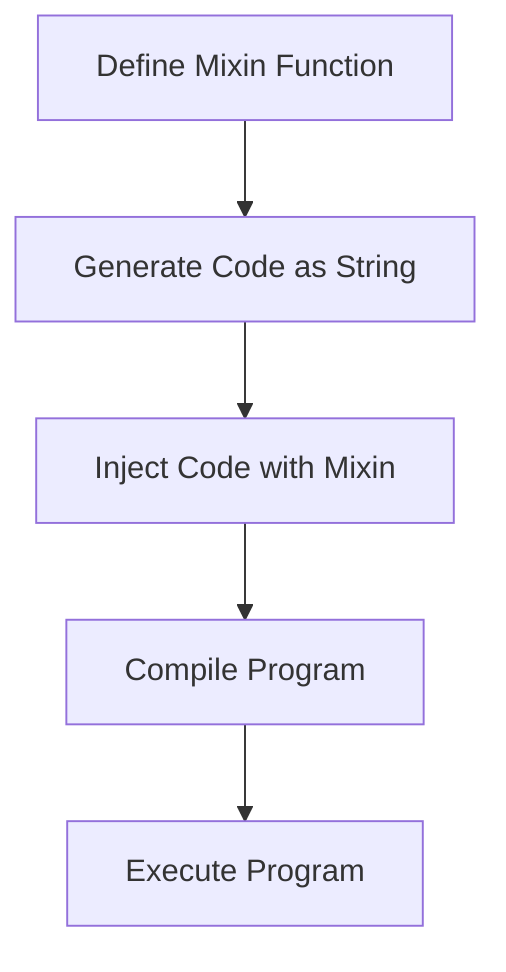

## 12.3 Mixins and Embedded DSLs

In the realm of advanced systems programming, the D programming language offers powerful tools for metaprogramming, notably through the use of mixins and embedded domain-specific languages (DSLs). These features enable developers to generate code dynamically and create specialized languages tailored to specific tasks, enhancing both flexibility and expressiveness in software development. In this section, we will delve into the concepts of string mixins and embedded DSLs, explore their advantages and risks, and provide practical use cases and examples to illustrate their application.

### String Mixins in D

String mixins in D allow developers to inject code into their programs at compile time. This feature is particularly useful for generating repetitive or boilerplate code, reducing manual coding effort, and minimizing errors. By leveraging string mixins, developers can create more concise and maintainable codebases.

#### Code Generation with String Mixins

String mixins enable code generation by allowing developers to construct code snippets as strings and then inject them into the program. This approach is particularly beneficial when dealing with repetitive patterns or when the code structure can be determined at compile time.

**Example: Generating Getter and Setter Methods**

```d
import std.stdio;

class Person {
    mixin(generateGetterSetter!("name", "string"));
    mixin(generateGetterSetter!("age", "int"));
}

string generateGetterSetter(string fieldName, string fieldType) {
    return q{
        private } ~ fieldType ~ ` ` ~ fieldName ~ `;
        
        public ` ~ fieldType ~ ` get` ~ capitalize(fieldName) ~ `() {
            return ` ~ fieldName ~ `;
        }
        
        public void set` ~ capitalize(fieldName) ~ `(` ~ fieldType ~ ` value) {
            ` ~ fieldName ~ ` = value;
        }
    `;
}

string capitalize(string s) {
    return s[0..1].toUpper() ~ s[1..$];
}

void main() {
    auto person = new Person();
    person.setName("Alice");
    person.setAge(30);
    writeln("Name: ", person.getName());
    writeln("Age: ", person.getAge());
}
```

In this example, the `generateGetterSetter` function constructs getter and setter methods for specified fields. The mixin keyword is used to inject these methods into the `Person` class at compile time.

#### Embedded DSLs with String Mixins

Embedded DSLs allow developers to create specialized languages within their programs, tailored to specific domains or tasks. By using string mixins, developers can define syntax and semantics that closely align with the problem domain, making the code more expressive and easier to understand.

**Example: SQL Query Builder**

```d
import std.stdio;

class QueryBuilder {
    string tableName;
    string[] columns;
    string condition;

    mixin(generateSelectQuery());

    void setTable(string name) {
        tableName = name;
    }

    void setColumns(string[] cols) {
        columns = cols;
    }

    void setCondition(string cond) {
        condition = cond;
    }
}

string generateSelectQuery() {
    return q{
        public string buildQuery() {
            string query = "SELECT " ~ columns.join(", ") ~ " FROM " ~ tableName;
            if (condition.length > 0) {
                query ~= " WHERE " ~ condition;
            }
            return query;
        }
    };
}

void main() {
    auto queryBuilder = new QueryBuilder();
    queryBuilder.setTable("employees");
    queryBuilder.setColumns(["id", "name", "position"]);
    queryBuilder.setCondition("position = 'Manager'");
    writeln(queryBuilder.buildQuery());
}
```

In this example, the `generateSelectQuery` function creates a method for building SQL `SELECT` queries. The mixin keyword injects this method into the `QueryBuilder` class, allowing developers to construct SQL queries dynamically.

### Advantages and Risks of Mixins and Embedded DSLs

#### Advantages

1. **Flexibility**: Mixins and embedded DSLs provide a flexible way to extend the language's capabilities, allowing developers to add powerful features with minimal syntax.

2. **Code Reusability**: By generating code dynamically, developers can create reusable components that reduce duplication and improve maintainability.

3. **Domain-Specific Abstractions**: Embedded DSLs enable developers to create abstractions that closely align with the problem domain, making the code more intuitive and easier to understand.

#### Risks

1. **Maintainability Concerns**: Generated code can be difficult to understand and debug, especially if the mixin logic is complex or poorly documented.

2. **Compile-Time Errors**: Errors in the generated code may not be immediately apparent, leading to compile-time issues that can be challenging to diagnose.

3. **Performance Overhead**: While mixins can improve code clarity, they may introduce performance overhead if not used judiciously.

### Use Cases and Examples

#### SQL Query Builders

SQL query builders are a common use case for embedded DSLs. By using string mixins, developers can create a DSL that allows them to construct SQL queries programmatically, reducing the risk of syntax errors and improving code readability.

**Example: Advanced SQL Query Builder**

```d
import std.stdio;

class AdvancedQueryBuilder {
    string tableName;
    string[] columns;
    string condition;
    string orderBy;
    int limit;

    mixin(generateAdvancedSelectQuery());

    void setTable(string name) {
        tableName = name;
    }

    void setColumns(string[] cols) {
        columns = cols;
    }

    void setCondition(string cond) {
        condition = cond;
    }

    void setOrderBy(string order) {
        orderBy = order;
    }

    void setLimit(int lim) {
        limit = lim;
    }
}

string generateAdvancedSelectQuery() {
    return q{
        public string buildQuery() {
            string query = "SELECT " ~ columns.join(", ") ~ " FROM " ~ tableName;
            if (condition.length > 0) {
                query ~= " WHERE " ~ condition;
            }
            if (orderBy.length > 0) {
                query ~= " ORDER BY " ~ orderBy;
            }
            if (limit > 0) {
                query ~= " LIMIT " ~ to!string(limit);
            }
            return query;
        }
    };
}

void main() {
    auto queryBuilder = new AdvancedQueryBuilder();
    queryBuilder.setTable("employees");
    queryBuilder.setColumns(["id", "name", "position"]);
    queryBuilder.setCondition("position = 'Manager'");
    queryBuilder.setOrderBy("name ASC");
    queryBuilder.setLimit(10);
    writeln(queryBuilder.buildQuery());
}
```

This example extends the previous SQL query builder by adding support for `ORDER BY` and `LIMIT` clauses, demonstrating the flexibility of embedded DSLs.

#### Shader Languages

In graphics programming, shader languages are used to define how graphics are rendered. By embedding a shader language DSL within a D program, developers can define shaders directly in their code, streamlining the development process.

**Example: Simple Shader DSL**

```d
import std.stdio;

class Shader {
    string vertexShader;
    string fragmentShader;

    mixin(generateShaderCode());

    void setVertexShader(string code) {
        vertexShader = code;
    }

    void setFragmentShader(string code) {
        fragmentShader = code;
    }
}

string generateShaderCode() {
    return q{
        public string buildShader() {
            return "Vertex Shader:\n" ~ vertexShader ~ "\nFragment Shader:\n" ~ fragmentShader;
        }
    };
}

void main() {
    auto shader = new Shader();
    shader.setVertexShader("void main() { gl_Position = vec4(0.0, 0.0, 0.0, 1.0); }");
    shader.setFragmentShader("void main() { gl_FragColor = vec4(1.0, 0.0, 0.0, 1.0); }");
    writeln(shader.buildShader());
}
```

In this example, the `generateShaderCode` function creates a method for building shader code. The mixin keyword injects this method into the `Shader` class, allowing developers to define shaders directly in their code.

### Visualizing Mixins and Embedded DSLs

To better understand the flow and interaction of mixins and embedded DSLs, let's visualize the process using a flowchart.



**Figure 1: Flowchart of Mixin Code Generation Process**

This flowchart illustrates the process of defining a mixin function, generating code as a string, injecting the code into the program using the mixin keyword, compiling the program, and executing it.

### Try It Yourself

To gain a deeper understanding of mixins and embedded DSLs, try modifying the examples provided. Experiment with adding new features to the SQL query builder or shader DSL, and observe how the changes affect the generated code. Consider creating your own DSL for a domain-specific task and see how it enhances your code's expressiveness.

### References and Links

- [D Programming Language Documentation](https://dlang.org/)
- [Metaprogramming in D](https://wiki.dlang.org/Metaprogramming)
- [Domain-Specific Languages](https://martinfowler.com/books/dsl.html)

### Knowledge Check

1. Explain the concept of string mixins in D and how they can be used for code generation.
2. Describe the advantages and risks associated with using mixins and embedded DSLs.
3. Provide an example of a domain where an embedded DSL could be beneficial.
4. Discuss how mixins can improve code reusability and maintainability.

### Embrace the Journey

Remember, mastering mixins and embedded DSLs is just the beginning of your journey into advanced systems programming with D. As you continue to explore these powerful features, you'll discover new ways to enhance your code's flexibility and expressiveness. Keep experimenting, stay curious, and enjoy the journey!

## Quiz Time!



### What is the primary purpose of string mixins in D?

- [x] To inject code into programs at compile time
- [ ] To execute code at runtime
- [ ] To manage memory allocation
- [ ] To handle exceptions

> **Explanation:** String mixins in D are used to inject code into programs at compile time, allowing for dynamic code generation.

### Which of the following is a benefit of using embedded DSLs?

- [x] They provide domain-specific abstractions
- [ ] They increase code verbosity
- [ ] They reduce code flexibility
- [ ] They complicate syntax

> **Explanation:** Embedded DSLs provide domain-specific abstractions, making the code more intuitive and easier to understand.

### What is a potential risk of using mixins?

- [x] Maintainability concerns
- [ ] Improved performance
- [ ] Increased code readability
- [ ] Simplified debugging

> **Explanation:** Mixins can lead to maintainability concerns, as generated code may be difficult to understand and debug.

### In the SQL query builder example, what does the `generateSelectQuery` function do?

- [x] It creates a method for building SQL SELECT queries
- [ ] It executes SQL queries
- [ ] It connects to a database
- [ ] It validates SQL syntax

> **Explanation:** The `generateSelectQuery` function creates a method for building SQL SELECT queries, which is then injected into the `QueryBuilder` class.

### How can mixins improve code reusability?

- [x] By generating reusable components dynamically
- [ ] By increasing code duplication
- [ ] By simplifying syntax
- [ ] By reducing compile-time errors

> **Explanation:** Mixins improve code reusability by generating reusable components dynamically, reducing duplication and improving maintainability.

### What is the role of the `mixin` keyword in D?

- [x] To inject code into a program
- [ ] To declare a variable
- [ ] To define a function
- [ ] To handle exceptions

> **Explanation:** The `mixin` keyword in D is used to inject code into a program, allowing for dynamic code generation.

### Which of the following is a common use case for embedded DSLs?

- [x] SQL query builders
- [ ] Memory management
- [ ] Exception handling
- [ ] File I/O operations

> **Explanation:** SQL query builders are a common use case for embedded DSLs, allowing developers to construct SQL queries programmatically.

### What is a potential performance concern with using mixins?

- [x] They may introduce performance overhead
- [ ] They always improve performance
- [ ] They reduce memory usage
- [ ] They optimize CPU usage

> **Explanation:** Mixins may introduce performance overhead if not used judiciously, as they can generate complex code structures.

### True or False: Embedded DSLs can only be used for SQL query building.

- [ ] True
- [x] False

> **Explanation:** False. Embedded DSLs can be used for a variety of domains, not just SQL query building.

### What is the first step in the mixin code generation process?

- [x] Define the mixin function
- [ ] Compile the program
- [ ] Execute the program
- [ ] Inject the code

> **Explanation:** The first step in the mixin code generation process is to define the mixin function, which generates the code as a string.


