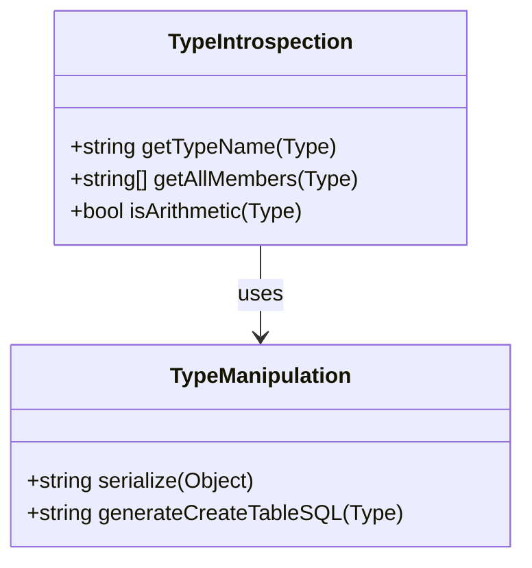

## 12.4 Reflection and Traits

Reflection and traits in the D programming language offer powerful tools for compile-time introspection and manipulation of types. These features allow developers to write more flexible, reusable, and efficient code by examining and modifying program structures during compilation. In this section, we will delve into the concepts of reflection and traits, explore practical examples, and provide insights into how these capabilities can be leveraged in advanced systems programming.

### Understanding Reflection and Traits

Reflection in programming refers to the ability of a program to inspect and modify its own structure and behavior. In D, reflection is primarily achieved through the use of `__traits`, a compile-time construct that provides introspection capabilities. Traits allow you to query various properties of types, functions, and symbols, enabling you to make decisions based on this information during compilation.

#### Key Concepts

- **Compile-Time Reflection**: The process of examining types and symbols at compile time to gather information about their properties.
- **Introspecting Types**: Using `__traits` to inspect attributes such as type names, member functions, and fields.
- **Type Manipulation**: Modifying or generating code based on the attributes of types, allowing for dynamic behavior at compile time.

### Introspecting Types with `__traits`

The `__traits` keyword in D provides a mechanism to query various properties of types and symbols. It is a powerful tool for compile-time reflection, enabling you to gather information about program elements and make decisions based on this data.

#### Common `__traits` Usage

1. **Getting Type Information**: Use `__traits` to obtain the name, members, and other attributes of a type.

   ```d
   import std.stdio;

   struct Example {
       int a;
       float b;
   }

   void main() {
       writeln(__traits(allMembers, Example)); // Output: ["a", "b"]
       writeln(__traits(identifier, Example)); // Output: "Example"
   }
   ```

2. **Checking Type Properties**: Determine if a type has certain properties or characteristics.

   ```d
   import std.stdio;

   void main() {
       writeln(__traits(isArithmetic, int)); // Output: true
       writeln(__traits(isArithmetic, string)); // Output: false
   }
   ```

3. **Function Introspection**: Inspect function attributes, such as parameter types and return types.

   ```d
   import std.stdio;

   int add(int x, int y) {
       return x + y;
   }

   void main() {
       writeln(__traits(getFunctionAttributes, add)); // Output: []
       writeln(__traits(getFunctionReturnType, add)); // Output: int
   }
   ```

### Type Manipulation and Code Generation

Type manipulation involves using the information gathered through reflection to modify or generate code. This can lead to more dynamic and adaptable programs, as code can be tailored to specific types or conditions at compile time.

#### Practical Examples

1. **Serialization and Deserialization**: Automatically generate serialization and deserialization code for structures.

   ```d
   import std.stdio;
   import std.conv;

   struct Person {
       string name;
       int age;
   }

   string serialize(T)(T obj) {
       string result = "{";
       foreach (member; __traits(allMembers, T)) {
           result ~= member ~ ": " ~ to!string(__traits(getMember, obj, member)) ~ ", ";
       }
       result = result[0 .. $ - 2] ~ "}";
       return result;
   }

   void main() {
       Person p = Person("Alice", 30);
       writeln(serialize(p)); // Output: {name: Alice, age: 30}
   }
   ```

2. **Object-Relational Mapping (ORM)**: Map objects to relational database tables by generating SQL queries based on type definitions.

   ```d
   import std.stdio;

   struct User {
       int id;
       string username;
   }

   string generateCreateTableSQL(T)() {
       string sql = "CREATE TABLE " ~ __traits(identifier, T) ~ " (";
       foreach (member; __traits(allMembers, T)) {
           sql ~= member ~ " " ~ (is(typeof(__traits(getMember, T.init, member)) == int) ? "INTEGER" : "TEXT") ~ ", ";
       }
       sql = sql[0 .. $ - 2] ~ ");";
       return sql;
   }

   void main() {
       writeln(generateCreateTableSQL!User()); // Output: CREATE TABLE User (id INTEGER, username TEXT);
   }
   ```

### Visualizing Reflection and Traits

To better understand how reflection and traits work in D, let's visualize the process of introspecting and manipulating types using a class diagram.



**Diagram Description**: The diagram illustrates the relationship between type introspection and type manipulation. The `TypeIntrospection` class provides methods for gathering information about types, while the `TypeManipulation` class uses this information to perform operations like serialization and SQL generation.

### Practical Applications

Reflection and traits in D can be applied to a wide range of scenarios, enhancing the flexibility and efficiency of your code. Here are some practical applications:

1. **Code Generation**: Automatically generate boilerplate code, such as getters and setters, based on type definitions.

2. **Generic Programming**: Implement generic algorithms that adapt to different types by introspecting their properties.

3. **Dynamic Dispatch**: Use reflection to implement dynamic dispatch mechanisms, allowing for more flexible and extensible systems.

4. **Testing and Validation**: Automatically generate test cases or validation logic based on type attributes.

### Design Considerations

When using reflection and traits in D, consider the following design considerations:

- **Compile-Time Overhead**: While reflection and traits provide powerful capabilities, they can introduce compile-time overhead. Use them judiciously to avoid excessive compilation times.

- **Type Safety**: Ensure that type manipulations do not compromise type safety. Always validate the properties and attributes of types before performing operations.

- **Maintainability**: Code that relies heavily on reflection and traits can become complex and difficult to maintain. Document your code thoroughly and use clear naming conventions to improve readability.

### Differences and Similarities with Other Languages

Reflection and traits in D are similar to reflection mechanisms in other languages, such as Java and C#. However, D's compile-time reflection offers unique advantages:

- **Compile-Time Execution**: Unlike runtime reflection in Java and C#, D's reflection occurs at compile time, enabling more efficient code generation and optimization.

- **Type Safety**: D's reflection mechanisms are designed to maintain type safety, reducing the risk of runtime errors.

- **Integration with Templates**: D's reflection capabilities integrate seamlessly with its powerful template system, allowing for more expressive and flexible code.

### Try It Yourself

To deepen your understanding of reflection and traits in D, try modifying the code examples provided in this section. Experiment with different types and attributes, and observe how the generated code changes. Consider implementing additional features, such as custom serialization formats or more complex ORM mappings.

### Knowledge Check

Before we conclude, let's reinforce your understanding of reflection and traits in D with a few questions:

- What is the primary purpose of the `__traits` keyword in D?
- How can reflection be used to generate serialization code?
- What are some design considerations when using reflection and traits?

### Embrace the Journey

Remember, mastering reflection and traits in D is a journey. As you continue to explore these powerful features, you'll unlock new possibilities for writing more efficient and adaptable code. Keep experimenting, stay curious, and enjoy the process of discovery!

## Quiz Time!



### What is the primary purpose of the `__traits` keyword in D?

- [x] To provide compile-time introspection capabilities
- [ ] To execute code at runtime
- [ ] To manage memory allocation
- [ ] To handle exceptions

> **Explanation:** The `__traits` keyword in D is used for compile-time introspection, allowing developers to examine and manipulate types and symbols during compilation.

### How can reflection be used to generate serialization code?

- [x] By introspecting type members and generating code to convert them to strings
- [ ] By executing serialization functions at runtime
- [ ] By using runtime type information
- [ ] By manually writing serialization logic

> **Explanation:** Reflection allows developers to introspect type members and automatically generate code to serialize them, reducing the need for manual serialization logic.

### What are some design considerations when using reflection and traits?

- [x] Compile-time overhead and maintainability
- [ ] Runtime performance and memory usage
- [ ] Network latency and bandwidth
- [ ] User interface design

> **Explanation:** When using reflection and traits, it's important to consider compile-time overhead and maintainability, as these features can introduce complexity and longer compilation times.

### Which of the following is a practical application of reflection and traits in D?

- [x] Object-Relational Mapping (ORM)
- [ ] Network communication
- [ ] User interface design
- [ ] File I/O operations

> **Explanation:** Reflection and traits can be used to implement Object-Relational Mapping (ORM) by generating SQL queries based on type definitions.

### What is a key advantage of D's compile-time reflection compared to runtime reflection in other languages?

- [x] Improved efficiency and optimization
- [ ] Easier debugging
- [ ] Better runtime performance
- [ ] Simpler syntax

> **Explanation:** D's compile-time reflection allows for more efficient code generation and optimization, as it occurs during compilation rather than at runtime.

### How does D's reflection maintain type safety?

- [x] By validating type properties before performing operations
- [ ] By using runtime checks
- [ ] By relying on manual type casting
- [ ] By ignoring type attributes

> **Explanation:** D's reflection mechanisms are designed to maintain type safety by validating type properties and attributes before performing operations.

### What is a common use case for code generation using reflection in D?

- [x] Automatically generating getters and setters
- [ ] Implementing network protocols
- [ ] Designing user interfaces
- [ ] Managing file systems

> **Explanation:** Reflection can be used to automatically generate boilerplate code, such as getters and setters, based on type definitions.

### How can reflection be integrated with D's template system?

- [x] By using introspection data to guide template instantiation
- [ ] By executing templates at runtime
- [ ] By manually writing template logic
- [ ] By ignoring template parameters

> **Explanation:** Reflection can be integrated with D's template system by using introspection data to guide template instantiation and adapt to different types.

### What is a potential drawback of using reflection and traits in D?

- [x] Increased compile-time complexity
- [ ] Reduced runtime performance
- [ ] Higher memory usage
- [ ] Limited type safety

> **Explanation:** Reflection and traits can increase compile-time complexity, making code more difficult to maintain and potentially leading to longer compilation times.

### True or False: D's reflection capabilities are limited to runtime introspection.

- [ ] True
- [x] False

> **Explanation:** False. D's reflection capabilities are primarily focused on compile-time introspection, allowing for efficient code generation and optimization.




