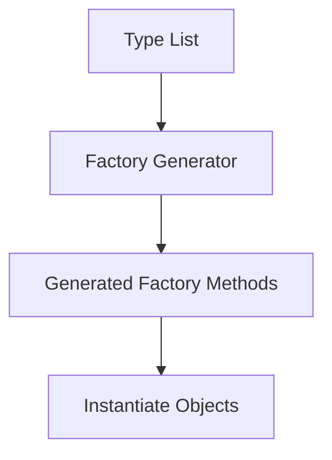
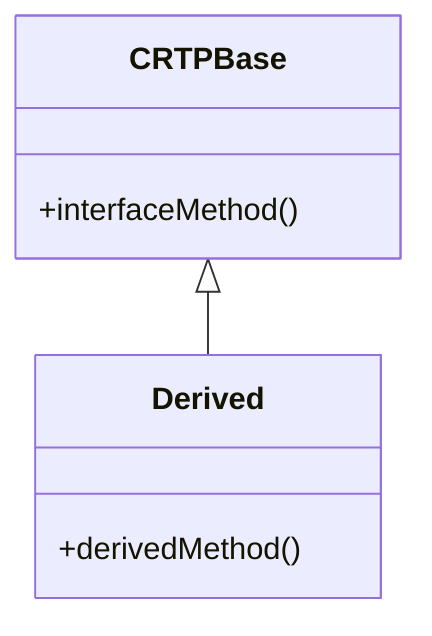

## 12.5 Design Patterns for Code Generation

In the realm of advanced systems programming, the ability to generate code dynamically can significantly enhance both performance and maintainability. The D programming language, with its robust metaprogramming capabilities, offers a fertile ground for implementing design patterns that facilitate code generation. In this section, we will delve into several key patterns and techniques that leverage D's unique features, such as templates, mixins, and compile-time function execution (CTFE), to automate and optimize code generation.

### Code Generation Techniques

#### Factory Generators

**Intent:** Automate the creation of factory classes or functions that instantiate objects based on a list of types.

**Key Participants:**

- **Type List:** A compile-time list of types for which factory methods are generated.
- **Factory Generator:** A template or mixin that iterates over the type list to produce factory methods.

**Applicability:** Use factory generators when you need to create a large number of factory methods for different types, especially when the types share a common interface or base class.

**Sample Code Snippet:**

```d
import std.stdio;

// Define a common interface
interface Product {
    void use();
}

// Implementations of the interface
class ProductA : Product {
    void use() { writeln("Using Product A"); }
}

class ProductB : Product {
    void use() { writeln("Using Product B"); }
}

// Factory generator using mixins
template FactoryGenerator(T...) {
    mixin(generateFactoryMethods!(T));
}

string generateFactoryMethods(T...)() {
    string result;
    foreach (type; T) {
        result ~= q{
            static Product create} ~ type.stringof ~ q{() {
                return new } ~ type.stringof ~ q{();
            }
        };
    }
    return result;
}

// Use the factory generator
mixin FactoryGenerator!(ProductA, ProductB);

void main() {
    auto a = createProductA();
    auto b = createProductB();
    a.use();
    b.use();
}
```

**Design Considerations:** Ensure that all types in the type list conform to the expected interface or base class. This pattern is particularly powerful when combined with D's compile-time reflection capabilities.

#### Builder Generators

**Intent:** Automate the creation of builder patterns to simplify the construction of complex objects.

**Key Participants:**

- **Builder Generator:** A template or mixin that generates builder methods for setting properties of an object.
- **Target Class:** The class for which the builder is generated.

**Applicability:** Use builder generators when you need to construct objects with many optional parameters or configurations.

**Sample Code Snippet:**

```d
import std.stdio;

// Target class
class House {
    string color;
    int windows;
    string roofType;

    void show() {
        writeln("House with ", windows, " windows, ", color, " color, and ", roofType, " roof.");
    }
}

// Builder generator using mixins
template BuilderGenerator(T) {
    mixin(generateBuilderMethods!T);
}

string generateBuilderMethods(T)() {
    import std.traits;
    string result;
    foreach (member; __traits(allMembers, T)) {
        static if (__traits(compiles, __traits(getMember, T, member))) {
            alias MemberType = typeof(__traits(getMember, T, member));
            result ~= q{
                T set} ~ member ~ q{(MemberType value) {
                    this.} ~ member ~ q{ = value;
                    return this;
                }
            };
        }
    }
    return result;
}

// Use the builder generator
class HouseBuilder {
    House house = new House();

    mixin BuilderGenerator!House;

    House build() {
        return house;
    }
}

void main() {
    auto builder = new HouseBuilder();
    auto house = builder.setColor("red").setWindows(4).setRoofType("gabled").build();
    house.show();
}
```

**Design Considerations:** This pattern is particularly useful for classes with many properties. Ensure that the generated builder methods return the builder object itself to allow method chaining.

### Metaprogramming Patterns

#### CRTP (Curiously Recurring Template Pattern)

**Intent:** Leverage inheritance with templates to achieve polymorphic behavior at compile time.

**Key Participants:**

- **Base Template Class:** A template class that takes the derived class as a template parameter.
- **Derived Class:** The class that inherits from the base template class.

**Applicability:** Use CRTP when you need to implement compile-time polymorphism or when you want to avoid the overhead of virtual functions.

**Sample Code Snippet:**

```d
import std.stdio;

// Base template class
template CRTPBase(T) {
    void interfaceMethod() {
        writeln("Calling derived method from base class");
        cast(T)this.derivedMethod();
    }
}

// Derived class
class Derived : CRTPBase!Derived {
    void derivedMethod() {
        writeln("Derived method implementation");
    }
}

void main() {
    auto obj = new Derived();
    obj.interfaceMethod();
}
```

**Design Considerations:** CRTP can be used to implement static polymorphism, which can lead to more efficient code by avoiding virtual function calls. However, it requires careful design to ensure that the derived class correctly implements the expected methods.

#### Expression Templates

**Intent:** Build complex expressions that are evaluated at compile time, improving performance by eliminating temporary objects.

**Key Participants:**

- **Expression Template Class:** A class that represents an expression and overloads operators to build expression trees.
- **Evaluator:** A function or class that evaluates the expression tree at compile time.

**Applicability:** Use expression templates in mathematical libraries or when you need to optimize operations involving temporary objects.

**Sample Code Snippet:**

```d
import std.stdio;

// Expression template class
struct Expr(T) {
    T value;

    Expr opBinary(string op : "+")(Expr rhs) {
        return Expr!(typeof(value + rhs.value))(value + rhs.value);
    }

    Expr opBinary(string op : "*")(Expr rhs) {
        return Expr!(typeof(value * rhs.value))(value * rhs.value);
    }
}

// Evaluator function
T evaluate(T)(Expr!T expr) {
    return expr.value;
}

void main() {
    auto expr1 = Expr!int(3);
    auto expr2 = Expr!int(4);
    auto result = expr1 + expr2 * expr1;
    writeln("Result: ", evaluate(result));
}
```

**Design Considerations:** Expression templates can significantly improve performance by reducing the number of temporary objects created during expression evaluation. However, they can make the code more complex and harder to read.

### Use Cases and Examples

#### Mathematical Libraries

**Intent:** Use operator overloading and expression templates to create readable and efficient mathematical expressions.

**Example:** Implementing a vector math library where operations like addition and multiplication are expressed naturally.

**Sample Code Snippet:**

```d
import std.stdio;

struct Vector {
    double x, y, z;

    Vector opBinary(string op : "+")(Vector rhs) {
        return Vector(x + rhs.x, y + rhs.y, z + rhs.z);
    }

    Vector opBinary(string op : "*")(double scalar) {
        return Vector(x * scalar, y * scalar, z * scalar);
    }

    void print() {
        writeln("Vector(", x, ", ", y, ", ", z, ")");
    }
}

void main() {
    auto v1 = Vector(1.0, 2.0, 3.0);
    auto v2 = Vector(4.0, 5.0, 6.0);
    auto v3 = v1 + v2 * 2.0;
    v3.print();
}
```

**Design Considerations:** Ensure that the overloaded operators are intuitive and follow mathematical conventions. This pattern is particularly useful in domains like physics simulations and computer graphics.

#### DSLs and Fluent Interfaces

**Intent:** Enable expressive code syntax by creating domain-specific languages (DSLs) or fluent interfaces.

**Example:** Implementing a configuration DSL for setting up a server.

**Sample Code Snippet:**

```d
import std.stdio;

class ServerConfig {
    string host;
    int port;

    ServerConfig setHost(string h) {
        host = h;
        return this;
    }

    ServerConfig setPort(int p) {
        port = p;
        return this;
    }

    void showConfig() {
        writeln("Server running on ", host, ":", port);
    }
}

void main() {
    auto config = new ServerConfig()
        .setHost("localhost")
        .setPort(8080);
    config.showConfig();
}
```

**Design Considerations:** Fluent interfaces should be designed to be intuitive and easy to read. They are particularly useful for configuration objects or when setting up complex objects with many parameters.

### Visualizing Code Generation Patterns

To better understand how these patterns interact and are structured, let's visualize the relationships and flow using Mermaid.js diagrams.

#### Factory Generator Flow



**Description:** This diagram illustrates the flow of a factory generator, starting from a type list, passing through the generator, and resulting in generated factory methods that instantiate objects.

#### CRTP Structure



**Description:** This class diagram shows the structure of the CRTP pattern, where the base class uses the derived class as a template parameter.

### References and Links

- [D Programming Language Documentation](https://dlang.org/)
- [Metaprogramming in D](https://wiki.dlang.org/Metaprogramming)
- [Design Patterns in D](https://dlang.org/articles/design-patterns.html)

### Knowledge Check

Before we wrap up, let's test your understanding of the concepts covered in this section.

## Quiz Time!



### What is the primary benefit of using factory generators in D?

- [x] Automating the creation of factory methods for multiple types.
- [ ] Reducing runtime memory usage.
- [ ] Simplifying the syntax of complex expressions.
- [ ] Enabling dynamic polymorphism.

> **Explanation:** Factory generators automate the creation of factory methods for multiple types, which is particularly useful when dealing with a large number of types that share a common interface or base class.

### Which pattern is used to achieve compile-time polymorphism in D?

- [x] CRTP (Curiously Recurring Template Pattern)
- [ ] Builder Pattern
- [ ] Factory Pattern
- [ ] Singleton Pattern

> **Explanation:** CRTP is used to achieve compile-time polymorphism by leveraging inheritance with templates.

### What is the main advantage of expression templates?

- [x] Eliminating temporary objects during expression evaluation.
- [ ] Simplifying the implementation of virtual functions.
- [ ] Reducing the number of lines of code.
- [ ] Enabling dynamic type checking.

> **Explanation:** Expression templates eliminate temporary objects during expression evaluation, which can significantly improve performance.

### In which scenario would you use a builder generator?

- [x] When constructing objects with many optional parameters.
- [ ] When implementing a mathematical library.
- [ ] When creating a singleton class.
- [ ] When designing a network protocol.

> **Explanation:** Builder generators are useful when constructing objects with many optional parameters or configurations.

### What is a key feature of fluent interfaces?

- [x] Enabling method chaining for intuitive syntax.
- [ ] Reducing compile-time errors.
- [ ] Increasing runtime performance.
- [ ] Simplifying memory management.

> **Explanation:** Fluent interfaces enable method chaining, which allows for intuitive and expressive code syntax.

### How does CRTP differ from traditional inheritance?

- [x] It uses templates to achieve polymorphism at compile time.
- [ ] It requires virtual functions for polymorphism.
- [ ] It is only applicable to interfaces.
- [ ] It cannot be used with abstract classes.

> **Explanation:** CRTP uses templates to achieve polymorphism at compile time, avoiding the overhead of virtual functions.

### What is the role of the evaluator in expression templates?

- [x] To evaluate the expression tree at compile time.
- [ ] To generate factory methods.
- [ ] To manage memory allocation.
- [ ] To handle runtime exceptions.

> **Explanation:** The evaluator in expression templates evaluates the expression tree at compile time, optimizing performance.

### Which D feature is commonly used in code generation patterns?

- [x] Mixins
- [ ] Interfaces
- [ ] Virtual Functions
- [ ] Dynamic Arrays

> **Explanation:** Mixins are commonly used in code generation patterns to inject code at compile time.

### What is the purpose of operator overloading in mathematical libraries?

- [x] To create readable and efficient mathematical expressions.
- [ ] To manage memory allocation.
- [ ] To handle exceptions.
- [ ] To implement network protocols.

> **Explanation:** Operator overloading in mathematical libraries is used to create readable and efficient mathematical expressions.

### True or False: Expression templates can make code more complex and harder to read.

- [x] True
- [ ] False

> **Explanation:** While expression templates can improve performance, they can also make the code more complex and harder to read.



Remember, mastering these patterns and techniques is a journey. As you continue to explore the capabilities of the D programming language, you'll find new ways to optimize and enhance your code. Keep experimenting, stay curious, and enjoy the process of learning and discovery!
