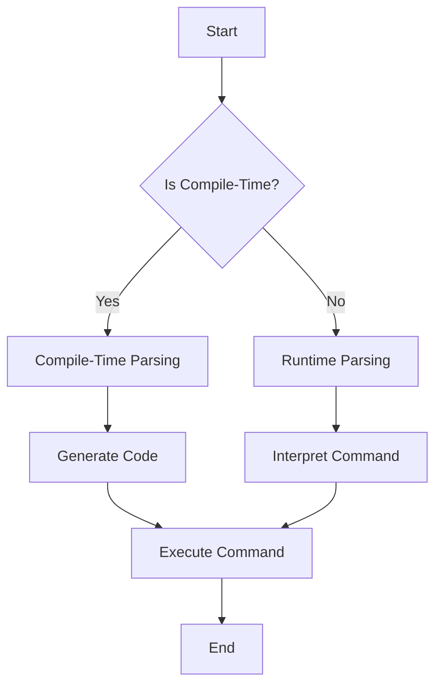

## 12.6 Domain-Specific Language Implementation

Domain-Specific Languages (DSLs) are specialized languages designed to solve problems within a specific domain. Unlike general-purpose languages, DSLs offer tailored syntax and semantics that make them highly efficient for particular tasks. In this section, we will explore how to implement DSLs using the D programming language, leveraging its powerful features such as templates, mixins, and compile-time function execution.

### Defining DSLs

#### Purpose

The primary purpose of a DSL is to provide a more expressive and concise way to describe problems and solutions within a specific domain. This can lead to increased productivity, reduced errors, and more maintainable code. DSLs can be categorized into two types:

- **Internal DSLs**: Embedded within a host language, leveraging its syntax and semantics.
- **External DSLs**: Standalone languages with their own syntax, requiring separate parsing and interpretation.

#### Implementation Strategies

Implementing a DSL in D can be achieved through several strategies:

1. **Mixins**: Allow for code generation and embedding domain-specific syntax directly into D code.
2. **Templates**: Enable generic programming and can be used to create flexible and reusable components.
3. **Operator Overloading**: Provides a way to define custom behaviors for operators, enhancing the expressiveness of the DSL.

### Parsing Techniques

#### Compile-Time Parsing

Compile-time parsing involves analyzing code or strings during the compilation process. This can be achieved using D's compile-time features such as `static if`, `static foreach`, and `mixin`. Compile-time parsing is particularly useful for DSLs that need to be highly performant, as it eliminates runtime overhead.

```d
import std.meta;

// Example of compile-time parsing using mixins
mixin template ParseDSL(string code) {
    static if (code == "command1") {
        enum parsed = "Executing command1";
    } else static if (code == "command2") {
        enum parsed = "Executing command2";
    } else {
        static assert(0, "Unknown command");
    }
}

void main() {
    mixin ParseDSL!"command1";
    writeln(parsed); // Outputs: Executing command1
}
```

#### Runtime Parsing

Runtime parsing involves analyzing and interpreting code or strings during program execution. This can be done using parser combinators or libraries such as `Pegged`, which provides a powerful way to define grammars and parse strings.

```d
import pegged.grammar;

// Define a simple grammar using Pegged
mixin(grammar(`
    Expr:
        Term '+' Expr
        / Term
    ;
    Term:
        Factor '*' Term
        / Factor
    ;
    Factor:
        '(' Expr ')'
        / Number
    ;
    Number:
        ~'[0-9]+'
    ;
`));

void main() {
    auto result = Expr("3 + 5 * (2 + 4)");
    writeln(result); // Outputs the parsed structure
}
```

### Use Cases and Examples

#### Configuration Languages

DSLs can be used to create configuration languages that simplify application setup. By providing a concise and expressive syntax, DSLs can make configuration files easier to read and maintain.

```d
// Example of a simple configuration DSL
mixin template ConfigDSL(string config) {
    static if (config == "set mode=debug") {
        enum mode = "debug";
    } else static if (config == "set mode=release") {
        enum mode = "release";
    } else {
        static assert(0, "Unknown configuration");
    }
}

void main() {
    mixin ConfigDSL!"set mode=debug";
    writeln("Mode: ", mode); // Outputs: Mode: debug
}
```

#### Automation Scripts

DSLs can also be used to create automation scripts that streamline repetitive tasks. By providing a high-level abstraction, DSLs can make automation scripts more intuitive and easier to write.

```d
// Example of an automation DSL
mixin template AutomationDSL(string script) {
    static if (script == "build") {
        enum action = "Building project";
    } else static if (script == "deploy") {
        enum action = "Deploying project";
    } else {
        static assert(0, "Unknown action");
    }
}

void main() {
    mixin AutomationDSL!"build";
    writeln(action); // Outputs: Building project
}
```

### Visualizing DSL Implementation

To better understand the process of implementing a DSL in D, let's visualize the workflow using a flowchart. This diagram illustrates the steps involved in parsing and executing a DSL command.



**Caption**: This flowchart demonstrates the decision-making process for choosing between compile-time and runtime parsing when implementing a DSL in D.

### Design Considerations

When implementing a DSL in D, consider the following:

- **Performance**: Compile-time parsing can improve performance by eliminating runtime overhead, but it may increase compilation time.
- **Complexity**: External DSLs require additional parsing and interpretation logic, which can increase complexity.
- **Flexibility**: Internal DSLs leverage the host language's syntax, providing more flexibility but potentially limiting expressiveness.

### Differences and Similarities

DSLs are often compared to libraries and frameworks. While libraries provide reusable code, DSLs offer a higher level of abstraction tailored to specific domains. Frameworks, on the other hand, provide a structure for building applications, which can include DSLs for configuration or scripting.

### Try It Yourself

Experiment with the provided code examples by modifying the DSL commands or adding new ones. Try creating a simple DSL for a domain you're familiar with, such as a configuration language for a web server or an automation script for a build system.

### References and Links

- [D Programming Language](https://dlang.org/)
- [Pegged - A Parsing Expression Grammar (PEG) Library for D](https://github.com/PhilippeSigaud/Pegged)
- [Domain-Specific Languages: An Annotated Bibliography](https://martinfowler.com/dslwip/)

### Knowledge Check

1. What is the primary purpose of a DSL?
2. How can mixins be used in DSL implementation?
3. What are the advantages of compile-time parsing?
4. How does runtime parsing differ from compile-time parsing?
5. What are some common use cases for DSLs?

### Embrace the Journey

Remember, implementing a DSL is just the beginning. As you gain experience, you'll be able to create more complex and powerful languages tailored to your specific needs. Keep experimenting, stay curious, and enjoy the journey!

## Quiz Time!



### What is the primary purpose of a Domain-Specific Language (DSL)?

- [x] To provide a more expressive and concise way to describe problems within a specific domain.
- [ ] To replace general-purpose programming languages.
- [ ] To increase the complexity of software systems.
- [ ] To serve as a universal solution for all programming tasks.

> **Explanation:** DSLs are designed to be more expressive and concise for specific domains, enhancing productivity and maintainability.

### Which feature of D is commonly used for compile-time parsing in DSL implementation?

- [x] Mixins
- [ ] Classes
- [ ] Interfaces
- [ ] Exceptions

> **Explanation:** Mixins in D allow for compile-time code generation, making them suitable for compile-time parsing in DSLs.

### What is a key advantage of compile-time parsing?

- [x] Eliminates runtime overhead
- [ ] Increases runtime flexibility
- [ ] Simplifies error handling
- [ ] Reduces compilation time

> **Explanation:** Compile-time parsing processes code during compilation, eliminating the need for runtime interpretation and thus reducing overhead.

### How does runtime parsing differ from compile-time parsing?

- [x] Runtime parsing occurs during program execution, while compile-time parsing occurs during compilation.
- [ ] Runtime parsing is faster than compile-time parsing.
- [ ] Compile-time parsing requires external libraries.
- [ ] Runtime parsing is only used for external DSLs.

> **Explanation:** Runtime parsing analyzes code during execution, whereas compile-time parsing does so during the compilation phase.

### Which of the following is a common use case for DSLs?

- [x] Configuration languages
- [ ] Operating system kernels
- [ ] General-purpose applications
- [ ] Low-level hardware drivers

> **Explanation:** DSLs are often used for configuration languages due to their expressiveness and simplicity in describing specific setups.

### What is a potential drawback of using external DSLs?

- [x] Increased complexity due to additional parsing and interpretation logic
- [ ] Limited expressiveness compared to internal DSLs
- [ ] Lack of flexibility in syntax design
- [ ] Incompatibility with general-purpose languages

> **Explanation:** External DSLs require separate parsing and interpretation, which can add complexity to the implementation.

### How can operator overloading enhance a DSL?

- [x] By defining custom behaviors for operators, increasing expressiveness
- [ ] By reducing the need for templates
- [ ] By simplifying memory management
- [ ] By improving error handling

> **Explanation:** Operator overloading allows DSLs to define custom operator behaviors, making the language more expressive and intuitive.

### What role do templates play in DSL implementation?

- [x] Enable generic programming and create flexible, reusable components
- [ ] Simplify error handling
- [ ] Enhance runtime performance
- [ ] Reduce compilation time

> **Explanation:** Templates in D allow for generic programming, which is useful for creating flexible and reusable components in DSLs.

### Which D library is commonly used for runtime parsing of DSLs?

- [x] Pegged
- [ ] Phobos
- [ ] Tango
- [ ] Vibe.d

> **Explanation:** Pegged is a library for D that provides parsing expression grammar (PEG) capabilities, useful for runtime parsing of DSLs.

### True or False: Internal DSLs are standalone languages with their own syntax.

- [ ] True
- [x] False

> **Explanation:** Internal DSLs are embedded within a host language, leveraging its syntax and semantics, unlike external DSLs which are standalone.


