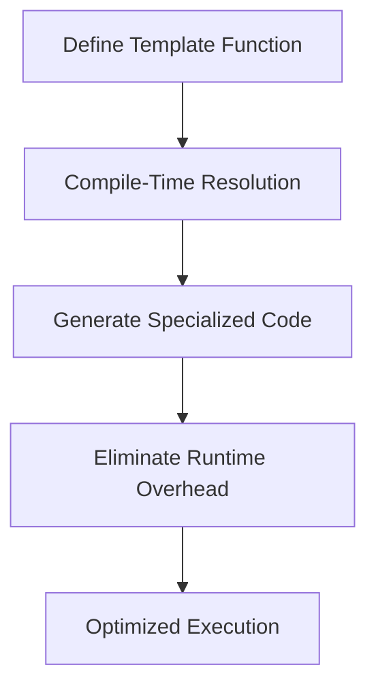

## 12.7 Compile-Time Polymorphism

In the realm of advanced systems programming, compile-time polymorphism stands out as a powerful technique that allows developers to leverage the full potential of the D programming language. By resolving function calls at compile time, we can achieve significant performance improvements and eliminate the overhead associated with runtime polymorphism. In this section, we will delve into the concepts of static dispatch, template interfaces, and how they can be implemented using D's unique features. We will also explore practical use cases and examples to illustrate the benefits of compile-time polymorphism.

### Concepts of Compile-Time Polymorphism

#### Static Dispatch

Static dispatch is a mechanism where function calls are resolved at compile time rather than at runtime. This is achieved by using templates and compile-time evaluation, allowing the compiler to generate specialized code for each type. The primary advantage of static dispatch is the elimination of the runtime overhead associated with virtual function calls, leading to more efficient and faster code execution.

**Example of Static Dispatch:**

```d
import std.stdio;

// Define a template function that works with any type
template staticDispatch(T) {
    void execute(T obj) {
        obj.perform();
    }
}

// Define a struct with a perform method
struct Task {
    void perform() {
        writeln("Task is being performed.");
    }
}

void main() {
    Task task;
    staticDispatch!(Task).execute(task); // Static dispatch at compile time
}
```

In this example, the `staticDispatch` template function is resolved at compile time, allowing the `perform` method of the `Task` struct to be called without any runtime overhead.

#### Template Interfaces

Template interfaces in D allow us to define behavior without incurring the cost of runtime polymorphism. By using templates, we can specify the required methods or properties that a type must implement, ensuring that the type adheres to a specific interface at compile time.

**Example of Template Interfaces:**

```d
import std.stdio;

// Define a template interface
template Interface(T) {
    void execute(T obj) {
        static assert(__traits(compiles, obj.perform()), "Type must implement perform method.");
        obj.perform();
    }
}

// Define a struct that implements the interface
struct Worker {
    void perform() {
        writeln("Worker is performing a task.");
    }
}

void main() {
    Worker worker;
    Interface!(Worker).execute(worker); // Compile-time interface enforcement
}
```

Here, the `Interface` template ensures that any type passed to it implements the `perform` method, providing compile-time interface enforcement.

### Implementing Polymorphism

#### Duck Typing with Templates

Duck typing is a concept where the suitability of an object is determined by the presence of certain methods or properties, rather than the object's type. In D, we can implement duck typing using templates, allowing any type that satisfies specific conditions to be used.

**Example of Duck Typing with Templates:**

```d
import std.stdio;

// Define a template function with duck typing
template duckType(T) {
    void execute(T obj) {
        static assert(__traits(compiles, obj.perform()), "Type must have a perform method.");
        obj.perform();
    }
}

// Define a struct with a perform method
struct Robot {
    void perform() {
        writeln("Robot is executing a command.");
    }
}

void main() {
    Robot robot;
    duckType!(Robot).execute(robot); // Duck typing at compile time
}
```

In this example, the `duckType` template function uses a compile-time assertion to ensure that the `perform` method exists, allowing any type with a `perform` method to be used.

#### Concepts and Constraints

Concepts and constraints are powerful tools in D that allow us to enforce interfaces at compile time. By defining constraints on template parameters, we can ensure that only types that meet specific criteria are accepted.

**Example of Concepts and Constraints:**

```d
import std.stdio;

// Define a concept using a template constraint
template isPerformable(T) {
    enum bool isPerformable = __traits(compiles, T.init.perform());
}

// Define a template function with a constraint
void execute(T)(T obj) if (isPerformable!T) {
    obj.perform();
}

// Define a struct that satisfies the concept
struct Operator {
    void perform() {
        writeln("Operator is performing an operation.");
    }
}

void main() {
    Operator operator;
    execute(operator); // Compile-time constraint enforcement
}
```

In this example, the `isPerformable` concept is used to define a constraint on the `execute` function, ensuring that only types with a `perform` method can be used.

### Use Cases and Examples

#### Generic Programming

Generic programming is a paradigm that allows us to write functions and classes that work with any compatible type. By using templates and compile-time polymorphism, we can create highly reusable and flexible code.

**Example of Generic Programming:**

```d
import std.stdio;

// Define a generic function that works with any type
template genericFunction(T) {
    void execute(T obj) {
        obj.perform();
    }
}

// Define multiple structs with a perform method
struct Printer {
    void perform() {
        writeln("Printer is printing a document.");
    }
}

struct Scanner {
    void perform() {
        writeln("Scanner is scanning a document.");
    }
}

void main() {
    Printer printer;
    Scanner scanner;
    genericFunction!(Printer).execute(printer);
    genericFunction!(Scanner).execute(scanner);
}
```

In this example, the `genericFunction` template function can work with any type that implements the `perform` method, demonstrating the power of generic programming.

#### Optimization

One of the key benefits of compile-time polymorphism is optimization. By eliminating virtual function overhead, we can achieve significant performance improvements, especially in performance-critical applications.

**Example of Optimization:**

```d
import std.stdio;

// Define a template function for optimized execution
template optimizedExecute(T) {
    void execute(T obj) {
        obj.perform();
    }
}

// Define a struct with a perform method
struct FastTask {
    void perform() {
        writeln("FastTask is executing quickly.");
    }
}

void main() {
    FastTask fastTask;
    optimizedExecute!(FastTask).execute(fastTask); // Optimized execution at compile time
}
```

In this example, the `optimizedExecute` template function allows the `perform` method of the `FastTask` struct to be executed without any runtime overhead, resulting in optimized performance.

### Visualizing Compile-Time Polymorphism

To better understand the flow of compile-time polymorphism, let's visualize the process using a Mermaid.js diagram.



**Diagram Description:** This diagram illustrates the process of compile-time polymorphism, starting with the definition of a template function, followed by compile-time resolution, generation of specialized code, elimination of runtime overhead, and resulting in optimized execution.

### References and Links

For further reading on compile-time polymorphism and related concepts, consider exploring the following resources:

- [D Programming Language Documentation](https://dlang.org/)
- [Metaprogramming in D](https://wiki.dlang.org/Metaprogramming)
- [Templates in D](https://dlang.org/spec/template.html)
- [Compile-Time Function Execution (CTFE)](https://dlang.org/spec/function.html#ctfe)

### Knowledge Check

To reinforce your understanding of compile-time polymorphism, consider the following questions and exercises:

1. Explain the difference between static dispatch and dynamic dispatch.
2. How can template interfaces be used to enforce behavior at compile time?
3. Provide an example of duck typing using templates in D.
4. What are the benefits of using concepts and constraints in template programming?
5. How does compile-time polymorphism contribute to optimization in systems programming?

### Embrace the Journey

Remember, mastering compile-time polymorphism is a journey that requires practice and experimentation. As you explore these concepts, keep experimenting with different types and templates to see how they interact. Stay curious, and enjoy the process of unlocking the full potential of the D programming language!

## Quiz Time!



### What is static dispatch?

- [x] Resolving function calls at compile time
- [ ] Resolving function calls at runtime
- [ ] Using dynamic typing
- [ ] Using virtual functions

> **Explanation:** Static dispatch involves resolving function calls at compile time, eliminating runtime overhead.

### How do template interfaces enforce behavior?

- [x] By using compile-time assertions
- [ ] By using runtime checks
- [ ] By using virtual functions
- [ ] By using dynamic typing

> **Explanation:** Template interfaces use compile-time assertions to ensure that types implement required methods.

### What is duck typing in D?

- [x] Allowing any type that satisfies certain conditions
- [ ] Using dynamic typing
- [ ] Using virtual functions
- [ ] Using runtime checks

> **Explanation:** Duck typing allows any type that satisfies specific conditions, determined at compile time.

### What is the primary benefit of compile-time polymorphism?

- [x] Eliminating runtime overhead
- [ ] Increasing code complexity
- [ ] Using dynamic typing
- [ ] Using virtual functions

> **Explanation:** Compile-time polymorphism eliminates runtime overhead, leading to more efficient code execution.

### How can concepts and constraints be used in D?

- [x] To enforce interfaces at compile time
- [ ] To enforce interfaces at runtime
- [ ] To use dynamic typing
- [ ] To use virtual functions

> **Explanation:** Concepts and constraints enforce interfaces at compile time, ensuring type compatibility.

### What is a key advantage of generic programming?

- [x] Writing functions that work with any compatible type
- [ ] Increasing code complexity
- [ ] Using dynamic typing
- [ ] Using virtual functions

> **Explanation:** Generic programming allows writing functions that work with any compatible type, enhancing code reusability.

### How does compile-time polymorphism contribute to optimization?

- [x] By eliminating virtual function overhead
- [ ] By increasing code complexity
- [ ] By using dynamic typing
- [ ] By using runtime checks

> **Explanation:** Compile-time polymorphism eliminates virtual function overhead, optimizing performance.

### What is the role of compile-time assertions in template interfaces?

- [x] To ensure types implement required methods
- [ ] To ensure types use dynamic typing
- [ ] To ensure types use virtual functions
- [ ] To ensure types use runtime checks

> **Explanation:** Compile-time assertions ensure that types implement required methods, enforcing behavior at compile time.

### What is the benefit of using static dispatch?

- [x] Faster code execution
- [ ] Increased code complexity
- [ ] Using dynamic typing
- [ ] Using virtual functions

> **Explanation:** Static dispatch leads to faster code execution by resolving function calls at compile time.

### Compile-time polymorphism is primarily used for optimization.

- [x] True
- [ ] False

> **Explanation:** Compile-time polymorphism is used for optimization by eliminating runtime overhead and improving performance.


