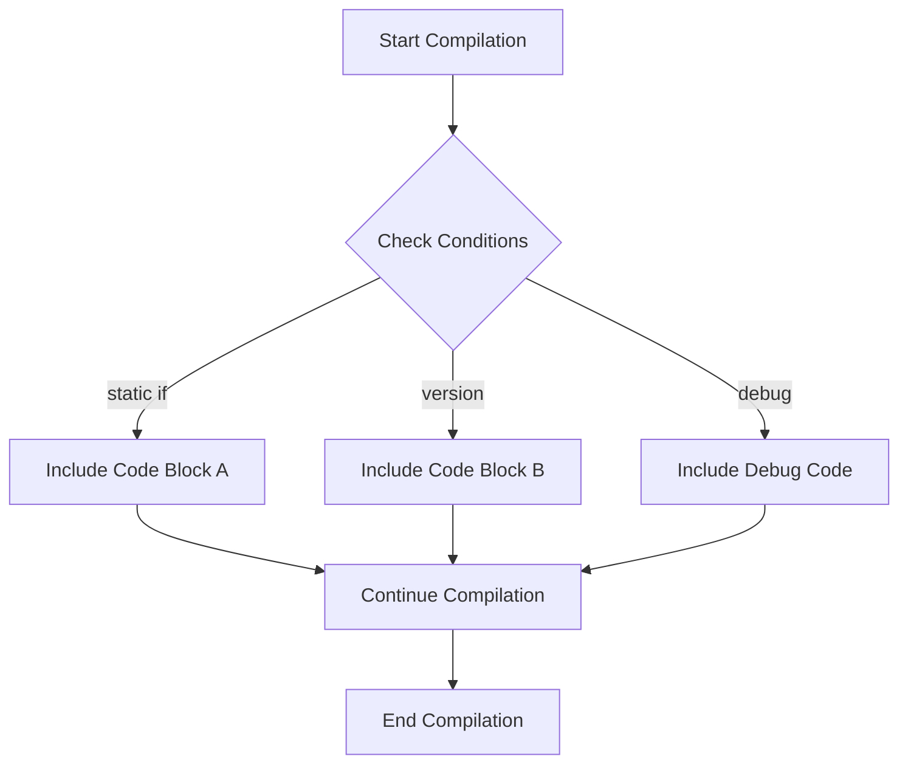

## 12.8 Static `if` and Conditional Compilation

In the realm of advanced systems programming, the ability to make decisions at compile time is a powerful tool. The D programming language offers several features that allow developers to conditionally include or exclude code based on compile-time conditions. This section delves into the use of `static if` statements, `version`, and `debug` blocks, which are essential for creating efficient, platform-specific, and feature-rich applications.

### Static Control Flow

#### `static if` Statements

The `static if` statement in D is a compile-time conditional construct that allows you to include or exclude code based on conditions evaluated during compilation. Unlike runtime `if` statements, `static if` is resolved at compile time, which means the code inside the `static if` block is either compiled or ignored based on the condition.

**Example: Basic `static if` Usage**

```d
import std.stdio;

void main() {
    enum isDebug = true;

    static if (isDebug) {
        writeln("Debug mode is enabled.");
    } else {
        writeln("Debug mode is disabled.");
    }
}
```

In this example, the `static if` statement checks the value of the `isDebug` enum. If `isDebug` is `true`, the message "Debug mode is enabled." is compiled into the program. Otherwise, the alternative message is included.

#### `version` and `debug` Blocks

The `version` and `debug` blocks in D provide a mechanism for conditional compilation based on predefined or user-defined versions and debug levels. These blocks are particularly useful for including platform-specific code or enabling debug features.

**Example: Using `version` Blocks**

```d
import std.stdio;

void main() {
    version(Windows) {
        writeln("Running on Windows.");
    }
    version(Posix) {
        writeln("Running on a POSIX-compliant system.");
    }
}
```

In this example, the `version` blocks allow the program to include code specific to Windows or POSIX systems. The appropriate block is compiled based on the target platform.

**Example: Using `debug` Blocks**

```d
import std.stdio;

void main() {
    debug {
        writeln("Debugging information.");
    }
    writeln("Normal execution.");
}
```

The `debug` block is included only when the program is compiled with the `-debug` flag. This is useful for inserting debugging information without affecting the release build.

### Pattern Applications

#### Platform-Specific Code

When developing cross-platform applications, it's often necessary to include code that is specific to certain platforms. The combination of `static if`, `version`, and `debug` blocks allows you to write platform-specific code without cluttering your codebase with unnecessary checks.

**Example: Platform-Specific Code with `version`**

```d
import std.stdio;

void platformSpecificFunction() {
    version(Windows) {
        writeln("Windows-specific implementation.");
    }
    version(Posix) {
        writeln("POSIX-specific implementation.");
    }
}
```

This approach ensures that only the relevant code for the target platform is compiled, reducing the binary size and potential errors from platform-specific differences.

#### Feature Toggling

Feature toggling is a technique used to enable or disable features at compile time. This is particularly useful for managing experimental features or customizing libraries for different use cases.

**Example: Feature Toggling with `static if`**

```d
import std.stdio;

enum enableFeatureX = true;

void main() {
    static if (enableFeatureX) {
        writeln("Feature X is enabled.");
    } else {
        writeln("Feature X is disabled.");
    }
}
```

By using `static if`, you can easily toggle features without modifying the core logic of your application. This makes it easier to manage feature flags and maintain a clean codebase.

### Use Cases and Examples

#### Logging Levels

Conditional compilation is an effective way to manage logging levels in your application. By using `debug` blocks, you can include detailed logging information only when needed.

**Example: Conditional Logging with `debug`**

```d
import std.stdio;

void logMessage(string message) {
    debug {
        writeln("DEBUG: ", message);
    }
    writeln("INFO: ", message);
}

void main() {
    logMessage("Application started.");
}
```

In this example, the debug message is only included when the program is compiled with the `-debug` flag, allowing you to control the verbosity of your logs without changing the code.

#### Library Customization

Libraries often need to be customized for different use cases or environments. Conditional compilation allows you to adapt library code without duplicating it.

**Example: Library Customization with `version`**

```d
module mylibrary;

version(CustomFeature) {
    void customFunction() {
        // Custom implementation
    }
} else {
    void customFunction() {
        // Default implementation
    }
}
```

By defining a `version` identifier, you can provide different implementations of a function based on the user's needs, making your library more flexible and adaptable.

### Visualizing Conditional Compilation

To better understand how conditional compilation works, let's visualize the process using a flowchart.



**Figure 1: Conditional Compilation Flowchart**

This flowchart illustrates the decision-making process during compilation. Based on the conditions evaluated by `static if`, `version`, and `debug`, different code blocks are included or excluded, leading to the final compiled binary.

### Try It Yourself

To get hands-on experience with static `if` and conditional compilation, try modifying the code examples provided. Experiment with different conditions and see how the compiled output changes. For instance, try toggling the `enableFeatureX` enum or compiling with different `version` identifiers to observe the effects.

### References and Links

- [D Programming Language Specification](https://dlang.org/spec/spec.html)
- [D Version and Debug Specification](https://dlang.org/spec/version.html)
- [D Static If Specification](https://dlang.org/spec/if-condition.html)

### Knowledge Check

To reinforce your understanding of static `if` and conditional compilation, consider the following questions and exercises:

1. What is the primary difference between `static if` and runtime `if` statements?
2. How can `version` blocks be used to manage platform-specific code?
3. Create a small program that uses `debug` blocks to include additional logging information.
4. How does feature toggling with `static if` improve code maintainability?
5. What are the benefits of using conditional compilation in library development?

### Embrace the Journey

Remember, mastering static `if` and conditional compilation is just one step in your journey to becoming an expert in D programming. As you continue to explore and experiment, you'll discover new ways to optimize and enhance your code. Stay curious, keep learning, and enjoy the process!

## Quiz Time!



### What is the primary purpose of `static if` in D?

- [x] To include or exclude code based on compile-time conditions
- [ ] To execute code conditionally at runtime
- [ ] To handle exceptions during compilation
- [ ] To manage memory allocation

> **Explanation:** `static if` is used to make decisions at compile time, allowing code to be included or excluded based on conditions evaluated during compilation.

### How does a `version` block differ from a `debug` block?

- [x] `version` blocks are used for platform-specific code, while `debug` blocks are for debugging purposes
- [ ] `version` blocks are evaluated at runtime, while `debug` blocks are evaluated at compile time
- [ ] `version` blocks are only used in release builds, while `debug` blocks are used in debug builds
- [ ] `version` blocks are for memory management, while `debug` blocks are for logging

> **Explanation:** `version` blocks are typically used to include platform-specific code, whereas `debug` blocks are used to include debugging information when the program is compiled with the `-debug` flag.

### Which of the following is a use case for feature toggling with `static if`?

- [x] Enabling or disabling features at compile time
- [ ] Managing runtime exceptions
- [ ] Allocating memory dynamically
- [ ] Handling user input

> **Explanation:** Feature toggling with `static if` allows developers to enable or disable features at compile time, making it easier to manage feature flags and maintain a clean codebase.

### What happens when a `debug` block is included in the code?

- [x] It is included only when compiled with the `-debug` flag
- [ ] It is always included in the compiled binary
- [ ] It is ignored during compilation
- [ ] It causes a compilation error

> **Explanation:** A `debug` block is included in the compiled binary only when the program is compiled with the `-debug` flag, allowing developers to control the inclusion of debugging information.

### How can conditional compilation improve library customization?

- [x] By allowing different implementations based on user-defined conditions
- [ ] By reducing the need for runtime checks
- [ ] By increasing the size of the compiled binary
- [ ] By making the code less readable

> **Explanation:** Conditional compilation allows libraries to provide different implementations based on user-defined conditions, making them more flexible and adaptable to different use cases.

### What is the benefit of using `static if` for logging levels?

- [x] It allows for compile-time control of logging verbosity
- [ ] It reduces runtime performance
- [ ] It increases the complexity of the code
- [ ] It requires additional memory allocation

> **Explanation:** Using `static if` for logging levels allows developers to control the verbosity of logs at compile time, ensuring that only the necessary logging information is included in the compiled binary.

### Which of the following is true about `version` blocks?

- [x] They are used to include code conditionally based on predefined or user-defined versions
- [ ] They are evaluated at runtime
- [ ] They are used for memory management
- [ ] They are ignored during compilation

> **Explanation:** `version` blocks are used to include code conditionally based on predefined or user-defined versions, allowing for platform-specific or feature-specific code inclusion.

### What is the role of `static if` in platform-specific code?

- [x] To include or exclude code based on compile-time platform checks
- [ ] To execute platform-specific code at runtime
- [ ] To manage memory allocation for different platforms
- [ ] To handle exceptions in platform-specific code

> **Explanation:** `static if` is used to include or exclude code based on compile-time platform checks, ensuring that only the relevant code for the target platform is compiled.

### How does conditional compilation affect the size of the compiled binary?

- [x] It reduces the size by excluding unnecessary code
- [ ] It increases the size by including all possible code paths
- [ ] It has no effect on the size of the binary
- [ ] It causes the binary to be larger than necessary

> **Explanation:** Conditional compilation reduces the size of the compiled binary by excluding unnecessary code, ensuring that only the relevant code is included.

### True or False: `static if` can be used to handle runtime exceptions.

- [ ] True
- [x] False

> **Explanation:** `static if` is a compile-time construct and cannot be used to handle runtime exceptions. It is used to make decisions during compilation.


