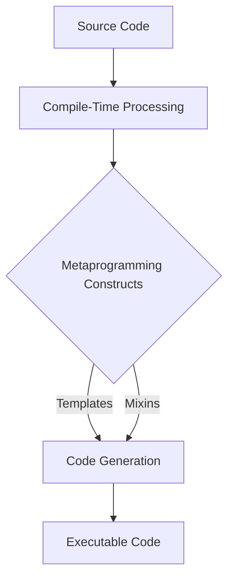

## 12.9 Metaprogramming Best Practices

Metaprogramming in D is a powerful technique that allows developers to write code that can generate and manipulate other code at compile time. This capability can lead to more efficient, flexible, and reusable code. However, it also introduces complexity that requires careful management. In this section, we will explore best practices for maintaining, debugging, and optimizing metaprogramming code in D, along with practical use cases.

### Maintainability

#### Readability

Metaprogramming can quickly become complex and difficult to understand. To maintain readability:

- **Use Descriptive Names**: Choose clear and descriptive names for templates, mixins, and other metaprogramming constructs. This helps others (and your future self) understand the purpose of each component.
- **Limit Complexity**: Avoid overly complex metaprogramming constructs. If a piece of code becomes too intricate, consider breaking it down into smaller, more manageable parts.
- **Consistent Style**: Follow a consistent coding style throughout your metaprogramming code. This includes indentation, spacing, and naming conventions.

#### Documentation

Documenting metaprogramming code is crucial for maintainability:

- **Explain Logic**: Use comments to explain the purpose and logic behind complex metaprogramming constructs. This is especially important for compile-time logic that may not be immediately obvious.
- **Provide Examples**: Include examples of how to use your metaprogramming constructs. This helps users understand how to integrate them into their own code.

### Debugging Techniques

#### Compile-Time Errors

Compile-time errors in metaprogramming can be cryptic. To improve error handling:

- **Clear Error Messages**: Use `static assert` with descriptive messages to catch errors early and provide clear feedback.
- **Isolate Errors**: Break down complex metaprogramming code into smaller parts to isolate errors. This makes it easier to identify the source of a problem.

#### Static Assertions

Static assertions are a powerful tool for validating assumptions at compile time:

```d
template IsPositive(T)
{
    static if (T > 0)
        enum IsPositive = true;
    else
        static assert(false, "Type must be positive.");
}

void main()
{
    static assert(IsPositive!5); // Passes
    // static assert(IsPositive!-1); // Fails with message: "Type must be positive."
}
```

### Performance Considerations

#### Compilation Time

Metaprogramming can increase compilation time. To manage this:

- **Optimize Compile-Time Computation**: Use efficient algorithms and data structures for compile-time computations.
- **Cache Results**: Where possible, cache results of expensive compile-time computations to avoid redundant calculations.

#### Code Bloat

Excessive code generation can lead to code bloat. To prevent this:

- **Generate Only Necessary Code**: Ensure that your metaprogramming constructs generate only the code that is necessary for the task at hand.
- **Reuse Code**: Use templates and mixins to reuse code and reduce duplication.

### Use Cases and Examples

#### Library Development

Metaprogramming is particularly useful in library development:

- **Generic APIs**: Use templates to create generic APIs that can work with a variety of types.
- **Compile-Time Configuration**: Allow users to configure library behavior at compile time using template parameters.

#### Complex Systems

In large codebases, metaprogramming can help manage complexity:

- **Code Generation**: Automatically generate repetitive code, such as boilerplate or serialization logic.
- **Domain-Specific Languages**: Implement domain-specific languages (DSLs) to simplify complex operations.

### Try It Yourself

Experiment with the following code example to understand metaprogramming in D:

```d
import std.stdio;

// A simple metaprogramming example using templates
template Add(T, U)
{
    enum Add = T + U;
}

void main()
{
    writeln("3 + 4 = ", Add!(3, 4)); // Outputs: 3 + 4 = 7
    writeln("5 + 10 = ", Add!(5, 10)); // Outputs: 5 + 10 = 15
}
```

**Try modifying the `Add` template to perform other operations, such as subtraction or multiplication.**

### Visualizing Metaprogramming

To better understand the flow of metaprogramming in D, consider the following diagram illustrating the compile-time process:



**Figure 1: Visualizing the Compile-Time Metaprogramming Process in D**

### References and Links

For further reading on metaprogramming in D, consider the following resources:

- [D Language Metaprogramming Guide](https://dlang.org/spec/template.html)
- [D Templates and Mixins](https://dlang.org/spec/mixin.html)
- [Compile-Time Function Execution in D](https://dlang.org/spec/expression.html#ctfe)

### Knowledge Check

- **What are the benefits of using metaprogramming in library development?**
- **How can static assertions improve the debugging process in metaprogramming?**
- **What strategies can be employed to reduce code bloat in metaprogramming?**

### Embrace the Journey

Remember, mastering metaprogramming in D is a journey. As you continue to explore and experiment, you'll discover new ways to leverage this powerful technique to enhance your code. Stay curious, keep learning, and enjoy the process!

## Quiz Time!



### What is a key benefit of using metaprogramming in library development?

- [x] Creating generic APIs
- [ ] Increasing runtime performance
- [ ] Reducing memory usage
- [ ] Simplifying user interfaces

> **Explanation:** Metaprogramming allows for the creation of generic APIs that can work with various types, enhancing flexibility and reusability.

### How can static assertions help in debugging metaprogramming code?

- [x] By providing clear error messages at compile time
- [ ] By reducing runtime errors
- [ ] By optimizing code execution
- [ ] By simplifying code logic

> **Explanation:** Static assertions allow developers to catch errors early and provide descriptive messages, making it easier to debug metaprogramming code.

### What is a common issue associated with metaprogramming that can affect performance?

- [x] Increased compilation time
- [ ] Reduced runtime speed
- [ ] Higher memory consumption
- [ ] Decreased code readability

> **Explanation:** Metaprogramming can lead to increased compilation time due to complex compile-time computations.

### Which technique can help manage code bloat in metaprogramming?

- [x] Reusing code with templates
- [ ] Increasing code duplication
- [ ] Using more mixins
- [ ] Avoiding static assertions

> **Explanation:** Reusing code with templates helps reduce duplication and manage code bloat effectively.

### What is a practical use case for metaprogramming in complex systems?

- [x] Code generation for repetitive tasks
- [ ] Improving user interface design
- [ ] Enhancing database performance
- [ ] Simplifying network protocols

> **Explanation:** Metaprogramming can automate the generation of repetitive code, such as boilerplate, which is beneficial in complex systems.

### How can compile-time errors be made more interpretable?

- [x] By using static assertions with descriptive messages
- [ ] By avoiding templates
- [ ] By increasing code complexity
- [ ] By using runtime assertions

> **Explanation:** Static assertions with descriptive messages help make compile-time errors more interpretable.

### What is a key consideration when using metaprogramming to avoid code bloat?

- [x] Generate only necessary code
- [ ] Use more mixins
- [ ] Increase template complexity
- [ ] Avoid code reuse

> **Explanation:** Generating only the necessary code helps prevent code bloat and keeps the codebase manageable.

### Which of the following is a benefit of documenting metaprogramming code?

- [x] It helps others understand complex logic
- [ ] It reduces compilation time
- [ ] It increases runtime performance
- [ ] It simplifies user interfaces

> **Explanation:** Documenting metaprogramming code helps others understand the complex logic and purpose behind the constructs.

### What is a common challenge when using metaprogramming in D?

- [x] Balancing compile-time computation with build speed
- [ ] Increasing runtime performance
- [ ] Reducing memory usage
- [ ] Simplifying user interfaces

> **Explanation:** Balancing compile-time computation with build speed is a common challenge due to the potential for increased compilation time.

### True or False: Metaprogramming can be used to implement domain-specific languages (DSLs).

- [x] True
- [ ] False

> **Explanation:** Metaprogramming can be used to implement DSLs, which simplify complex operations by providing a specialized language tailored to a specific domain.


