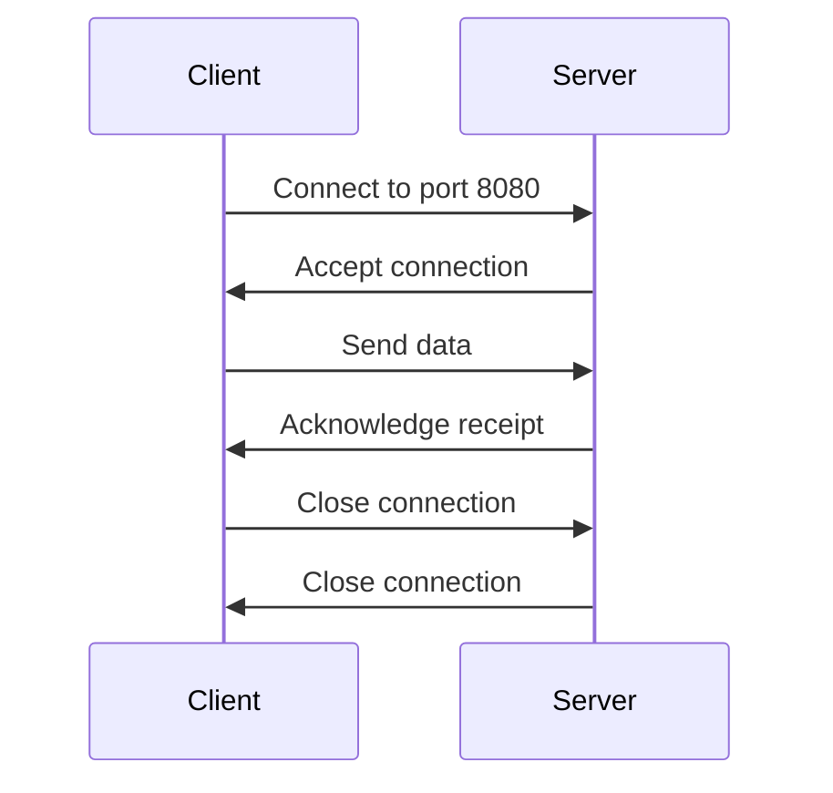

## 13.1 Overview of Network Programming in D

Network programming is a crucial aspect of modern software development, enabling applications to communicate over a network. The D programming language, with its robust features and libraries, offers powerful tools for building networked applications. In this section, we will explore the foundational concepts of network programming, delve into D's networking capabilities, and provide practical examples to illustrate these concepts.

### Foundational Concepts

Before diving into D's networking capabilities, it's essential to understand some foundational concepts that underpin network programming.

#### OSI Model

The OSI (Open Systems Interconnection) model is a conceptual framework used to understand and implement network communication. It divides the communication process into seven distinct layers, each with specific functions:

1. **Physical Layer**: Deals with the physical connection between devices, including cables and switches.
2. **Data Link Layer**: Handles error detection and correction from the physical layer.
3. **Network Layer**: Manages data routing and forwarding.
4. **Transport Layer**: Ensures reliable data transfer with error checking and flow control.
5. **Session Layer**: Manages sessions and connections between applications.
6. **Presentation Layer**: Translates data formats between the application and network.
7. **Application Layer**: Provides network services to end-user applications.

Understanding the OSI model helps developers design and troubleshoot networked applications by providing a structured approach to network communication.

#### Sockets and Protocols

Sockets are the endpoints for sending and receiving data across a network. They provide a programming interface for network communication, allowing applications to connect and exchange data. Sockets can be used with various protocols, which define the rules for data exchange.

- **TCP (Transmission Control Protocol)**: A connection-oriented protocol that ensures reliable data transfer.
- **UDP (User Datagram Protocol)**: A connectionless protocol that allows for faster, but less reliable, data transfer.

Sockets can be created and managed using D's standard libraries, enabling developers to build robust networked applications.

### D's Networking Capabilities

The D programming language provides several tools and libraries for network programming, making it a versatile choice for building networked applications.

#### Standard Libraries

D's standard library, `std.socket`, offers a comprehensive set of functions for network programming. It provides support for both TCP and UDP sockets, allowing developers to create and manage network connections with ease.

```d
import std.socket;
import std.stdio;

void main() {
    // Create a TCP socket
    auto socket = new TcpSocket();
    socket.bind(new InternetAddress("127.0.0.1", 8080));
    socket.listen(10);

    writeln("Server listening on port 8080");

    while (true) {
        auto client = socket.accept();
        writeln("Client connected: ", client.remoteAddress);
        client.close();
    }
}
```

In this example, we create a simple TCP server that listens for incoming connections on port 8080. The server accepts connections and prints the client's remote address.

#### Third-Party Libraries

In addition to the standard library, there are several third-party libraries available for network programming in D. These libraries offer additional features and abstractions, making it easier to build complex networked applications.

- **Vibe.d**: A high-performance asynchronous I/O and web framework for D. It provides tools for building web applications, RESTful APIs, and more.
- **Hunt**: A comprehensive library for building networked applications, offering features like HTTP clients and servers, WebSocket support, and more.

These libraries extend D's networking capabilities, providing developers with powerful tools for building scalable and efficient networked applications.

### Use Cases and Examples

To illustrate D's networking capabilities, let's explore some common use cases and examples of networked applications.

#### Client-Server Models

The client-server model is a common architecture for networked applications, where a server provides resources or services, and clients request them. D's networking libraries make it easy to implement both client and server components.

**Server Example**

```d
import std.socket;
import std.stdio;

void main() {
    auto server = new TcpSocket();
    server.bind(new InternetAddress("127.0.0.1", 8080));
    server.listen(10);

    writeln("Server listening on port 8080");

    while (true) {
        auto client = server.accept();
        writeln("Client connected: ", client.remoteAddress);
        client.close();
    }
}
```

**Client Example**

```d
import std.socket;
import std.stdio;

void main() {
    auto client = new TcpSocket();
    client.connect(new InternetAddress("127.0.0.1", 8080));

    writeln("Connected to server");

    client.close();
}
```

In these examples, we create a simple client-server application where the server listens for connections on port 8080, and the client connects to the server.

### Visualizing Network Communication

To better understand the flow of network communication, let's visualize the client-server interaction using a sequence diagram.



This diagram illustrates the sequence of events in a client-server interaction, highlighting the connection, data exchange, and disconnection phases.

### Try It Yourself

To deepen your understanding of network programming in D, try modifying the examples provided:

- Change the server to handle multiple clients simultaneously.
- Implement a simple chat application using TCP sockets.
- Explore using UDP sockets for faster, but less reliable, communication.

### References and Links

For further reading and exploration of network programming in D, consider the following resources:

- [D Programming Language Official Documentation](https://dlang.org/)
- [Vibe.d Web Framework](https://vibed.org/)
- [Hunt Framework](https://huntlabs.net/)

### Knowledge Check

Before moving on, let's summarize the key takeaways from this section:

- The OSI model provides a structured approach to understanding network communication.
- Sockets are the endpoints for network communication, supporting various protocols like TCP and UDP.
- D's standard library, `std.socket`, offers comprehensive support for network programming.
- Third-party libraries like Vibe.d and Hunt extend D's networking capabilities.

Remember, network programming is a powerful tool for building connected applications. As you continue to explore D's networking capabilities, keep experimenting and building more complex applications.

## Quiz Time!



### What is the primary purpose of the OSI model in network programming?

- [x] To provide a structured framework for understanding network communication
- [ ] To define specific programming languages for network applications
- [ ] To replace TCP/IP as the main protocol suite
- [ ] To establish hardware standards for network devices

> **Explanation:** The OSI model provides a structured framework for understanding and implementing network communication by dividing it into seven layers.

### Which layer of the OSI model is responsible for routing data between devices?

- [ ] Physical Layer
- [ ] Data Link Layer
- [x] Network Layer
- [ ] Transport Layer

> **Explanation:** The Network Layer is responsible for routing data between devices and managing data forwarding.

### What is the main difference between TCP and UDP protocols?

- [x] TCP is connection-oriented, while UDP is connectionless
- [ ] TCP is faster than UDP
- [ ] UDP provides error checking, while TCP does not
- [ ] UDP is used for secure communication, while TCP is not

> **Explanation:** TCP is a connection-oriented protocol that ensures reliable data transfer, while UDP is connectionless and allows for faster, but less reliable, data transfer.

### Which D standard library is used for network programming?

- [ ] std.io
- [x] std.socket
- [ ] std.network
- [ ] std.net

> **Explanation:** The `std.socket` library in D provides functions for network programming, including support for TCP and UDP sockets.

### What is the role of a socket in network programming?

- [x] To serve as an endpoint for sending and receiving data across a network
- [ ] To encrypt data for secure transmission
- [ ] To manage hardware connections between devices
- [ ] To compile network protocols into machine code

> **Explanation:** A socket serves as an endpoint for sending and receiving data across a network, providing a programming interface for network communication.

### Which third-party library is known for high-performance asynchronous I/O in D?

- [ ] Hunt
- [x] Vibe.d
- [ ] Phobos
- [ ] Tango

> **Explanation:** Vibe.d is a high-performance asynchronous I/O and web framework for D, providing tools for building web applications and RESTful APIs.

### What is a common use case for the client-server model in network programming?

- [x] Building applications where a server provides resources or services, and clients request them
- [ ] Encrypting data for secure communication
- [ ] Managing hardware connections between devices
- [ ] Compiling network protocols into machine code

> **Explanation:** The client-server model is commonly used in network programming to build applications where a server provides resources or services, and clients request them.

### What is the primary advantage of using third-party libraries for network programming in D?

- [x] They offer additional features and abstractions for building complex networked applications
- [ ] They replace the need for D's standard library
- [ ] They are faster than using the standard library
- [ ] They provide hardware-level access for network programming

> **Explanation:** Third-party libraries offer additional features and abstractions, making it easier to build complex networked applications in D.

### Which protocol is typically used for faster, but less reliable, data transfer?

- [ ] TCP
- [x] UDP
- [ ] HTTP
- [ ] FTP

> **Explanation:** UDP (User Datagram Protocol) is typically used for faster, but less reliable, data transfer compared to TCP.

### True or False: The OSI model is used to define specific programming languages for network applications.

- [ ] True
- [x] False

> **Explanation:** False. The OSI model is not used to define specific programming languages; it provides a structured framework for understanding network communication.



Remember, this is just the beginning of your journey into network programming with D. As you progress, you'll build more complex and interactive networked applications. Keep experimenting, stay curious, and enjoy the journey!
