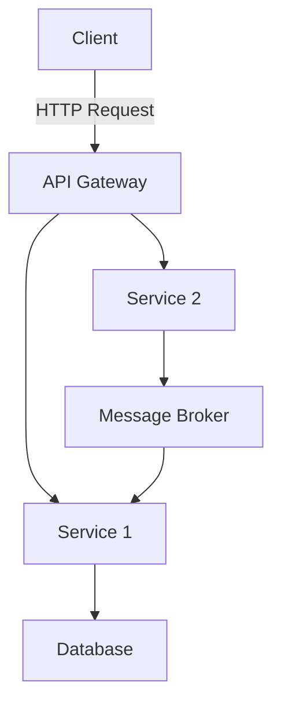

## 13.10 Microservices Architecture and D

Microservices architecture has become a cornerstone of modern software development, enabling the creation of scalable, resilient, and maintainable systems. In this section, we will explore how the D programming language can be leveraged to implement microservices architecture effectively. We will delve into the principles of microservices, discuss communication strategies, and provide practical examples and code snippets to illustrate these concepts.

### Microservices Principles

Microservices architecture is based on several key principles that guide the design and implementation of systems as a collection of small, independent services. Let's explore these principles in detail.

#### Decoupled Services

The fundamental idea behind microservices is to build applications as a suite of small, autonomous services. Each service is responsible for a specific business capability and can be developed, deployed, and scaled independently. This decoupling allows for greater flexibility and agility in development and operations.

- **Single Responsibility**: Each microservice should have a single responsibility, encapsulating a specific piece of business logic.
- **Independent Deployment**: Services can be updated and deployed without affecting other parts of the system.
- **Technology Agnostic**: Different services can be implemented using different technologies, allowing teams to choose the best tool for the job.

#### Communication Strategies

Microservices need to communicate with each other to function as a cohesive system. This communication can be achieved through various strategies, including APIs and messaging systems.

- **RESTful APIs**: Representational State Transfer (REST) is a common approach for building APIs that allow services to communicate over HTTP.
- **gRPC**: A high-performance, open-source RPC framework that can be used for communication between microservices.
- **Message Brokers**: Systems like Kafka or RabbitMQ can be used for asynchronous communication, enabling services to publish and subscribe to messages.

### Implementing Microservices in D

The D programming language offers several features that make it well-suited for implementing microservices. Let's explore how D can be used to build microservices with a focus on service discovery and fault tolerance.

#### Service Discovery

In a microservices architecture, services need to locate each other dynamically. Service discovery is the process of automatically detecting services within a network.

- **Consul**: A popular tool for service discovery that can be integrated with D applications to register and discover services.
- **Zookeeper**: Another option for service discovery, providing a centralized service for maintaining configuration information.

Here's a simple example of how you might implement service discovery in D using Consul:

```d
import std.net.curl;
import std.json;

void registerService(string serviceName, string serviceAddress, ushort servicePort) {
    auto json = `{
        "Name": "` ~ serviceName ~ `",
        "Address": "` ~ serviceAddress ~ `",
        "Port": ` ~ to!string(servicePort) ~ `
    }`;

    auto url = "http://localhost:8500/v1/agent/service/register";
    auto response = post(url, json);
    assert(response.statusCode == 200, "Failed to register service");
}

void main() {
    registerService("example-service", "127.0.0.1", 8080);
}
```

#### Fault Tolerance

Fault tolerance is crucial in microservices architecture to ensure that the system can handle failures gracefully. D provides several mechanisms to build fault-tolerant services.

- **Retries and Circuit Breakers**: Implementing retries and circuit breakers can help services recover from transient failures.
- **Timeouts**: Setting timeouts for service calls can prevent the system from hanging indefinitely.

Here's an example of implementing a simple retry mechanism in D:

```d
import std.stdio;
import std.exception;

void callService() {
    // Simulate a service call
    throw new Exception("Service call failed");
}

void retryServiceCall(int retries = 3) {
    int attempts = 0;
    while (attempts < retries) {
        try {
            callService();
            writeln("Service call succeeded");
            return;
        } catch (Exception e) {
            writeln("Attempt ", attempts + 1, " failed: ", e.msg);
            attempts++;
        }
    }
    writeln("All attempts failed");
}

void main() {
    retryServiceCall();
}
```

### Use Cases and Examples

Microservices architecture is particularly well-suited for certain types of applications. Let's explore some use cases and examples of how D can be used to implement microservices.

#### Enterprise Systems

Microservices can help scale complex enterprise systems by breaking them down into smaller, manageable components. This approach allows for better scalability, maintainability, and flexibility.

- **Scalability**: Services can be scaled independently based on demand.
- **Maintainability**: Smaller codebases are easier to maintain and evolve.
- **Flexibility**: Teams can work on different services simultaneously without stepping on each other's toes.

#### Continuous Deployment

Microservices enable continuous deployment by allowing services to be updated independently. This approach reduces the risk of deploying new features and enables faster iteration.

- **Independent Updates**: Services can be updated without affecting the entire system.
- **Rollback**: If a new version of a service causes issues, it can be rolled back without impacting other services.
- **A/B Testing**: Different versions of a service can be deployed simultaneously to test new features.

### Visualizing Microservices Architecture

To better understand microservices architecture, let's visualize the interaction between services using a Mermaid.js diagram.



**Diagram Description**: This diagram illustrates a simple microservices architecture where a client sends an HTTP request to an API Gateway. The gateway routes the request to the appropriate service (Service 1 or Service 2). Service 1 interacts with a database, while Service 2 communicates with a message broker.

### Try It Yourself

Experiment with the code examples provided in this section. Try modifying the service discovery example to register multiple services or implement a more sophisticated retry mechanism with exponential backoff.

### References and Links

- [Consul by HashiCorp](https://www.consul.io/)
- [Apache Zookeeper](https://zookeeper.apache.org/)
- [gRPC](https://grpc.io/)
- [Kafka](https://kafka.apache.org/)
- [RabbitMQ](https://www.rabbitmq.com/)

### Knowledge Check

- What are the key principles of microservices architecture?
- How can service discovery be implemented in D?
- What strategies can be used to achieve fault tolerance in microservices?

### Embrace the Journey

Remember, mastering microservices architecture is a journey. As you continue to explore and experiment with D, you'll discover new ways to build scalable and resilient systems. Stay curious, keep learning, and enjoy the process!

## Quiz Time!



### What is a key principle of microservices architecture?

- [x] Decoupled services
- [ ] Monolithic design
- [ ] Tight coupling
- [ ] Single deployment

> **Explanation:** Microservices architecture emphasizes decoupled services, allowing for independent development and deployment.

### Which communication strategy is commonly used in microservices?

- [x] RESTful APIs
- [ ] Direct database access
- [ ] Shared memory
- [ ] File transfer

> **Explanation:** RESTful APIs are commonly used for communication between microservices due to their simplicity and scalability.

### What tool can be used for service discovery in D?

- [x] Consul
- [ ] Docker
- [ ] Kubernetes
- [ ] Jenkins

> **Explanation:** Consul is a popular tool for service discovery that can be integrated with D applications.

### How can fault tolerance be achieved in microservices?

- [x] Implementing retries and circuit breakers
- [ ] Ignoring errors
- [ ] Using global variables
- [ ] Hardcoding values

> **Explanation:** Fault tolerance can be achieved by implementing retries and circuit breakers to handle transient failures.

### What is an advantage of microservices in enterprise systems?

- [x] Scalability
- [ ] Increased complexity
- [ ] Single point of failure
- [ ] Tight coupling

> **Explanation:** Microservices allow for scalability by enabling independent scaling of services based on demand.

### How does continuous deployment benefit from microservices?

- [x] Independent updates
- [ ] Increased downtime
- [ ] Single deployment pipeline
- [ ] Manual testing

> **Explanation:** Microservices enable independent updates, reducing the risk of deploying new features and allowing for faster iteration.

### What is a common tool for asynchronous communication in microservices?

- [x] Kafka
- [ ] HTTP
- [ ] FTP
- [ ] Telnet

> **Explanation:** Kafka is a common tool for asynchronous communication, allowing services to publish and subscribe to messages.

### What is the role of an API Gateway in microservices?

- [x] Routing requests to appropriate services
- [ ] Storing data
- [ ] Compiling code
- [ ] Managing memory

> **Explanation:** An API Gateway routes requests to the appropriate services, acting as a single entry point for clients.

### What is a benefit of using gRPC in microservices?

- [x] High-performance communication
- [ ] Text-based communication
- [ ] Manual serialization
- [ ] Limited scalability

> **Explanation:** gRPC provides high-performance communication between microservices, supporting multiple languages and platforms.

### True or False: Microservices architecture allows for technology agnostic development.

- [x] True
- [ ] False

> **Explanation:** Microservices architecture allows for technology agnostic development, enabling different services to be implemented using different technologies.


