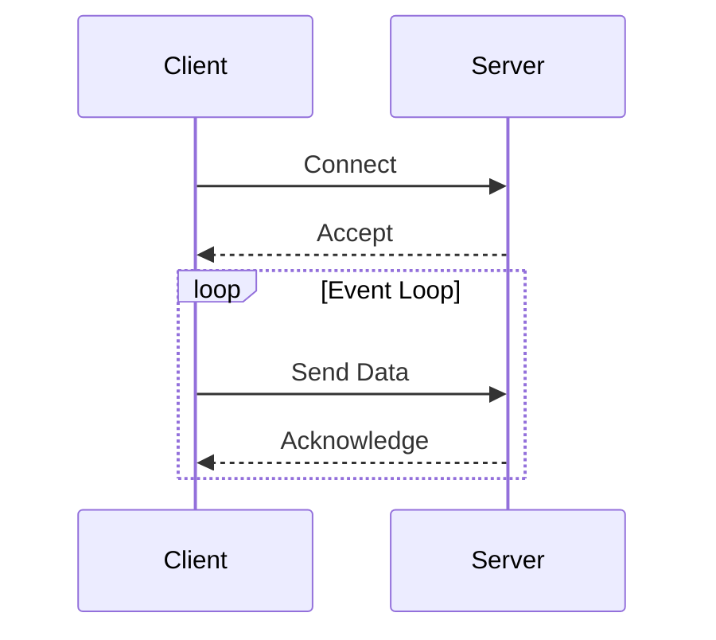

## 13.2 Socket Programming and Asynchronous I/O

In the realm of network programming, socket programming and asynchronous I/O are pivotal for building high-performance, scalable applications. The D programming language, with its powerful features, offers robust support for these concepts, allowing developers to create efficient and responsive systems. In this section, we will delve into the nuances of socket programming and asynchronous I/O, exploring how D can be leveraged to implement these techniques effectively.

### Blocking vs. Non-Blocking I/O

#### Synchronous Communication

Synchronous communication, often referred to as blocking I/O, is the traditional approach where a function call waits for an operation to complete before returning control to the caller. This method is simple and straightforward, making it easy to understand and implement. However, it can lead to inefficiencies, especially in network programming, where waiting for data can cause significant delays.

```d
import std.socket;
import std.stdio;

void main() {
    auto socket = new TcpSocket();
    socket.connect(new InternetAddress("127.0.0.1", 8080));
    
    // Blocking call
    socket.send("Hello, Server!");
    char[1024] buffer;
    auto received = socket.receive(buffer);
    writeln("Received: ", buffer[0 .. received]);
}
```

In this example, the `send` and `receive` methods block the execution until the operation is complete, which can be inefficient if the server is slow to respond.

#### Asynchronous Operations

Asynchronous I/O, or non-blocking I/O, enhances performance and scalability by allowing a program to continue executing while waiting for an I/O operation to complete. This approach is crucial for applications that handle multiple connections simultaneously, such as web servers and real-time systems.

```d
import std.socket;
import std.stdio;
import core.thread;

void main() {
    auto socket = new TcpSocket();
    socket.connect(new InternetAddress("127.0.0.1", 8080));
    
    // Non-blocking call
    socket.setOption(SocketOptionLevel.SOCKET, SocketOption.NONBLOCK, true);
    
    while (true) {
        char[1024] buffer;
        auto received = socket.receive(buffer);
        if (received > 0) {
            writeln("Received: ", buffer[0 .. received]);
            break;
        }
        Thread.sleep(10.msecs); // Yield to other operations
    }
}
```

Here, the socket is set to non-blocking mode, allowing the program to perform other tasks while waiting for data.

### Implementing Asynchronous I/O in D

#### Event Loops

Event loops are a fundamental concept in asynchronous programming, enabling the management of multiple connections efficiently. An event loop continuously checks for events and dispatches them to the appropriate handlers, allowing a single thread to manage numerous I/O operations.

```d
import std.socket;
import std.stdio;
import core.thread;
import core.time;

void eventLoop(TcpSocket socket) {
    while (true) {
        char[1024] buffer;
        auto received = socket.receive(buffer);
        if (received > 0) {
            writeln("Received: ", buffer[0 .. received]);
        }
        // Perform other tasks or check other sockets
        Thread.sleep(10.msecs);
    }
}

void main() {
    auto socket = new TcpSocket();
    socket.connect(new InternetAddress("127.0.0.1", 8080));
    socket.setOption(SocketOptionLevel.SOCKET, SocketOption.NONBLOCK, true);
    
    eventLoop(socket);
}
```

In this example, the `eventLoop` function continuously checks for incoming data, allowing the application to handle multiple connections without blocking.

#### Callbacks and Promises

Callbacks and promises are mechanisms to handle the completion of asynchronous operations. Callbacks are functions that are executed once an operation is complete, while promises provide a more structured way to handle asynchronous results.

```d
import std.socket;
import std.stdio;
import core.thread;
import core.time;

void onDataReceived(char[] data) {
    writeln("Data received: ", data);
}

void asyncReceive(TcpSocket socket, void delegate(char[]) callback) {
    char[1024] buffer;
    while (true) {
        auto received = socket.receive(buffer);
        if (received > 0) {
            callback(buffer[0 .. received]);
            break;
        }
        Thread.sleep(10.msecs);
    }
}

void main() {
    auto socket = new TcpSocket();
    socket.connect(new InternetAddress("127.0.0.1", 8080));
    socket.setOption(SocketOptionLevel.SOCKET, SocketOption.NONBLOCK, true);
    
    asyncReceive(socket, &onDataReceived);
}
```

Here, the `asyncReceive` function takes a callback that is executed when data is received, demonstrating a simple form of asynchronous handling.

### Use Cases and Examples

#### High-Concurrency Servers

High-concurrency servers, such as web servers, require the ability to handle many simultaneous connections efficiently. Asynchronous I/O is essential in these scenarios to prevent bottlenecks and ensure responsiveness.

```d
import std.socket;
import std.stdio;
import core.thread;
import core.time;

void handleClient(TcpSocket client) {
    char[1024] buffer;
    while (true) {
        auto received = client.receive(buffer);
        if (received > 0) {
            writeln("Client says: ", buffer[0 .. received]);
            client.send("Message received!");
        }
        Thread.sleep(10.msecs);
    }
}

void main() {
    auto server = new TcpSocket();
    server.bind(new InternetAddress("0.0.0.0", 8080));
    server.listen(10);
    
    while (true) {
        auto client = server.accept();
        client.setOption(SocketOptionLevel.SOCKET, SocketOption.NONBLOCK, true);
        spawn(&handleClient, client); // Handle each client in a separate thread
    }
}
```

This server listens for incoming connections and spawns a new thread for each client, allowing it to handle multiple clients concurrently.

#### Responsive Applications

Responsive applications, such as GUIs and real-time systems, benefit from asynchronous I/O by remaining responsive to user input and other events even under heavy load.

```d
import std.socket;
import std.stdio;
import core.thread;
import core.time;

void handleNetworkEvents(TcpSocket socket) {
    char[1024] buffer;
    while (true) {
        auto received = socket.receive(buffer);
        if (received > 0) {
            writeln("Network event: ", buffer[0 .. received]);
        }
        // Handle other events, such as user input
        Thread.sleep(10.msecs);
    }
}

void main() {
    auto socket = new TcpSocket();
    socket.connect(new InternetAddress("127.0.0.1", 8080));
    socket.setOption(SocketOptionLevel.SOCKET, SocketOption.NONBLOCK, true);
    
    handleNetworkEvents(socket);
}
```

In this example, the application handles network events asynchronously, allowing it to remain responsive to other events.

### Visualizing Asynchronous I/O

To better understand the flow of asynchronous I/O, let's visualize the process using a sequence diagram.



This diagram illustrates the interaction between a client and server using asynchronous I/O, highlighting the continuous event loop that handles multiple connections.

### Try It Yourself

Experiment with the provided code examples by modifying the buffer size, changing the server port, or implementing additional features such as logging or error handling. This hands-on approach will deepen your understanding of socket programming and asynchronous I/O in D.

### References and Links

- [D Programming Language Official Documentation](https://dlang.org/)
- [Beej's Guide to Network Programming](https://beej.us/guide/bgnet/)
- [Asynchronous Programming in D](https://dlang.org/articles/async.html)

### Knowledge Check

- What are the advantages of asynchronous I/O over synchronous I/O?
- How does an event loop improve the efficiency of a server?
- What role do callbacks play in asynchronous programming?

### Embrace the Journey

Remember, mastering socket programming and asynchronous I/O is a journey. As you progress, you'll build more complex and efficient systems. Keep experimenting, stay curious, and enjoy the process!

## Quiz Time!



### What is the primary advantage of asynchronous I/O over synchronous I/O?

- [x] It allows a program to continue executing while waiting for an I/O operation to complete.
- [ ] It simplifies the code structure.
- [ ] It reduces the need for error handling.
- [ ] It increases the size of the application.

> **Explanation:** Asynchronous I/O allows a program to perform other tasks while waiting for an I/O operation to complete, improving efficiency and responsiveness.

### In D, how can you set a socket to non-blocking mode?

- [x] By using `socket.setOption(SocketOptionLevel.SOCKET, SocketOption.NONBLOCK, true)`.
- [ ] By using `socket.setBlocking(false)`.
- [ ] By using `socket.setAsync(true)`.
- [ ] By using `socket.enableNonBlocking()`.

> **Explanation:** The correct method to set a socket to non-blocking mode in D is by using `socket.setOption(SocketOptionLevel.SOCKET, SocketOption.NONBLOCK, true)`.

### What is the role of an event loop in asynchronous programming?

- [x] It continuously checks for events and dispatches them to the appropriate handlers.
- [ ] It blocks the execution until an event occurs.
- [ ] It simplifies the code structure.
- [ ] It reduces memory usage.

> **Explanation:** An event loop is responsible for managing multiple I/O operations by continuously checking for events and dispatching them to the appropriate handlers.

### Which of the following is a mechanism to handle the completion of asynchronous operations?

- [x] Callbacks
- [ ] Threads
- [ ] Synchronous functions
- [ ] Blocking I/O

> **Explanation:** Callbacks are functions that are executed once an asynchronous operation is complete, allowing the program to handle the result.

### What is a common use case for high-concurrency servers?

- [x] Handling many simultaneous connections efficiently.
- [ ] Simplifying code structure.
- [ ] Reducing application size.
- [ ] Increasing memory usage.

> **Explanation:** High-concurrency servers are designed to handle many simultaneous connections efficiently, making them ideal for applications like web servers.

### How can you keep an application responsive under heavy load?

- [x] By using asynchronous I/O to handle events without blocking.
- [ ] By increasing the number of threads.
- [ ] By reducing the number of features.
- [ ] By using synchronous I/O.

> **Explanation:** Asynchronous I/O allows an application to handle events without blocking, keeping it responsive even under heavy load.

### What is the purpose of the `Thread.sleep` function in the provided examples?

- [x] To yield control to other operations or threads.
- [ ] To block the execution indefinitely.
- [ ] To increase the execution speed.
- [ ] To reduce memory usage.

> **Explanation:** `Thread.sleep` is used to yield control to other operations or threads, allowing the program to perform other tasks while waiting for an event.

### What is a callback in the context of asynchronous programming?

- [x] A function that is executed when an asynchronous operation completes.
- [ ] A method to block the execution until an event occurs.
- [ ] A way to simplify code structure.
- [ ] A mechanism to increase memory usage.

> **Explanation:** A callback is a function that is executed when an asynchronous operation completes, allowing the program to handle the result.

### Which of the following is a benefit of using event loops in server design?

- [x] Efficiently managing multiple connections with a single thread.
- [ ] Simplifying the code structure.
- [ ] Reducing the need for error handling.
- [ ] Increasing the size of the application.

> **Explanation:** Event loops allow a server to efficiently manage multiple connections with a single thread, improving performance and scalability.

### True or False: Asynchronous I/O can help improve the scalability of an application.

- [x] True
- [ ] False

> **Explanation:** True. Asynchronous I/O allows an application to handle multiple operations concurrently, improving scalability and performance.


