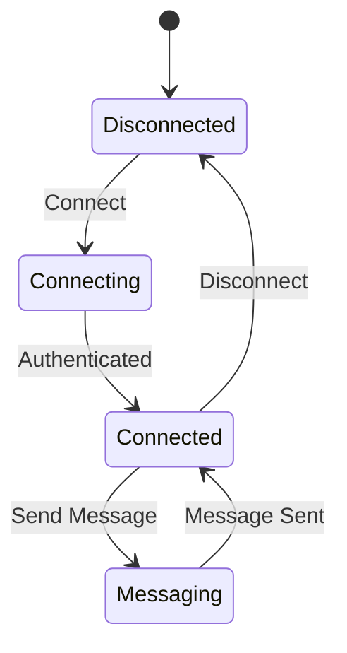

## 13.3 Implementing Protocols and Services

In the realm of advanced systems programming, implementing protocols and services is a critical skill for software engineers and architects. This section delves into the design and implementation of protocols and services using the D programming language, leveraging its unique features to create efficient, scalable, and maintainable systems.

### Protocol Design

#### Custom Protocols

Designing custom protocols involves defining message formats and interactions between different components of a system. This process is crucial for ensuring that data is transmitted accurately and efficiently across networks.

**Defining Message Formats**

When designing a custom protocol, the first step is to define the message formats. This involves specifying the structure of the data that will be exchanged. Considerations include data types, field lengths, and encoding methods.

```d
struct Message {
    uint id;
    string command;
    string payload;
}
```

In this example, a simple message structure is defined using D's `struct`. The `id` field is used to uniquely identify the message, while `command` and `payload` represent the action to be performed and the associated data, respectively.

**Managing Interactions**

Interactions in a protocol are defined by the sequence and rules governing message exchanges. This can be represented using state machines, which help manage protocol states and transitions.

#### State Machines

State machines are a powerful tool for managing the complexity of protocol interactions. They define the possible states of a protocol and the transitions between these states based on received messages or events.

```d
enum State {
    INIT,
    CONNECTED,
    AUTHENTICATED,
    DISCONNECTED
}

State currentState = State.INIT;

void handleMessage(Message msg) {
    switch (currentState) {
        case State.INIT:
            if (msg.command == "CONNECT") {
                currentState = State.CONNECTED;
            }
            break;
        case State.CONNECTED:
            if (msg.command == "AUTH") {
                currentState = State.AUTHENTICATED;
            }
            break;
        case State.AUTHENTICATED:
            if (msg.command == "DISCONNECT") {
                currentState = State.DISCONNECTED;
            }
            break;
        default:
            break;
    }
}
```

In this example, a simple state machine is implemented to manage the states of a protocol. The `handleMessage` function processes incoming messages and transitions the protocol state accordingly.

### Service Implementation

Implementing services involves creating software components that provide specific functionalities over a network. These services can be stateless or stateful, each with its own trade-offs.

#### Stateless vs. Stateful Services

**Stateless Services**

Stateless services do not retain any information about client interactions between requests. Each request is independent, which simplifies scaling and fault tolerance.

```d
void handleRequest(string request) {
    // Process request without relying on previous state
    string response = processRequest(request);
    sendResponse(response);
}
```

In this example, a stateless service processes each request independently, without relying on any stored state.

**Stateful Services**

Stateful services maintain information about client interactions, allowing for more complex interactions but requiring careful management of state.

```d
class Session {
    string sessionId;
    string userData;
}

Session[] activeSessions;

void handleRequest(string sessionId, string request) {
    auto session = activeSessions.find!(s => s.sessionId == sessionId);
    if (session) {
        // Process request using session data
        string response = processRequestWithSession(request, session);
        sendResponse(response);
    }
}
```

In this example, a stateful service manages sessions for each client, allowing for personalized interactions based on stored session data.

#### Scaling Considerations

Designing services for scalability involves considering how the service will handle increased load and grow over time. Key considerations include load balancing, distributed architectures, and resource management.

**Load Balancing**

Load balancing distributes incoming requests across multiple instances of a service to ensure even load distribution and prevent any single instance from becoming a bottleneck.

```d
void distributeRequest(string request) {
    // Select an instance based on load balancing strategy
    auto instance = selectInstance();
    instance.handleRequest(request);
}
```

In this example, a simple load balancing mechanism distributes requests across service instances.

**Distributed Architectures**

Distributed architectures involve deploying services across multiple nodes or data centers to improve availability and fault tolerance.

```d
void replicateData(string data) {
    // Replicate data across multiple nodes
    foreach (node; nodes) {
        node.storeData(data);
    }
}
```

In this example, data is replicated across multiple nodes to ensure availability and consistency.

### Use Cases and Examples

#### Chat Applications

Chat applications are a common use case for implementing protocols and services. They require real-time communication between clients, often involving complex interactions and state management.

**Real-Time Communication**

Real-time communication in chat applications can be achieved using protocols like WebSockets, which provide a persistent connection between clients and servers.

```d
import vibe.d;

void handleWebSocketConnection(WebSocket ws) {
    ws.onMessage((msg) {
        // Broadcast message to all connected clients
        foreach (client; connectedClients) {
            client.send(msg);
        }
    });
}
```

In this example, a WebSocket server is implemented using the Vibe.d library, allowing for real-time message broadcasting to connected clients.

#### File Transfer Services

File transfer services handle data uploads and downloads, often requiring efficient data handling and error management.

**Handling Data Transfers**

Efficient data handling in file transfer services involves managing large data streams and ensuring data integrity.

```d
void handleFileUpload(File file) {
    // Read file data in chunks
    while (!file.eof) {
        auto chunk = file.readChunk();
        processChunk(chunk);
    }
}
```

In this example, a file upload service reads file data in chunks, allowing for efficient processing and error handling.

### Visualizing Protocol and Service Design

To better understand the design of protocols and services, let's visualize a simple chat application using a state machine diagram.



This diagram illustrates the states and transitions of a chat application protocol, highlighting the flow from connection to messaging and disconnection.

### References and Links

- [Vibe.d Documentation](https://vibed.org/docs)
- [D Programming Language](https://dlang.org/)
- [WebSocket Protocol](https://developer.mozilla.org/en-US/docs/Web/API/WebSockets_API)

### Knowledge Check

- What are the key differences between stateless and stateful services?
- How can state machines be used to manage protocol interactions?
- What are the benefits of using load balancing in service implementation?

### Embrace the Journey

Remember, implementing protocols and services is a journey that involves continuous learning and experimentation. As you progress, you'll build more complex and efficient systems. Keep exploring, stay curious, and enjoy the process!

## Quiz Time!



### What is the primary purpose of defining message formats in protocol design?

- [x] To ensure data is transmitted accurately and efficiently
- [ ] To increase the complexity of the protocol
- [ ] To reduce the size of the messages
- [ ] To make the protocol harder to understand

> **Explanation:** Defining message formats ensures that data is transmitted accurately and efficiently across networks.

### How do state machines help in protocol design?

- [x] By managing protocol states and transitions
- [ ] By increasing the number of states
- [ ] By making the protocol more complex
- [ ] By reducing the number of messages

> **Explanation:** State machines help manage protocol states and transitions, simplifying the design of complex interactions.

### What is a key characteristic of stateless services?

- [x] They do not retain information about client interactions between requests
- [ ] They maintain a session for each client
- [ ] They require more memory
- [ ] They are harder to scale

> **Explanation:** Stateless services do not retain information about client interactions, making them easier to scale and manage.

### What is the benefit of using load balancing in service implementation?

- [x] It distributes incoming requests across multiple instances
- [ ] It increases the complexity of the service
- [ ] It reduces the number of servers needed
- [ ] It makes the service slower

> **Explanation:** Load balancing distributes incoming requests across multiple instances, ensuring even load distribution and preventing bottlenecks.

### What protocol is commonly used for real-time communication in chat applications?

- [x] WebSockets
- [ ] HTTP
- [ ] FTP
- [ ] SMTP

> **Explanation:** WebSockets provide a persistent connection for real-time communication in chat applications.

### How can data integrity be ensured in file transfer services?

- [x] By managing large data streams efficiently
- [ ] By reducing the size of the files
- [ ] By increasing the number of transfers
- [ ] By using smaller chunks

> **Explanation:** Efficient management of large data streams helps ensure data integrity during file transfers.

### What is a key advantage of distributed architectures?

- [x] Improved availability and fault tolerance
- [ ] Increased complexity
- [ ] Reduced number of nodes
- [ ] Slower data replication

> **Explanation:** Distributed architectures improve availability and fault tolerance by deploying services across multiple nodes.

### What is the role of a state machine in a chat application protocol?

- [x] To manage the flow from connection to messaging and disconnection
- [ ] To increase the number of messages
- [ ] To reduce the number of states
- [ ] To make the protocol more complex

> **Explanation:** A state machine manages the flow from connection to messaging and disconnection in a chat application protocol.

### What is the primary benefit of using WebSockets in chat applications?

- [x] Real-time message broadcasting
- [ ] Reduced server load
- [ ] Increased message size
- [ ] Slower communication

> **Explanation:** WebSockets enable real-time message broadcasting, essential for chat applications.

### True or False: Stateless services are harder to scale than stateful services.

- [ ] True
- [x] False

> **Explanation:** Stateless services are easier to scale because they do not retain information about client interactions.




