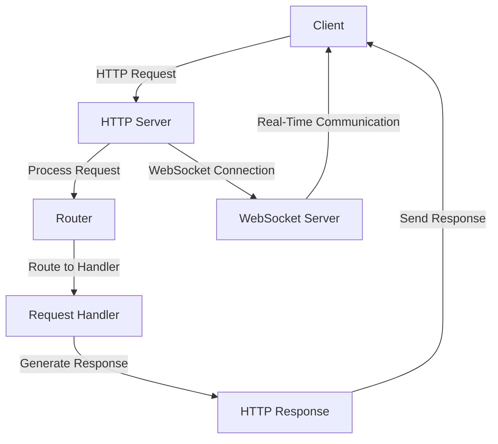

## 13.4 Web Development with Vibe.d

Web development in the D programming language is significantly enhanced by Vibe.d, a high-performance asynchronous I/O framework. Vibe.d is designed to simplify the creation of scalable web applications and services, leveraging D's unique features to provide a robust environment for both server-side and client-side development. In this section, we will explore the core components of Vibe.d, including its HTTP server capabilities, WebSocket support, and how to build dynamic web applications and REST APIs.

### Introduction to Vibe.d

Vibe.d is an asynchronous I/O framework that utilizes an event-driven architecture, making it ideal for developing high-performance web applications. Its design is inspired by frameworks like Node.js, but it takes full advantage of D's powerful features, such as compile-time function execution and metaprogramming. Vibe.d allows developers to write non-blocking code that can handle thousands of concurrent connections efficiently.

#### Asynchronous I/O Framework

Vibe.d's asynchronous I/O model is built around the concept of fibers, lightweight threads that allow for cooperative multitasking. This model enables the framework to handle multiple I/O operations concurrently without the overhead of traditional threading models. By using fibers, Vibe.d can manage numerous connections simultaneously, making it suitable for applications requiring high concurrency.

```d
import vibe.core.core : runApplication;
import vibe.http.server : HTTPServerSettings, listenHTTP;

void main() {
    auto settings = new HTTPServerSettings;
    settings.port = 8080;
    listenHTTP(settings, (req, res) {
        res.writeBody("Hello, Vibe.d!");
    });
    runApplication();
}
```

In the example above, we create a simple HTTP server using Vibe.d. The `listenHTTP` function sets up a server that listens on port 8080 and responds with "Hello, Vibe.d!" to any incoming request. The `runApplication` function starts the event loop, allowing the server to handle requests asynchronously.

#### Web Application Support

Vibe.d provides comprehensive support for building web applications, including REST APIs and full-fledged web servers. Its modular architecture allows developers to choose the components they need, such as HTTP servers, WebSockets, and database connectors, to build scalable and maintainable applications.

### Core Components

Vibe.d's core components are designed to facilitate the development of web applications by providing essential building blocks for handling HTTP requests, managing WebSocket connections, and more.

#### HTTP Servers

The HTTP server component of Vibe.d is a powerful tool for handling web requests and responses. It supports various HTTP methods, including GET, POST, PUT, and DELETE, making it suitable for building RESTful services.

```d
import vibe.http.router : URLRouter;
import vibe.http.server : listenHTTP;

void main() {
    auto router = new URLRouter;
    router.get("/hello", (req, res) {
        res.writeBody("Hello, World!");
    });

    listenHTTP(new HTTPServerSettings, router);
    runApplication();
}
```

In this example, we use a `URLRouter` to define a route for the `/hello` endpoint. When a GET request is made to this endpoint, the server responds with "Hello, World!". This demonstrates how Vibe.d simplifies the process of setting up routes and handling HTTP requests.

#### WebSockets

WebSockets are a key feature of Vibe.d, enabling real-time bidirectional communication between clients and servers. This is particularly useful for applications that require instant updates, such as chat applications or live data feeds.

```d
import vibe.http.websockets : listenWebSocket;

void main() {
    listenWebSocket(new HTTPServerSettings, "/ws", (conn) {
        while (conn.connected) {
            auto msg = conn.receiveText();
            conn.sendText("Echo: " ~ msg);
        }
    });
    runApplication();
}
```

The code above sets up a WebSocket server that listens for connections on the `/ws` endpoint. When a message is received, the server echoes it back to the client. This example illustrates how Vibe.d makes it easy to implement WebSocket communication.

### Use Cases and Examples

Vibe.d is versatile and can be used for a wide range of web development tasks, from creating simple web APIs to building complex dynamic web applications.

#### Web APIs

Vibe.d excels at building web APIs, allowing developers to expose services over HTTP. Its support for RESTful architecture makes it easy to create APIs that are both scalable and maintainable.

```d
import vibe.http.router : URLRouter;
import vibe.http.server : listenHTTP;

void main() {
    auto router = new URLRouter;
    router.get("/api/data", (req, res) {
        res.writeJson(["key": "value"]);
    });

    listenHTTP(new HTTPServerSettings, router);
    runApplication();
}
```

In this example, we define a simple API endpoint `/api/data` that returns a JSON response. Vibe.d's built-in JSON support simplifies the process of serializing and deserializing data, making it straightforward to work with JSON in web APIs.

#### Dynamic Web Applications

Dynamic web applications require the ability to serve content and handle user interactions efficiently. Vibe.d's asynchronous architecture and support for templating engines make it well-suited for this task.

```d
import vibe.http.fileserver : serveStaticFiles;
import vibe.http.server : listenHTTP;

void main() {
    listenHTTP(new HTTPServerSettings, serveStaticFiles("./public"));
    runApplication();
}
```

The example above demonstrates how to serve static files from a `public` directory. This is useful for serving HTML, CSS, and JavaScript files in a dynamic web application. By combining static file serving with dynamic content generation, developers can create rich, interactive web applications.

### Visualizing Vibe.d's Architecture

To better understand how Vibe.d's components interact, let's visualize its architecture using a Mermaid.js diagram.



**Diagram Description:** This diagram illustrates the flow of an HTTP request through Vibe.d's architecture. The client sends an HTTP request to the server, which processes the request and routes it to the appropriate handler. The handler generates a response, which is sent back to the client. Additionally, the WebSocket server handles real-time communication with the client.

### Try It Yourself

Experiment with the examples provided by modifying the code to add new routes, implement additional WebSocket functionality, or integrate a database for persistent storage. This hands-on approach will deepen your understanding of Vibe.d and its capabilities.

### References and Links

- [Vibe.d Official Documentation](https://vibed.org/docs)
- [D Programming Language](https://dlang.org/)
- [MDN Web Docs on WebSockets](https://developer.mozilla.org/en-US/docs/Web/API/WebSockets_API)

### Knowledge Check

- What is the primary advantage of using Vibe.d's asynchronous I/O model?
- How does Vibe.d handle HTTP requests and responses?
- What are some use cases for WebSockets in web applications?

### Embrace the Journey

Remember, mastering web development with Vibe.d is a journey. As you explore its features and capabilities, you'll gain the skills needed to build high-performance, scalable web applications. Keep experimenting, stay curious, and enjoy the process!

## Quiz Time!



### What is the primary advantage of using Vibe.d's asynchronous I/O model?

- [x] It allows handling multiple I/O operations concurrently without blocking.
- [ ] It simplifies synchronous programming.
- [ ] It reduces the need for error handling.
- [ ] It eliminates the need for HTTP servers.

> **Explanation:** Vibe.d's asynchronous I/O model enables concurrent handling of multiple I/O operations, improving performance and scalability.

### How does Vibe.d handle HTTP requests and responses?

- [x] By using an event-driven architecture with fibers.
- [ ] By creating a new thread for each request.
- [ ] By using synchronous blocking calls.
- [ ] By relying on external libraries for HTTP handling.

> **Explanation:** Vibe.d uses an event-driven architecture with fibers to efficiently handle HTTP requests and responses.

### What are some use cases for WebSockets in web applications?

- [x] Real-time chat applications and live data feeds.
- [ ] Static file serving.
- [ ] Batch processing.
- [ ] Data storage.

> **Explanation:** WebSockets are ideal for applications requiring real-time communication, such as chat applications and live data feeds.

### Which component of Vibe.d is used to define routes for HTTP requests?

- [x] URLRouter
- [ ] WebSocketServer
- [ ] HTTPClient
- [ ] FiberManager

> **Explanation:** The URLRouter component is used to define routes for handling HTTP requests in Vibe.d.

### What is the role of fibers in Vibe.d's architecture?

- [x] They enable cooperative multitasking for handling concurrent operations.
- [ ] They manage memory allocation.
- [ ] They provide a security layer.
- [ ] They handle database connections.

> **Explanation:** Fibers in Vibe.d allow for cooperative multitasking, enabling efficient handling of concurrent operations.

### How can you serve static files using Vibe.d?

- [x] By using the serveStaticFiles function.
- [ ] By implementing a custom file server.
- [ ] By using WebSockets.
- [ ] By creating a new HTTP client.

> **Explanation:** The serveStaticFiles function in Vibe.d is used to serve static files from a specified directory.

### What is a key feature of Vibe.d's WebSocket support?

- [x] Real-time bidirectional communication.
- [ ] Static content delivery.
- [ ] Batch processing.
- [ ] Database management.

> **Explanation:** Vibe.d's WebSocket support enables real-time bidirectional communication between clients and servers.

### Which function is used to start the event loop in a Vibe.d application?

- [x] runApplication
- [ ] startServer
- [ ] beginEventLoop
- [ ] initializeApp

> **Explanation:** The runApplication function is used to start the event loop in a Vibe.d application.

### What is the purpose of the HTTPServerSettings in Vibe.d?

- [x] To configure server settings such as port and address.
- [ ] To manage database connections.
- [ ] To define WebSocket endpoints.
- [ ] To handle error logging.

> **Explanation:** HTTPServerSettings in Vibe.d is used to configure server settings like port and address.

### True or False: Vibe.d can only be used for server-side web development.

- [ ] True
- [x] False

> **Explanation:** Vibe.d can be used for both server-side and client-side web development, providing a comprehensive framework for building web applications.


