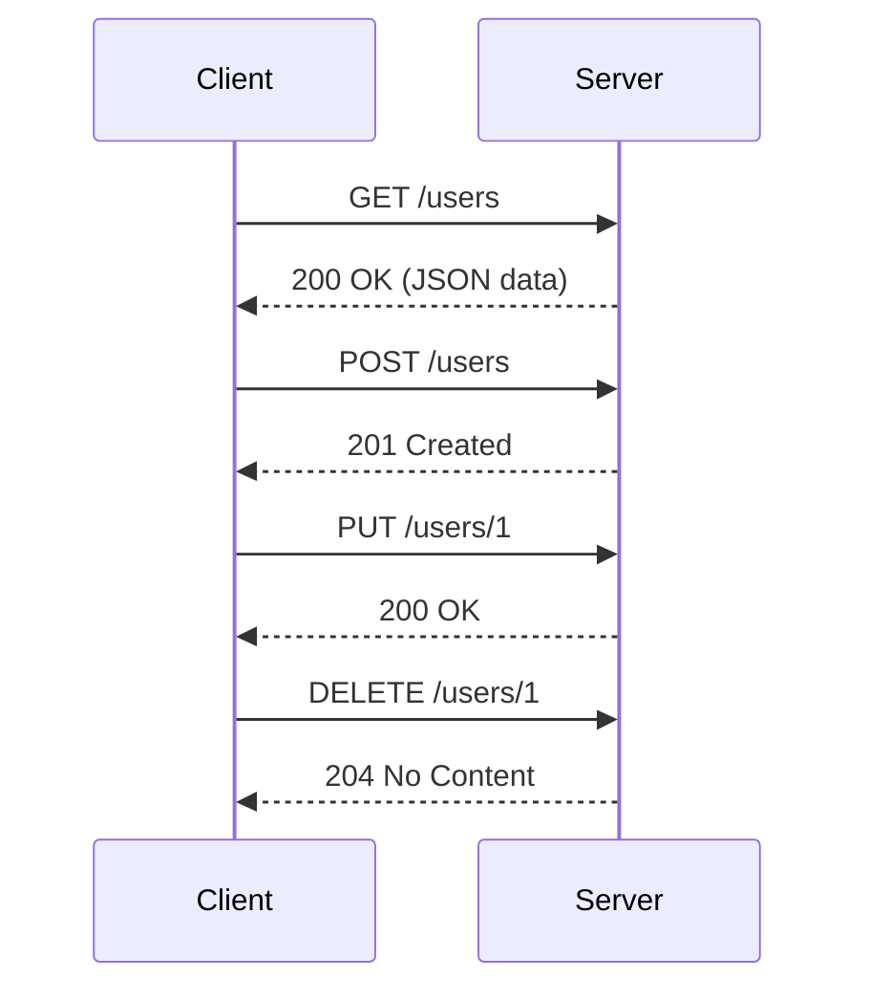

## 13.5 RESTful API Design and Implementation

In the modern landscape of software development, RESTful APIs have become a cornerstone for enabling communication between distributed systems. The D programming language, with its powerful features and performance capabilities, offers a robust platform for designing and implementing RESTful APIs. In this section, we will explore the principles of REST, delve into the specifics of implementing RESTful APIs in D, and examine practical use cases.

### Principles of REST

REST, or Representational State Transfer, is an architectural style that defines a set of constraints and principles for creating web services. Let's explore some of the core principles that underpin RESTful API design.

#### Statelessness

One of the fundamental principles of REST is statelessness. This means that each HTTP request from a client to a server must contain all the information needed to understand and process the request. The server does not store any session information about the client. This stateless nature simplifies server design and enhances scalability.

#### Resource-Oriented Architecture

RESTful APIs are built around resources, which are identified by URLs. Each resource can have multiple representations, such as JSON, XML, or HTML. The operations on these resources are performed using standard HTTP methods like GET, POST, PUT, DELETE, etc.

### Implementing RESTful APIs in D

The D programming language provides several features that make it an excellent choice for implementing RESTful APIs. Let's explore some of these features and how they can be leveraged.

#### Routing

Routing is the process of mapping URLs to specific handlers or functions that process the requests. In D, libraries like Vibe.d provide powerful routing capabilities. Here's a simple example of setting up routing in a D application using Vibe.d:

```d
import vibe.vibe;

void main()
{
    auto settings = new HTTPServerSettings;
    settings.port = 8080;
    listenHTTP(settings, &router);
}

void router(HTTPServerRequest req, HTTPServerResponse res)
{
    final switch (req.path)
    {
        case "/":
            res.writeBody("Welcome to the RESTful API!");
            break;
        case "/users":
            handleUsers(req, res);
            break;
        default:
            res.statusCode = 404;
            res.writeBody("Not Found");
    }
}

void handleUsers(HTTPServerRequest req, HTTPServerResponse res)
{
    // Handle user-related requests
    res.writeBody("User endpoint");
}
```

In this example, we set up a basic HTTP server that listens on port 8080 and routes requests to different handlers based on the URL path.

#### Serialization

Serialization is the process of converting data structures into a format that can be easily transmitted over the network. JSON is a popular format for RESTful APIs due to its simplicity and readability. D provides libraries for JSON serialization, such as `std.json` and `vibe.data.json`.

Here's an example of serializing a D struct to JSON using `vibe.data.json`:

```d
import vibe.data.json;

struct User
{
    string name;
    int age;
}

void main()
{
    User user = User("Alice", 30);
    Json json = toJson(user);
    writeln(json.toString());
}
```

This code snippet demonstrates how to convert a `User` struct into a JSON object, which can then be sent as a response in a RESTful API.

### Use Cases and Examples

RESTful APIs are versatile and can be used in various scenarios. Let's explore some common use cases and how D can be used to implement them.

#### Microservices

Microservices architecture involves building small, independent services that communicate over HTTP. Each service is responsible for a specific business capability. D's performance and concurrency features make it an excellent choice for building microservices.

Here's a simple example of a microservice in D that provides user information:

```d
import vibe.vibe;

void main()
{
    auto settings = new HTTPServerSettings;
    settings.port = 8081;
    listenHTTP(settings, &router);
}

void router(HTTPServerRequest req, HTTPServerResponse res)
{
    if (req.path == "/user")
    {
        res.writeJson(User("Bob", 25));
    }
    else
    {
        res.statusCode = 404;
        res.writeBody("Not Found");
    }
}

struct User
{
    string name;
    int age;
}
```

This microservice listens on port 8081 and responds with user information in JSON format when the `/user` endpoint is accessed.

#### Mobile App Backends

RESTful APIs are commonly used as backends for mobile applications, providing data and services to client apps. D's ability to interface with C and C++ code makes it a great choice for building high-performance backends.

Here's an example of a simple RESTful API that serves as a backend for a mobile app:

```d
import vibe.vibe;

void main()
{
    auto settings = new HTTPServerSettings;
    settings.port = 8082;
    listenHTTP(settings, &router);
}

void router(HTTPServerRequest req, HTTPServerResponse res)
{
    switch (req.path)
    {
        case "/products":
            res.writeJson(getProducts());
            break;
        case "/product":
            res.writeJson(getProduct(req.query["id"]));
            break;
        default:
            res.statusCode = 404;
            res.writeBody("Not Found");
    }
}

Json[] getProducts()
{
    return [
        Json(["id": 1, "name": "Product A", "price": 10.0]),
        Json(["id": 2, "name": "Product B", "price": 20.0])
    ];
}

Json getProduct(string id)
{
    // Simulate fetching a product by ID
    return Json(["id": id, "name": "Product A", "price": 10.0]);
}
```

This example demonstrates a RESTful API that provides product information to a mobile app, with endpoints for listing products and fetching a specific product by ID.

### Visualizing RESTful API Design

To better understand the flow of a RESTful API, let's visualize the interaction between a client and a server using a sequence diagram.



This diagram illustrates the typical interactions between a client and a server in a RESTful API, using standard HTTP methods.

### Try It Yourself

Now that we've explored the principles and implementation of RESTful APIs in D, it's time to experiment. Try modifying the code examples to add new endpoints, handle different HTTP methods, or integrate with a database for persistent storage. This hands-on practice will deepen your understanding and help you build more complex APIs.

### Knowledge Check

To reinforce your learning, consider the following questions:

- What are the key principles of RESTful API design?
- How does D's stateless nature benefit RESTful API implementation?
- What are some common use cases for RESTful APIs?
- How can you leverage D's features to build efficient microservices?

### Embrace the Journey

Remember, mastering RESTful API design and implementation is a journey. As you continue to explore and experiment, you'll gain deeper insights and build more sophisticated systems. Stay curious, keep learning, and enjoy the process!

## Quiz Time!



### What is a fundamental principle of RESTful API design?

- [x] Statelessness
- [ ] Stateful sessions
- [ ] Persistent connections
- [ ] Client-side caching

> **Explanation:** Statelessness ensures that each request contains all necessary information, simplifying server design and enhancing scalability.

### Which HTTP method is used to create a new resource in a RESTful API?

- [ ] GET
- [x] POST
- [ ] PUT
- [ ] DELETE

> **Explanation:** The POST method is used to create a new resource in a RESTful API.

### What is the purpose of routing in a RESTful API?

- [x] Mapping URLs to handlers
- [ ] Encrypting data
- [ ] Managing sessions
- [ ] Caching responses

> **Explanation:** Routing maps URLs to specific handlers or functions that process the requests.

### Which format is commonly used for data serialization in RESTful APIs?

- [x] JSON
- [ ] CSV
- [ ] YAML
- [ ] HTML

> **Explanation:** JSON is a popular format for data serialization in RESTful APIs due to its simplicity and readability.

### What is a common use case for RESTful APIs?

- [x] Microservices
- [ ] Desktop applications
- [ ] Embedded systems
- [ ] Batch processing

> **Explanation:** RESTful APIs are commonly used in microservices architecture to enable communication between distributed services.

### How does D's ability to interface with C and C++ benefit RESTful API implementation?

- [x] It allows for high-performance backends.
- [ ] It simplifies routing.
- [ ] It enhances data serialization.
- [ ] It improves statelessness.

> **Explanation:** D's ability to interface with C and C++ allows for building high-performance backends, which is beneficial for RESTful API implementation.

### What is the role of serialization in RESTful APIs?

- [x] Converting data structures into a transmittable format
- [ ] Encrypting data for security
- [ ] Managing user sessions
- [ ] Caching responses for performance

> **Explanation:** Serialization converts data structures into a format that can be easily transmitted over the network, such as JSON.

### Which D library provides routing capabilities for RESTful APIs?

- [x] Vibe.d
- [ ] Phobos
- [ ] Tango
- [ ] DlangUI

> **Explanation:** Vibe.d is a D library that provides powerful routing capabilities for building RESTful APIs.

### What is the benefit of using a resource-oriented architecture in RESTful APIs?

- [x] It models data as resources, simplifying interactions.
- [ ] It enhances data encryption.
- [ ] It improves session management.
- [ ] It reduces server load.

> **Explanation:** A resource-oriented architecture models data as resources, simplifying interactions and making APIs more intuitive.

### True or False: RESTful APIs require the server to maintain session state.

- [ ] True
- [x] False

> **Explanation:** RESTful APIs are stateless, meaning the server does not maintain session state. Each request contains all necessary information.


