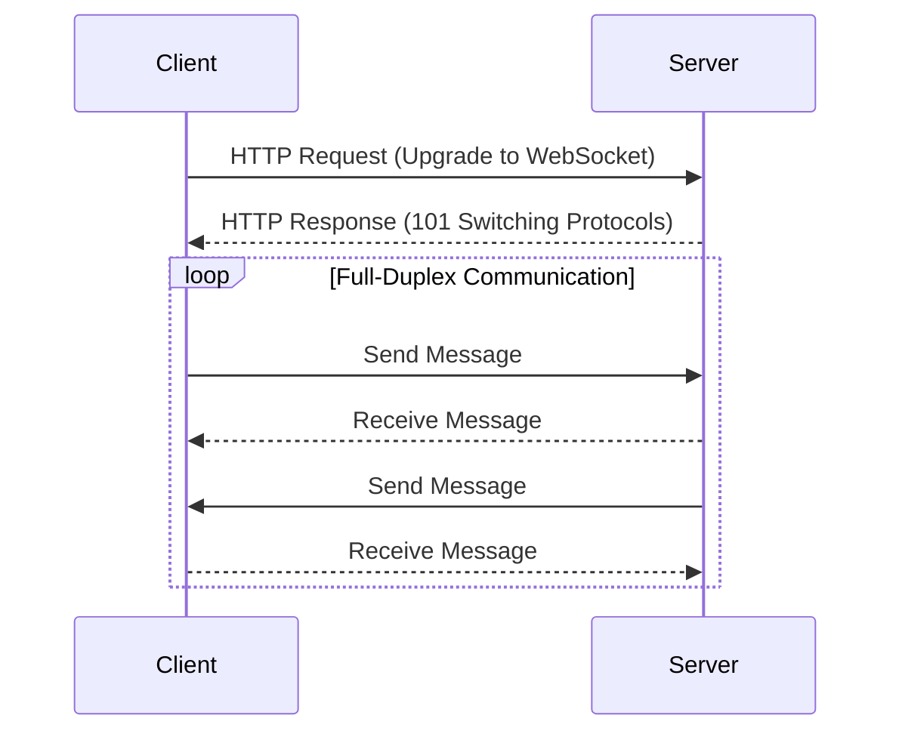

## 13.6 WebSocket Communication Patterns

In the realm of modern web applications, real-time communication is a cornerstone for delivering dynamic and interactive user experiences. WebSockets, a protocol providing full-duplex communication channels over a single TCP connection, have become a vital tool for developers aiming to implement real-time features. In this section, we delve into WebSocket communication patterns in the D programming language, exploring how to leverage D's capabilities to build efficient, scalable, and maintainable real-time systems.

### WebSockets Basics

Before diving into implementation specifics, let's establish a foundational understanding of WebSockets and their core features.

#### Persistent Connections

WebSockets enable persistent connections between clients and servers, allowing data to be sent and received continuously without the overhead of establishing new connections for each message. This persistent nature is crucial for applications requiring constant updates, such as live sports scores, stock tickers, or collaborative tools.

#### Full-Duplex Communication

Unlike traditional HTTP requests, which are half-duplex (either sending or receiving at a time), WebSockets support full-duplex communication. This means both client and server can send messages simultaneously, making WebSockets ideal for interactive applications like chat systems or multiplayer games.

### Implementing WebSockets in D

Implementing WebSockets in D involves several key components: establishing connections, handling multiple clients, and broadcasting messages. Let's explore each of these aspects in detail.

#### Connection Handling

Managing WebSocket connections in D requires handling multiple clients efficiently. The `vibe.d` library, a popular choice for web development in D, provides robust support for WebSockets. Here's a basic example of setting up a WebSocket server using `vibe.d`:

```d
import vibe.d;

void handleWebSocket(WebSocket socket) {
    while (socket.connected) {
        auto message = socket.receiveText();
        // Process the message
        socket.sendText("Echo: " ~ message);
    }
}

void main() {
    auto settings = new HTTPServerSettings;
    settings.port = 8080;
    listenHTTP(settings, (req, res) {
        if (req.isWebSocket) {
            req.upgradeWebSocket(&handleWebSocket);
        } else {
            res.writeBody("WebSocket server running...");
        }
    });
    runApplication();
}
```

In this example, we define a `handleWebSocket` function to manage incoming WebSocket connections. The server listens on port 8080 and upgrades HTTP requests to WebSocket connections when applicable.

#### Message Broadcasting

Broadcasting messages to all connected clients is a common requirement in WebSocket applications. This pattern is essential for scenarios like real-time notifications or collaborative applications. Here's how you can implement message broadcasting in D:

```d
import vibe.d;

shared static this() {
    auto clients = new ConcurrentBag!WebSocket;

    void handleWebSocket(WebSocket socket) {
        clients.insert(socket);
        while (socket.connected) {
            auto message = socket.receiveText();
            foreach (client; clients) {
                if (client.connected) {
                    client.sendText(message);
                }
            }
        }
        clients.remove(socket);
    }

    auto settings = new HTTPServerSettings;
    settings.port = 8080;
    listenHTTP(settings, (req, res) {
        if (req.isWebSocket) {
            req.upgradeWebSocket(&handleWebSocket);
        } else {
            res.writeBody("WebSocket server running...");
        }
    });
    runApplication();
}
```

In this code, we use a `ConcurrentBag` to store active WebSocket connections. The `handleWebSocket` function broadcasts received messages to all connected clients, ensuring real-time updates across the board.

### Use Cases and Examples

WebSockets are versatile and can be applied to various real-time communication scenarios. Let's explore some common use cases and how they can be implemented in D.

#### Real-Time Notifications

Real-time notifications are essential for keeping users informed about important events as they happen. Whether it's a new message in a chat application or a price change in a stock trading platform, WebSockets provide the necessary infrastructure for instant updates.

**Example: Stock Price Updates**

Imagine a stock trading application where users need to receive real-time updates on stock prices. Using WebSockets, we can push updates to clients as soon as they occur:

```d
import vibe.d;

void broadcastStockPrice(string stockSymbol, double price) {
    foreach (client; clients) {
        if (client.connected) {
            client.sendText(format("Stock: %s, Price: %.2f", stockSymbol, price));
        }
    }
}

// Simulate stock price updates
void simulateStockUpdates() {
    while (true) {
        broadcastStockPrice("AAPL", 150.00 + uniform(-5.0, 5.0));
        sleep(1.seconds);
    }
}

void main() {
    // Setup WebSocket server as before
    // Start stock update simulation
    runTask(&simulateStockUpdates);
    runApplication();
}
```

In this example, we simulate stock price updates and broadcast them to all connected clients using WebSockets. This approach ensures that users receive timely information without polling the server.

#### Collaborative Applications

Collaborative applications, such as shared document editors or multiplayer games, benefit greatly from WebSockets' ability to synchronize state across multiple clients in real-time.

**Example: Collaborative Text Editor**

Consider a collaborative text editor where multiple users can edit a document simultaneously. WebSockets can be used to propagate changes made by one user to all others:

```d
import vibe.d;

void handleTextEdit(WebSocket socket, string documentId) {
    while (socket.connected) {
        auto edit = socket.receiveText();
        // Apply edit to the document
        foreach (client; clients) {
            if (client.connected && client != socket) {
                client.sendText(edit);
            }
        }
    }
}

void main() {
    // Setup WebSocket server as before
    // Handle text edits
    listenHTTP(settings, (req, res) {
        if (req.isWebSocket) {
            req.upgradeWebSocket((socket) => handleTextEdit(socket, "doc123"));
        } else {
            res.writeBody("Collaborative editor server running...");
        }
    });
    runApplication();
}
```

In this scenario, the `handleTextEdit` function receives edits from a client and broadcasts them to all other clients, ensuring that everyone sees the same document state.

### Visualizing WebSocket Communication

To better understand the flow of WebSocket communication, let's visualize a typical interaction between a client and a server using a sequence diagram.



**Diagram Description:** This sequence diagram illustrates the initial HTTP request from the client to upgrade to a WebSocket connection, followed by the full-duplex communication where both client and server can send and receive messages simultaneously.

### Design Considerations

When implementing WebSocket communication patterns in D, consider the following:

- **Scalability**: Ensure your server can handle a large number of concurrent connections. Use efficient data structures and algorithms to manage client connections and message broadcasting.
- **Error Handling**: Implement robust error handling to manage connection drops and unexpected errors gracefully.
- **Security**: Use secure WebSocket (wss://) to encrypt data in transit and protect against man-in-the-middle attacks.
- **Resource Management**: Monitor and manage resources such as memory and CPU usage to prevent server overload.

### Differences and Similarities

WebSockets are often compared to other real-time communication technologies like Server-Sent Events (SSE) and HTTP/2. While SSE is simpler and more lightweight, it only supports one-way communication from server to client. HTTP/2, on the other hand, provides multiplexing and server push capabilities but lacks the full-duplex nature of WebSockets.

### Try It Yourself

To deepen your understanding of WebSocket communication patterns in D, try modifying the examples provided:

- **Experiment with Different Message Types**: Extend the examples to handle binary messages or JSON payloads.
- **Implement Authentication**: Add authentication mechanisms to ensure only authorized clients can connect.
- **Optimize Performance**: Profile your WebSocket server and identify bottlenecks. Experiment with different data structures or algorithms to improve performance.

### Knowledge Check

- What are the key benefits of using WebSockets for real-time communication?
- How does full-duplex communication differ from half-duplex communication?
- What are some common use cases for WebSockets in web applications?
- How can you handle multiple WebSocket connections efficiently in D?
- What security considerations should you keep in mind when implementing WebSockets?

### Embrace the Journey

Remember, mastering WebSocket communication patterns in D is just one step in your journey to becoming an expert in real-time systems programming. As you continue to explore and experiment, you'll discover new ways to leverage D's unique features to build powerful, interactive applications. Stay curious, keep learning, and enjoy the process!

## Quiz Time!



### What is a key feature of WebSockets that makes them suitable for real-time applications?

- [x] Full-duplex communication
- [ ] Half-duplex communication
- [ ] Stateless communication
- [ ] One-way communication

> **Explanation:** WebSockets support full-duplex communication, allowing simultaneous sending and receiving of messages, which is ideal for real-time applications.

### Which D library is commonly used for implementing WebSockets?

- [x] vibe.d
- [ ] phobos
- [ ] std.socket
- [ ] tango

> **Explanation:** The `vibe.d` library is a popular choice for web development in D, providing robust support for WebSockets.

### What is the purpose of using a ConcurrentBag in WebSocket implementations?

- [x] To manage multiple WebSocket connections efficiently
- [ ] To store messages for later processing
- [ ] To handle HTTP requests
- [ ] To encrypt WebSocket data

> **Explanation:** A `ConcurrentBag` is used to store active WebSocket connections, allowing efficient management of multiple clients.

### How does WebSocket communication differ from traditional HTTP requests?

- [x] WebSockets maintain a persistent connection
- [ ] WebSockets are stateless
- [ ] WebSockets use the GET method
- [ ] WebSockets require a new connection for each message

> **Explanation:** WebSockets maintain a persistent connection, unlike traditional HTTP requests which are stateless and require a new connection for each message.

### What is a common use case for WebSockets in web applications?

- [x] Real-time notifications
- [ ] Static content delivery
- [ ] Batch processing
- [ ] File uploads

> **Explanation:** WebSockets are commonly used for real-time notifications, providing instant updates to clients.

### Which of the following is a security consideration when using WebSockets?

- [x] Use secure WebSocket (wss://) to encrypt data
- [ ] Use plain WebSocket (ws://) for faster communication
- [ ] Disable authentication for simplicity
- [ ] Allow all incoming connections without validation

> **Explanation:** Using secure WebSocket (wss://) encrypts data in transit, protecting against man-in-the-middle attacks.

### What is the role of the `handleWebSocket` function in the provided examples?

- [x] To manage incoming WebSocket connections
- [ ] To send HTTP responses
- [ ] To process HTTP requests
- [ ] To encrypt WebSocket data

> **Explanation:** The `handleWebSocket` function manages incoming WebSocket connections, handling message reception and broadcasting.

### How can you optimize a WebSocket server for performance?

- [x] Profile the server and identify bottlenecks
- [ ] Increase the number of connections without monitoring
- [ ] Use plain WebSocket (ws://) for all connections
- [ ] Disable error handling for simplicity

> **Explanation:** Profiling the server and identifying bottlenecks allows you to optimize performance by addressing specific issues.

### What is a benefit of using WebSockets over Server-Sent Events (SSE)?

- [x] Full-duplex communication
- [ ] Simpler implementation
- [ ] One-way communication
- [ ] Stateless communication

> **Explanation:** WebSockets provide full-duplex communication, allowing both client and server to send messages simultaneously, unlike SSE which is one-way.

### True or False: WebSockets require a new connection for each message sent.

- [ ] True
- [x] False

> **Explanation:** WebSockets maintain a persistent connection, allowing multiple messages to be sent and received over the same connection.


