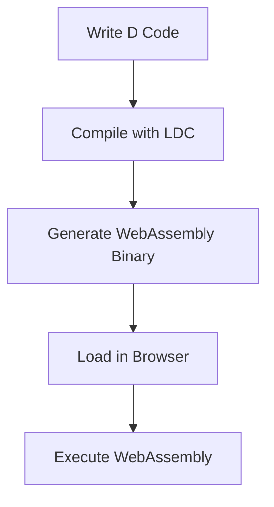
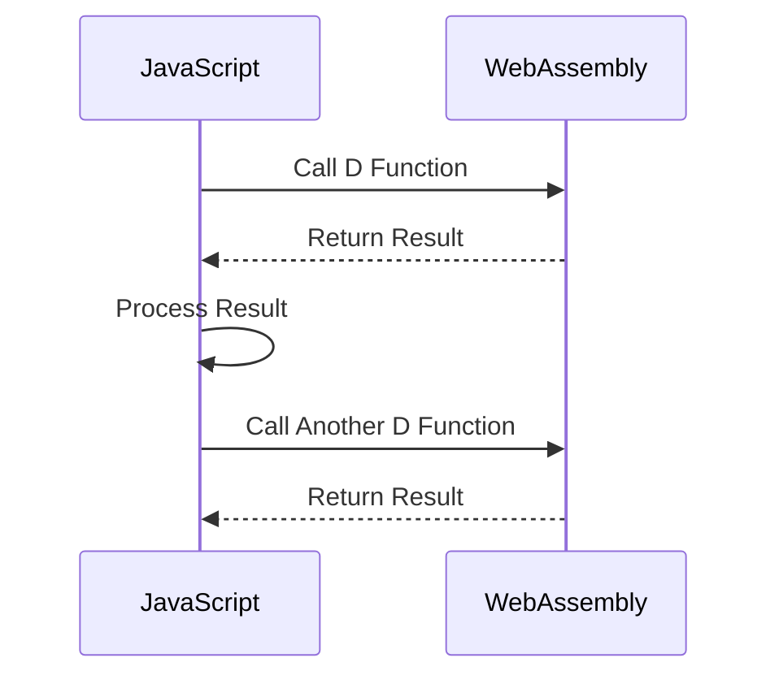

## 13.7 Client-Side Scripting with D

As web applications continue to evolve, the demand for high-performance client-side scripting has never been greater. The D programming language, with its powerful features and efficient execution, offers a compelling option for developers looking to push the boundaries of what's possible in the browser. In this section, we will explore how D can be used for client-side scripting through WebAssembly, and how it can interact with JavaScript to create robust and high-performance web applications.

### D for WebAssembly

WebAssembly (Wasm) is a binary instruction format designed as a portable target for the compilation of high-level languages like D. It enables high-performance applications to run in web browsers, providing a near-native execution speed. Let's delve into how you can compile D code to WebAssembly and run it in the browser.

#### Compiling D to WebAssembly

To compile D code to WebAssembly, we need to use a toolchain that supports this target. One such toolchain is LDC, the LLVM-based D compiler, which can be configured to output WebAssembly binaries.

**Steps to Compile D to WebAssembly:**

1. **Install LDC**: Ensure you have the latest version of LDC installed. You can download it from the [LDC GitHub releases](https://github.com/ldc-developers/ldc/releases).

2. **Set Up the WebAssembly Toolchain**: Install the necessary tools to support WebAssembly compilation. This includes `wasm-ld` for linking and `wasm-opt` for optimization.

3. **Write Your D Code**: Create a simple D program that you want to compile to WebAssembly. Here's an example:

   ```d
   // hello.d
   extern (C) export void sayHello() {
       import std.stdio;
       writeln("Hello from D and WebAssembly!");
   }
   ```

4. **Compile to WebAssembly**: Use LDC to compile the D code to WebAssembly. The command might look like this:

   ```bash
   ldc2 -betterC -mtriple=wasm32-unknown-unknown-wasm -O3 -release -of=hello.wasm hello.d
   ```

   - `-betterC`: Strips down the runtime to make it suitable for WebAssembly.
   - `-mtriple=wasm32-unknown-unknown-wasm`: Specifies the target as WebAssembly.
   - `-O3`: Enables optimization for speed.
   - `-release`: Compiles in release mode for performance.

5. **Run in the Browser**: Use JavaScript to load and execute the WebAssembly module in a web page.

   ```html
   <html>
   <body>
       <script>
           fetch('hello.wasm').then(response =>
               response.arrayBuffer()
           ).then(bytes =>
               WebAssembly.instantiate(bytes)
           ).then(results => {
               results.instance.exports.sayHello();
           });
       </script>
   </body>
   </html>
   ```

#### Visualizing the Compilation Process



**Diagram Description:** This flowchart illustrates the process of compiling D code to WebAssembly and executing it in a web browser.

### Interacting with JavaScript

While WebAssembly allows D code to run in the browser, interacting with JavaScript is crucial for integrating with existing web applications. Let's explore how D can communicate with JavaScript.

#### Bindings and Interoperability

To enable communication between D and JavaScript, we need to define bindings that allow JavaScript to call D functions and vice versa. This is typically done using the WebAssembly JavaScript API.

**Example: Calling D Functions from JavaScript**

Suppose we have a D function that performs a complex computation:

```d
// compute.d
extern (C) export int computeFactorial(int n) {
    if (n <= 1) return 1;
    return n * computeFactorial(n - 1);
}
```

Compile this to WebAssembly as shown earlier. Then, use JavaScript to call this function:

```html
<html>
<body>
    <script>
        fetch('compute.wasm').then(response =>
            response.arrayBuffer()
        ).then(bytes =>
            WebAssembly.instantiate(bytes)
        ).then(results => {
            const factorial = results.instance.exports.computeFactorial;
            console.log(`Factorial of 5 is: ${factorial(5)}`);
        });
    </script>
</body>
</html>
```

**Example: Calling JavaScript Functions from D**

To call JavaScript functions from D, you can use the `importObject` parameter when instantiating the WebAssembly module. Here's an example:

```d
// call_js.d
extern (C) export void callJSFunction() {
    // This function will be defined in JavaScript
    import std.stdio;
    writeln("Calling JavaScript function from D!");
}
```

In your JavaScript code:

```html
<html>
<body>
    <script>
        const importObject = {
            env: {
                jsFunction: function() {
                    console.log("JavaScript function called from D!");
                }
            }
        };

        fetch('call_js.wasm').then(response =>
            response.arrayBuffer()
        ).then(bytes =>
            WebAssembly.instantiate(bytes, importObject)
        ).then(results => {
            results.instance.exports.callJSFunction();
        });
    </script>
</body>
</html>
```

### Use Cases and Examples

Now that we understand how to compile D to WebAssembly and interact with JavaScript, let's explore some practical use cases where D can shine in client-side scripting.

#### High-Performance Web Applications

D's performance characteristics make it an excellent choice for high-performance web applications. By offloading computationally intensive tasks to WebAssembly modules written in D, you can achieve significant performance gains.

**Example: Image Processing**

Consider an image processing application where you need to apply complex filters to images. Implementing these filters in D and compiling them to WebAssembly can drastically reduce processing time compared to JavaScript.

```d
// image_filter.d
extern (C) export void applyFilter(uint8_t* imageData, int width, int height) {
    // Apply a simple grayscale filter
    for (int i = 0; i < width * height * 4; i += 4) {
        uint8_t gray = (imageData[i] + imageData[i + 1] + imageData[i + 2]) / 3;
        imageData[i] = gray;
        imageData[i + 1] = gray;
        imageData[i + 2] = gray;
    }
}
```

Compile this code to WebAssembly and use JavaScript to pass image data to the `applyFilter` function.

#### Complex Computations

D is well-suited for performing complex computations that would be inefficient in JavaScript. This includes tasks like numerical simulations, data analysis, and cryptographic operations.

**Example: Numerical Simulation**

Suppose you are building a web-based physics simulation. Implementing the core simulation logic in D can provide the performance needed for real-time interaction.

```d
// physics_simulation.d
extern (C) export void simulateStep(float* positions, float* velocities, int count, float deltaTime) {
    for (int i = 0; i < count; ++i) {
        positions[i] += velocities[i] * deltaTime;
    }
}
```

Compile this to WebAssembly and integrate it into your web application to handle the simulation steps efficiently.

### Try It Yourself

To deepen your understanding, try modifying the code examples provided:

- **Experiment with Different Filters**: Modify the `applyFilter` function to implement different image filters, such as sepia or invert colors.
- **Extend the Physics Simulation**: Add more complex physics interactions, such as collision detection or gravity, to the `simulateStep` function.
- **Optimize for Performance**: Use D's optimization flags and techniques to further enhance the performance of your WebAssembly modules.

### Visualizing JavaScript and WebAssembly Interaction



**Diagram Description:** This sequence diagram illustrates the interaction between JavaScript and WebAssembly, showing how JavaScript can call functions in a WebAssembly module and process the results.

### References and Links

- [WebAssembly.org](https://webassembly.org/) - Official WebAssembly website with documentation and resources.
- [MDN Web Docs on WebAssembly](https://developer.mozilla.org/en-US/docs/WebAssembly) - Comprehensive guide to WebAssembly on MDN.
- [LDC GitHub Releases](https://github.com/ldc-developers/ldc/releases) - Download the latest version of LDC for compiling D to WebAssembly.

### Knowledge Check

- **What are the benefits of using D for client-side scripting?**
- **How does WebAssembly improve the performance of web applications?**
- **What are some use cases where D's performance can be leveraged in the browser?**

### Embrace the Journey

Remember, this is just the beginning. As you progress, you'll build more complex and interactive web pages. Keep experimenting, stay curious, and enjoy the journey!

## Quiz Time!



### What is WebAssembly?

- [x] A binary instruction format for a stack-based virtual machine
- [ ] A JavaScript library for DOM manipulation
- [ ] A CSS framework for responsive design
- [ ] A database management system

> **Explanation:** WebAssembly is a binary instruction format designed as a portable target for the compilation of high-level languages like D, enabling high-performance applications to run in web browsers.

### How can D code be compiled to WebAssembly?

- [x] Using the LDC compiler with specific flags
- [ ] Using the DMD compiler with default settings
- [ ] By writing JavaScript wrappers around D code
- [ ] By converting D code to JavaScript manually

> **Explanation:** D code can be compiled to WebAssembly using the LDC compiler with specific flags that target WebAssembly as the output format.

### What is the primary advantage of using WebAssembly in web applications?

- [x] Near-native execution speed
- [ ] Easier debugging
- [ ] Better compatibility with older browsers
- [ ] Simplified code structure

> **Explanation:** The primary advantage of using WebAssembly is its near-native execution speed, which allows for high-performance applications in the browser.

### Which of the following is a use case for D in client-side scripting?

- [x] High-performance web applications
- [ ] Basic HTML rendering
- [ ] Simple form validation
- [ ] Styling web pages with CSS

> **Explanation:** D is well-suited for high-performance web applications where computationally intensive tasks can be offloaded to WebAssembly modules.

### How can JavaScript call a function defined in a WebAssembly module?

- [x] By using the WebAssembly JavaScript API
- [ ] By directly importing the function in HTML
- [ ] By using a CSS selector
- [ ] By writing a server-side script

> **Explanation:** JavaScript can call a function defined in a WebAssembly module by using the WebAssembly JavaScript API to instantiate the module and access its exports.

### What is the role of `importObject` in WebAssembly?

- [x] It provides JavaScript functions that can be called from WebAssembly
- [ ] It imports CSS styles into the WebAssembly module
- [ ] It manages memory allocation for WebAssembly
- [ ] It compiles D code to WebAssembly

> **Explanation:** The `importObject` parameter provides JavaScript functions that can be called from WebAssembly, allowing for interaction between the two.

### What is a potential benefit of using D for complex computations in the browser?

- [x] Improved performance over JavaScript
- [ ] Simplified code syntax
- [ ] Better integration with HTML
- [ ] Enhanced styling capabilities

> **Explanation:** D can offer improved performance over JavaScript for complex computations due to its efficient execution and ability to compile to WebAssembly.

### What toolchain is commonly used to compile D to WebAssembly?

- [x] LDC
- [ ] DMD
- [ ] GDC
- [ ] Clang

> **Explanation:** LDC, the LLVM-based D compiler, is commonly used to compile D code to WebAssembly.

### True or False: WebAssembly can only be used for server-side applications.

- [ ] True
- [x] False

> **Explanation:** False. WebAssembly is designed to run in web browsers, enabling high-performance client-side applications.

### What is a key feature of WebAssembly that benefits web developers?

- [x] Portability across different platforms
- [ ] Automatic UI generation
- [ ] Built-in database support
- [ ] Native support for CSS animations

> **Explanation:** WebAssembly's portability across different platforms allows developers to write code once and run it in any web browser that supports WebAssembly.




