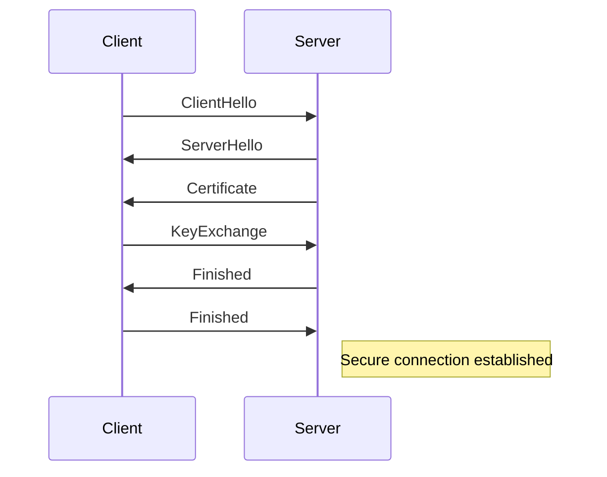
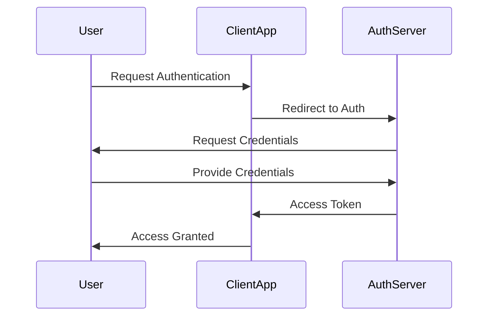

## 13.8 Network Security Best Practices

In today's interconnected world, network security is paramount for protecting sensitive data and maintaining the integrity of software systems. As expert software engineers and architects, understanding and implementing network security best practices is crucial. This section delves into essential security measures, focusing on encryption, authentication, input validation, and practical use cases, all tailored for the D programming language.

### Encryption

Encryption is the cornerstone of network security, ensuring that data remains confidential and tamper-proof during transmission. Let's explore two critical aspects of encryption: SSL/TLS and certificate management.

#### SSL/TLS: Securing Data in Transit

Secure Sockets Layer (SSL) and Transport Layer Security (TLS) are protocols that encrypt data transmitted over networks, protecting it from eavesdropping and tampering. Implementing SSL/TLS in your D applications involves several steps:

1. **Generate a Certificate**: Obtain an SSL/TLS certificate from a trusted Certificate Authority (CA).
2. **Configure the Server**: Set up your server to use the certificate for encrypting data.
3. **Use Secure Protocols**: Ensure your application uses secure versions of protocols, such as TLS 1.2 or 1.3.

Here's a simple example of setting up a secure connection using D's `vibe.d` library:

```d
import vibe.d;

void main() {
    auto settings = new HTTPServerSettings;
    settings.bindAddresses = ["::1", "127.0.0.1"];
    settings.port = 443;
    settings.tlsContext = createTLSContext(TLSContextKind.server);
    settings.tlsContext.useCertificateChainFile("server-cert.pem");
    settings.tlsContext.usePrivateKeyFile("server-key.pem");

    listenHTTP(settings, &handleRequest);
}

void handleRequest(HTTPServerRequest req, HTTPServerResponse res) {
    res.writeBody("Hello, secure world!");
}
```

In this example, we configure a server to use TLS by specifying the certificate and private key files. This ensures that all data exchanged with the server is encrypted.

#### Certificate Management: Implementing HTTPS Correctly

Proper certificate management is essential for maintaining secure connections. Consider the following best practices:

- **Regularly Update Certificates**: Certificates have expiration dates. Ensure they are renewed before expiration to avoid service disruptions.
- **Use Strong Encryption Algorithms**: Choose certificates that support strong encryption algorithms to prevent vulnerabilities.
- **Implement Certificate Pinning**: Pinning helps prevent man-in-the-middle attacks by ensuring the client only accepts a specific certificate.

### Authentication and Authorization

Authentication and authorization are critical for verifying user identities and controlling access to resources. Let's explore tokens, sessions, OAuth, and OpenID Connect.

#### Tokens and Sessions: Managing User Identities

Tokens and sessions are mechanisms for managing user authentication. Tokens, such as JSON Web Tokens (JWT), are compact, self-contained tokens that can be used for authentication and information exchange.

Here's an example of generating a JWT in D:

```d
import vibe.d;
import vibe.data.json;

string generateJWT(string userId, string secret) {
    auto payload = Json(["userId": userId, "exp": Clock.currTime + 3600]);
    return jwt.encodeHS256(payload, secret);
}

void main() {
    string token = generateJWT("user123", "supersecretkey");
    writeln("Generated JWT: ", token);
}
```

In this example, we create a JWT with a user ID and expiration time, then encode it using a secret key.

#### OAuth and OpenID Connect: Integrating with Authentication Providers

OAuth and OpenID Connect are protocols for delegating authentication to external providers, such as Google or Facebook. They simplify user authentication by allowing users to log in using their existing accounts.

To integrate OAuth in a D application, you can use the `vibe.d` library to handle the OAuth flow:

```d
import vibe.d;

void main() {
    auto settings = new OAuth2Settings;
    settings.clientId = "your-client-id";
    settings.clientSecret = "your-client-secret";
    settings.authorizationEndpoint = "https://provider.com/auth";
    settings.tokenEndpoint = "https://provider.com/token";

    auto oauth2 = new OAuth2(settings);
    oauth2.authenticate(&handleAuthResponse);
}

void handleAuthResponse(OAuth2Response response) {
    if (response.isSuccess) {
        writeln("Access token: ", response.accessToken);
    } else {
        writeln("Authentication failed: ", response.error);
    }
}
```

This example demonstrates setting up OAuth2 authentication, where users are redirected to the provider's authorization page and returned with an access token.

### Input Validation

Input validation is crucial for preventing injection attacks and ensuring secure data handling. Let's explore these concepts in detail.

#### Preventing Injection Attacks: Sanitizing User Input

Injection attacks, such as SQL injection, occur when untrusted input is executed as part of a query or command. To prevent these attacks, always sanitize and validate user input.

Here's an example of using parameterized queries in D to prevent SQL injection:

```d
import vibe.d;
import vibe.db.mongo;

void main() {
    auto db = connectMongoDB("mongodb://localhost/test");
    auto users = db.getCollection("users");

    string userInput = "admin'; DROP TABLE users; --";
    auto query = users.find(["username": userInput]);

    if (query.empty) {
        writeln("No user found.");
    } else {
        writeln("User found.");
    }
}
```

In this example, we use a parameterized query to safely handle user input, preventing malicious code execution.

#### Secure Data Handling: Avoiding Leaks and Exposure

Secure data handling involves protecting sensitive information from unauthorized access. Consider the following best practices:

- **Encrypt Sensitive Data**: Use encryption to protect sensitive data at rest and in transit.
- **Limit Data Exposure**: Only expose necessary data to users and services.
- **Implement Access Controls**: Use role-based access controls to restrict data access based on user roles.

### Use Cases and Examples

Let's explore practical use cases and examples of network security best practices in action.

#### Secure Services: Protecting Sensitive Data

When building secure services, consider the following strategies:

- **Use HTTPS**: Ensure all communication between clients and servers is encrypted using HTTPS.
- **Implement Rate Limiting**: Protect services from abuse by limiting the number of requests a client can make in a given time period.
- **Monitor and Log Activity**: Continuously monitor and log network activity to detect and respond to suspicious behavior.

#### Compliance Requirements: Meeting Industry Standards

Meeting industry standards, such as GDPR or HIPAA, is essential for ensuring data protection and compliance. Consider the following practices:

- **Conduct Regular Audits**: Regularly audit your systems to ensure compliance with industry standards.
- **Implement Data Anonymization**: Use data anonymization techniques to protect personal information.
- **Provide User Consent**: Obtain explicit user consent before collecting or processing personal data.

### Visualizing Network Security Concepts

To better understand network security concepts, let's visualize the flow of data and security mechanisms using Mermaid.js diagrams.

#### Visualizing SSL/TLS Handshake



This diagram illustrates the SSL/TLS handshake process, where the client and server exchange messages to establish a secure connection.

#### Visualizing OAuth2 Authentication Flow



This diagram shows the OAuth2 authentication flow, where the user is redirected to the authentication server to obtain an access token.

### Knowledge Check

Before we conclude, let's reinforce our understanding with a few questions:

- How does SSL/TLS protect data in transit?
- What are the benefits of using OAuth for authentication?
- Why is input validation crucial for preventing injection attacks?

### Embrace the Journey

Remember, mastering network security is an ongoing journey. As you implement these best practices, you'll build more secure and robust systems. Keep experimenting, stay curious, and enjoy the journey!

## Quiz Time!



### What is the primary purpose of SSL/TLS in network security?

- [x] To encrypt data in transit
- [ ] To manage user identities
- [ ] To validate user input
- [ ] To store sensitive data securely

> **Explanation:** SSL/TLS is used to encrypt data transmitted over networks, ensuring confidentiality and integrity.

### Which protocol is commonly used for delegating authentication to external providers?

- [ ] SSL/TLS
- [x] OAuth
- [ ] JWT
- [ ] HTTPS

> **Explanation:** OAuth is a protocol for delegating authentication to external providers, allowing users to log in using existing accounts.

### What is a common method to prevent SQL injection attacks?

- [ ] Encrypting data
- [x] Using parameterized queries
- [ ] Implementing rate limiting
- [ ] Using JWTs

> **Explanation:** Parameterized queries prevent SQL injection by safely handling user input, avoiding execution of malicious code.

### What is the role of JWT in authentication?

- [x] To manage user identities
- [ ] To encrypt data in transit
- [ ] To validate user input
- [ ] To implement access controls

> **Explanation:** JWTs are used to manage user identities by providing a compact, self-contained token for authentication.

### Which of the following is a best practice for secure data handling?

- [x] Encrypting sensitive data
- [ ] Using plain text for storage
- [ ] Exposing all data to users
- [ ] Ignoring access controls

> **Explanation:** Encrypting sensitive data ensures it is protected from unauthorized access, both at rest and in transit.

### What is the purpose of certificate pinning?

- [x] To prevent man-in-the-middle attacks
- [ ] To encrypt data at rest
- [ ] To manage user sessions
- [ ] To validate input data

> **Explanation:** Certificate pinning ensures the client only accepts a specific certificate, preventing man-in-the-middle attacks.

### Why is it important to regularly update SSL/TLS certificates?

- [x] To avoid service disruptions
- [ ] To encrypt data at rest
- [ ] To manage user identities
- [ ] To validate input data

> **Explanation:** Regularly updating certificates ensures they do not expire, maintaining secure connections without disruptions.

### What is a benefit of using HTTPS for communication?

- [x] It encrypts data in transit
- [ ] It manages user identities
- [ ] It validates input data
- [ ] It stores sensitive data securely

> **Explanation:** HTTPS encrypts data transmitted between clients and servers, ensuring confidentiality and integrity.

### Which of the following is a compliance requirement for data protection?

- [x] Conducting regular audits
- [ ] Using plain text for storage
- [ ] Exposing all data to users
- [ ] Ignoring access controls

> **Explanation:** Regular audits ensure systems comply with industry standards, protecting data and maintaining compliance.

### True or False: OAuth2 can be used to authenticate users with existing accounts from external providers.

- [x] True
- [ ] False

> **Explanation:** OAuth2 allows users to authenticate using existing accounts from external providers, simplifying the authentication process.


