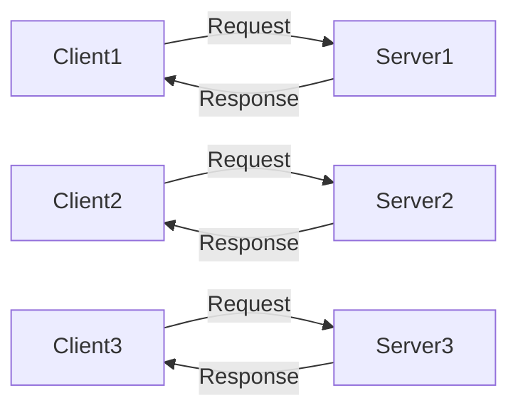
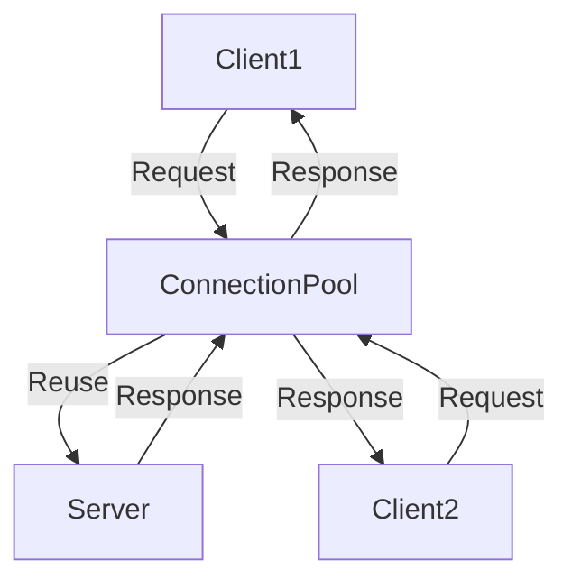
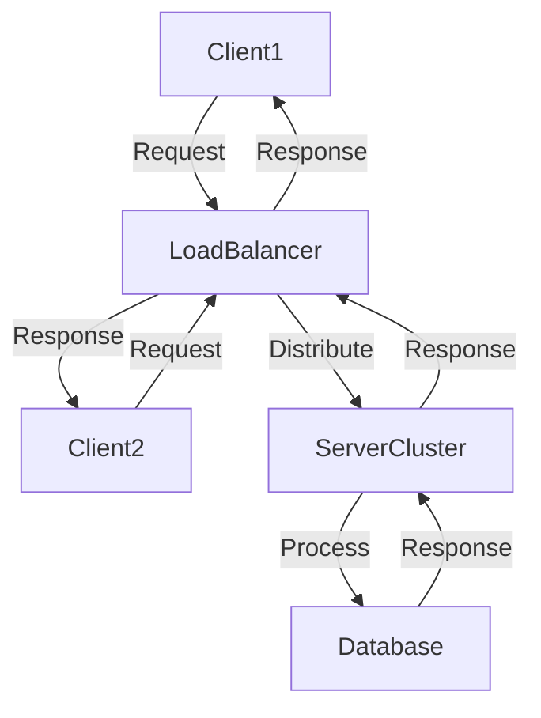

## 13.9 High-Performance Network Application Design

Designing high-performance network applications is a critical skill for expert software engineers and architects. In this section, we will delve into the strategies and techniques necessary to build scalable, efficient, and robust network applications using the D programming language. We will explore scalability techniques, performance optimization strategies, and real-world use cases to provide a comprehensive understanding of high-performance network application design.

### Scalability Techniques

Scalability is the ability of a system to handle increased load by adding resources. In network applications, scalability is crucial for maintaining performance as the number of users or the volume of data grows. Let's explore some key scalability techniques.

#### Load Balancing

Load balancing is the process of distributing network traffic across multiple servers to ensure no single server becomes a bottleneck. This technique enhances the availability and reliability of applications.

- **Round Robin**: Distributes requests sequentially across servers.
- **Least Connections**: Directs traffic to the server with the fewest active connections.
- **IP Hash**: Uses the client's IP address to determine which server will handle the request.

**Code Example: Implementing a Simple Load Balancer in D**

```d
import std.stdio;
import std.socket;

void main() {
    auto servers = ["192.168.1.1", "192.168.1.2", "192.168.1.3"];
    int currentServer = 0;

    auto listener = new TcpListener(new InternetAddress("0.0.0.0", 8080));
    listener.listen();

    while (true) {
        auto client = listener.accept();
        auto serverAddress = servers[currentServer];
        currentServer = (currentServer + 1) % servers.length;

        // Forward request to the selected server
        auto serverSocket = new TcpSocket();
        serverSocket.connect(new InternetAddress(serverAddress, 8080));
        serverSocket.send(client.receive());

        // Send response back to the client
        client.send(serverSocket.receive());
        client.close();
        serverSocket.close();
    }
}
```

In this example, we use a simple round-robin algorithm to distribute incoming connections across a list of server addresses.

#### Stateless Design

Stateless design involves designing applications where each request from a client contains all the information needed to process it. This approach simplifies scaling because servers do not need to maintain session state.

- **Benefits**: Easier to scale horizontally, improved fault tolerance, and simplified server management.
- **Implementation**: Use tokens or cookies to store session information on the client side.

**Diagram: Stateless Architecture**



In this diagram, each client request is independent, allowing any server to handle it without needing to share state with other servers.

### Performance Optimization

Performance optimization is essential for ensuring that network applications can handle high loads efficiently. Let's explore some key strategies.

#### Concurrency Models

Choosing the right concurrency model is crucial for maximizing performance. D offers several options:

- **Threads**: Suitable for CPU-bound tasks but can be resource-intensive.
- **Fibers**: Lightweight, cooperative multitasking, ideal for I/O-bound tasks.
- **Async I/O**: Efficient for handling many simultaneous connections with minimal overhead.

**Code Example: Using Fibers for Concurrency**

```d
import std.stdio;
import std.concurrency;

void handleRequest(Tid clientTid) {
    // Simulate processing
    writeln("Handling request for client ", clientTid);
    receiveOnly!string(); // Wait for a message to simulate work
    writeln("Finished request for client ", clientTid);
}

void main() {
    auto clients = [1, 2, 3, 4, 5];

    foreach (client; clients) {
        spawn(&handleRequest, thisTid);
        send(thisTid, "Process request");
    }
}
```

In this example, we use fibers to handle multiple client requests concurrently, demonstrating how D's concurrency model can be leveraged for high-performance applications.

#### Resource Management

Efficient resource management is critical for maintaining performance. This includes managing memory, connections, and other system resources.

- **Memory Management**: Use D's garbage collector wisely, and consider manual memory management for performance-critical sections.
- **Connection Pooling**: Reuse connections to reduce the overhead of establishing new connections.

**Diagram: Connection Pooling**



This diagram illustrates how a connection pool can efficiently manage connections between clients and servers, reducing latency and improving throughput.

### Use Cases and Examples

To solidify our understanding, let's explore some real-world use cases of high-performance network applications.

#### Content Delivery Networks (CDNs)

CDNs are used to serve large amounts of data efficiently by caching content at multiple locations worldwide. This reduces latency and improves load times for users.

- **Key Features**: Caching, load balancing, and geographic distribution.
- **Implementation**: Use D's networking libraries to build a custom CDN solution.

**Code Example: Simple CDN Node in D**

```d
import std.stdio;
import std.socket;

void main() {
    auto listener = new TcpListener(new InternetAddress("0.0.0.0", 80));
    listener.listen();

    while (true) {
        auto client = listener.accept();
        auto request = client.receive();

        // Check cache for requested content
        if (isCached(request)) {
            client.send(getCachedContent(request));
        } else {
            // Fetch from origin server and cache it
            auto content = fetchFromOrigin(request);
            cacheContent(request, content);
            client.send(content);
        }
        client.close();
    }
}

bool isCached(string request) {
    // Check if the content is cached
    return false;
}

string getCachedContent(string request) {
    // Retrieve cached content
    return "Cached Content";
}

string fetchFromOrigin(string request) {
    // Fetch content from the origin server
    return "Origin Content";
}

void cacheContent(string request, string content) {
    // Cache the content
}
```

This example demonstrates a simple CDN node that checks for cached content and fetches from the origin server if necessary.

#### Gaming Servers

Gaming servers require high performance to support real-time, interactive experiences. This involves handling many simultaneous connections and minimizing latency.

- **Key Features**: Low latency, high throughput, and real-time updates.
- **Implementation**: Use D's concurrency and networking capabilities to build a high-performance gaming server.

**Code Example: Basic Gaming Server in D**

```d
import std.stdio;
import std.socket;
import std.concurrency;

void handlePlayer(Tid playerTid) {
    writeln("Player ", playerTid, " connected.");
    receiveOnly!string(); // Simulate game loop
    writeln("Player ", playerTid, " disconnected.");
}

void main() {
    auto listener = new TcpListener(new InternetAddress("0.0.0.0", 7777));
    listener.listen();

    while (true) {
        auto player = listener.accept();
        spawn(&handlePlayer, thisTid);
        send(thisTid, "Start game loop");
    }
}
```

In this example, we create a basic gaming server that handles player connections and simulates a game loop using fibers for concurrency.

### Try It Yourself

To deepen your understanding, try modifying the code examples provided:

- **Load Balancer**: Implement a least-connections load balancing algorithm.
- **CDN Node**: Add functionality to cache content based on expiration time.
- **Gaming Server**: Implement a simple chat feature for players.

### Visualizing Network Application Architecture

To better understand the architecture of a high-performance network application, consider the following diagram:

**Diagram: High-Performance Network Application Architecture**



This diagram illustrates a typical architecture for a high-performance network application, featuring load balancing, server clusters, and database interactions.

### References and Links

For further reading on high-performance network application design, consider the following resources:

- [D Programming Language](https://dlang.org/)
- [High-Performance Networking with D](https://wiki.dlang.org/High_Performance_Networking)
- [Load Balancing Algorithms](https://www.nginx.com/resources/glossary/load-balancing/)

### Knowledge Check

To reinforce your understanding, consider the following questions:

1. What are the benefits of a stateless design in network applications?
2. How does connection pooling improve performance in network applications?
3. What are the key features of a content delivery network (CDN)?

### Embrace the Journey

Remember, designing high-performance network applications is a journey. As you progress, you'll encounter new challenges and opportunities to optimize your applications. Keep experimenting, stay curious, and enjoy the journey!

## Quiz Time!



### What is the primary benefit of load balancing in network applications?

- [x] Distributing traffic across multiple servers to prevent bottlenecks
- [ ] Increasing the number of servers
- [ ] Reducing the number of client requests
- [ ] Simplifying server configurations

> **Explanation:** Load balancing distributes network traffic across multiple servers, preventing any single server from becoming a bottleneck and ensuring high availability and reliability.

### Which concurrency model is most suitable for I/O-bound tasks in D?

- [ ] Threads
- [x] Fibers
- [ ] Processes
- [ ] Synchronous I/O

> **Explanation:** Fibers are lightweight and ideal for I/O-bound tasks, allowing for efficient handling of many simultaneous connections with minimal overhead.

### What is a key advantage of stateless design in network applications?

- [x] Simplifies scaling by avoiding server-side state
- [ ] Increases server-side complexity
- [ ] Requires more server resources
- [ ] Reduces client-side processing

> **Explanation:** Stateless design simplifies scaling by avoiding the need to maintain session state on the server, allowing any server to handle requests independently.

### How does connection pooling enhance performance?

- [x] By reusing connections to reduce the overhead of establishing new ones
- [ ] By increasing the number of connections
- [ ] By decreasing the number of servers
- [ ] By simplifying client requests

> **Explanation:** Connection pooling enhances performance by reusing existing connections, reducing the overhead and latency associated with establishing new connections.

### What is a common use case for content delivery networks (CDNs)?

- [x] Serving large amounts of data efficiently
- [ ] Reducing server costs
- [ ] Increasing server complexity
- [ ] Simplifying client-side processing

> **Explanation:** CDNs are used to serve large amounts of data efficiently by caching content at multiple locations worldwide, reducing latency and improving load times.

### Which of the following is a feature of gaming servers?

- [x] Low latency and high throughput
- [ ] High latency and low throughput
- [ ] Stateless design
- [ ] Simplified server architecture

> **Explanation:** Gaming servers require low latency and high throughput to support real-time, interactive experiences for players.

### What is the role of a load balancer in a high-performance network application?

- [x] To distribute incoming requests across multiple servers
- [ ] To increase the number of client requests
- [ ] To reduce server resources
- [ ] To simplify client-side processing

> **Explanation:** A load balancer distributes incoming requests across multiple servers, ensuring no single server becomes a bottleneck and maintaining high availability.

### How can you implement a least-connections load balancing algorithm?

- [x] By directing traffic to the server with the fewest active connections
- [ ] By distributing requests sequentially
- [ ] By using the client's IP address
- [ ] By increasing server resources

> **Explanation:** A least-connections load balancing algorithm directs traffic to the server with the fewest active connections, balancing the load more evenly.

### What is a benefit of using D's concurrency model for network applications?

- [x] Efficient handling of many simultaneous connections
- [ ] Increased server-side complexity
- [ ] Reduced client-side processing
- [ ] Simplified server architecture

> **Explanation:** D's concurrency model, including fibers and async I/O, allows for efficient handling of many simultaneous connections with minimal overhead.

### True or False: Stateless design requires maintaining session state on the server.

- [ ] True
- [x] False

> **Explanation:** Stateless design does not require maintaining session state on the server; instead, each request contains all the information needed to process it.


