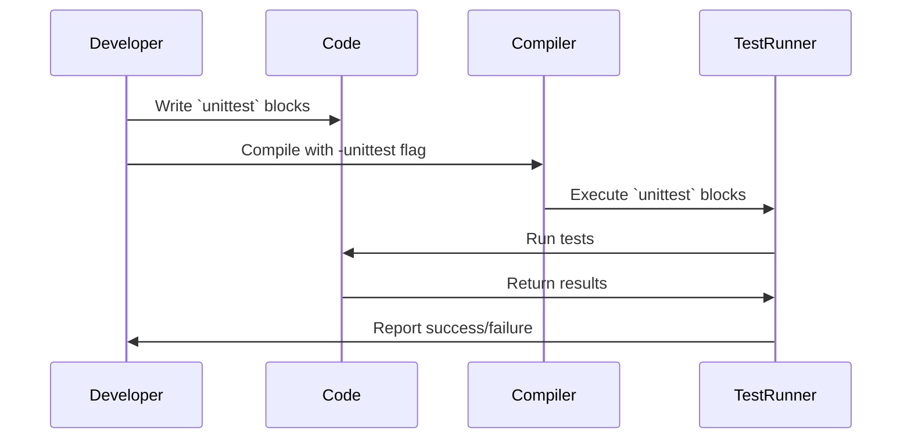

## 14.1 Unit Testing with `unittest` Blocks

Unit testing is a fundamental practice in software development that ensures individual components of a program function correctly. In the D programming language, unit testing is seamlessly integrated through the use of `unittest` blocks. This section will guide you through the process of writing, organizing, and running unit tests in D, leveraging its built-in capabilities to enhance your software's reliability and maintainability.

### Built-In Testing Support

D's `unittest` blocks provide a straightforward and efficient way to incorporate testing directly within your codebase. This built-in feature simplifies the testing process, allowing developers to focus on writing effective tests without the need for external testing frameworks.

#### Writing Tests

To write a unit test in D, you simply include a `unittest` block within your module. These blocks are executed when the program is compiled with the `-unittest` flag, ensuring that your tests are run alongside your code.

```d
module example;

int add(int a, int b) {
    return a + b;
}

unittest {
    assert(add(2, 3) == 5);
    assert(add(-1, 1) == 0);
}
```

In this example, the `unittest` block tests the `add` function to verify its correctness. The `assert` statements check that the function returns the expected results.

#### Running Tests

To execute the tests, compile your D program with the `-unittest` flag. This flag ensures that all `unittest` blocks are executed, and any failed assertions will be reported.

```bash
dmd -unittest example.d
```

If all tests pass, the program will compile successfully. If any assertions fail, the compiler will provide detailed output indicating which tests failed and why.

### Test Organization

Organizing your tests effectively is crucial for maintaining a clean and manageable codebase. D provides several mechanisms to help you structure your tests logically.

#### Grouping Tests

Grouping related tests together can improve readability and make it easier to identify the purpose of each test. You can achieve this by placing `unittest` blocks near the functions they test or by organizing them within separate modules dedicated to testing.

```d
module math_tests;

import example;

unittest {
    assert(add(2, 3) == 5);
    assert(add(-1, 1) == 0);
}

unittest {
    assert(add(0, 0) == 0);
    assert(add(100, 200) == 300);
}
```

#### Setup and Teardown

In some cases, tests may require specific setup or teardown procedures to prepare the test environment. While D does not have built-in setup and teardown functions, you can achieve similar functionality by using helper functions or classes.

```d
module setup_teardown;

class TestEnvironment {
    this() {
        // Setup code
    }

    ~this() {
        // Teardown code
    }
}

unittest {
    auto env = new TestEnvironment();
    // Perform tests
}
```

### Use Cases and Examples

Unit testing in D can be applied to various development methodologies and scenarios, enhancing the robustness of your software.

#### Test-Driven Development (TDD)

Test-Driven Development (TDD) is a methodology where tests are written before the actual code. This approach ensures that the code meets the specified requirements and encourages developers to think about edge cases and potential issues upfront.

```d
module tdd_example;

int subtract(int a, int b) {
    return a - b;
}

unittest {
    assert(subtract(5, 3) == 2);
    assert(subtract(0, 0) == 0);
    assert(subtract(-1, -1) == 0);
}
```

By writing tests first, you define the expected behavior of the `subtract` function, guiding its implementation.

#### Regression Testing

Regression testing involves re-running tests to ensure that recent changes have not introduced new bugs. This practice is essential for maintaining software quality over time.

```d
module regression_tests;

import example;

unittest {
    // Existing tests
    assert(add(2, 3) == 5);
    assert(add(-1, 1) == 0);

    // New tests for recent changes
    assert(add(10, -10) == 0);
    assert(add(-5, -5) == -10);
}
```

By continuously running your suite of tests, you can quickly identify and address any regressions introduced by code changes.

### Visualizing the Testing Process

To better understand the flow of unit testing in D, let's visualize the process using a sequence diagram.



This diagram illustrates the interaction between the developer, code, compiler, and test runner during the unit testing process.

### Try It Yourself

To deepen your understanding of unit testing in D, try modifying the code examples provided. Experiment with different test cases, add new functions to test, and explore how changes to the code affect the test results. This hands-on approach will reinforce the concepts covered in this section.

### References and Links

For further reading on unit testing and D programming, consider exploring the following resources:

- [D Programming Language Official Documentation](https://dlang.org/)
- [Test-Driven Development: By Example by Kent Beck](https://www.amazon.com/Test-Driven-Development-Kent-Beck/dp/0321146530)
- [Regression Testing: A Practical Guide by Martin Pol](https://www.amazon.com/Regression-Testing-Practical-Guide-Software/dp/0201331403)

### Knowledge Check

To ensure you've grasped the key concepts of unit testing with `unittest` blocks in D, consider the following questions:

- What is the purpose of the `-unittest` flag in D?
- How can you organize your tests for better readability and maintainability?
- What are the benefits of using Test-Driven Development (TDD)?
- How does regression testing help maintain software quality?

### Embrace the Journey

Remember, mastering unit testing in D is a journey. As you continue to explore and experiment with `unittest` blocks, you'll gain a deeper understanding of how to build robust and reliable software. Keep testing, stay curious, and enjoy the process!

## Quiz Time!



### What is the primary purpose of `unittest` blocks in D?

- [x] To write and execute unit tests within the codebase.
- [ ] To compile the code without errors.
- [ ] To optimize the performance of the code.
- [ ] To document the code for better readability.

> **Explanation:** `unittest` blocks in D are specifically designed for writing and executing unit tests within the codebase, ensuring that individual components function correctly.

### How do you run `unittest` blocks in a D program?

- [x] By compiling the program with the `-unittest` flag.
- [ ] By using a separate testing framework.
- [ ] By running the program with a special command-line argument.
- [ ] By including a main function in the `unittest` block.

> **Explanation:** To execute `unittest` blocks, you compile the D program with the `-unittest` flag, which triggers the execution of all `unittest` blocks.

### What is a key benefit of Test-Driven Development (TDD)?

- [x] It ensures code meets specified requirements before implementation.
- [ ] It reduces the need for documentation.
- [ ] It automatically optimizes code performance.
- [ ] It eliminates the need for regression testing.

> **Explanation:** TDD involves writing tests before the actual code, ensuring that the code meets specified requirements and encouraging developers to consider edge cases and potential issues upfront.

### What is regression testing primarily used for?

- [x] To ensure recent changes have not introduced new bugs.
- [ ] To improve code performance.
- [ ] To refactor code for better readability.
- [ ] To document the codebase.

> **Explanation:** Regression testing involves re-running tests to ensure that recent changes have not introduced new bugs, maintaining software quality over time.

### How can you organize tests in D for better readability?

- [x] By grouping related tests together within `unittest` blocks.
- [ ] By writing all tests in a single `unittest` block.
- [x] By organizing tests within separate modules dedicated to testing.
- [ ] By placing tests at the end of the code file.

> **Explanation:** Grouping related tests together within `unittest` blocks and organizing them within separate modules dedicated to testing improves readability and maintainability.

### What is the role of the `assert` statement in `unittest` blocks?

- [x] To verify that a condition is true during testing.
- [ ] To compile the code without errors.
- [ ] To optimize the performance of the code.
- [ ] To document the code for better readability.

> **Explanation:** The `assert` statement is used in `unittest` blocks to verify that a condition is true during testing, helping to identify errors and ensure correctness.

### What is a common practice for setting up test environments in D?

- [x] Using helper functions or classes for setup and teardown.
- [ ] Writing setup code directly in the `unittest` block.
- [x] Using a separate testing framework for setup.
- [ ] Avoiding setup and teardown to simplify tests.

> **Explanation:** While D does not have built-in setup and teardown functions, you can achieve similar functionality by using helper functions or classes to prepare the test environment.

### What is the significance of the `-unittest` flag in D?

- [x] It triggers the execution of all `unittest` blocks during compilation.
- [ ] It optimizes the code for better performance.
- [ ] It generates documentation for the codebase.
- [ ] It refactors the code for better readability.

> **Explanation:** The `-unittest` flag is significant because it triggers the execution of all `unittest` blocks during compilation, allowing you to run tests alongside your code.

### What is the primary focus of unit testing?

- [x] To ensure individual components of a program function correctly.
- [ ] To optimize the overall performance of the program.
- [ ] To document the code for better readability.
- [ ] To refactor the code for better maintainability.

> **Explanation:** The primary focus of unit testing is to ensure that individual components of a program function correctly, helping to identify and fix errors early in the development process.

### True or False: D requires external testing frameworks to perform unit testing.

- [ ] True
- [x] False

> **Explanation:** False. D has built-in support for unit testing through `unittest` blocks, eliminating the need for external testing frameworks.


