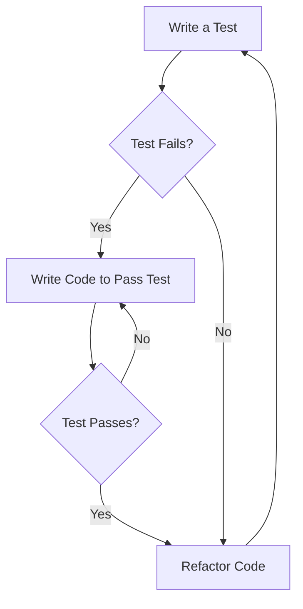

## 14.10 Test-Driven Development (TDD) Strategies

Test-Driven Development (TDD) is a software development process that emphasizes writing tests before writing the actual code. This approach not only ensures that the code meets its requirements but also encourages a more thoughtful design process. In this section, we will explore TDD strategies specifically tailored for the D programming language, focusing on the Red-Green-Refactor cycle, the benefits of TDD, how to implement it in D, and practical use cases.

### Understanding the TDD Cycle

#### Red-Green-Refactor

The TDD cycle is often summarized by the mantra "Red-Green-Refactor." This cycle is a continuous loop that guides developers through the process of writing tests and code. Let's break down each step:

1. **Red**: Start by writing a test for a new feature or functionality. At this stage, the test will fail because the feature has not been implemented yet. This failure is crucial as it confirms that the test is correctly identifying the absence of the feature.

2. **Green**: Write the minimum amount of code necessary to make the test pass. The goal here is not to write perfect code but to achieve functionality that satisfies the test conditions.

3. **Refactor**: Once the test passes, review and improve the code. Refactoring involves cleaning up the code, optimizing it, and ensuring that it adheres to best practices without altering its behavior. The tests provide a safety net that ensures refactoring does not introduce new bugs.

```d
// Example of Red-Green-Refactor in D

// Red: Write a failing test
unittest {
    assert(calculateSum(2, 3) == 5); // Test will fail as calculateSum is not implemented
}

// Green: Implement the function to pass the test
int calculateSum(int a, int b) {
    return a + b; // Now the test will pass
}

// Refactor: Improve the code if necessary
// In this simple example, refactoring might not be needed, but in more complex cases, it would involve optimizing the code.
```

### Benefits of TDD

#### Design Focus

TDD encourages developers to think about the design and architecture of their software before writing the actual code. By writing tests first, developers are forced to consider the interface and behavior of their components, leading to more modular and maintainable code.

#### Defect Reduction

One of the primary benefits of TDD is the early detection of defects. By writing tests before the code, developers can catch issues at the earliest possible stage, reducing the cost and effort required to fix them later in the development process.

### Implementing TDD in D

#### Tool Support

The D programming language offers robust support for testing through its built-in `unittest` blocks. These blocks allow developers to write tests directly within their code, making it easy to integrate TDD into the development workflow.

- **`unittest` Blocks**: D's `unittest` blocks are a powerful feature that enables developers to write and execute tests as part of the compilation process. These blocks can be placed anywhere in the code and are executed when the `-unittest` flag is used during compilation.

```d
// Using unittest blocks in D

module mymodule;

int multiply(int a, int b) {
    return a * b;
}

unittest {
    assert(multiply(2, 3) == 6);
    assert(multiply(-1, 5) == -5);
}
```

- **DUB and Testing**: DUB, the D package manager, provides support for running tests as part of the build process. By including `"buildRequirements": ["unittest"]` in the `dub.json` file, developers can ensure that tests are executed whenever the project is built.

```json
{
    "name": "myproject",
    "dependencies": {},
    "buildRequirements": ["unittest"]
}
```

### Use Cases and Examples

#### API Development

TDD is particularly useful in API development, where designing interfaces through tests can lead to more intuitive and robust APIs. By writing tests that define the expected behavior of an API, developers can ensure that the implementation meets the requirements and is easy to use.

```d
// Example of TDD in API development

interface Calculator {
    int add(int a, int b);
    int subtract(int a, int b);
}

class SimpleCalculator : Calculator {
    int add(int a, int b) {
        return a + b;
    }

    int subtract(int a, int b) {
        return a - b;
    }
}

unittest {
    Calculator calc = new SimpleCalculator();
    assert(calc.add(5, 3) == 8);
    assert(calc.subtract(5, 3) == 2);
}
```

#### Incremental Development

TDD supports incremental development by allowing developers to build software iteratively. By focusing on one small feature at a time, developers can ensure that each part of the software is thoroughly tested and integrated before moving on to the next.

```d
// Incremental development with TDD

class ShoppingCart {
    private int itemCount = 0;

    void addItem() {
        itemCount++;
    }

    int getItemCount() {
        return itemCount;
    }
}

unittest {
    ShoppingCart cart = new ShoppingCart();
    assert(cart.getItemCount() == 0);

    cart.addItem();
    assert(cart.getItemCount() == 1);

    cart.addItem();
    assert(cart.getItemCount() == 2);
}
```

### Visualizing the TDD Process

To better understand the TDD process, let's visualize the Red-Green-Refactor cycle using a flowchart.



**Figure 1**: The Red-Green-Refactor cycle in TDD.

### Knowledge Check

To reinforce your understanding of TDD strategies in D, consider the following questions:

- What are the main steps in the TDD cycle?
- How does TDD encourage better software design?
- What are the benefits of using `unittest` blocks in D?
- How can TDD be applied to API development?
- What role does refactoring play in the TDD process?

### Try It Yourself

To gain hands-on experience with TDD in D, try modifying the code examples provided in this section. Experiment with adding new features, writing tests for them, and refactoring the code to improve its design and performance. Remember, the key to mastering TDD is practice and iteration.

### References and Further Reading

For more information on TDD and its application in D programming, consider exploring the following resources:

- [D Programming Language Documentation](https://dlang.org/)
- [Test-Driven Development: By Example by Kent Beck](https://www.amazon.com/Test-Driven-Development-Kent-Beck/dp/0321146530)
- [DUB Package Manager](https://code.dlang.org/)

## Quiz Time!



### What is the first step in the TDD cycle?

- [x] Write a test
- [ ] Write the code
- [ ] Refactor the code
- [ ] Deploy the application

> **Explanation:** The first step in the TDD cycle is to write a test that will initially fail, guiding the development of the feature.

### What does the "Green" phase in TDD involve?

- [x] Writing code to pass the test
- [ ] Writing tests
- [ ] Refactoring code
- [ ] Deploying the application

> **Explanation:** The "Green" phase involves writing the minimum amount of code necessary to make the test pass.

### How does TDD help in API development?

- [x] By designing interfaces through tests
- [ ] By eliminating the need for documentation
- [ ] By reducing the number of API endpoints
- [ ] By increasing the complexity of the API

> **Explanation:** TDD helps in API development by allowing developers to design interfaces through tests, ensuring they meet the expected behavior.

### What is the purpose of refactoring in the TDD cycle?

- [x] To improve code quality without changing its behavior
- [ ] To add new features
- [ ] To remove tests
- [ ] To deploy the application

> **Explanation:** Refactoring is done to improve the code's structure and quality without altering its behavior, ensuring it remains maintainable.

### Which D feature is particularly useful for TDD?

- [x] `unittest` blocks
- [ ] `@safe` attribute
- [ ] `mixin` templates
- [ ] `alias` declarations

> **Explanation:** `unittest` blocks in D are particularly useful for TDD as they allow developers to write and execute tests as part of the compilation process.

### What is a key benefit of TDD?

- [x] Early detection of defects
- [ ] Faster deployment
- [ ] Reduced code complexity
- [ ] Elimination of all bugs

> **Explanation:** A key benefit of TDD is the early detection of defects, which reduces the cost and effort required to fix them later.

### How does TDD encourage better software design?

- [x] By requiring developers to think about interfaces and behavior first
- [ ] By focusing on code performance
- [ ] By reducing the number of lines of code
- [ ] By eliminating the need for refactoring

> **Explanation:** TDD encourages better software design by requiring developers to think about interfaces and behavior before writing the actual code.

### What is the role of DUB in TDD?

- [x] It supports running tests as part of the build process
- [ ] It compiles the code faster
- [ ] It manages database connections
- [ ] It generates documentation

> **Explanation:** DUB supports running tests as part of the build process, integrating TDD into the development workflow.

### What does the "Red" phase in TDD signify?

- [x] A failing test
- [ ] A passing test
- [ ] Refactored code
- [ ] Deployed application

> **Explanation:** The "Red" phase signifies a failing test, indicating that the feature has not yet been implemented.

### True or False: TDD eliminates the need for refactoring.

- [ ] True
- [x] False

> **Explanation:** False. TDD does not eliminate the need for refactoring; instead, it includes refactoring as a crucial step to improve code quality.



Remember, mastering TDD is a journey. As you continue to practice and apply these strategies, you'll find yourself writing more robust, maintainable, and high-quality code. Keep experimenting, stay curious, and enjoy the process of learning and growing as a developer!
