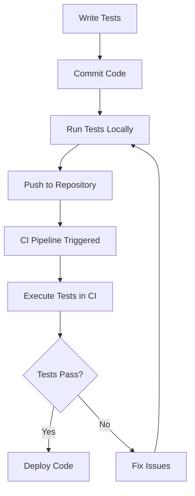

## 14.11 Automated Testing Best Practices

Automated testing is a cornerstone of modern software development, ensuring that code is reliable, maintainable, and scalable. In the context of D programming for advanced systems, automated testing becomes even more crucial due to the complexity and performance requirements of systems-level software. This section delves into best practices for automated testing in D, focusing on test design, maintenance, and collaboration in large projects and team environments.

### Test Design

Effective test design is the foundation of a robust testing strategy. It involves writing tests that are clear, concise, and independent, ensuring that they accurately verify the functionality of the code.

#### Clear and Concise Tests

Writing understandable tests is essential for maintaining a clean and effective test suite. Tests should be easy to read and comprehend, allowing developers to quickly grasp what is being tested and why.

- **Use Descriptive Names**: Ensure that test names clearly describe the functionality being tested. For example, `testCalculateSumWithPositiveNumbers` is more informative than `testSum`.

- **Keep Tests Focused**: Each test should verify a single behavior or functionality. This makes it easier to identify the cause of a failure.

- **Use Assertions Wisely**: Limit the number of assertions per test to avoid confusion. Each assertion should contribute to verifying the test's purpose.

- **Example**:

```d
unittest {
    // Test that the sum of two positive numbers is calculated correctly
    assert(calculateSum(3, 5) == 8, "Sum of 3 and 5 should be 8");
}
```

#### Test Independence

Ensuring that tests do not rely on each other is crucial for maintaining a reliable test suite. Independent tests can be run in any order without affecting the outcome.

- **Avoid Shared State**: Tests should not depend on shared state or data modified by other tests. Use setup and teardown functions to initialize and clean up state.

- **Mock External Dependencies**: Use mocking to isolate the unit under test from external dependencies, ensuring that tests are not affected by changes in those dependencies.

- **Example**:

```d
unittest {
    // Mocking an external service
    auto mockService = new MockService();
    mockService.expectCall("fetchData").returns("mockData");

    // Test function that uses the mocked service
    assert(fetchDataFromService(mockService) == "mockData");
}
```

### Maintenance

Maintaining a test suite is as important as maintaining the codebase itself. Tests should be refactored and updated regularly to reflect changes in the code.

#### Refactoring Tests

Keeping test code clean and organized is essential for long-term maintainability. Refactoring tests involves improving their structure and readability without changing their behavior.

- **Remove Duplicated Code**: Extract common setup code into helper functions or fixtures to reduce duplication.

- **Simplify Complex Tests**: Break down complex tests into smaller, more manageable ones.

- **Example**:

```d
// Before refactoring
unittest {
    auto result = calculateComplexOperation(5, 10);
    assert(result == expectedValue);
}

// After refactoring
unittest {
    auto result = performSetupAndCalculate(5, 10);
    assert(result == expectedValue);
}

auto performSetupAndCalculate(int a, int b) {
    // Common setup code
    return calculateComplexOperation(a, b);
}
```

#### Keeping Tests Updated

As the codebase evolves, tests must be updated to reflect changes in functionality. This ensures that tests remain relevant and effective.

- **Review Tests Regularly**: Schedule regular reviews of the test suite to identify outdated or redundant tests.

- **Update Tests with Code Changes**: Whenever code is modified, update the corresponding tests to ensure they still verify the correct behavior.

- **Example**:

```d
// Original test for a function that has changed
unittest {
    assert(oldFunctionality() == oldExpectedResult);
}

// Updated test for the new functionality
unittest {
    assert(newFunctionality() == newExpectedResult);
}
```

### Use Cases and Examples

Automated testing in large projects and team environments presents unique challenges. Effective management and collaboration are key to maintaining a comprehensive test suite.

#### Large Projects

Managing extensive test suites in large projects requires careful planning and organization.

- **Organize Tests by Module**: Group tests by module or feature to make it easier to locate and manage them.

- **Use Continuous Integration (CI)**: Implement CI pipelines to automate the execution of tests, ensuring that changes are tested as soon as they are made.

- **Example**:

```yaml
stages:
  - test

test:
  stage: test
  script:
    - dub test
```

#### Team Development

Collaborating on testing efforts in a team environment requires clear communication and coordination.

- **Establish Testing Standards**: Define and document testing standards and guidelines for the team to follow.

- **Use Code Reviews for Tests**: Include test code in code reviews to ensure that tests are well-designed and effective.

- **Example**:

```d
// Code review checklist for tests
// - Are test names descriptive?
// - Do tests cover all edge cases?
// - Is the test code clean and maintainable?
```

### Try It Yourself

To solidify your understanding of automated testing best practices, try modifying the code examples provided. Experiment with different test designs, refactor tests to improve their structure, and update tests to reflect changes in functionality. This hands-on approach will help you gain practical experience and confidence in applying these best practices.

### Visualizing Automated Testing Workflow

To better understand the workflow of automated testing, let's visualize the process using a Mermaid.js diagram. This diagram illustrates the typical steps involved in setting up and executing automated tests in a CI pipeline.



**Diagram Description**: This diagram represents the automated testing workflow, starting from writing tests and committing code, to running tests locally and pushing to a repository. The CI pipeline is triggered, executing tests, and based on the results, the code is either deployed or issues are fixed.

### References and Links

For further reading on automated testing best practices, consider exploring the following resources:

- [MDN Web Docs: Automated Testing](https://developer.mozilla.org/en-US/docs/Learn/Tools_and_testing/Understanding_client-side_tools/Automated_testing)
- [W3Schools: Testing](https://www.w3schools.com/)
- [D Programming Language: Unit Testing](https://dlang.org/spec/unittest.html)

### Knowledge Check

To reinforce your understanding of automated testing best practices, consider the following questions and challenges:

- What are the benefits of writing clear and concise tests?
- How can you ensure test independence in your test suite?
- Why is it important to refactor and update tests regularly?
- How can you effectively manage a large test suite in a team environment?

### Embrace the Journey

Remember, mastering automated testing is a journey. As you continue to apply these best practices, you'll develop more reliable and maintainable software. Keep experimenting, stay curious, and enjoy the process of improving your testing skills.

## Quiz Time!



### What is the primary benefit of writing clear and concise tests?

- [x] They are easier to understand and maintain.
- [ ] They execute faster.
- [ ] They require fewer resources.
- [ ] They are more secure.

> **Explanation:** Clear and concise tests are easier to understand and maintain, which is crucial for long-term test suite management.

### How can you ensure test independence?

- [x] Avoid shared state between tests.
- [ ] Use global variables.
- [ ] Run tests in a specific order.
- [ ] Combine multiple tests into one.

> **Explanation:** Avoiding shared state ensures that tests do not affect each other, maintaining independence.

### What is a key practice for maintaining a test suite?

- [x] Regularly update tests to reflect code changes.
- [ ] Write tests only once.
- [ ] Avoid refactoring test code.
- [ ] Use as few tests as possible.

> **Explanation:** Regularly updating tests ensures they remain relevant and effective as the codebase evolves.

### Why is it important to refactor test code?

- [x] To improve structure and readability.
- [ ] To increase test execution time.
- [ ] To reduce test coverage.
- [ ] To make tests more complex.

> **Explanation:** Refactoring test code improves its structure and readability, making it easier to maintain.

### What is a benefit of using Continuous Integration (CI) for testing?

- [x] Automates test execution upon code changes.
- [ ] Eliminates the need for manual testing.
- [ ] Increases code complexity.
- [ ] Reduces test coverage.

> **Explanation:** CI automates test execution, ensuring that changes are tested immediately.

### How can you manage a large test suite effectively?

- [x] Organize tests by module or feature.
- [ ] Write all tests in a single file.
- [ ] Avoid using any testing framework.
- [ ] Run tests manually.

> **Explanation:** Organizing tests by module or feature makes it easier to manage and locate them.

### What should be included in a code review checklist for tests?

- [x] Descriptive test names.
- [x] Coverage of edge cases.
- [ ] Use of global variables.
- [ ] Complex test logic.

> **Explanation:** Descriptive test names and coverage of edge cases ensure that tests are effective and comprehensive.

### What is a common pitfall to avoid in test design?

- [x] Writing tests that depend on each other.
- [ ] Using assertions in tests.
- [ ] Writing tests for edge cases.
- [ ] Using descriptive test names.

> **Explanation:** Tests that depend on each other can lead to unreliable test results.

### Why is it important to mock external dependencies in tests?

- [x] To isolate the unit under test.
- [ ] To increase test execution time.
- [ ] To reduce test coverage.
- [ ] To make tests more complex.

> **Explanation:** Mocking external dependencies isolates the unit under test, ensuring that tests are not affected by changes in those dependencies.

### True or False: Automated testing eliminates the need for manual testing.

- [ ] True
- [x] False

> **Explanation:** While automated testing is crucial, manual testing is still necessary for exploratory testing and scenarios that are difficult to automate.


