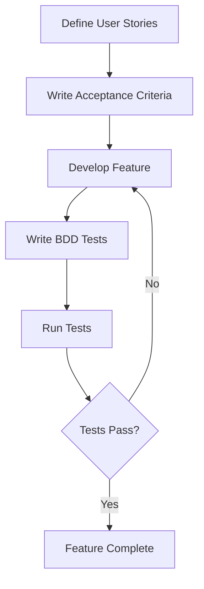

## 14.2 Behavior-Driven Development (BDD)

Behavior-Driven Development (BDD) is a software development approach that enhances collaboration between developers, testers, and non-technical stakeholders. By focusing on the expected behavior of the software, BDD ensures that all parties have a shared understanding of the requirements. In this section, we will explore BDD concepts, how to implement BDD in the D programming language, and provide practical examples to illustrate its application.

### BDD Concepts

#### User Stories

User stories are a fundamental component of BDD. They describe the desired functionality from the user's perspective, providing a narrative that guides development. A typical user story follows the format:

- **As a** [role]
- **I want** [feature]
- **So that** [benefit]

This format ensures that the focus remains on the user's needs and the value the feature provides.

#### Acceptance Criteria

Acceptance criteria define the conditions that must be met for a user story to be considered complete. They provide clear, testable requirements that guide development and testing. Acceptance criteria are often written in the form of scenarios using the Given-When-Then format:

- **Given** [context]
- **When** [event]
- **Then** [outcome]

This structure helps ensure that all scenarios are covered and that the software behaves as expected under various conditions.

### Implementing BDD in D

#### Testing Frameworks

To implement BDD in D, we can utilize testing frameworks that support BDD-style testing. One such framework is `specd`, which allows developers to write tests in a human-readable format.

```d
// Import the specd library
import specd;

// Define a simple BDD test
describe("Calculator") {
    it("should add two numbers correctly") {
        // Given
        auto calculator = new Calculator();

        // When
        auto result = calculator.add(2, 3);

        // Then
        assert(result == 5);
    }
}
```

In this example, the `describe` and `it` functions are used to create a readable test case that documents the expected behavior of the `Calculator` class.

#### Readable Test Cases

Readable test cases serve as both documentation and tests. They help ensure that the code meets the specified requirements and provide a clear understanding of the system's behavior.

```d
// Another example of a BDD test case
describe("User Authentication") {
    it("should allow a user to log in with valid credentials") {
        // Given
        auto authService = new AuthService();
        authService.register("user@example.com", "password123");

        // When
        bool loginSuccess = authService.login("user@example.com", "password123");

        // Then
        assert(loginSuccess);
    }
}
```

This test case clearly outlines the expected behavior of the `AuthService` class, making it easier for developers and stakeholders to understand the system's functionality.

### Use Cases and Examples

#### Collaborative Development

BDD fosters collaboration between developers, testers, and stakeholders by providing a common language for discussing requirements. By involving all parties in the creation of user stories and acceptance criteria, BDD ensures that everyone has a shared understanding of the project's goals.

#### Specification by Example

Specification by example is a key practice in BDD. It involves using concrete examples to illustrate requirements, ensuring clarity and reducing ambiguity. By writing tests that reflect these examples, developers can ensure that the software meets the specified requirements.

```d
// Example of specification by example
describe("Shopping Cart") {
    it("should calculate the total price of items") {
        // Given
        auto cart = new ShoppingCart();
        cart.addItem("Apple", 2, 1.50);
        cart.addItem("Banana", 3, 0.75);

        // When
        double total = cart.calculateTotal();

        // Then
        assert(total == 6.75);
    }
}
```

In this example, the test case provides a concrete example of how the `ShoppingCart` class should behave, ensuring that the implementation aligns with the specified requirements.

### Visualizing BDD Workflow

To better understand the BDD workflow, let's visualize the process using a flowchart.



This flowchart illustrates the iterative nature of BDD, where features are developed and tested based on user stories and acceptance criteria. If tests fail, the feature is refined until it meets the specified requirements.

### Try It Yourself

To gain hands-on experience with BDD in D, try modifying the provided code examples. For instance, add new scenarios to the `Calculator` or `User Authentication` tests, or create your own BDD tests for a different feature. Experiment with different acceptance criteria and observe how they affect the implementation.

### References and Links

- [Specd Documentation](https://github.com/yourusername/specd)
- [Cucumber BDD](https://cucumber.io/docs/bdd/)
- [D Programming Language](https://dlang.org/)

### Knowledge Check

- What is the purpose of user stories in BDD?
- How do acceptance criteria help guide development?
- What are the benefits of using BDD-style testing frameworks?
- How does BDD foster collaboration between developers and stakeholders?

### Embrace the Journey

Remember, BDD is not just about writing tests; it's about fostering collaboration and ensuring that everyone involved in the project has a shared understanding of the requirements. As you continue to explore BDD in D, keep experimenting, stay curious, and enjoy the journey!

## Quiz Time!



### What is the primary purpose of user stories in BDD?

- [x] To describe the desired functionality from the user's perspective
- [ ] To define the technical implementation details
- [ ] To outline the project's budget
- [ ] To specify the database schema

> **Explanation:** User stories focus on the user's needs and the value the feature provides, guiding development from the user's perspective.

### How are acceptance criteria typically structured in BDD?

- [x] Given-When-Then format
- [ ] As-Is-Should format
- [ ] If-Else format
- [ ] Do-While format

> **Explanation:** Acceptance criteria use the Given-When-Then format to define testable conditions for success.

### Which D testing framework supports BDD-style testing?

- [x] specd
- [ ] unittest
- [ ] gtest
- [ ] jUnit

> **Explanation:** `specd` is a D testing framework that allows for BDD-style testing with human-readable test cases.

### What is the benefit of writing readable test cases in BDD?

- [x] They serve as both documentation and tests
- [ ] They reduce the need for code comments
- [ ] They eliminate the need for user stories
- [ ] They increase the complexity of the code

> **Explanation:** Readable test cases provide a clear understanding of the system's behavior and ensure that the code meets specified requirements.

### How does BDD foster collaboration?

- [x] By providing a common language for discussing requirements
- [ ] By eliminating the need for meetings
- [ ] By focusing solely on technical details
- [ ] By reducing the number of stakeholders involved

> **Explanation:** BDD involves all parties in the creation of user stories and acceptance criteria, ensuring a shared understanding of the project's goals.

### What is specification by example?

- [x] Using concrete examples to illustrate requirements
- [ ] Writing abstract requirements without examples
- [ ] Focusing on technical specifications
- [ ] Creating examples after development

> **Explanation:** Specification by example involves using concrete examples to ensure clarity and reduce ambiguity in requirements.

### What is the role of acceptance criteria in BDD?

- [x] To define testable conditions for success
- [ ] To outline the project's timeline
- [ ] To specify the programming language to be used
- [ ] To determine the project's budget

> **Explanation:** Acceptance criteria provide clear, testable requirements that guide development and testing.

### What is the iterative nature of BDD?

- [x] Features are developed and tested based on user stories and acceptance criteria
- [ ] Features are developed without testing
- [ ] Features are developed in isolation
- [ ] Features are developed without user input

> **Explanation:** BDD involves an iterative process where features are refined until they meet the specified requirements.

### What is the benefit of using BDD-style testing frameworks?

- [x] They allow for human-readable test cases
- [ ] They eliminate the need for user stories
- [ ] They focus solely on technical implementation
- [ ] They increase the complexity of the code

> **Explanation:** BDD-style testing frameworks support human-readable test cases, making it easier to understand the system's behavior.

### True or False: BDD is only about writing tests.

- [ ] True
- [x] False

> **Explanation:** BDD is about fostering collaboration and ensuring a shared understanding of requirements, not just writing tests.


