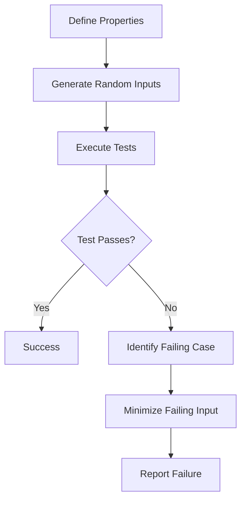

## 14.3 Property-Based Testing

In the realm of software testing, property-based testing (PBT) stands out as a powerful methodology that allows developers to verify the correctness of their code by testing properties over a wide range of inputs. Unlike traditional example-based testing, which checks specific scenarios, property-based testing focuses on the general behavior of the code. This approach is particularly effective in uncovering edge cases and ensuring robustness.

### Understanding Property-Based Testing

**Property-Based Testing** is a testing paradigm where properties, or invariants, of the code are defined and tested against a multitude of automatically generated inputs. The core idea is to specify what the code should do, rather than how it should behave in specific situations.

#### Key Concepts

- **Generalizing Tests**: Instead of writing individual test cases, we define properties that should hold true for any input. This allows us to verify the behavior of the code over a wide range of scenarios.
  
- **Randomized Input Generation**: Inputs are generated randomly, covering a broad spectrum of possible cases. This helps in discovering edge cases that might not be considered in example-based testing.

### Implementing Property-Based Testing in D

The D programming language, with its powerful features like templates and metaprogramming, provides an excellent environment for implementing property-based testing. Let's explore how we can leverage these features to enhance our testing strategy.

#### Using Libraries

To implement property-based testing in D, we can utilize libraries such as [D's std.random](https://dlang.org/phobos/std_random.html) for generating random inputs and [unit-threaded](https://code.dlang.org/packages/unit-threaded) for testing frameworks that support property-based testing.

```d
import std.random;
import std.stdio;
import unit_threaded;

void main() {
    // Example of generating random integers
    auto rng = Random(unpredictableSeed);
    writeln("Random Integer: ", uniform(0, 100, rng));

    // Example property-based test
    @property
    void testAdditionCommutativity() {
        foreach (_; 0 .. 1000) {
            int a = uniform(0, 100, rng);
            int b = uniform(0, 100, rng);
            assert(a + b == b + a, "Addition is not commutative for a = " ~ to!string(a) ~ " and b = " ~ to!string(b));
        }
    }
}
```

In this example, we use `std.random` to generate random integers and define a property that tests the commutativity of addition. The `unit_threaded` library can be used to automate the execution of such tests.

#### Defining Properties

Defining properties involves specifying the invariants that should hold true for the code. These properties are then tested against a variety of inputs.

- **Commutativity**: For operations like addition and multiplication, the order of operands should not affect the result.
- **Associativity**: Grouping of operations should not affect the result.
- **Idempotence**: Applying an operation multiple times should yield the same result as applying it once.

```d
@property
void testMultiplicationAssociativity() {
    auto rng = Random(unpredictableSeed);
    foreach (_; 0 .. 1000) {
        int a = uniform(1, 100, rng);
        int b = uniform(1, 100, rng);
        int c = uniform(1, 100, rng);
        assert((a * b) * c == a * (b * c), "Multiplication is not associative for a = " ~ to!string(a) ~ ", b = " ~ to!string(b) ~ ", c = " ~ to!string(c));
    }
}
```

### Use Cases and Examples

Property-based testing is particularly useful in scenarios where the input space is large or complex. Let's explore some common use cases.

#### Edge Case Discovery

One of the significant advantages of property-based testing is its ability to uncover edge cases that might not be apparent during manual test case creation.

```d
@property
void testStringReversal() {
    auto rng = Random(unpredictableSeed);
    foreach (_; 0 .. 1000) {
        string s = generateRandomString(rng);
        assert(s.reverse.reverse == s, "String reversal failed for s = " ~ s);
    }
}

string generateRandomString(Random rng) {
    auto length = uniform(0, 100, rng);
    string result;
    foreach (_; 0 .. length) {
        result ~= cast(char) uniform('a', 'z', rng);
    }
    return result;
}
```

In this example, we test the property that reversing a string twice should yield the original string. By generating random strings, we can test this property across a wide range of inputs.

#### Robustness Testing

Property-based testing ensures that the code can handle a variety of inputs, including those that are unexpected or unusual.

```d
@property
void testDivisionByNonZero() {
    auto rng = Random(unpredictableSeed);
    foreach (_; 0 .. 1000) {
        int numerator = uniform(-1000, 1000, rng);
        int denominator = uniform(1, 1000, rng); // Ensure denominator is non-zero
        assert(numerator / denominator * denominator + numerator % denominator == numerator, "Division failed for numerator = " ~ to!string(numerator) ~ ", denominator = " ~ to!string(denominator));
    }
}
```

Here, we test the property that division followed by multiplication and addition of the remainder should yield the original numerator. This ensures that the division operation is robust across a range of inputs.

### Visualizing Property-Based Testing

To better understand the flow of property-based testing, let's visualize the process using a flowchart.



**Figure 1**: This flowchart illustrates the process of property-based testing, from defining properties to generating inputs, executing tests, and handling failures.

### Try It Yourself

To deepen your understanding of property-based testing, try modifying the examples provided:

- Change the range of random inputs and observe how it affects the test results.
- Define new properties for different operations or data structures.
- Experiment with different random number generators and see how they influence the test outcomes.

### References and Further Reading

For more information on property-based testing and related concepts, consider exploring the following resources:

- [D Programming Language Documentation](https://dlang.org/)
- [unit-threaded Library](https://code.dlang.org/packages/unit-threaded)
- [Property-Based Testing with QuickCheck](https://hackage.haskell.org/package/QuickCheck)

### Knowledge Check

Before moving on, let's review some key takeaways:

- Property-based testing focuses on verifying properties over a wide range of inputs.
- Randomized input generation helps uncover edge cases and ensures robustness.
- D's features like templates and metaprogramming enhance the implementation of property-based testing.

### Embrace the Journey

Remember, mastering property-based testing is a journey. As you continue to explore and experiment, you'll gain a deeper understanding of how to leverage this powerful testing methodology to improve the quality and robustness of your software. Keep experimenting, stay curious, and enjoy the journey!

## Quiz Time!



### What is the primary focus of property-based testing?

- [x] Verifying properties over a range of inputs
- [ ] Testing specific scenarios
- [ ] Checking code syntax
- [ ] Measuring code performance

> **Explanation:** Property-based testing focuses on verifying properties over a wide range of inputs, rather than testing specific scenarios.

### Which D library is commonly used for random input generation in property-based testing?

- [x] std.random
- [ ] std.algorithm
- [ ] std.math
- [ ] std.string

> **Explanation:** The `std.random` library in D is used for generating random inputs, which is essential for property-based testing.

### What is a key advantage of property-based testing?

- [x] Discovering edge cases
- [ ] Reducing code size
- [ ] Improving code readability
- [ ] Simplifying algorithms

> **Explanation:** Property-based testing is particularly effective in discovering edge cases that might not be apparent in example-based testing.

### In property-based testing, what is a "property"?

- [x] An invariant that should hold true for the code
- [ ] A specific test case
- [ ] A variable in the code
- [ ] A function parameter

> **Explanation:** A property in property-based testing is an invariant that should hold true for the code, regardless of the input.

### How does property-based testing ensure robustness?

- [x] By testing code with a variety of inputs
- [ ] By reducing the number of test cases
- [ ] By focusing on code syntax
- [ ] By using only manual tests

> **Explanation:** Property-based testing ensures robustness by testing the code with a wide variety of inputs, including unexpected or unusual ones.

### What is the purpose of minimizing failing input in property-based testing?

- [x] To simplify the failing case for easier debugging
- [ ] To increase test coverage
- [ ] To reduce test execution time
- [ ] To improve code performance

> **Explanation:** Minimizing failing input helps simplify the failing case, making it easier to debug and understand the issue.

### Which of the following is a property that can be tested in property-based testing?

- [x] Commutativity
- [ ] Code indentation
- [ ] Variable naming
- [ ] Function length

> **Explanation:** Commutativity is a property that can be tested in property-based testing, ensuring that the order of operands does not affect the result.

### What is the role of `unit_threaded` in property-based testing in D?

- [x] It provides a framework for automating test execution
- [ ] It generates random numbers
- [ ] It compiles the code
- [ ] It formats the code

> **Explanation:** The `unit_threaded` library provides a framework for automating the execution of tests, including property-based tests.

### True or False: Property-based testing can only be used for mathematical operations.

- [ ] True
- [x] False

> **Explanation:** False. Property-based testing can be used for a wide range of applications, not just mathematical operations.

### Which of the following is NOT a benefit of property-based testing?

- [ ] Discovering edge cases
- [ ] Ensuring robustness
- [ ] Reducing test coverage
- [x] Improving code readability

> **Explanation:** While property-based testing helps discover edge cases and ensure robustness, it does not inherently improve code readability.


