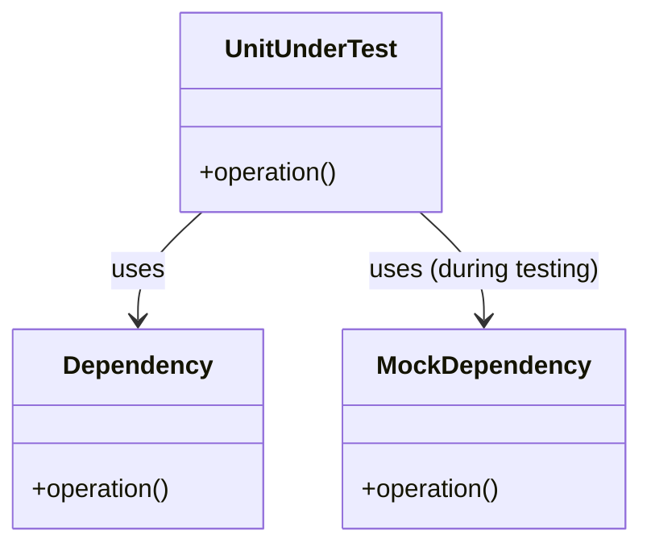

## 14.4 Mocking and Test Doubles

In the realm of software testing, especially in systems programming with D, ensuring that each component functions correctly in isolation is crucial. This is where mocking and test doubles come into play. They allow us to simulate dependencies, control the behavior of external components, and focus on the unit under test. In this section, we will delve into the concepts of mocking and test doubles, explore how to implement them in D, and provide practical examples to illustrate their use.

### Simulating Dependencies

When testing a piece of software, we often encounter dependencies that are either complex, unreliable, or simply unavailable during the testing phase. To address this, we use test doubles, which are simplified versions of these dependencies. Test doubles come in various forms, including mock objects, stubs, and fakes.

#### Mock Objects

Mock objects are controlled substitutes for real components. They are used to verify interactions between the unit under test and its dependencies. Mocks can be programmed to expect certain calls and respond with predefined data, allowing us to test the behavior of the unit in isolation.

#### Stubs and Fakes

Stubs are simplified versions of real components that return fixed responses to specific calls. They are useful when we need to provide consistent data to the unit under test. Fakes, on the other hand, are more complex than stubs and often contain some working implementation, but are not suitable for production use. They are used to simulate the behavior of real components in a controlled manner.

### Implementing Mocks in D

Implementing mocks in D can be done manually or by using existing mocking frameworks. Each approach has its advantages and trade-offs.

#### Manual Mocking

Manual mocking involves writing custom mock objects to simulate dependencies. This approach provides full control over the behavior of the mocks but can be time-consuming and error-prone. Here's an example of manual mocking in D:

```d
interface Database {
    void connect();
    string query(string sql);
}

class MockDatabase : Database {
    bool connected = false;
    string lastQuery;

    void connect() {
        connected = true;
    }

    string query(string sql) {
        lastQuery = sql;
        return "Mocked result";
    }
}

void testDatabaseConnection() {
    auto db = new MockDatabase();
    db.connect();
    assert(db.connected, "Database should be connected");
    string result = db.query("SELECT * FROM users");
    assert(result == "Mocked result", "Query result should be mocked");
    assert(db.lastQuery == "SELECT * FROM users", "Last query should be recorded");
}
```

In this example, `MockDatabase` is a manual mock of the `Database` interface. It simulates the behavior of a real database by providing controlled responses to method calls.

#### Using Mocking Frameworks

Mocking frameworks can significantly reduce the effort required to create and manage mocks. They provide tools to automatically generate mock objects and define their behavior. While D does not have as many mature mocking frameworks as some other languages, there are still options available, such as `unit-threaded` and `dunit`.

Here's an example using `unit-threaded`:

```d
import unit_threaded;

interface Service {
    int performAction();
}

class MockService : Service {
    int performAction() {
        return 42;
    }
}

void testServiceAction() {
    auto mock = new MockService();
    assert(mock.performAction() == 42, "Mocked service should return 42");
}

mixin UnitTest!testServiceAction;
```

In this example, `MockService` is a mock implementation of the `Service` interface. The `unit-threaded` framework is used to define and run the test.

### Use Cases and Examples

Mocking and test doubles are invaluable in various testing scenarios. Let's explore some common use cases and examples.

#### Isolated Testing

Isolated testing focuses on testing a unit in isolation from its dependencies. By using mocks, we can ensure that the unit behaves correctly without relying on external components.

```d
interface Logger {
    void log(string message);
}

class MockLogger : Logger {
    string lastMessage;

    void log(string message) {
        lastMessage = message;
    }
}

void testLogging() {
    auto logger = new MockLogger();
    logger.log("Test message");
    assert(logger.lastMessage == "Test message", "Logger should record the last message");
}
```

In this example, `MockLogger` is used to test a logging component in isolation. The test verifies that the logger records the correct message.

#### Simulating External Services

When testing components that interact with external services, such as web APIs or databases, mocks can simulate these services and provide controlled responses.

```d
interface ApiService {
    string fetchData();
}

class MockApiService : ApiService {
    string fetchData() {
        return "Mocked data";
    }
}

void testApiService() {
    auto api = new MockApiService();
    assert(api.fetchData() == "Mocked data", "API service should return mocked data");
}
```

In this example, `MockApiService` simulates an external API service, allowing us to test the component without relying on the actual service.

### Visualizing Mocking and Test Doubles

To better understand the relationships between the unit under test and its dependencies, let's visualize the process using a class diagram.



**Figure 1: Visualizing the Use of Mocking in Testing**

In this diagram, `UnitUnderTest` depends on `Dependency` during normal operation. However, during testing, `MockDependency` is used to simulate `Dependency`, allowing for isolated testing.

### Try It Yourself

To deepen your understanding of mocking and test doubles in D, try modifying the examples provided:

- Change the behavior of the mock objects to simulate different scenarios.
- Implement additional methods in the mock classes and test their interactions.
- Experiment with different mocking frameworks and compare their features.

### References and Links

For further reading on mocking and test doubles, consider the following resources:

- [Martin Fowler's Article on Mocks Aren't Stubs](https://martinfowler.com/articles/mocksArentStubs.html)
- [D Programming Language Documentation](https://dlang.org/)
- [unit-threaded GitHub Repository](https://github.com/atilaneves/unit-threaded)

### Knowledge Check

Before moving on, let's review some key concepts:

- What are the differences between mocks, stubs, and fakes?
- How can mocking frameworks simplify the process of creating test doubles?
- Why is isolated testing important in software development?

### Embrace the Journey

Remember, mastering mocking and test doubles is a journey. As you continue to experiment and learn, you'll gain a deeper understanding of how to effectively test your software. Keep exploring, stay curious, and enjoy the process!

## Quiz Time!



### What is the primary purpose of using mock objects in testing?

- [x] To simulate dependencies and verify interactions
- [ ] To replace all real components in production
- [ ] To generate random data for testing
- [ ] To improve the performance of the application

> **Explanation:** Mock objects are used to simulate dependencies and verify interactions between the unit under test and its dependencies.

### Which of the following is a characteristic of a stub?

- [x] It returns fixed responses to specific calls
- [ ] It contains a full implementation of the component
- [ ] It is used in production environments
- [ ] It verifies interactions between components

> **Explanation:** Stubs return fixed responses to specific calls and are used to provide consistent data to the unit under test.

### What is a key advantage of using mocking frameworks?

- [x] They reduce the effort required to create and manage mocks
- [ ] They eliminate the need for unit testing
- [ ] They automatically fix bugs in the code
- [ ] They replace all manual testing processes

> **Explanation:** Mocking frameworks reduce the effort required to create and manage mocks by providing tools to automatically generate mock objects and define their behavior.

### In the context of testing, what is a fake?

- [x] A simplified version of a component with some working implementation
- [ ] A tool that generates random test data
- [ ] A complete replacement for the production component
- [ ] A framework for managing test environments

> **Explanation:** A fake is a simplified version of a component with some working implementation, used to simulate the behavior of real components in a controlled manner.

### How does isolated testing benefit software development?

- [x] It ensures that each component functions correctly in isolation
- [ ] It eliminates the need for integration testing
- [ ] It speeds up the deployment process
- [ ] It reduces the overall cost of development

> **Explanation:** Isolated testing ensures that each component functions correctly in isolation, allowing developers to focus on the unit under test without relying on external components.

### What is the role of a mock object in isolated testing?

- [x] To simulate dependencies and control their behavior
- [ ] To replace the entire application during testing
- [ ] To generate random test scenarios
- [ ] To improve the performance of the test suite

> **Explanation:** In isolated testing, mock objects simulate dependencies and control their behavior, allowing the unit under test to be evaluated independently.

### Which of the following is NOT a type of test double?

- [ ] Mock
- [ ] Stub
- [ ] Fake
- [x] Real

> **Explanation:** Real components are not test doubles. Test doubles include mocks, stubs, and fakes, which are used to simulate dependencies during testing.

### What is a common use case for simulating external services in testing?

- [x] To test components without relying on real service dependencies
- [ ] To improve the performance of the application
- [ ] To replace all real components in production
- [ ] To generate random data for testing

> **Explanation:** Simulating external services allows testing components without relying on real service dependencies, ensuring controlled and consistent test environments.

### What is the primary difference between a mock and a stub?

- [x] Mocks verify interactions, while stubs return fixed responses
- [ ] Mocks are used in production, while stubs are not
- [ ] Mocks generate random data, while stubs do not
- [ ] Mocks are faster than stubs

> **Explanation:** The primary difference is that mocks verify interactions between components, while stubs return fixed responses to specific calls.

### True or False: Mocking frameworks can completely replace manual testing.

- [ ] True
- [x] False

> **Explanation:** Mocking frameworks cannot completely replace manual testing. They are tools that aid in creating and managing mocks but do not eliminate the need for manual testing processes.


