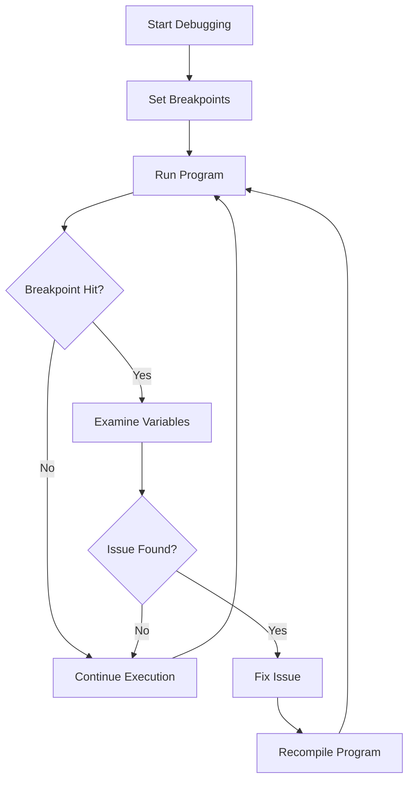

## 14.5 Debugging Techniques and Tools

Debugging is an essential skill for any software engineer, especially when dealing with complex systems programming in D. This section will guide you through various debugging techniques and tools, focusing on both general and D-specific strategies. We'll explore how to effectively use `gdb`, leverage D's unique features for debugging, and optimize performance by identifying inefficiencies.

### Debugging with `gdb`

`gdb` (GNU Debugger) is a powerful tool for debugging applications written in C, C++, and D. It allows you to inspect the state of a program at runtime, set breakpoints, and examine variables. Let's delve into how you can use `gdb` to debug D programs effectively.

#### Setting Breakpoints

Breakpoints are crucial for pausing program execution at specific points to inspect the state of your application. Here's how you can set breakpoints in `gdb`:

```bash
gdb ./your_program

(gdb) break main

(gdb) break file.d:42

(gdb) break yourFunction
```

Once a breakpoint is hit, you can inspect variables, step through code, and evaluate expressions.

#### Examining Variables

Examining variables during runtime is essential for understanding the current state of your program. Use the following commands in `gdb`:

```bash
(gdb) print variableName

(gdb) print expression

(gdb) display variableName
```

These commands help you verify if variables hold the expected values and identify any discrepancies.

### D-Specific Debugging

D offers unique features that can enhance your debugging experience. Understanding how to utilize these features can significantly improve your debugging efficiency.

#### Symbol Information

Compiling your D program with debug symbols is crucial for effective debugging. Use the `-g` flag to include debug information:

```bash
dmd -g your_program.d
```

This enables `gdb` to provide more detailed information about your program, such as variable names and line numbers.

#### Exception Handling

D's exception handling mechanism provides stack traces that are invaluable for debugging. When an exception occurs, you can analyze the stack trace to pinpoint the source of the error.

```d
try {
    // Code that might throw an exception
} catch (Exception e) {
    writeln("Exception: ", e.msg);
    writeln("Stack trace: ", e.stackTrace);
}
```

The stack trace helps you trace back the sequence of function calls leading to the exception, making it easier to identify and fix bugs.

### Use Cases and Examples

Let's explore some practical use cases and examples to illustrate how these debugging techniques can be applied in real-world scenarios.

#### Tracing Issues

Consider a scenario where your program crashes unexpectedly. By setting breakpoints and examining variables, you can trace the issue back to its source. Here's a simple example:

```d
import std.stdio;

void faultyFunction() {
    int[] numbers = [1, 2, 3];
    writeln(numbers[3]); // Out of bounds access
}

void main() {
    faultyFunction();
}
```

Using `gdb`, you can set a breakpoint at `faultyFunction` and inspect the `numbers` array to identify the out-of-bounds access.

#### Performance Debugging

Performance issues can be challenging to diagnose. Use `gdb` to profile your program and identify bottlenecks. Here's a basic example:

```d
import std.stdio;

void compute() {
    foreach (i; 0 .. 1000000) {
        writeln(i);
    }
}

void main() {
    compute();
}
```

By profiling the `compute` function, you can determine that excessive I/O operations are causing performance degradation. Consider optimizing by reducing unnecessary output.

### Visualizing Debugging Workflows

To better understand the debugging process, let's visualize a typical debugging workflow using a flowchart.



This flowchart illustrates the iterative nature of debugging, where you set breakpoints, run the program, examine variables, and fix issues until the program runs correctly.

### References and Links

For further reading on debugging techniques and tools, consider the following resources:

- [GNU Debugger (gdb) Documentation](https://www.gnu.org/software/gdb/documentation/)
- [D Programming Language Official Website](https://dlang.org/)
- [D Language Debugging Tips](https://wiki.dlang.org/Debugging)

### Knowledge Check

To reinforce your understanding of debugging techniques and tools, consider the following questions:

1. What is the purpose of setting breakpoints in `gdb`?
2. How can you compile a D program with debug symbols?
3. What information does a stack trace provide?
4. How can you identify performance bottlenecks using `gdb`?

### Embrace the Journey

Remember, debugging is an iterative process that requires patience and persistence. As you gain experience, you'll develop a keen eye for identifying and resolving issues efficiently. Keep experimenting, stay curious, and enjoy the journey of mastering debugging in D programming!

## Quiz Time!



### What is the primary purpose of setting breakpoints in `gdb`?

- [x] To pause execution and inspect the program state
- [ ] To compile the program
- [ ] To optimize performance
- [ ] To generate documentation

> **Explanation:** Breakpoints allow you to pause execution at specific points to inspect variables and program state.

### How do you compile a D program with debug symbols?

- [x] Use the `-g` flag with the DMD compiler
- [ ] Use the `-O` flag with the DMD compiler
- [ ] Use the `-d` flag with the DMD compiler
- [ ] Use the `-c` flag with the DMD compiler

> **Explanation:** The `-g` flag includes debug symbols in the compiled program, enabling detailed debugging information.

### What information does a stack trace provide?

- [x] The sequence of function calls leading to an exception
- [ ] The memory usage of the program
- [ ] The performance metrics of the program
- [ ] The list of all variables in the program

> **Explanation:** A stack trace shows the sequence of function calls that led to an exception, helping identify the source of errors.

### Which command in `gdb` is used to print the value of a variable?

- [x] `print variableName`
- [ ] `display variableName`
- [ ] `show variableName`
- [ ] `inspect variableName`

> **Explanation:** The `print` command is used to display the value of a variable in `gdb`.

### What is a common cause of performance issues in D programs?

- [x] Excessive I/O operations
- [ ] Lack of comments
- [ ] Using too many functions
- [ ] Compiling with debug symbols

> **Explanation:** Excessive I/O operations can significantly degrade performance, especially in loops.

### How can you continuously display the value of a variable in `gdb`?

- [x] Use the `display` command
- [ ] Use the `print` command
- [ ] Use the `watch` command
- [ ] Use the `trace` command

> **Explanation:** The `display` command continuously shows the value of a variable each time the program stops.

### What is the role of exception handling in debugging?

- [x] To provide stack traces for identifying error sources
- [ ] To optimize program performance
- [ ] To compile the program
- [ ] To generate documentation

> **Explanation:** Exception handling provides stack traces that help trace back the sequence of function calls leading to an error.

### Which tool is commonly used for debugging D programs?

- [x] `gdb`
- [ ] `valgrind`
- [ ] `make`
- [ ] `cmake`

> **Explanation:** `gdb` is a widely used debugger for D programs, providing powerful debugging capabilities.

### What is the benefit of using `gdb` for performance debugging?

- [x] Identifying bottlenecks and inefficiencies
- [ ] Generating documentation
- [ ] Compiling the program
- [ ] Writing unit tests

> **Explanation:** `gdb` helps identify performance bottlenecks by allowing you to profile and analyze program execution.

### True or False: Debugging is a one-time process that doesn't require iteration.

- [ ] True
- [x] False

> **Explanation:** Debugging is an iterative process that involves setting breakpoints, examining variables, and fixing issues until the program runs correctly.


