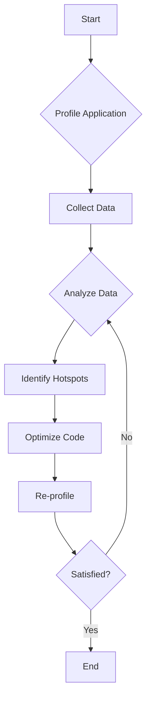
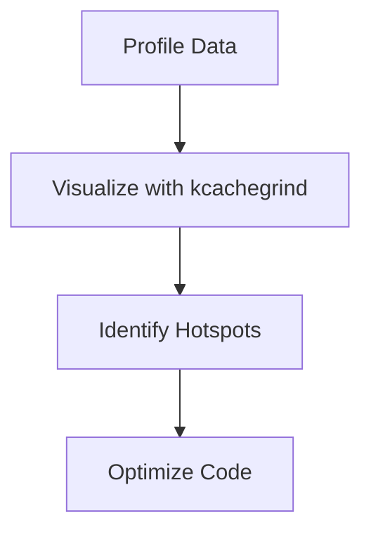

## 14.6 Profiling and Performance Measurement

In the realm of advanced systems programming, understanding and optimizing the performance of your applications is crucial. Profiling and performance measurement are essential practices that enable developers to identify bottlenecks, optimize resource usage, and ensure scalability. In this section, we will delve into the tools and techniques available for profiling in the D programming language, analyze performance metrics, and explore real-world use cases to enhance your software's efficiency.

### Profiling Tools

Profiling is the process of measuring the space (memory) and time complexity of a program, identifying sections of code that are resource-intensive, and optimizing them for better performance. D provides several tools and methods for profiling, both built-in and third-party.

#### D Profile: Using Built-in Profiling Support

The D programming language includes built-in support for profiling, which can be easily utilized to gather performance data. The `-profile` flag in the DMD compiler is a straightforward way to enable profiling in your D applications.

```bash
dmd -profile myapp.d
./myapp
```

When you compile your program with the `-profile` flag, DMD generates a profiling report that includes information about function call counts and execution times. This report is invaluable for identifying hotspots in your code.

#### Third-Party Profilers: Integrating External Tools

While D's built-in profiling is useful, integrating third-party profilers can provide more detailed insights and advanced features. Some popular third-party profilers that can be used with D include:

- **Valgrind**: A powerful tool for memory debugging, memory leak detection, and profiling.
- **gprof**: A GNU profiler that provides a detailed call graph of your program.
- **Perf**: A performance analyzing tool in Linux that provides a wide range of profiling capabilities.

To use these tools, you may need to compile your D program with additional flags to generate the necessary debug information.

```bash
dmd -g -gc myapp.d
valgrind --tool=callgrind ./myapp
```

### Analyzing Results

Once you have collected profiling data, the next step is to analyze the results to identify performance bottlenecks and optimize your code accordingly.

#### Hotspots Identification

Hotspots are sections of code that consume the most resources, such as CPU time or memory. Identifying these hotspots is crucial for effective optimization. Profiling reports typically highlight functions or lines of code that are executed frequently or take a long time to complete.



#### Performance Metrics

Performance metrics provide quantitative data about your application's behavior. Key metrics to consider include:

- **Execution Time**: The total time taken by the program to execute.
- **Memory Usage**: The amount of memory consumed by the program during execution.
- **CPU Utilization**: The percentage of CPU resources used by the program.
- **I/O Operations**: The number of input/output operations performed.

By analyzing these metrics, you can gain insights into how your application performs under different conditions and identify areas for improvement.

### Use Cases and Examples

Profiling and performance measurement are not just theoretical exercises; they have practical applications in real-world scenarios. Let's explore some use cases and examples to illustrate how these techniques can be applied effectively.

#### Optimizing Code: Improving Performance Based on Data

Consider a scenario where you have a D application that processes large datasets. Profiling reveals that a specific function is consuming a significant amount of CPU time. By optimizing this function, you can achieve substantial performance gains.

```d
import std.stdio;
import std.datetime;

void processData(int[] data) {
    auto start = Clock.currTime();
    foreach (i; 0 .. data.length) {
        // Simulate a time-consuming operation
        data[i] = data[i] * 2;
    }
    auto end = Clock.currTime();
    writeln("Processing time: ", end - start);
}

void main() {
    int[] data = new int[1000000];
    processData(data);
}
```

In this example, the `processData` function is a hotspot. By optimizing the algorithm or using parallel processing, you can reduce the execution time and improve overall performance.

#### Scalability Analysis: Assessing How Applications Behave Under Load

Scalability is a critical aspect of modern software systems. Profiling can help you assess how your application behaves under different loads and identify potential scalability issues.

```d
import std.stdio;
import std.parallelism;

void computeHeavyTask(int id) {
    writeln("Task ", id, " started.");
    // Simulate a heavy computation
    foreach (i; 0 .. 1000000) {
        auto x = i * i;
    }
    writeln("Task ", id, " completed.");
}

void main() {
    auto tasks = [1, 2, 3, 4];
    tasks.parallelForeach!computeHeavyTask;
}
```

By profiling the above code, you can analyze how well it scales with the number of tasks and identify any bottlenecks in parallel execution.

### Try It Yourself

To gain hands-on experience with profiling and performance measurement in D, try modifying the code examples provided. Experiment with different optimization techniques, such as parallel processing or algorithm improvements, and observe the impact on performance metrics.

### Visualizing Performance Data

Visualizing performance data can provide a clearer understanding of your application's behavior. Use tools like `kcachegrind` to visualize call graphs and identify hotspots more easily.



### References and Links

- [D Programming Language Official Site](https://dlang.org/)
- [Valgrind Documentation](http://valgrind.org/docs/manual/manual.html)
- [gprof Manual](https://sourceware.org/binutils/docs/gprof/)
- [Perf Wiki](https://perf.wiki.kernel.org/index.php/Main_Page)

### Knowledge Check

- What are the key metrics to consider when profiling an application?
- How can you identify hotspots in your code using profiling tools?
- What are some common third-party profilers that can be used with D?

### Embrace the Journey

Remember, profiling and performance measurement are iterative processes. As you optimize your code, continue to profile and measure performance to ensure that your changes have the desired effect. Keep experimenting, stay curious, and enjoy the journey of mastering performance optimization in D programming!

## Quiz Time!



### What is the primary purpose of profiling in software development?

- [x] To identify performance bottlenecks and optimize resource usage.
- [ ] To compile code into machine language.
- [ ] To debug syntax errors in the code.
- [ ] To manage version control of the codebase.

> **Explanation:** Profiling is used to identify sections of code that consume the most resources, allowing developers to optimize them for better performance.

### Which built-in tool does D provide for profiling?

- [x] DMD with the `-profile` flag.
- [ ] Valgrind.
- [ ] gprof.
- [ ] Perf.

> **Explanation:** DMD, the D compiler, provides a built-in profiling feature that can be enabled with the `-profile` flag.

### What is a hotspot in the context of profiling?

- [x] A section of code that consumes a significant amount of resources.
- [ ] A bug in the code that causes crashes.
- [ ] A feature that enhances code readability.
- [ ] A tool used for version control.

> **Explanation:** A hotspot is a part of the code that is resource-intensive, often requiring optimization to improve performance.

### Which of the following is NOT a performance metric?

- [ ] Execution Time
- [ ] Memory Usage
- [ ] CPU Utilization
- [x] Code Readability

> **Explanation:** Code readability is not a performance metric; it relates to how easily the code can be understood by humans.

### How can you visualize profiling data for better analysis?

- [x] Using tools like `kcachegrind`.
- [ ] By manually reading the source code.
- [ ] By using a text editor.
- [ ] By compiling the code with optimization flags.

> **Explanation:** Tools like `kcachegrind` can visualize profiling data, making it easier to identify hotspots and analyze performance.

### What is the benefit of using third-party profilers with D?

- [x] They provide more detailed insights and advanced features.
- [ ] They automatically fix performance issues.
- [ ] They compile the code faster.
- [ ] They manage memory allocation.

> **Explanation:** Third-party profilers offer detailed insights and advanced features that can enhance the profiling process.

### What does the `-g` flag do when compiling a D program?

- [x] It generates debug information for profiling.
- [ ] It optimizes the code for faster execution.
- [ ] It compiles the code without any warnings.
- [ ] It enables garbage collection.

> **Explanation:** The `-g` flag generates debug information, which is useful for profiling and debugging.

### What is the role of `std.parallelism` in D?

- [x] It facilitates parallel processing to improve performance.
- [ ] It manages memory allocation.
- [ ] It handles error reporting.
- [ ] It provides syntax highlighting.

> **Explanation:** `std.parallelism` is a module in D that supports parallel processing, which can enhance performance by utilizing multiple CPU cores.

### True or False: Profiling should be done only once during the development process.

- [ ] True
- [x] False

> **Explanation:** Profiling is an iterative process that should be done multiple times throughout development to ensure ongoing performance optimization.

### What is the primary goal of scalability analysis?

- [x] To assess how applications behave under different loads.
- [ ] To improve code readability.
- [ ] To manage version control.
- [ ] To debug syntax errors.

> **Explanation:** Scalability analysis evaluates how well an application performs under varying loads, helping to identify potential scalability issues.


