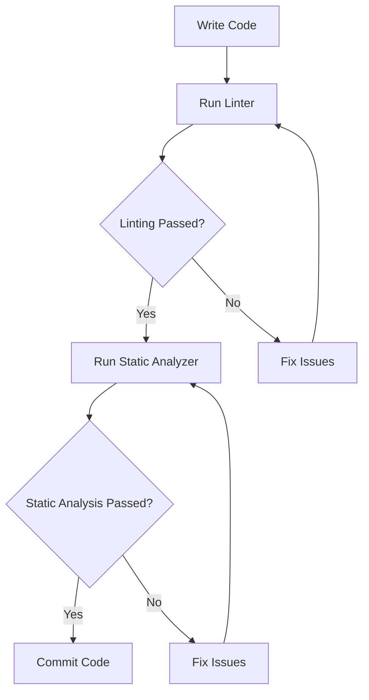

## 14.7 Static Analysis and Linting

In the realm of software development, ensuring code quality is paramount. Static analysis and linting play a crucial role in this process by examining code for potential errors, code smells, and adherence to coding standards without executing the program. In this section, we delve into the importance of these practices in the D programming language, explore available tools, and demonstrate how to integrate them into your development workflow.

### Code Analysis Tools

#### Linting: Detecting Potential Errors and Code Smells

Linting involves analyzing source code to flag programming errors, bugs, stylistic errors, and suspicious constructs. It is an essential step in maintaining a clean and efficient codebase. Linting tools provide immediate feedback to developers, helping them adhere to coding standards and best practices.

**Key Benefits of Linting:**

- **Consistency**: Enforces a uniform coding style across the codebase.
- **Error Detection**: Identifies potential bugs and errors early in the development process.
- **Code Smells**: Highlights areas of code that may require refactoring.
- **Documentation**: Encourages well-documented code through style checks.

#### Static Analyzers: Examining Code Without Execution

Static analysis tools go beyond linting by performing a more in-depth examination of the code. These tools analyze the code's structure, data flow, and control flow to detect complex issues such as memory leaks, race conditions, and security vulnerabilities.

**Advantages of Static Analysis:**

- **Comprehensive Analysis**: Provides a deeper understanding of potential issues in the code.
- **Security**: Identifies vulnerabilities that could be exploited by attackers.
- **Performance**: Highlights inefficient code that could impact performance.
- **Maintainability**: Encourages writing maintainable and scalable code.

### Implementing Static Analysis and Linting in D

#### Available Tools: Using `D-scanner` and Other Analyzers

For D programming, several tools are available to facilitate static analysis and linting. One of the most popular tools is `D-scanner`, which is specifically designed for the D language.

**D-scanner**: A static analysis tool for D that checks for style issues, potential errors, and code smells. It is highly configurable and can be integrated into various development environments.

```bash
dub fetch dscanner
dub run dscanner -- --help
```

**Other Tools**: While `D-scanner` is a primary tool, other general-purpose static analysis tools can also be configured to work with D code, such as `SonarQube` and `Coverity`.

#### Custom Rules: Configuring Tools to Match Coding Standards

One of the strengths of static analysis tools is their configurability. By defining custom rules, you can tailor these tools to enforce your team's specific coding standards and practices.

**Configuring D-scanner**:

1. **Create a Configuration File**: Define your rules and preferences in a configuration file, typically named `.dscanner.ini`.

   ```ini
   [style]
   max_line_length = 100
   indent_size = 4
   ```

2. **Run D-scanner with Custom Rules**: Use the configuration file to guide the analysis process.

   ```bash
   dscanner --config .dscanner.ini source/
   ```

3. **Iterate and Refine**: Continuously update your rules as your coding standards evolve.

### Use Cases and Examples

#### Code Quality Assurance: Maintaining High Standards

Static analysis and linting are integral to maintaining high code quality. By integrating these tools into your development process, you can ensure that your codebase remains clean, efficient, and free of common errors.

**Example Workflow**:

1. **Pre-Commit Hooks**: Use tools like `pre-commit` to run static analysis and linting checks before code is committed to the repository.

   ```yaml
   # .pre-commit-config.yaml
   - repo: local
     hooks:
     - id: dscanner
       name: D-scanner
       entry: dscanner
       language: system
       files: \.d$
   ```

2. **Continuous Integration**: Integrate static analysis into your CI/CD pipeline to automatically check code quality on every build.

   ```yaml
   # Example GitHub Actions workflow
   name: D Static Analysis

   on: [push, pull_request]

   jobs:
     build:
       runs-on: ubuntu-latest
       steps:
       - uses: actions/checkout@v2
       - name: Install D-scanner
         run: |
           dub fetch dscanner
           dub run dscanner -- --help
       - name: Run D-scanner
         run: dscanner source/
   ```

#### Automated Checks: Integrating into Development Workflows

Automating static analysis and linting checks ensures that code quality is consistently monitored and maintained throughout the development lifecycle.

**Benefits of Automation**:

- **Efficiency**: Reduces the manual effort required to enforce coding standards.
- **Early Detection**: Identifies issues early in the development process, reducing the cost of fixing them later.
- **Continuous Feedback**: Provides developers with immediate feedback, facilitating faster iterations.

### Visualizing Static Analysis Workflow

To better understand how static analysis and linting fit into the development workflow, let's visualize the process using a flowchart.



**Diagram Explanation**: This flowchart illustrates a typical development workflow where code is first linted to catch style and syntax issues. If linting passes, static analysis is performed to catch deeper issues. The process iterates until all checks are passed, allowing the code to be committed.

### References and Links

- [D Language Official Website](https://dlang.org/)
- [D-scanner GitHub Repository](https://github.com/dlang-community/D-Scanner)
- [SonarQube](https://www.sonarqube.org/)
- [Coverity](https://scan.coverity.com/)

### Knowledge Check

1. **What is the primary purpose of linting in software development?**
2. **How does static analysis differ from linting?**
3. **What are some benefits of integrating static analysis into a CI/CD pipeline?**

### Embrace the Journey

Remember, mastering static analysis and linting is a journey. As you integrate these practices into your workflow, you'll find that your code becomes more robust, maintainable, and secure. Keep experimenting with different tools and configurations, and enjoy the process of continuous improvement!

### Quiz Time!



### What is the primary purpose of linting?

- [x] To detect potential errors and code smells
- [ ] To execute code and find runtime errors
- [ ] To compile code into machine language
- [ ] To manage project dependencies

> **Explanation:** Linting is used to detect potential errors and code smells in the source code without executing it.

### How does static analysis differ from linting?

- [x] Static analysis provides a deeper examination of code structure
- [ ] Static analysis is only for runtime errors
- [ ] Linting checks for security vulnerabilities
- [ ] Linting compiles the code

> **Explanation:** Static analysis examines code structure, data flow, and control flow, providing a deeper analysis than linting.

### Which tool is specifically designed for static analysis in D?

- [x] D-scanner
- [ ] SonarQube
- [ ] Coverity
- [ ] ESLint

> **Explanation:** D-scanner is specifically designed for static analysis in the D programming language.

### What is a benefit of using pre-commit hooks for static analysis?

- [x] Ensures code quality before committing
- [ ] Automatically merges code
- [ ] Compiles code into binaries
- [ ] Manages project dependencies

> **Explanation:** Pre-commit hooks run checks before code is committed, ensuring code quality.

### What is the role of a configuration file in static analysis tools?

- [x] To define custom rules and preferences
- [ ] To compile the code
- [ ] To execute the code
- [ ] To manage dependencies

> **Explanation:** Configuration files define custom rules and preferences for static analysis tools.

### What is one advantage of integrating static analysis into CI/CD pipelines?

- [x] Provides continuous feedback on code quality
- [ ] Automatically deploys code to production
- [ ] Manages project dependencies
- [ ] Compiles code into machine language

> **Explanation:** Integrating static analysis into CI/CD pipelines provides continuous feedback on code quality.

### What does a static analyzer typically check for?

- [x] Security vulnerabilities and performance issues
- [ ] Runtime errors
- [ ] Project dependencies
- [ ] Code compilation

> **Explanation:** Static analyzers check for security vulnerabilities, performance issues, and other potential problems in the code.

### How can static analysis improve code maintainability?

- [x] By encouraging writing maintainable and scalable code
- [ ] By compiling code into machine language
- [ ] By executing code and finding runtime errors
- [ ] By managing project dependencies

> **Explanation:** Static analysis encourages writing maintainable and scalable code by identifying potential issues.

### What is the benefit of using D-scanner for D programming?

- [x] It is specifically designed for D and checks for style issues
- [ ] It compiles D code into machine language
- [ ] It manages D project dependencies
- [ ] It executes D code

> **Explanation:** D-scanner is specifically designed for D programming and checks for style issues, potential errors, and code smells.

### True or False: Static analysis tools execute the code to find errors.

- [ ] True
- [x] False

> **Explanation:** Static analysis tools examine the code without executing it to find potential errors and issues.


