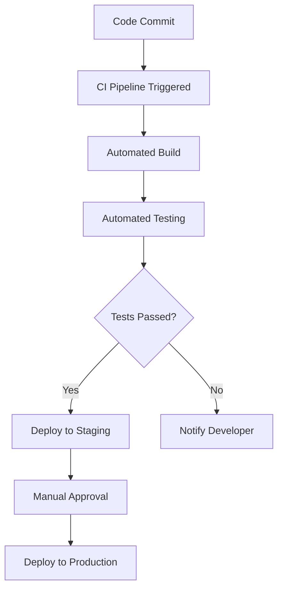

## 14.8 Continuous Integration Pipelines

In the realm of modern software development, Continuous Integration (CI) pipelines are indispensable for ensuring code quality and accelerating the development process. In this section, we will delve into the concepts of CI/CD, explore how to implement CI with the D programming language, and examine use cases and examples that highlight the benefits of CI pipelines.

### CI/CD Concepts

Continuous Integration and Continuous Deployment (CI/CD) are practices that aim to improve software development by automating the integration and deployment processes. Let's break down the key components:

#### Automated Building

Automated building is the process of compiling code automatically whenever changes are made. This ensures that the codebase is always in a buildable state, reducing integration issues and allowing developers to focus on writing code rather than managing builds.

- **Build Triggers**: Set up triggers to initiate builds automatically when code is pushed to a repository. This can be configured for specific branches or pull requests.
- **Build Scripts**: Use scripts to define the build process, specifying the compiler, flags, and any dependencies required.

#### Automated Testing

Automated testing involves running a suite of tests automatically to catch issues early in the development cycle. This ensures that new changes do not break existing functionality and that the code meets quality standards.

- **Unit Tests**: Write unit tests to verify individual components of the code.
- **Integration Tests**: Implement integration tests to ensure that different parts of the application work together as expected.
- **Test Coverage**: Measure test coverage to ensure that a significant portion of the code is tested.

### Implementing CI with D

Implementing CI pipelines for D projects involves integrating with CI services, containerizing applications, and automating the build and test processes.

#### Using CI Services

CI services like Travis CI, GitHub Actions, and Jenkins provide platforms for automating the build, test, and deployment processes.

- **Travis CI**: A popular CI service that integrates seamlessly with GitHub repositories. It supports multiple languages, including D, and allows you to define build and test scripts in a `.travis.yml` file.

```yaml
language: d
d:
  - dmd
  - ldc
script:
  - dub test
```

- **GitHub Actions**: A flexible CI/CD platform that allows you to automate workflows directly from your GitHub repository. You can define workflows in YAML files located in the `.github/workflows` directory.

```yaml
name: D CI

on: [push, pull_request]

jobs:
  build:
    runs-on: ubuntu-latest
    steps:
      - uses: actions/checkout@v2
      - name: Install D
        run: sudo apt-get install -y dmd-compiler dub
      - name: Build and Test
        run: dub test
```

- **Jenkins**: An open-source automation server that can be configured to build and test D projects. Jenkins supports a wide range of plugins for integration with various tools and services.

#### Dockerization

Dockerization involves containerizing applications to ensure consistent environments across different stages of the CI/CD pipeline. Docker containers encapsulate the application and its dependencies, making it easier to manage and deploy.

- **Dockerfile**: Create a `Dockerfile` to define the environment and build steps for your D application.

```dockerfile
FROM dlang2/dmd-ubuntu:latest

WORKDIR /app

COPY . .

RUN dub build

CMD ["./your-application"]
```

- **Docker Compose**: Use Docker Compose to define and run multi-container applications. This is useful for applications that require multiple services, such as databases or message brokers.

```yaml
version: '3'
services:
  app:
    build: .
    ports:
      - "8080:8080"
```

### Use Cases and Examples

Continuous Integration pipelines offer numerous benefits, including rapid feedback and deployment automation. Let's explore some use cases and examples.

#### Rapid Feedback

CI pipelines provide rapid feedback by automatically building and testing code upon each commit. This allows developers to identify and fix issues quickly, reducing the time spent on debugging and manual testing.

- **Example**: A developer pushes a change to a feature branch. The CI pipeline triggers a build and runs tests. Within minutes, the developer receives feedback indicating whether the change is successful or if there are issues to address.

#### Deployment Automation

Deployment automation streamlines the release process by automatically deploying applications to production or staging environments. This reduces the risk of human error and ensures that deployments are consistent and repeatable.

- **Example**: After a successful build and test, the CI pipeline automatically deploys the application to a staging environment for further testing. Once approved, the application is deployed to production with minimal manual intervention.

### Visualizing CI/CD Pipelines

To better understand the flow of a CI/CD pipeline, let's visualize the process using a flowchart.



**Description**: This flowchart illustrates a typical CI/CD pipeline. It starts with a code commit, triggering the CI pipeline. The code is built and tested automatically. If tests pass, the application is deployed to a staging environment for manual approval before being deployed to production. If tests fail, the developer is notified to address the issues.

### Try It Yourself

To get hands-on experience with CI pipelines, try setting up a simple CI pipeline for a D project using GitHub Actions. Modify the provided YAML workflow to include additional steps, such as linting or deploying to a cloud service.

### References and Links

- [Travis CI Documentation](https://docs.travis-ci.com/)
- [GitHub Actions Documentation](https://docs.github.com/en/actions)
- [Jenkins Documentation](https://www.jenkins.io/doc/)
- [Docker Documentation](https://docs.docker.com/)

### Knowledge Check

- **What is the purpose of automated building in CI pipelines?**
- **How can Dockerization benefit CI/CD processes?**
- **What are some common CI services used for D projects?**

### Embrace the Journey

Remember, implementing CI pipelines is a journey. Start small, experiment with different tools and configurations, and gradually build a robust CI/CD process that suits your project's needs. Keep learning, stay curious, and enjoy the journey!

## Quiz Time!



### What is the primary goal of Continuous Integration (CI)?

- [x] To automate the integration and testing of code changes
- [ ] To manually deploy applications to production
- [ ] To write code faster
- [ ] To eliminate the need for testing

> **Explanation:** CI aims to automate the integration and testing of code changes to ensure code quality and reduce integration issues.

### Which CI service integrates seamlessly with GitHub repositories?

- [x] Travis CI
- [ ] Jenkins
- [ ] CircleCI
- [ ] Bamboo

> **Explanation:** Travis CI is known for its seamless integration with GitHub repositories.

### What is the purpose of Dockerization in CI/CD pipelines?

- [x] To ensure consistent environments across different stages
- [ ] To increase the size of the application
- [ ] To make applications slower
- [ ] To eliminate the need for testing

> **Explanation:** Dockerization ensures consistent environments across different stages of the CI/CD pipeline by encapsulating the application and its dependencies.

### What file format is used to define GitHub Actions workflows?

- [x] YAML
- [ ] JSON
- [ ] XML
- [ ] INI

> **Explanation:** GitHub Actions workflows are defined using YAML files.

### What happens if automated tests fail in a CI pipeline?

- [x] The developer is notified to address the issues
- [ ] The application is deployed to production
- [ ] The pipeline continues without interruption
- [ ] The code is automatically deleted

> **Explanation:** If automated tests fail, the developer is notified to address the issues before proceeding.

### Which of the following is a benefit of deployment automation?

- [x] Reduces the risk of human error
- [ ] Increases manual intervention
- [ ] Slows down the release process
- [ ] Requires more developers

> **Explanation:** Deployment automation reduces the risk of human error by ensuring that deployments are consistent and repeatable.

### What is a common use case for CI pipelines?

- [x] Rapid feedback on code changes
- [ ] Manual testing of applications
- [ ] Writing code without testing
- [ ] Increasing the number of bugs

> **Explanation:** CI pipelines provide rapid feedback on code changes by automatically building and testing code upon each commit.

### Which tool can be used for containerizing applications in CI/CD pipelines?

- [x] Docker
- [ ] Kubernetes
- [ ] Ansible
- [ ] Terraform

> **Explanation:** Docker is commonly used for containerizing applications in CI/CD pipelines.

### What is the role of a Dockerfile in Dockerization?

- [x] To define the environment and build steps for an application
- [ ] To delete the application
- [ ] To slow down the build process
- [ ] To increase the size of the application

> **Explanation:** A Dockerfile defines the environment and build steps for an application, facilitating Dockerization.

### True or False: CI pipelines eliminate the need for manual testing.

- [ ] True
- [x] False

> **Explanation:** While CI pipelines automate many testing processes, manual testing is still important for certain aspects of software quality assurance.


