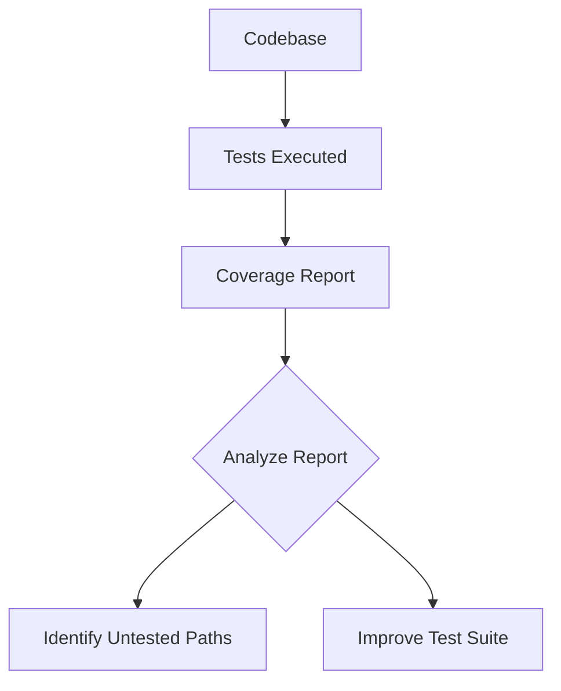

## 14.9 Code Coverage and Quality Metrics

In the realm of advanced systems programming, ensuring the reliability and maintainability of your code is paramount. Code coverage and quality metrics are essential tools in achieving this goal. They provide insights into how much of your code is exercised by tests, helping you identify untested paths and potential weaknesses. In this section, we will delve into the concepts of code coverage, explore tools available in the D programming language, and discuss how to interpret and improve your test suites.

### Measuring Coverage

Code coverage is a measure of how much of your code is executed during testing. It helps you understand the effectiveness of your test suite and identify areas that may require additional testing. There are several types of code coverage metrics, each providing different insights into your codebase.

#### Statement and Branch Coverage

**Statement Coverage** measures the percentage of executable statements in your code that have been executed by your test suite. It is a basic measure of coverage that ensures each line of code is tested at least once.

**Branch Coverage**, on the other hand, measures the percentage of branches (e.g., `if` and `else` statements) that have been executed. This metric ensures that all possible paths through your code are tested, providing a more comprehensive view of your test coverage.

##### Example

Consider the following D code snippet:

```d
void exampleFunction(int x) {
    if (x > 0) {
        writeln("Positive");
    } else {
        writeln("Non-positive");
    }
}
```

To achieve full statement coverage, your tests must execute both the `if` and `else` branches. However, to achieve full branch coverage, you must ensure that both branches are taken during testing.

#### Coverage Tools

In D programming, several tools can help you measure code coverage. Two popular options are `dmd-cov` and `gcov`.

- **`dmd-cov`**: This tool is part of the DMD compiler suite and provides coverage analysis for D programs. It generates reports that show which lines of code were executed during testing.

- **`gcov`**: Although primarily used with C/C++ programs, `gcov` can also be used with D programs when compiled with the GDC compiler. It provides detailed coverage reports, including line-by-line execution counts.

##### Using `dmd-cov`

To use `dmd-cov`, compile your D program with the `-cov` flag:

```bash
dmd -cov example.d
```

After running your tests, `dmd-cov` will generate a coverage report, typically in a file named `example.lst`. This report will show which lines of code were executed and which were not.

### Analyzing Metrics

Once you have generated coverage reports, the next step is to analyze the results. Understanding these metrics is crucial for improving your test suite and ensuring comprehensive coverage.

#### Understanding Results

Coverage reports provide valuable insights into your codebase. They highlight which parts of your code are well-tested and which are not. By examining these reports, you can identify untested code paths and areas that may require additional testing.

##### Example Coverage Report

Consider the following excerpt from a coverage report:

```
example.d:
    1:    10: void exampleFunction(int x) {
    2:     5:     if (x > 0) {
    3:     3:         writeln("Positive");
    4:     2:     } else {
    5:     2:         writeln("Non-positive");
    6:     1:     }
    7:     0: }
```

In this report, the numbers on the left indicate how many times each line was executed. Lines with a count of `0` were not executed during testing, indicating potential gaps in your test suite.

#### Improving Tests

To improve your test suite, focus on increasing both statement and branch coverage. This may involve writing additional tests to cover untested paths or refactoring your code to make it more testable.

##### Strategies for Improvement

- **Identify Untested Paths**: Use coverage reports to pinpoint untested branches and statements. Write additional tests to cover these paths.

- **Refactor for Testability**: If certain parts of your code are difficult to test, consider refactoring them to improve testability. This may involve breaking down complex functions into smaller, more manageable units.

- **Automate Testing**: Use continuous integration (CI) tools to automate your testing process. This ensures that your tests are run regularly and that coverage metrics are consistently updated.

### Use Cases and Examples

Code coverage and quality metrics are invaluable tools for ensuring the reliability and maintainability of your software. Let's explore some use cases and examples to illustrate their importance.

#### Ensuring Reliability

A comprehensive test suite with high coverage metrics is a key factor in ensuring the reliability of your software. By thoroughly testing your code, you can catch bugs early and prevent them from reaching production.

##### Example: Ensuring Reliability in a Web Server

Consider a high-performance web server written in D. To ensure its reliability, you must achieve high coverage metrics across all critical components, such as request handling, routing, and response generation. By doing so, you can confidently deploy your server to production, knowing that it has been thoroughly tested.

#### Identifying Weak Spots

Coverage metrics can also help you identify weak spots in your codebase. By analyzing coverage reports, you can pinpoint areas that are under-tested and may be prone to bugs.

##### Example: Identifying Weak Spots in a Game Engine

Imagine you are developing a game engine in D. By analyzing coverage reports, you discover that certain rendering functions are not fully tested. By writing additional tests for these functions, you can improve the stability and performance of your engine.

### Visualizing Code Coverage

Visualizing code coverage can provide a clearer understanding of your test suite's effectiveness. Diagrams and charts can help you identify patterns and trends in your coverage metrics.

#### Example Diagram: Code Coverage Visualization



**Diagram Description**: This flowchart illustrates the process of measuring and analyzing code coverage. It begins with executing tests on your codebase, generating a coverage report, analyzing the report to identify untested paths, and finally improving the test suite based on the analysis.

### References and Links

- [D Programming Language](https://dlang.org/)
- [DMD Compiler Documentation](https://dlang.org/dmd-linux.html)
- [gcov Documentation](https://gcc.gnu.org/onlinedocs/gcc/Gcov.html)

### Knowledge Check

To reinforce your understanding of code coverage and quality metrics, consider the following questions:

- What is the difference between statement coverage and branch coverage?
- How can coverage tools like `dmd-cov` and `gcov` help improve your test suite?
- Why is it important to analyze coverage reports regularly?

### Embrace the Journey

Remember, mastering code coverage and quality metrics is an ongoing journey. As you continue to develop and test your software, strive for comprehensive coverage and high-quality metrics. Keep experimenting, stay curious, and enjoy the process of building reliable and maintainable software.

## Quiz Time!



### What is statement coverage?

- [x] The percentage of executable statements tested
- [ ] The percentage of branches tested
- [ ] The percentage of functions tested
- [ ] The percentage of classes tested

> **Explanation:** Statement coverage measures the percentage of executable statements in the code that have been executed by the test suite.

### What does branch coverage measure?

- [x] The percentage of branches tested
- [ ] The percentage of executable statements tested
- [ ] The percentage of functions tested
- [ ] The percentage of classes tested

> **Explanation:** Branch coverage measures the percentage of branches (e.g., `if` and `else` statements) that have been executed.

### Which tool is part of the DMD compiler suite for coverage analysis?

- [x] dmd-cov
- [ ] gcov
- [ ] lcov
- [ ] coveralls

> **Explanation:** `dmd-cov` is part of the DMD compiler suite and provides coverage analysis for D programs.

### What is the purpose of analyzing coverage reports?

- [x] To identify untested code paths
- [ ] To increase code complexity
- [ ] To reduce code readability
- [ ] To decrease test execution time

> **Explanation:** Analyzing coverage reports helps identify untested code paths, allowing developers to improve their test suite.

### How can you improve your test suite?

- [x] By writing additional tests for untested paths
- [ ] By increasing code complexity
- [x] By refactoring code for testability
- [ ] By reducing code readability

> **Explanation:** Improving a test suite involves writing additional tests for untested paths and refactoring code to enhance testability.

### What is the benefit of automating testing with CI tools?

- [x] Ensures tests are run regularly
- [ ] Increases code complexity
- [ ] Reduces code readability
- [ ] Decreases test execution time

> **Explanation:** Automating testing with CI tools ensures that tests are run regularly and coverage metrics are consistently updated.

### What is the goal of achieving high coverage metrics?

- [x] To ensure software reliability
- [ ] To increase code complexity
- [x] To identify weak spots in the codebase
- [ ] To decrease test execution time

> **Explanation:** High coverage metrics help ensure software reliability and identify weak spots in the codebase.

### What does a coverage report show?

- [x] Which lines of code were executed
- [ ] The number of functions in the codebase
- [ ] The number of classes in the codebase
- [ ] The number of files in the codebase

> **Explanation:** A coverage report shows which lines of code were executed during testing.

### Why is it important to visualize code coverage?

- [x] To identify patterns and trends
- [ ] To increase code complexity
- [ ] To reduce code readability
- [ ] To decrease test execution time

> **Explanation:** Visualizing code coverage helps identify patterns and trends, providing a clearer understanding of the test suite's effectiveness.

### True or False: Code coverage is the only metric needed to ensure software quality.

- [ ] True
- [x] False

> **Explanation:** While code coverage is an important metric, it is not the only one needed to ensure software quality. Other metrics and practices are also essential.


