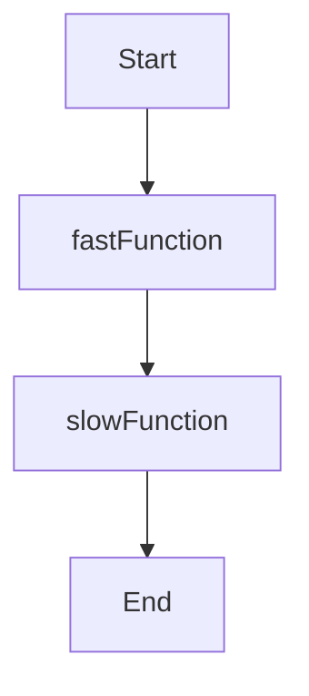

## 15.1 Identifying and Analyzing Bottlenecks

In the realm of advanced systems programming, performance is paramount. Identifying and analyzing bottlenecks is a critical skill for expert software engineers and architects, especially when working with the D programming language. This section will guide you through the process of pinpointing performance issues and optimizing your code for maximum efficiency.

### Understanding Bottlenecks

A bottleneck in software is a point where the performance or capacity of an entire system is limited by a single component. Identifying these bottlenecks is crucial because they can significantly degrade the performance of your application.

#### Key Concepts

- **Throughput**: The amount of work performed by a system in a given period.
- **Latency**: The time taken to complete a single task.
- **Resource Utilization**: The extent to which system resources (CPU, memory, I/O) are used.

### Profiling Techniques

Profiling is the process of measuring where time and resources are spent in your program. It helps in identifying bottlenecks by providing insights into the execution flow and resource utilization.

#### Sampling vs. Instrumentation

**Sampling** and **instrumentation** are two primary profiling techniques. Choosing the right method depends on your specific needs.

- **Sampling**: This technique periodically checks the state of your program, capturing snapshots of the call stack. It's less intrusive and has minimal impact on performance but may miss short-lived functions.

- **Instrumentation**: This involves inserting additional code to record entry and exit times of functions. It provides detailed information but can significantly slow down your program.

#### Choosing the Right Method

- Use **sampling** when you need a broad overview with minimal performance impact.
- Opt for **instrumentation** when you require detailed insights into specific functions or execution paths.

### Analyzing Call Stacks

Call stacks are a crucial tool in understanding how your program executes. They provide a snapshot of the active function calls at any point in time.

#### Understanding Execution Paths

Visualizing the execution paths of your code can help identify which functions are consuming the most resources. This involves analyzing the call stack to see how functions are called and how long they take to execute.

```d
import std.stdio;
import std.datetime;

void fastFunction() {
    writeln("Fast function executed.");
}

void slowFunction() {
    auto start = Clock.currTime();
    while (Clock.currTime() - start < dur!"seconds"(2)) {
        // Simulate a slow operation
    }
    writeln("Slow function executed.");
}

void main() {
    fastFunction();
    slowFunction();
}
```

In the above code, `slowFunction` is a potential bottleneck due to its longer execution time. Profiling would help us identify this by showing that `slowFunction` takes significantly more time than `fastFunction`.

### Use Cases and Examples

#### Real-Time Analysis

Real-time analysis involves adjusting your code during development to address performance issues as they arise. This proactive approach can prevent bottlenecks from reaching production.

- **Example**: Use D's built-in profiling tools to monitor function execution times and resource usage during development. Adjust algorithms or data structures based on the insights gained.

#### Post-Deployment Monitoring

Once your application is deployed, continuous monitoring is essential to identify bottlenecks that may not have been apparent during development.

- **Example**: Implement logging and monitoring solutions to track performance metrics in production. Use this data to identify and address bottlenecks that occur under real-world usage conditions.

### Visualizing Execution Paths

To better understand execution paths and identify bottlenecks, we can use visual tools. Below is a simple flowchart representing the execution of our example functions.



This flowchart helps visualize the sequence of function calls, making it easier to identify where time is being spent.

### Profiling Tools in D

D provides several tools and libraries to assist with profiling and performance analysis.

- **DMD Profiler**: The DMD compiler includes a built-in profiler that can be used to gather performance data.
- **GDC and LDC**: These compilers support integration with external profiling tools like `gprof` and `perf`.

### Practical Steps for Identifying Bottlenecks

1. **Profile Your Code**: Use profiling tools to gather data on function execution times and resource usage.
2. **Analyze Call Stacks**: Examine call stacks to understand execution paths and identify functions that consume the most resources.
3. **Visualize Data**: Use diagrams and charts to visualize execution paths and resource usage.
4. **Optimize**: Focus on optimizing the identified bottlenecks, such as by improving algorithms or data structures.

### Try It Yourself

Experiment with the provided code example by modifying the execution time of `slowFunction`. Use D's profiling tools to observe how these changes affect the overall performance. This hands-on approach will help solidify your understanding of identifying and analyzing bottlenecks.

### Knowledge Check

- What is the difference between sampling and instrumentation profiling techniques?
- How can call stacks help in identifying bottlenecks?
- Why is post-deployment monitoring important for performance optimization?

### Conclusion

Identifying and analyzing bottlenecks is a critical step in optimizing the performance of your D applications. By leveraging profiling techniques, analyzing call stacks, and using real-time and post-deployment monitoring, you can ensure your software runs efficiently and effectively.

Remember, this is just the beginning. As you progress, you'll build more complex and high-performance systems. Keep experimenting, stay curious, and enjoy the journey!

## Quiz Time!



### What is a bottleneck in software?

- [x] A point where the performance or capacity of an entire system is limited by a single component.
- [ ] A feature that enhances system performance.
- [ ] A type of software bug.
- [ ] A method for optimizing code.

> **Explanation:** A bottleneck is a point where the performance or capacity of an entire system is limited by a single component, causing a slowdown.

### Which profiling technique is less intrusive?

- [x] Sampling
- [ ] Instrumentation
- [ ] Debugging
- [ ] Logging

> **Explanation:** Sampling is less intrusive as it periodically checks the state of your program without significantly affecting performance.

### What does a call stack provide?

- [x] A snapshot of the active function calls at any point in time.
- [ ] A list of all variables in a program.
- [ ] A history of all executed commands.
- [ ] A summary of memory usage.

> **Explanation:** A call stack provides a snapshot of the active function calls at any point in time, helping to understand execution paths.

### Why is real-time analysis important?

- [x] It allows for adjusting code during development to prevent bottlenecks from reaching production.
- [ ] It is used only after deployment.
- [ ] It focuses on hardware optimization.
- [ ] It is not important for performance.

> **Explanation:** Real-time analysis allows for adjusting code during development to address performance issues proactively.

### What is the purpose of post-deployment monitoring?

- [x] To identify bottlenecks that may not have been apparent during development.
- [ ] To replace real-time analysis.
- [ ] To increase system latency.
- [ ] To reduce code complexity.

> **Explanation:** Post-deployment monitoring helps identify bottlenecks that occur under real-world usage conditions.

### Which tool is built into the DMD compiler for profiling?

- [x] DMD Profiler
- [ ] GDC Profiler
- [ ] LDC Profiler
- [ ] Perf

> **Explanation:** The DMD compiler includes a built-in profiler that can be used to gather performance data.

### What should you focus on after identifying bottlenecks?

- [x] Optimizing the identified bottlenecks, such as by improving algorithms or data structures.
- [ ] Ignoring them if they are minor.
- [ ] Adding more features.
- [ ] Reducing code size.

> **Explanation:** After identifying bottlenecks, focus on optimizing them to improve performance.

### What is the role of diagrams in analyzing execution paths?

- [x] They help visualize the sequence of function calls.
- [ ] They replace profiling tools.
- [ ] They are used for debugging.
- [ ] They are not useful.

> **Explanation:** Diagrams help visualize the sequence of function calls, making it easier to identify where time is being spent.

### How can you experiment with the provided code example?

- [x] Modify the execution time of `slowFunction` and observe changes using profiling tools.
- [ ] Change the language to C++.
- [ ] Remove all functions.
- [ ] Add more print statements.

> **Explanation:** Experiment by modifying the execution time of `slowFunction` and using profiling tools to observe the impact on performance.

### True or False: Instrumentation profiling has minimal impact on performance.

- [ ] True
- [x] False

> **Explanation:** Instrumentation profiling can significantly slow down your program as it involves inserting additional code to record entry and exit times of functions.


