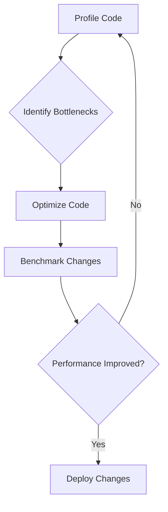

## 15.10 Best Practices for High-Performance Code

In the realm of systems programming, performance is paramount. The D programming language, with its unique blend of high-level and low-level features, offers a powerful toolkit for crafting high-performance applications. This section delves into best practices for writing high-performance code in D, focusing on code quality, testing, validation, and continuous improvement. By adhering to these practices, you can ensure that your software not only meets but exceeds performance expectations.

### Code Quality

#### Readable Code

Readable code is the foundation of maintainable and high-performance software. While it may be tempting to optimize code prematurely, doing so can lead to convoluted and error-prone implementations. Instead, focus on writing clear and concise code, and optimize only when necessary.

- **Avoid Premature Optimization**: As Donald Knuth famously said, "Premature optimization is the root of all evil." Prioritize code clarity and maintainability over micro-optimizations that may not yield significant performance gains.

- **Use Descriptive Names**: Choose variable and function names that clearly convey their purpose. This practice aids in understanding the code's intent and facilitates collaboration among team members.

- **Comment Judiciously**: While code should be self-explanatory, comments can provide valuable context, especially for complex algorithms or non-intuitive optimizations.

- **Adopt Consistent Formatting**: Use consistent indentation, spacing, and brace styles to enhance readability. Tools like `dfmt` can help enforce a uniform code style.

#### Example: Readable vs. Optimized Code

```d
// Readable version
int sumArray(int[] arr) {
    int sum = 0;
    foreach (element; arr) {
        sum += element;
    }
    return sum;
}

// Optimized version (using D's built-in function)
int sumArrayOptimized(int[] arr) {
    return arr.sum;
}
```

In this example, the optimized version leverages D's built-in `sum` function, which is both efficient and readable. However, always ensure that such optimizations do not obscure the code's intent.

### Testing and Validation

#### Benchmarking

Benchmarking is crucial for measuring and validating the performance of your code. It provides empirical data to guide optimization efforts and ensures that changes do not degrade performance.

- **Use D's Built-in Benchmarking Tools**: The `std.datetime.stopwatch` module provides a simple way to measure execution time. Use it to benchmark critical sections of your code.

- **Isolate Benchmark Tests**: Ensure that benchmarks are isolated from external factors that could skew results, such as I/O operations or network latency.

- **Compare Against Baselines**: Establish performance baselines and compare new implementations against them to quantify improvements or regressions.

#### Example: Benchmarking with `std.datetime.stopwatch`

```d
import std.datetime.stopwatch;
import std.stdio;

void main() {
    auto sw = StopWatch(AutoStart.yes);
    // Code to benchmark
    int result = sumArray([1, 2, 3, 4, 5]);
    sw.stop();
    writeln("Execution time: ", sw.peek.total!"msecs", " ms");
}
```

This example demonstrates how to use `StopWatch` to measure the execution time of a function. By benchmarking different implementations, you can make informed decisions about which approach offers the best performance.

### Continuous Improvement

#### Iterative Optimization

Optimization is an ongoing process. As your codebase evolves, so too should your optimization strategies. Regularly revisit and refine your code to maintain or improve performance.

- **Profile Before Optimizing**: Use profiling tools to identify bottlenecks before attempting optimizations. This ensures that efforts are focused on areas with the greatest impact.

- **Refactor for Performance**: As new language features or libraries become available, refactor code to take advantage of these improvements.

- **Monitor Performance Metrics**: Continuously monitor key performance metrics in production environments to detect and address performance issues proactively.

#### Example: Iterative Optimization Process



This flowchart illustrates the iterative optimization process. By profiling, identifying bottlenecks, optimizing, and benchmarking, you can ensure that your code remains performant over time.

### Use Cases and Examples

#### Long-Term Projects

In long-term projects, sustaining performance as the codebase grows is a significant challenge. Adopting best practices for high-performance code from the outset can mitigate this issue.

- **Modular Design**: Break down complex systems into smaller, manageable modules. This approach facilitates targeted optimizations and simplifies maintenance.

- **Automated Testing**: Implement automated performance tests to catch regressions early in the development cycle.

- **Documentation**: Maintain comprehensive documentation of performance-critical sections to aid future developers in understanding and optimizing the code.

#### Industry Standards

Meeting or exceeding industry standards for performance is often a requirement for competitive software. By adhering to best practices, you can ensure that your software remains performant and reliable.

- **Stay Informed**: Keep abreast of industry trends and emerging technologies that could impact performance.

- **Adopt Proven Patterns**: Leverage design patterns and architectural styles that are known to enhance performance, such as the Actor Model for concurrency.

- **Engage with the Community**: Participate in the D programming community to share insights and learn from others' experiences.

### Try It Yourself

To reinforce these concepts, try modifying the provided code examples to explore different optimization strategies. For instance, experiment with different data structures or algorithms to see how they impact performance. Remember, the key to mastering high-performance code is practice and experimentation.

### Visualizing Performance Optimization


This diagram provides a high-level overview of the best practices for high-performance code. By following this flow, you can systematically enhance the performance of your software.

### References and Links

- [D Programming Language Official Website](https://dlang.org/)
- [D Language Tour](https://tour.dlang.org/)
- [Dlang GitHub Repository](https://github.com/dlang)
- [MDN Web Docs on Performance](https://developer.mozilla.org/en-US/docs/Web/Performance)

### Knowledge Check

To ensure you've grasped the key concepts, consider the following questions:

1. What is the primary goal of benchmarking in performance optimization?
2. Why is it important to avoid premature optimization?
3. How can modular design aid in maintaining high performance in long-term projects?
4. What role does automated testing play in performance optimization?
5. How can engaging with the D programming community benefit your performance optimization efforts?

### Embrace the Journey

Remember, mastering high-performance code is a journey, not a destination. As you continue to explore and experiment with D programming, you'll uncover new techniques and strategies to enhance your software's performance. Stay curious, keep learning, and enjoy the process!

## Quiz Time!



### What is the primary goal of benchmarking in performance optimization?

- [x] To measure and validate the performance of code
- [ ] To write more complex code
- [ ] To replace manual testing
- [ ] To eliminate the need for profiling

> **Explanation:** Benchmarking is used to measure and validate the performance of code, providing empirical data to guide optimization efforts.

### Why is it important to avoid premature optimization?

- [x] It can lead to convoluted and error-prone implementations
- [ ] It always improves performance
- [ ] It simplifies code maintenance
- [ ] It reduces the need for documentation

> **Explanation:** Premature optimization can lead to convoluted and error-prone implementations, making the code harder to maintain and understand.

### How can modular design aid in maintaining high performance in long-term projects?

- [x] By facilitating targeted optimizations and simplifying maintenance
- [ ] By increasing code complexity
- [ ] By reducing the need for testing
- [ ] By eliminating the need for documentation

> **Explanation:** Modular design breaks down complex systems into smaller, manageable modules, facilitating targeted optimizations and simplifying maintenance.

### What role does automated testing play in performance optimization?

- [x] It helps catch regressions early in the development cycle
- [ ] It replaces the need for manual testing
- [ ] It simplifies code complexity
- [ ] It eliminates the need for benchmarking

> **Explanation:** Automated testing helps catch regressions early in the development cycle, ensuring that performance remains consistent.

### How can engaging with the D programming community benefit your performance optimization efforts?

- [x] By sharing insights and learning from others' experiences
- [ ] By reducing the need for documentation
- [ ] By simplifying code complexity
- [ ] By eliminating the need for testing

> **Explanation:** Engaging with the community allows you to share insights and learn from others' experiences, enhancing your performance optimization efforts.

### What is the benefit of using D's built-in benchmarking tools?

- [x] They provide a simple way to measure execution time
- [ ] They eliminate the need for profiling
- [ ] They simplify code complexity
- [ ] They replace manual testing

> **Explanation:** D's built-in benchmarking tools provide a simple way to measure execution time, aiding in performance validation.

### Why should you profile code before optimizing?

- [x] To identify bottlenecks and focus efforts on areas with the greatest impact
- [ ] To simplify code complexity
- [ ] To eliminate the need for testing
- [ ] To replace manual testing

> **Explanation:** Profiling helps identify bottlenecks, ensuring that optimization efforts are focused on areas with the greatest impact.

### What is the purpose of establishing performance baselines?

- [x] To compare new implementations and quantify improvements or regressions
- [ ] To simplify code complexity
- [ ] To eliminate the need for testing
- [ ] To replace manual testing

> **Explanation:** Performance baselines allow you to compare new implementations and quantify improvements or regressions.

### How can you ensure that benchmarks are isolated from external factors?

- [x] By ensuring benchmarks are isolated from I/O operations or network latency
- [ ] By simplifying code complexity
- [ ] By eliminating the need for testing
- [ ] By replacing manual testing

> **Explanation:** Isolating benchmarks from external factors ensures accurate measurement of code performance.

### True or False: Optimization is a one-time process.

- [ ] True
- [x] False

> **Explanation:** Optimization is an ongoing process that should be revisited regularly as the codebase evolves.




