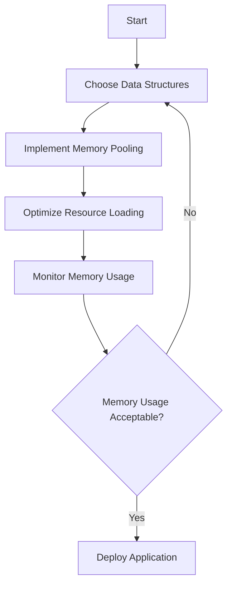

## 15.3 Memory Footprint Reduction Strategies

In the realm of systems programming, particularly when using the D programming language, optimizing memory usage is crucial for building efficient, high-performance applications. Memory footprint reduction strategies are essential for ensuring that applications run smoothly, especially in environments with limited resources such as embedded systems and mobile applications. In this section, we will delve into various strategies to minimize memory usage, focusing on data structure optimization, memory allocation patterns, and practical use cases.

### Data Structure Optimization

Data structures are the backbone of any application, and choosing the right ones can significantly impact both performance and memory usage. Let's explore how to optimize data structures in D.

#### Choosing Appropriate Structures

Selecting the right data structure involves balancing performance and memory usage. Here are some considerations:

- **Arrays vs. Linked Lists**: Arrays provide contiguous memory allocation, which can be more cache-friendly and faster for random access. However, they can lead to wasted space if not fully utilized. Linked lists, on the other hand, offer dynamic memory usage but can incur overhead due to pointers.

- **Hash Tables vs. Trees**: Hash tables offer average O(1) time complexity for lookups but can consume more memory due to hash collisions and resizing. Trees, such as binary search trees, provide O(log n) lookups and can be more memory-efficient if balanced properly.

- **Custom Data Structures**: Sometimes, creating a custom data structure tailored to specific needs can reduce memory usage. For instance, using bit fields or packed structs can minimize the memory footprint.

**Example: Optimizing a Data Structure in D**

```d
struct PackedStruct {
    ubyte field1 : 4; // 4 bits
    ubyte field2 : 4; // 4 bits
    ushort field3;    // 16 bits
}

void main() {
    PackedStruct ps;
    ps.field1 = 0xF; // Max value for 4 bits
    ps.field2 = 0xA; // Max value for 4 bits
    ps.field3 = 0xFFFF; // Max value for 16 bits

    writeln("PackedStruct size: ", PackedStruct.sizeof, " bytes");
}
```

In this example, we use bit fields to pack multiple small fields into a single byte, reducing the overall memory footprint.

#### Memory Allocation Patterns

Efficient memory allocation is key to reducing memory usage. Let's explore some patterns that can help.

##### Pooling and Reuse

Memory pooling involves pre-allocating a block of memory and reusing it for multiple objects. This reduces the overhead of frequent allocations and deallocations.

**Example: Implementing a Memory Pool in D**

```d
class MemoryPool {
    private void[] pool;
    private size_t objectSize;
    private size_t poolSize;
    private size_t currentIndex;

    this(size_t objectSize, size_t poolSize) {
        this.objectSize = objectSize;
        this.poolSize = poolSize;
        pool = new void[](objectSize * poolSize);
        currentIndex = 0;
    }

    void* allocate() {
        if (currentIndex >= poolSize) {
            throw new Exception("Memory pool exhausted");
        }
        void* obj = &pool[currentIndex * objectSize];
        currentIndex++;
        return obj;
    }

    void deallocate(void* obj) {
        // Simple pool, no deallocation logic
    }
}

void main() {
    auto pool = new MemoryPool(16, 10); // Pool for 10 objects of 16 bytes each
    void* obj1 = pool.allocate();
    void* obj2 = pool.allocate();
    writeln("Allocated objects from pool");
}
```

In this example, we create a simple memory pool that pre-allocates memory for a fixed number of objects, reducing the need for frequent allocations.

### Use Cases and Examples

Understanding practical use cases can help in applying these strategies effectively.

#### Embedded Systems

Embedded systems often operate within strict memory limits, making memory optimization crucial.

- **Minimize Static Data**: Use dynamic memory allocation where possible to avoid large static data sections.
- **Optimize Stack Usage**: Limit the use of large local variables and prefer heap allocation for large data structures.

#### Mobile Applications

Mobile applications benefit from reduced memory usage, leading to better performance and battery life.

- **Use Efficient Data Formats**: Prefer compressed data formats and lazy loading to minimize memory usage.
- **Optimize Image and Resource Loading**: Load resources on-demand and release them when not needed.

### Visualizing Memory Optimization Strategies

To better understand how these strategies work together, let's visualize the process of memory optimization in a typical application.



This flowchart illustrates the iterative process of optimizing memory usage, starting from choosing data structures to monitoring and adjusting as needed.

### References and Links

- [D Programming Language Official Documentation](https://dlang.org/)
- [Memory Management in D](https://dlang.org/spec/garbage.html)
- [Efficient Data Structures](https://en.wikipedia.org/wiki/Data_structure)

### Knowledge Check

To reinforce your understanding, consider the following questions:

- What are the trade-offs between using arrays and linked lists in terms of memory usage?
- How does memory pooling reduce allocation overhead?
- Why is it important to optimize memory usage in embedded systems?

### Embrace the Journey

Remember, optimizing memory usage is an ongoing process. As you continue to develop applications in D, keep experimenting with different strategies, stay curious, and enjoy the journey of building efficient and high-performance software.

## Quiz Time!



### What is a key advantage of using arrays over linked lists in terms of memory usage?

- [x] Contiguous memory allocation
- [ ] Dynamic memory usage
- [ ] Easier to resize
- [ ] Less memory overhead

> **Explanation:** Arrays provide contiguous memory allocation, which can be more cache-friendly and efficient for random access.

### How does memory pooling help reduce memory allocation overhead?

- [x] By reusing pre-allocated memory blocks
- [ ] By dynamically allocating memory as needed
- [ ] By using linked lists for memory management
- [ ] By reducing the size of each allocation

> **Explanation:** Memory pooling involves pre-allocating a block of memory and reusing it, reducing the need for frequent allocations and deallocations.

### In which scenario is memory optimization particularly crucial?

- [x] Embedded systems
- [ ] Desktop applications
- [ ] Web applications
- [ ] Cloud services

> **Explanation:** Embedded systems often have strict memory limits, making memory optimization crucial for efficient operation.

### What is a potential downside of using hash tables in terms of memory usage?

- [x] Increased memory consumption due to hash collisions
- [ ] Slower lookup times
- [ ] Inefficient memory allocation
- [ ] Difficulty in resizing

> **Explanation:** Hash tables can consume more memory due to hash collisions and the need for resizing.

### Which data structure is more memory-efficient if balanced properly?

- [x] Trees
- [ ] Arrays
- [ ] Linked lists
- [ ] Hash tables

> **Explanation:** Trees, such as binary search trees, can be more memory-efficient if balanced properly.

### What is a benefit of using bit fields in data structures?

- [x] Reduced memory footprint
- [ ] Faster access times
- [ ] Easier to implement
- [ ] Improved data integrity

> **Explanation:** Bit fields allow packing multiple small fields into a single byte, reducing the overall memory footprint.

### Why is it important to optimize stack usage in embedded systems?

- [x] To limit the use of large local variables
- [ ] To increase the speed of execution
- [ ] To improve data integrity
- [ ] To enhance security

> **Explanation:** Optimizing stack usage helps limit the use of large local variables, which is important in memory-constrained environments like embedded systems.

### What is a common strategy for optimizing resource loading in mobile applications?

- [x] Load resources on-demand
- [ ] Load all resources at startup
- [ ] Use static data sections
- [ ] Avoid dynamic memory allocation

> **Explanation:** Loading resources on-demand helps minimize memory usage and improve performance in mobile applications.

### What is the purpose of monitoring memory usage in an application?

- [x] To identify areas for optimization
- [ ] To increase the speed of execution
- [ ] To enhance security
- [ ] To improve data integrity

> **Explanation:** Monitoring memory usage helps identify areas for optimization and ensure efficient memory management.

### True or False: Custom data structures can sometimes reduce memory usage.

- [x] True
- [ ] False

> **Explanation:** Custom data structures tailored to specific needs can reduce memory usage by optimizing how data is stored and accessed.


