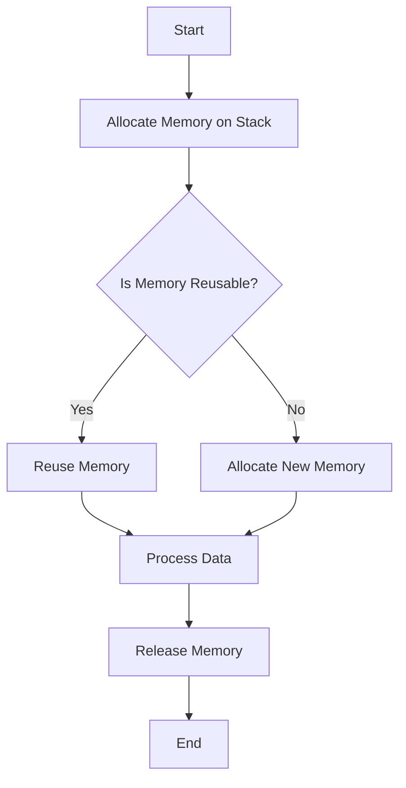

## 15.4 Avoiding Unnecessary Allocations

In the realm of systems programming, especially when using the D programming language, efficient memory management is crucial for achieving high performance. Unnecessary memory allocations can lead to increased latency, reduced throughput, and overall inefficiencies in software systems. In this section, we will explore strategies to avoid unnecessary allocations, focusing on techniques that leverage D's unique features to optimize performance in demanding applications such as high-frequency trading and real-time simulations.

### Allocations and Performance

#### Allocation Costs

Memory allocation is a fundamental operation in programming, but it comes with costs that can impact performance. Understanding these costs is the first step in optimizing memory usage:

- **Time Overhead**: Allocating memory on the heap is generally slower than using stack memory due to the need for dynamic memory management. This can introduce latency, especially in performance-critical applications.
- **Fragmentation**: Frequent allocations and deallocations can lead to memory fragmentation, which reduces the efficiency of memory usage and can increase the time required for future allocations.
- **Garbage Collection**: In languages like D, which use garbage collection, unnecessary allocations can increase the workload of the garbage collector, leading to pauses and reduced application responsiveness.

By minimizing unnecessary allocations, we can reduce these overheads and improve the performance of our applications.

### Allocation-Free Techniques

#### Using Stack Memory

One of the most effective ways to avoid unnecessary allocations is to prefer stack memory over heap memory whenever possible. Stack allocations are faster because they involve simple pointer arithmetic and do not require complex memory management.

**Example: Using Stack Memory in D**

```d
void processData()
{
    // Allocate an array on the stack
    int[100] stackArray;
    
    // Use the stack array for computations
    foreach (i; 0 .. stackArray.length)
    {
        stackArray[i] = i * i;
    }
    
    // Stack memory is automatically reclaimed when the function exits
}
```

In this example, we allocate an array on the stack, which is automatically reclaimed when the function exits, avoiding the need for manual memory management.

#### Reusable Buffers

Another technique to reduce allocations is to reuse memory buffers where it is safe to do so. This is particularly useful in scenarios where the same memory is used repeatedly, such as in loops or iterative processes.

**Example: Reusing Buffers in D**

```d
void processMultipleDataSets(int[][] dataSets)
{
    // Reusable buffer
    int[] buffer = new int[100];
    
    foreach (dataSet; dataSets)
    {
        // Ensure the buffer is large enough
        if (buffer.length < dataSet.length)
        {
            buffer.length = dataSet.length;
        }
        
        // Process data using the buffer
        foreach (i; 0 .. dataSet.length)
        {
            buffer[i] = dataSet[i] * 2;
        }
        
        // Use the buffer for further processing
        // ...
    }
}
```

In this example, we use a buffer that is resized only when necessary, minimizing the number of allocations.

### Use Cases and Examples

#### High-Frequency Trading

In high-frequency trading (HFT), minimizing latency is critical. Every microsecond counts, and unnecessary memory allocations can introduce delays that affect trading performance.

**Strategies for HFT in D**

- **Preallocate Memory**: Allocate memory upfront and reuse it throughout the trading session.
- **Avoid Garbage Collection**: Use `@nogc` code to prevent garbage collection pauses.
- **Use Fixed-Size Structures**: Prefer fixed-size data structures that can be allocated on the stack.

**Example: Preallocating Memory for HFT**

```d
@nogc
void executeTrades()
{
    // Preallocate memory for trade data
    TradeData[1000] trades;
    
    // Process trades
    foreach (trade; trades)
    {
        // Execute trade logic
        // ...
    }
}
```

By preallocating memory and using `@nogc`, we can ensure that our trading application runs with minimal latency.

#### Games and Simulations

In games and simulations, maintaining real-time performance is essential. Frame rates must be consistent, and any delays can disrupt the user experience.

**Strategies for Games and Simulations in D**

- **Object Pools**: Use object pools to manage frequently created and destroyed objects.
- **Batch Processing**: Process data in batches to reduce the frequency of allocations.
- **Optimize Data Structures**: Use data structures that minimize memory usage and access times.

**Example: Using Object Pools in D**

```d
class GameObject
{
    // Game object properties
    // ...
}

class ObjectPool
{
    private GameObject[] pool;
    private int index;
    
    this(int size)
    {
        pool = new GameObject[size];
        foreach (i; 0 .. size)
        {
            pool[i] = new GameObject();
        }
        index = 0;
    }
    
    GameObject acquire()
    {
        if (index < pool.length)
        {
            return pool[index++];
        }
        return null; // Pool exhausted
    }
    
    void release(GameObject obj)
    {
        if (index > 0)
        {
            pool[--index] = obj;
        }
    }
}

void simulateGame()
{
    ObjectPool pool = new ObjectPool(100);
    
    // Acquire and release objects during the simulation
    GameObject obj = pool.acquire();
    // Use the object
    // ...
    pool.release(obj);
}
```

By using an object pool, we can manage game objects efficiently, reducing the need for frequent allocations and deallocations.

### Visualizing Allocation Strategies

To better understand the impact of different allocation strategies, let's visualize the process of memory allocation and reuse using a flowchart.



**Figure 1: Memory Allocation and Reuse Flowchart**

This flowchart illustrates the decision-making process for memory allocation and reuse, highlighting the importance of reusing memory where possible to avoid unnecessary allocations.

### References and Links

For further reading on memory management and performance optimization in D, consider the following resources:

- [D Programming Language Documentation](https://dlang.org/)
- [Memory Management in D](https://dlang.org/spec/garbage.html)
- [High-Performance D Programming](https://wiki.dlang.org/High_Performance_D)

### Knowledge Check

To reinforce your understanding of avoiding unnecessary allocations, consider the following questions:

- What are the primary costs associated with memory allocations?
- How can stack memory be used to reduce allocation overhead?
- What are the benefits of using reusable buffers in performance-critical applications?
- How can object pools improve performance in games and simulations?

### Embrace the Journey

Remember, optimizing memory allocations is just one aspect of performance optimization. As you continue to explore the D programming language, you'll discover many more techniques and strategies to enhance the performance and efficiency of your applications. Keep experimenting, stay curious, and enjoy the journey!

## Quiz Time!



### What is a primary cost associated with memory allocations?

- [x] Time overhead
- [ ] Increased code complexity
- [ ] Reduced readability
- [ ] Increased security risks

> **Explanation:** Memory allocations, especially on the heap, introduce time overhead due to dynamic memory management.

### How can stack memory be used to reduce allocation overhead?

- [x] By allocating memory that is automatically reclaimed
- [ ] By increasing the stack size
- [ ] By using global variables
- [ ] By avoiding function calls

> **Explanation:** Stack memory is automatically reclaimed when a function exits, reducing the need for manual memory management.

### What is a benefit of using reusable buffers?

- [x] Minimizing the number of allocations
- [ ] Increasing code complexity
- [ ] Reducing code readability
- [ ] Increasing memory usage

> **Explanation:** Reusable buffers minimize the number of allocations by reusing memory, which is efficient in performance-critical applications.

### How can object pools improve performance in games?

- [x] By managing frequently created and destroyed objects
- [ ] By increasing memory usage
- [ ] By reducing code readability
- [ ] By introducing more allocations

> **Explanation:** Object pools manage frequently created and destroyed objects efficiently, reducing the need for frequent allocations and deallocations.

### What is a strategy for high-frequency trading in D?

- [x] Preallocating memory
- [ ] Using global variables
- [ ] Increasing the heap size
- [ ] Avoiding stack memory

> **Explanation:** Preallocating memory helps minimize latency by reducing the need for dynamic memory allocations during trading.

### What is the impact of garbage collection on performance?

- [x] It can introduce pauses and reduce responsiveness
- [ ] It increases memory usage
- [ ] It improves code readability
- [ ] It enhances security

> **Explanation:** Garbage collection can introduce pauses, affecting application responsiveness, especially in real-time systems.

### What is a benefit of using fixed-size structures in D?

- [x] They can be allocated on the stack
- [ ] They increase memory usage
- [ ] They reduce code readability
- [ ] They introduce more allocations

> **Explanation:** Fixed-size structures can be allocated on the stack, which is faster and more efficient than heap allocations.

### What is a common use case for avoiding unnecessary allocations?

- [x] High-frequency trading
- [ ] Increasing code complexity
- [ ] Reducing code readability
- [ ] Enhancing security

> **Explanation:** High-frequency trading requires minimizing latency, making it a common use case for avoiding unnecessary allocations.

### What is the role of batch processing in performance optimization?

- [x] Reducing the frequency of allocations
- [ ] Increasing memory usage
- [ ] Reducing code readability
- [ ] Introducing more allocations

> **Explanation:** Batch processing reduces the frequency of allocations by processing data in batches, which is efficient in performance-critical applications.

### True or False: Using `@nogc` code can help avoid garbage collection pauses.

- [x] True
- [ ] False

> **Explanation:** Using `@nogc` code prevents garbage collection, helping avoid pauses and improving application responsiveness.


