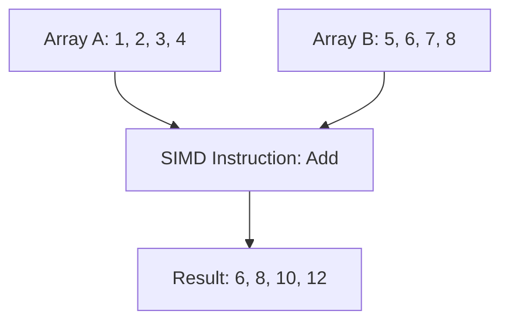
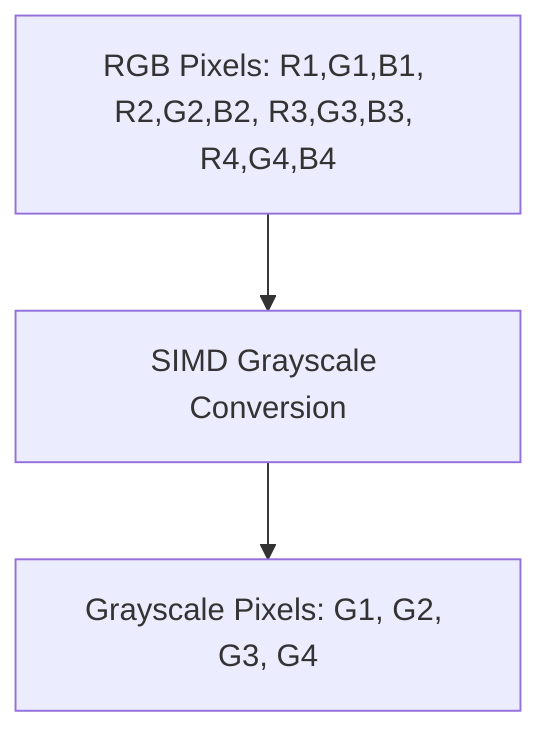

## 15.5 Leveraging SIMD and Vectorization

In the realm of high-performance computing, optimizing the execution speed of programs is paramount. One of the most effective techniques for achieving this is through the use of SIMD (Single Instruction, Multiple Data) and vectorization. In this section, we will delve into how these techniques can be leveraged in the D programming language to enhance performance, particularly in systems programming. We will explore the concepts of SIMD, how to implement it in D, and examine practical use cases such as image processing and scientific computing.

### SIMD Concepts

#### Single Instruction, Multiple Data

SIMD stands for Single Instruction, Multiple Data, a parallel computing model that allows a single instruction to be executed on multiple data points simultaneously. This is particularly useful in scenarios where the same operation needs to be performed on a large dataset, such as in image processing or numerical simulations.

**Key Benefits of SIMD:**

- **Increased Throughput:** By processing multiple data points in parallel, SIMD can significantly increase the throughput of data processing tasks.
- **Reduced Execution Time:** SIMD can reduce the execution time of loops and repetitive tasks by handling multiple operations in a single instruction cycle.
- **Efficient Resource Utilization:** SIMD makes efficient use of CPU resources by leveraging vector registers and parallel execution units.

#### Visualizing SIMD Execution

To better understand how SIMD works, let's visualize the execution of a SIMD operation using a simple example of adding two arrays:



In this diagram, a single SIMD instruction adds corresponding elements of two arrays, resulting in a new array with the summed values.

### Implementing SIMD in D

D provides several mechanisms to implement SIMD and vectorization, including intrinsic functions and compiler optimizations.

#### Intrinsic Functions

Intrinsic functions are low-level operations that map directly to machine instructions. They provide a way to access SIMD capabilities directly from the D language. Using intrinsic functions, developers can write code that explicitly utilizes SIMD instructions.

**Example of Using Intrinsic Functions in D:**

```d
import core.simd;

void addArrays(float[] a, float[] b, float[] result) {
    assert(a.length == b.length && b.length == result.length);
    foreach (i; 0 .. a.length / 4) {
        float4 va = float4(a[i * 4 .. i * 4 + 4]);
        float4 vb = float4(b[i * 4 .. i * 4 + 4]);
        float4 vr = va + vb;
        vr.store(result[i * 4 .. i * 4 + 4]);
    }
}
```

In this example, we use the `float4` type from the `core.simd` module to perform SIMD addition on arrays of floats. The `store` method writes the result back to the `result` array.

#### Auto-Vectorization

Auto-vectorization is a compiler optimization technique that automatically converts scalar operations to vector operations. The D compiler can perform auto-vectorization to optimize loops and other repetitive tasks.

**Enabling Auto-Vectorization:**

To enable auto-vectorization, you can use compiler flags that instruct the D compiler to optimize for SIMD. For example, using `-O` for optimization and `-mcpu=native` to target the native architecture can help the compiler generate vectorized code.

### Use Cases and Examples

SIMD and vectorization are particularly beneficial in domains that require processing large datasets efficiently. Let's explore two common use cases: image processing and scientific computing.

#### Image Processing

Image processing involves manipulating pixel data to achieve various effects or extract information. SIMD can accelerate these operations by processing multiple pixels simultaneously.

**Example: Grayscale Conversion**

```d
import core.simd;

void convertToGrayscale(ubyte[] image, ubyte[] grayscale) {
    assert(image.length % 3 == 0 && grayscale.length == image.length / 3);
    foreach (i; 0 .. image.length / 12) {
        ubyte4 r = ubyte4(image[i * 12 .. i * 12 + 4]);
        ubyte4 g = ubyte4(image[i * 12 + 4 .. i * 12 + 8]);
        ubyte4 b = ubyte4(image[i * 12 + 8 .. i * 12 + 12]);
        ubyte4 gray = (r * 0.3 + g * 0.59 + b * 0.11).to!ubyte4();
        gray.store(grayscale[i * 4 .. i * 4 + 4]);
    }
}
```

In this example, we convert an RGB image to grayscale using SIMD instructions. Each set of four pixels is processed in parallel, significantly speeding up the conversion process.

#### Scientific Computing

Scientific computing often involves complex mathematical computations on large datasets. SIMD can be used to accelerate these computations by performing operations on multiple data points simultaneously.

**Example: Vector Dot Product**

```d
import core.simd;

float dotProduct(float[] a, float[] b) {
    assert(a.length == b.length);
    float4 sum = float4(0.0);
    foreach (i; 0 .. a.length / 4) {
        float4 va = float4(a[i * 4 .. i * 4 + 4]);
        float4 vb = float4(b[i * 4 .. i * 4 + 4]);
        sum += va * vb;
    }
    return sum[0] + sum[1] + sum[2] + sum[3];
}
```

This example demonstrates the use of SIMD to compute the dot product of two vectors. By processing four elements at a time, we achieve a significant performance boost.

### Try It Yourself

To deepen your understanding of SIMD and vectorization in D, try modifying the code examples provided:

- **Experiment with Different Data Types:** Modify the examples to work with different data types, such as integers or doubles.
- **Implement Additional Image Processing Operations:** Extend the grayscale conversion example to include other operations like blurring or edge detection.
- **Optimize Existing Code:** Take a piece of code from your projects and attempt to optimize it using SIMD and vectorization techniques.

### Visualizing SIMD in Image Processing

Let's visualize the SIMD process in the grayscale conversion example:



This diagram illustrates how four sets of RGB pixels are converted to grayscale in parallel using SIMD instructions.

### References and Links

- [D Language Specification](https://dlang.org/spec/spec.html)
- [SIMD Intrinsics in D](https://dlang.org/phobos/core_simd.html)
- [Auto-Vectorization Techniques](https://gcc.gnu.org/projects/tree-ssa/vectorization.html)

### Knowledge Check

- **What is SIMD and how does it differ from traditional scalar processing?**
- **How can intrinsic functions be used to implement SIMD in D?**
- **What are some practical use cases for SIMD in systems programming?**

### Embrace the Journey

Remember, mastering SIMD and vectorization is a journey. As you experiment with these techniques, you'll uncover new ways to optimize your code and improve performance. Keep exploring, stay curious, and enjoy the process of learning and applying these powerful optimization strategies.

## Quiz Time!



### What does SIMD stand for?

- [x] Single Instruction, Multiple Data
- [ ] Single Instruction, Multiple Devices
- [ ] Single Instruction, Multiple Directions
- [ ] Single Instruction, Multiple Dimensions

> **Explanation:** SIMD stands for Single Instruction, Multiple Data, which allows a single instruction to operate on multiple data points simultaneously.

### Which module in D provides SIMD support?

- [x] core.simd
- [ ] std.parallelism
- [ ] std.concurrency
- [ ] core.memory

> **Explanation:** The `core.simd` module in D provides support for SIMD operations.

### What is the primary benefit of using SIMD?

- [x] Increased throughput by processing multiple data points in parallel
- [ ] Reduced memory usage
- [ ] Simplified code structure
- [ ] Enhanced security

> **Explanation:** SIMD increases throughput by allowing parallel processing of multiple data points, which reduces execution time for repetitive tasks.

### How can you enable auto-vectorization in D?

- [x] Use compiler flags like `-O` and `-mcpu=native`
- [ ] Use the `@vectorize` attribute
- [ ] Enable it in the D language settings
- [ ] Use a special vectorization library

> **Explanation:** Auto-vectorization can be enabled by using compiler flags such as `-O` for optimization and `-mcpu=native` to target the native architecture.

### Which of the following is a use case for SIMD?

- [x] Image processing
- [ ] Text parsing
- [ ] Network communication
- [ ] File I/O

> **Explanation:** SIMD is particularly useful in image processing, where operations can be performed on multiple pixels simultaneously.

### What is the role of intrinsic functions in SIMD?

- [x] They map directly to machine instructions for SIMD operations
- [ ] They provide high-level abstractions for parallel computing
- [ ] They simplify memory management
- [ ] They enhance error handling

> **Explanation:** Intrinsic functions provide a way to access SIMD capabilities directly by mapping to machine instructions.

### In the provided grayscale conversion example, how many pixels are processed in parallel?

- [x] Four
- [ ] Two
- [ ] Eight
- [ ] Sixteen

> **Explanation:** The example processes four pixels in parallel using SIMD instructions.

### What is the purpose of the `store` method in the SIMD examples?

- [x] To write the SIMD operation results back to an array
- [ ] To allocate memory for SIMD operations
- [ ] To initialize SIMD registers
- [ ] To synchronize SIMD threads

> **Explanation:** The `store` method writes the results of SIMD operations back to the specified array.

### What is a potential challenge when using SIMD?

- [x] Ensuring data alignment for vector operations
- [ ] Increasing memory usage
- [ ] Simplifying code logic
- [ ] Reducing code execution speed

> **Explanation:** Ensuring data alignment is crucial for efficient SIMD operations, as misaligned data can lead to performance penalties.

### True or False: SIMD can only be used for floating-point operations.

- [ ] True
- [x] False

> **Explanation:** SIMD can be used for various data types, including integers and floating-point numbers, depending on the specific SIMD instructions available.


