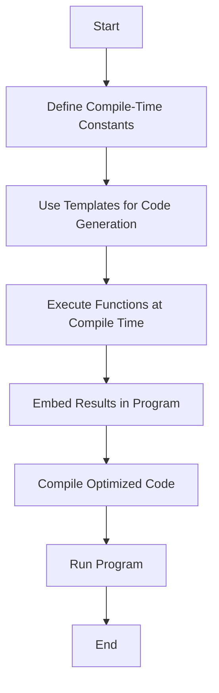

## 15.6 Optimizing with Compile-Time Techniques

In the realm of high-performance systems programming, compile-time techniques offer a powerful means to optimize code by shifting computations from runtime to compile time. The D programming language, with its rich set of features like templates and Compile-Time Function Execution (CTFE), provides a robust framework for implementing these optimizations. This section delves into the strategies and benefits of compile-time optimizations, illustrating how they can significantly enhance the performance and efficiency of your D programs.

### Understanding Compile-Time Computations

Compile-time computations involve performing calculations during the compilation phase rather than at runtime. This approach can lead to reduced runtime workload, faster execution, and more efficient use of resources. By leveraging compile-time techniques, developers can precompute values, generate code, and optimize algorithms tailored to specific use cases.

#### Reducing Runtime Workload

One of the primary advantages of compile-time computations is the reduction of runtime workload. By moving complex calculations to compile time, you can minimize the amount of work the program needs to perform during execution. This not only speeds up the program but also reduces the potential for runtime errors.

Consider a scenario where you need to compute a complex mathematical constant. Instead of recalculating it every time the program runs, you can compute it once at compile time:

```d
import std.math;

// Compile-time computation of a constant
enum double PI_SQUARED = PI * PI;

void main() {
    // Use the precomputed constant
    writeln("Pi squared is: ", PI_SQUARED);
}
```

In this example, the value of `PI_SQUARED` is computed during compilation, eliminating the need for runtime calculation.

### Templates and CTFE in D

Templates and Compile-Time Function Execution (CTFE) are two powerful features in D that facilitate compile-time optimizations.

#### Templates

Templates in D allow for generic programming, enabling code reuse and specialization. They can be used to generate code at compile time, providing a mechanism for creating efficient and type-safe abstractions.

```d
// Template to compute factorial at compile time
template Factorial(int N) {
    static if (N <= 1) {
        enum Factorial = 1;
    } else {
        enum Factorial = N * Factorial!(N - 1);
    }
}

void main() {
    // Compile-time computation of factorial
    writeln("Factorial of 5 is: ", Factorial!(5));
}
```

In this example, the `Factorial` template computes the factorial of a number at compile time, ensuring that the result is available without any runtime overhead.

#### Compile-Time Function Execution (CTFE)

CTFE allows functions to be executed during compilation, enabling complex computations to be performed ahead of time. This feature is particularly useful for generating data structures and performing algorithmic optimizations.

```d
// Function to compute Fibonacci numbers at compile time
int fibonacci(int n) {
    if (n <= 1) return n;
    return fibonacci(n - 1) + fibonacci(n - 2);
}

void main() {
    // Compile-time execution of the Fibonacci function
    enum fib10 = fibonacci(10);
    writeln("Fibonacci of 10 is: ", fib10);
}
```

Here, the `fibonacci` function is executed at compile time, allowing the result to be embedded directly into the program.

### Use Cases and Examples

Compile-time techniques can be applied in various scenarios to optimize performance and enhance code efficiency.

#### Configuration Constants

Configuration constants are values that remain unchanged throughout the program's execution. By computing these constants at compile time, you can ensure that they are optimized and readily available.

```d
// Compile-time configuration constant
enum int MAX_CONNECTIONS = 100;

void main() {
    writeln("Max connections allowed: ", MAX_CONNECTIONS);
}
```

In this example, `MAX_CONNECTIONS` is defined as a compile-time constant, ensuring that it is efficiently managed by the compiler.

#### Algorithm Specialization

Algorithm specialization involves tailoring algorithms to specific use cases, often by using templates and CTFE to generate optimized code paths.

```d
// Template for specialized sorting algorithm
template Sort(T) {
    void sort(T[] array) {
        // Simple bubble sort for demonstration
        for (size_t i = 0; i < array.length; i++) {
            for (size_t j = 0; j < array.length - 1; j++) {
                if (array[j] > array[j + 1]) {
                    auto temp = array[j];
                    array[j] = array[j + 1];
                    array[j + 1] = temp;
                }
            }
        }
    }
}

void main() {
    int[] numbers = [5, 3, 8, 1, 2];
    Sort!(int).sort(numbers);
    writeln("Sorted numbers: ", numbers);
}
```

This example demonstrates a simple sorting algorithm that can be specialized for different data types using templates.

### Visualizing Compile-Time Optimization

To better understand the flow of compile-time optimizations, let's visualize the process using a flowchart. This diagram illustrates how computations are shifted from runtime to compile time, resulting in optimized code execution.



**Figure 1: Flowchart of Compile-Time Optimization Process**

### Try It Yourself

To gain hands-on experience with compile-time techniques, try modifying the code examples provided. Experiment with different constants, templates, and functions to see how they affect the program's performance and behavior. Consider creating your own compile-time computations and observe the impact on runtime efficiency.

### References and Further Reading

For more information on compile-time techniques and optimizations in D, consider exploring the following resources:

- [D Programming Language Documentation](https://dlang.org/)
- [Compile-Time Function Execution in D](https://dlang.org/spec/function.html#ctfe)
- [Templates in D Programming](https://dlang.org/spec/template.html)

### Knowledge Check

Let's reinforce your understanding of compile-time techniques with a few questions and exercises.

1. What are the benefits of using compile-time computations in D?
2. How do templates facilitate compile-time optimizations?
3. Write a compile-time function to compute the square of a number.
4. Modify the `Factorial` template to handle negative inputs gracefully.
5. Explain how CTFE can be used to optimize data structure initialization.

### Embrace the Journey

Remember, mastering compile-time techniques is a journey. As you continue to explore and experiment with these concepts, you'll unlock new levels of performance and efficiency in your D programs. Keep pushing the boundaries, stay curious, and enjoy the process of discovery and optimization!

## Quiz Time!



### What is the primary advantage of compile-time computations?

- [x] Reducing runtime workload
- [ ] Increasing code complexity
- [ ] Enhancing runtime error handling
- [ ] Improving code readability

> **Explanation:** Compile-time computations reduce the workload during runtime by performing calculations at compile time.

### Which feature in D allows functions to be executed during compilation?

- [x] Compile-Time Function Execution (CTFE)
- [ ] Templates
- [ ] Mixins
- [ ] Metaprogramming

> **Explanation:** CTFE allows functions to be executed during the compilation phase in D.

### How do templates contribute to compile-time optimizations?

- [x] By generating code at compile time
- [ ] By simplifying runtime logic
- [ ] By enhancing error handling
- [ ] By improving code readability

> **Explanation:** Templates generate code at compile time, allowing for optimizations and specialization.

### What is a common use case for compile-time constants?

- [x] Configuration settings
- [ ] Dynamic data processing
- [ ] User input validation
- [ ] Runtime error handling

> **Explanation:** Compile-time constants are often used for configuration settings that do not change during execution.

### What is the result of executing a function at compile time?

- [x] The result is embedded in the program
- [ ] The function is skipped during runtime
- [ ] The function is executed twice
- [ ] The function is optimized for runtime

> **Explanation:** Executing a function at compile time embeds the result directly into the program.

### Which of the following is NOT a benefit of compile-time optimizations?

- [ ] Reduced runtime workload
- [ ] Faster execution
- [ ] More efficient resource use
- [x] Increased runtime flexibility

> **Explanation:** Compile-time optimizations focus on reducing workload and improving efficiency, not increasing runtime flexibility.

### What does CTFE stand for?

- [x] Compile-Time Function Execution
- [ ] Compile-Time Feature Evaluation
- [ ] Compile-Time Function Evaluation
- [ ] Compile-Time Feature Execution

> **Explanation:** CTFE stands for Compile-Time Function Execution, a feature in D for executing functions during compilation.

### How can algorithm specialization be achieved in D?

- [x] Using templates and CTFE
- [ ] Using mixins and metaprogramming
- [ ] Using runtime polymorphism
- [ ] Using dynamic typing

> **Explanation:** Algorithm specialization in D can be achieved using templates and CTFE for compile-time optimizations.

### What is the role of templates in D?

- [x] To enable generic programming and code generation
- [ ] To simplify error handling
- [ ] To enhance runtime performance
- [ ] To improve code readability

> **Explanation:** Templates in D enable generic programming and code generation, facilitating compile-time optimizations.

### True or False: Compile-time techniques can lead to runtime errors.

- [ ] True
- [x] False

> **Explanation:** Compile-time techniques aim to reduce runtime errors by performing computations and checks during compilation.


