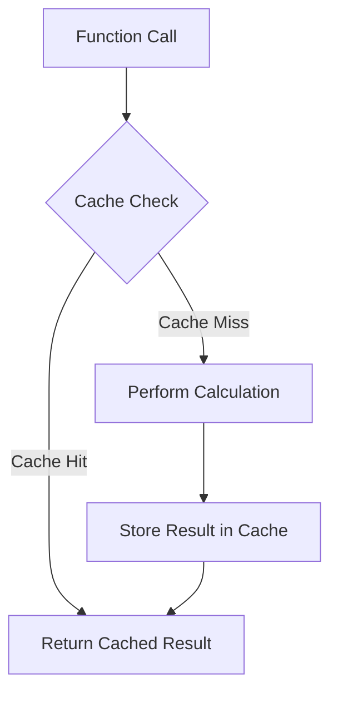

## 15.7 Caching and Memoization Patterns

In the realm of performance optimization, caching and memoization are indispensable techniques that can significantly enhance the efficiency of software systems. In this section, we will delve into the intricacies of these patterns, exploring their implementation in the D programming language. We will cover caching strategies, the concept of memoization, and practical use cases, providing you with the tools to optimize your systems effectively.

### Caching Strategies

Caching is a technique used to store copies of data in a temporary storage location, known as a cache, so that future requests for that data can be served faster. Let's explore some key caching strategies:

#### Temporal and Spatial Locality

Temporal and spatial locality are fundamental concepts in caching that exploit data access patterns to improve performance.

- **Temporal Locality**: This principle is based on the observation that if a particular piece of data is accessed, it is likely to be accessed again in the near future. By caching this data, we can reduce the time required to access it again.

- **Spatial Locality**: This principle suggests that if a particular piece of data is accessed, data located nearby in memory is likely to be accessed soon. Caching data in blocks or chunks can take advantage of this pattern.

**Example: Implementing Temporal and Spatial Locality in D**

```d
import std.stdio;
import std.datetime;
import std.algorithm;

void main() {
    // Simulate data access with temporal locality
    int[] data = [1, 2, 3, 4, 5];
    int[] cache = new int[5];
    int cacheIndex = 0;

    foreach (i; 0 .. 10) {
        int index = i % data.length;
        if (cacheIndex < cache.length) {
            cache[cacheIndex++] = data[index];
        } else {
            writeln("Cache hit: ", data[index]);
        }
    }

    // Simulate data access with spatial locality
    int[] spatialData = [10, 20, 30, 40, 50];
    foreach (i; 0 .. spatialData.length) {
        writeln("Accessing data: ", spatialData[i]);
    }
}
```

In this example, we simulate data access patterns that exhibit temporal and spatial locality. The cache is used to store recently accessed data, demonstrating how caching can reduce access times.

### Implementing Memoization

Memoization is a specific form of caching that involves storing the results of expensive function calls and returning the cached result when the same inputs occur again. This technique is particularly useful for optimizing recursive functions and complex calculations.

#### Function Result Caching

Memoization can be implemented by creating a cache that maps function inputs to their corresponding outputs. This cache is checked before performing any computation, ensuring that redundant calculations are avoided.

**Example: Memoization in D**

```d
import std.stdio;
import std.algorithm;
import std.functional;

int fibonacci(int n, int[int] cache = null) {
    if (cache is null) {
        cache = new int[n + 1];
        cache[0] = 0;
        cache[1] = 1;
    }
    if (cache[n] != 0) {
        return cache[n];
    }
    cache[n] = fibonacci(n - 1, cache) + fibonacci(n - 2, cache);
    return cache[n];
}

void main() {
    int n = 10;
    writeln("Fibonacci of ", n, " is ", fibonacci(n));
}
```

In this example, we implement memoization for the Fibonacci sequence. The `cache` array stores previously computed values, allowing us to avoid redundant calculations and significantly improve performance.

### Use Cases and Examples

Caching and memoization are applicable in a wide range of scenarios. Let's explore some practical use cases:

#### Web Applications

In web applications, caching can be used to reduce the number of database queries, improving response times and reducing server load.

**Example: Database Query Caching**

```d
import std.stdio;
import std.algorithm;
import std.container;

struct User {
    int id;
    string name;
}

User[] getUsersFromDatabase() {
    // Simulate a database query
    return [User(1, "Alice"), User(2, "Bob")];
}

User[] cacheUsers() {
    static User[] userCache;
    if (userCache.length == 0) {
        userCache = getUsersFromDatabase();
    }
    return userCache;
}

void main() {
    auto users = cacheUsers();
    foreach (user; users) {
        writeln("User: ", user.name);
    }
}
```

In this example, we cache the results of a simulated database query, reducing the need for repeated queries and improving performance.

#### Complex Calculations

Memoization is particularly useful for optimizing complex calculations, such as those found in scientific computing or graphics rendering.

**Example: Optimizing Complex Calculations**

```d
import std.stdio;
import std.algorithm;
import std.functional;

double complexCalculation(double x, double[double] cache = null) {
    if (cache is null) {
        cache = new double[double]();
    }
    if (x in cache) {
        return cache[x];
    }
    double result = x * x + 2 * x + 1; // Example calculation
    cache[x] = result;
    return result;
}

void main() {
    double x = 3.0;
    writeln("Result of complex calculation: ", complexCalculation(x));
}
```

In this example, we use memoization to cache the results of a complex calculation, avoiding redundant computations and improving efficiency.

### Visualizing Caching and Memoization

To better understand the flow of caching and memoization, let's visualize these concepts using a diagram.



**Diagram Description**: This diagram illustrates the process of memoization. When a function is called, the cache is checked for a stored result. If a cache hit occurs, the cached result is returned. Otherwise, the calculation is performed, and the result is stored in the cache for future use.

### Design Considerations

When implementing caching and memoization, consider the following:

- **Cache Size**: Determine the appropriate size for your cache to balance memory usage and performance.
- **Eviction Policies**: Implement strategies for removing old or unused cache entries, such as Least Recently Used (LRU) or First In, First Out (FIFO).
- **Concurrency**: Ensure that your caching mechanism is thread-safe if your application is concurrent.
- **Cache Invalidation**: Implement mechanisms to invalidate or update cache entries when the underlying data changes.

### Differences and Similarities

Caching and memoization are often confused, but they serve different purposes:

- **Caching**: A general technique for storing data temporarily to improve access times. It can be applied to various data types and scenarios.
- **Memoization**: A specific form of caching focused on storing function results to avoid redundant calculations.

### Try It Yourself

Experiment with the provided code examples by modifying the cache size, implementing different eviction policies, or applying memoization to other recursive functions. This hands-on approach will deepen your understanding of caching and memoization patterns.

### References and Links

- [MDN Web Docs: Caching](https://developer.mozilla.org/en-US/docs/Web/HTTP/Caching)
- [Wikipedia: Memoization](https://en.wikipedia.org/wiki/Memoization)
- [D Programming Language: Official Website](https://dlang.org/)

### Knowledge Check

- What is the difference between caching and memoization?
- How does temporal locality improve caching performance?
- What are some common cache eviction policies?
- How can memoization optimize recursive functions?

### Embrace the Journey

Remember, mastering caching and memoization is a journey. As you continue to explore these patterns, you'll discover new ways to optimize your systems and improve performance. Keep experimenting, stay curious, and enjoy the process!

## Quiz Time!



### What is the primary purpose of caching?

- [x] To store data temporarily for faster access
- [ ] To permanently store data
- [ ] To delete unused data
- [ ] To encrypt data

> **Explanation:** Caching is used to store data temporarily to improve access times.

### What principle does temporal locality rely on?

- [x] Recently accessed data is likely to be accessed again soon
- [ ] Data located nearby is likely to be accessed soon
- [ ] Data should be stored permanently
- [ ] Data should be encrypted

> **Explanation:** Temporal locality is based on the idea that recently accessed data is likely to be accessed again in the near future.

### How does memoization differ from general caching?

- [x] Memoization specifically caches function results
- [ ] Memoization caches all types of data
- [ ] Memoization is used for data encryption
- [ ] Memoization deletes unused data

> **Explanation:** Memoization is a specific form of caching that focuses on storing the results of function calls.

### What is a common use case for memoization?

- [x] Optimizing recursive functions
- [ ] Encrypting data
- [ ] Deleting unused data
- [ ] Storing data permanently

> **Explanation:** Memoization is commonly used to optimize recursive functions by avoiding redundant calculations.

### Which of the following is a cache eviction policy?

- [x] Least Recently Used (LRU)
- [ ] Most Recently Used (MRU)
- [ ] First In, Last Out (FILO)
- [ ] Random Access Memory (RAM)

> **Explanation:** Least Recently Used (LRU) is a common cache eviction policy that removes the least recently accessed items.

### What is the benefit of spatial locality in caching?

- [x] It improves performance by caching data located near recently accessed data
- [ ] It encrypts data for security
- [ ] It deletes unused data
- [ ] It stores data permanently

> **Explanation:** Spatial locality improves performance by caching data located near recently accessed data, as it is likely to be accessed soon.

### How can caching improve web application performance?

- [x] By reducing the number of database queries
- [ ] By encrypting user data
- [ ] By deleting unused files
- [ ] By storing data permanently

> **Explanation:** Caching can reduce the number of database queries, improving response times and reducing server load.

### What should be considered when implementing caching in a concurrent application?

- [x] Ensuring thread safety
- [ ] Encrypting all data
- [ ] Deleting unused data
- [ ] Storing data permanently

> **Explanation:** In a concurrent application, it's important to ensure that the caching mechanism is thread-safe.

### What is a potential downside of caching?

- [x] Increased memory usage
- [ ] Data encryption
- [ ] Permanent data storage
- [ ] Data deletion

> **Explanation:** Caching can increase memory usage, as it involves storing additional copies of data.

### True or False: Memoization can be used to optimize any type of function.

- [ ] True
- [x] False

> **Explanation:** Memoization is most effective for functions with deterministic outputs, where the same inputs always produce the same outputs.


