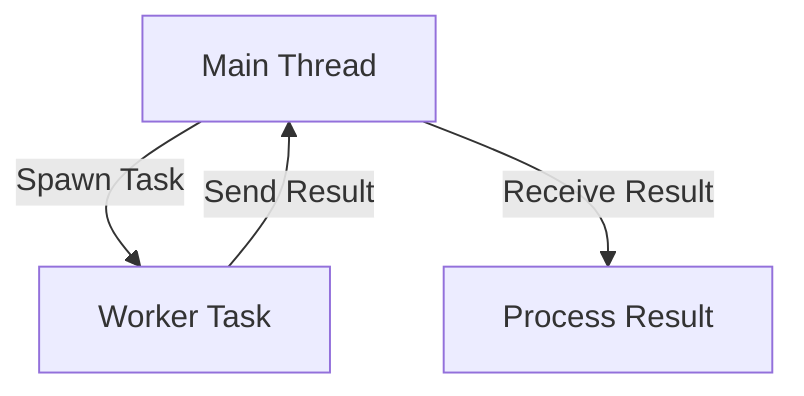
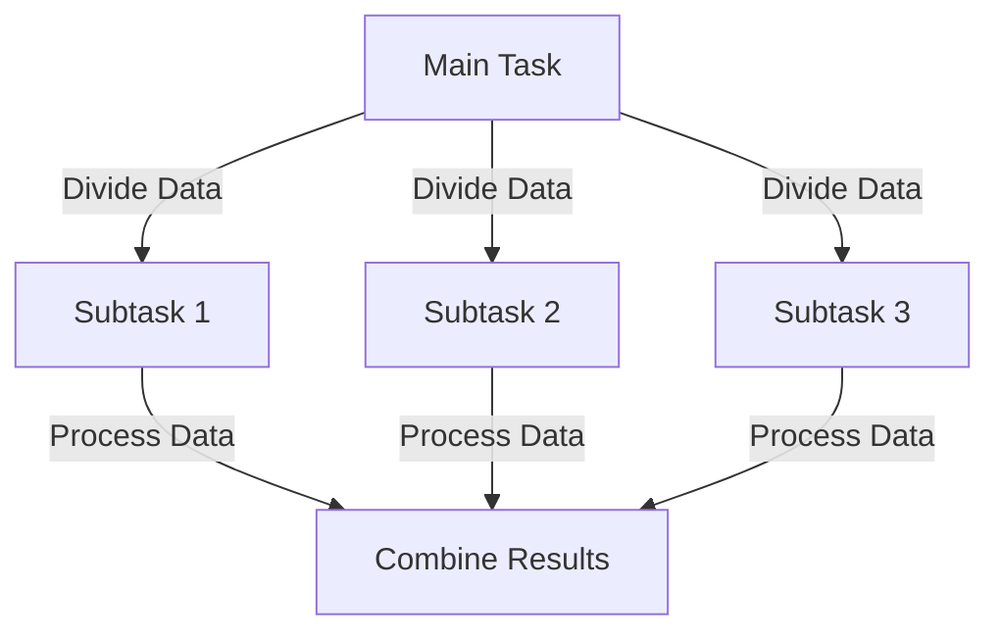

## 15.8 Asynchronous and Parallel Processing

In the realm of advanced systems programming, mastering asynchronous and parallel processing is crucial for building high-performance, scalable, and responsive software systems. The D programming language, with its rich feature set, provides powerful tools for handling concurrency, enabling developers to efficiently manage tasks and leverage parallel algorithms. In this section, we will explore the concepts of asynchronous and parallel processing, delve into concurrency models, and examine real-world use cases to illustrate how these techniques can be applied effectively in D.

### Concurrency Models

Concurrency in programming refers to the ability of a system to manage multiple tasks simultaneously, improving performance and responsiveness. D offers several concurrency models, each suited for different scenarios. Let's explore some of the key models:

#### Tasks and Futures

Tasks and futures are fundamental constructs for managing asynchronous operations. A task represents a unit of work that can be executed independently, while a future is a placeholder for the result of an asynchronous computation.

**Tasks**: In D, tasks can be created using the `std.concurrency` module, which provides a high-level abstraction for managing concurrent operations. Tasks can be executed in separate threads, allowing for parallel execution.

**Futures**: Futures are used to handle the results of asynchronous operations. They allow you to write non-blocking code by providing a way to retrieve the result of a computation once it is complete.

Here's a simple example demonstrating tasks and futures in D:

```d
import std.concurrency;
import std.stdio;

void workerFunction() {
    writeln("Task started.");
    // Simulate some work
    Thread.sleep(dur!("msecs")(500));
    writeln("Task completed.");
    send(thisTid, "Result from task");
}

void main() {
    auto task = spawn(&workerFunction);
    writeln("Main thread continues to execute.");
    
    // Wait for the task to complete and retrieve the result
    auto result = receiveOnly!string();
    writeln("Received: ", result);
}
```

In this example, the `workerFunction` is executed as a separate task using the `spawn` function. The main thread continues to execute while the task runs concurrently. Once the task is complete, the result is sent back to the main thread using a message-passing mechanism.

### Parallel Algorithms

Parallel algorithms are designed to divide a problem into smaller subproblems that can be solved concurrently, leveraging multiple processors to achieve faster execution times. D provides robust support for parallel algorithms, enabling developers to harness the power of modern multi-core processors.

#### Data Parallelism

Data parallelism involves distributing data across multiple processors and performing the same operation on each subset of data concurrently. This approach is particularly effective for tasks that involve large data sets, such as image processing or numerical simulations.

D's `std.parallelism` module offers a range of functions for implementing data parallelism. Here's an example demonstrating data parallelism using the `parallel` function:

```d
import std.parallelism;
import std.stdio;

void main() {
    auto data = [1, 2, 3, 4, 5, 6, 7, 8, 9, 10];
    
    // Apply a function to each element in parallel
    auto results = taskPool.parallel(data, (int x) => x * x);
    
    writeln("Squared values: ", results);
}
```

In this example, the `parallel` function is used to apply a lambda function to each element of the `data` array concurrently. The results are collected and printed once all computations are complete.

### Use Cases and Examples

Asynchronous and parallel processing techniques are applicable in a wide range of scenarios. Let's explore some common use cases where these techniques can significantly enhance performance and responsiveness.

#### Batch Processing

Batch processing involves handling large volumes of data in a single operation. By leveraging parallel processing, you can distribute the workload across multiple processors, reducing the time required to complete the task.

Consider a scenario where you need to process a large dataset of images. By using parallel algorithms, you can divide the dataset into smaller batches and process each batch concurrently, significantly reducing the overall processing time.

```d
import std.parallelism;
import std.stdio;

void processImage(int imageId) {
    writeln("Processing image: ", imageId);
    // Simulate image processing
    Thread.sleep(dur!("msecs")(100));
    writeln("Image ", imageId, " processed.");
}

void main() {
    auto imageIds = [1, 2, 3, 4, 5, 6, 7, 8, 9, 10];
    
    // Process images in parallel
    taskPool.parallel(imageIds, &processImage);
    
    writeln("All images processed.");
}
```

In this example, the `processImage` function is applied to each image ID in parallel, allowing multiple images to be processed simultaneously.

#### Responsive Interfaces

In user interface (UI) development, maintaining responsiveness is crucial to providing a smooth user experience. Asynchronous processing allows you to perform time-consuming operations in the background, keeping the UI responsive.

Consider a scenario where a UI needs to fetch data from a remote server. By using asynchronous operations, you can initiate the data fetch without blocking the main UI thread, allowing the user to continue interacting with the application.

```d
import std.concurrency;
import std.stdio;

void fetchData() {
    writeln("Fetching data...");
    // Simulate network delay
    Thread.sleep(dur!("secs")(2));
    writeln("Data fetched.");
    send(thisTid, "Data from server");
}

void main() {
    auto task = spawn(&fetchData);
    writeln("UI remains responsive.");
    
    // Wait for data to be fetched
    auto data = receiveOnly!string();
    writeln("Received: ", data);
}
```

In this example, the `fetchData` function is executed asynchronously, allowing the main thread to remain responsive while the data is being fetched.

### Visualizing Concurrency Models

To better understand the flow of asynchronous and parallel processing, let's visualize the concurrency models using Mermaid.js diagrams.

#### Tasks and Futures Flowchart



**Description**: This flowchart illustrates the interaction between the main thread and a worker task. The main thread spawns a task, which performs work and sends the result back to the main thread for processing.

#### Data Parallelism Diagram



**Description**: This diagram represents data parallelism, where a main task divides data into smaller chunks, each processed by a separate subtask. The results are then combined to produce the final output.

### References and Links

- [D Programming Language: Concurrency](https://dlang.org/concurrency.html)
- [Dlang Tour: Parallelism](https://tour.dlang.org/tour/en/gems/parallelism)
- [MDN Web Docs: Concurrency model and the event loop](https://developer.mozilla.org/en-US/docs/Web/JavaScript/EventLoop)

### Knowledge Check

To reinforce your understanding of asynchronous and parallel processing in D, consider the following questions and exercises:

1. Explain the difference between tasks and futures in D.
2. How can data parallelism improve the performance of batch processing tasks?
3. Modify the `processImage` example to simulate a longer processing time and observe the impact on performance.
4. Describe a scenario where asynchronous processing can enhance the responsiveness of a user interface.
5. Experiment with the `fetchData` example by introducing a delay in the main thread and observe how it affects the UI responsiveness.

### Embrace the Journey

Remember, mastering asynchronous and parallel processing is a journey. As you continue to explore these concepts, you'll discover new ways to optimize performance and responsiveness in your software systems. Keep experimenting, stay curious, and enjoy the process of building high-performance applications with D.

## Quiz Time!



### What is the primary purpose of using tasks and futures in D?

- [x] To manage asynchronous operations efficiently
- [ ] To handle synchronous operations
- [ ] To improve memory management
- [ ] To simplify error handling

> **Explanation:** Tasks and futures are used to manage asynchronous operations, allowing for non-blocking code execution.

### How does data parallelism enhance performance?

- [x] By distributing data across multiple processors
- [ ] By reducing memory usage
- [ ] By simplifying code structure
- [ ] By improving error handling

> **Explanation:** Data parallelism distributes data across multiple processors, enabling concurrent processing and faster execution.

### In the `fetchData` example, what keeps the UI responsive?

- [x] Asynchronous execution of the `fetchData` function
- [ ] Synchronous execution of the `fetchData` function
- [ ] Blocking the main thread
- [ ] Using a single-threaded model

> **Explanation:** The `fetchData` function is executed asynchronously, allowing the main thread to remain responsive.

### What module in D provides support for parallel algorithms?

- [x] `std.parallelism`
- [ ] `std.concurrency`
- [ ] `std.algorithm`
- [ ] `std.async`

> **Explanation:** The `std.parallelism` module provides functions for implementing parallel algorithms in D.

### Which concurrency model is best suited for handling large datasets?

- [x] Data parallelism
- [ ] Task parallelism
- [ ] Event-driven concurrency
- [ ] Actor model

> **Explanation:** Data parallelism is ideal for handling large datasets by distributing data across multiple processors.

### What is the role of a future in asynchronous processing?

- [x] To act as a placeholder for the result of an asynchronous computation
- [ ] To manage memory allocation
- [ ] To handle error propagation
- [ ] To simplify code readability

> **Explanation:** A future serves as a placeholder for the result of an asynchronous computation, allowing non-blocking code execution.

### How can batch processing benefit from parallel processing?

- [x] By reducing the overall processing time
- [ ] By increasing memory usage
- [ ] By simplifying code structure
- [ ] By improving error handling

> **Explanation:** Parallel processing can distribute the workload across multiple processors, reducing the overall processing time for batch tasks.

### What is the advantage of using the `spawn` function in D?

- [x] It allows tasks to be executed concurrently
- [ ] It simplifies error handling
- [ ] It improves memory management
- [ ] It enhances code readability

> **Explanation:** The `spawn` function allows tasks to be executed concurrently, enabling parallel execution.

### Which module in D is used for managing concurrent operations?

- [x] `std.concurrency`
- [ ] `std.parallelism`
- [ ] `std.algorithm`
- [ ] `std.async`

> **Explanation:** The `std.concurrency` module provides high-level abstractions for managing concurrent operations in D.

### True or False: Asynchronous processing can improve the responsiveness of user interfaces.

- [x] True
- [ ] False

> **Explanation:** Asynchronous processing allows time-consuming operations to run in the background, keeping the UI responsive.


