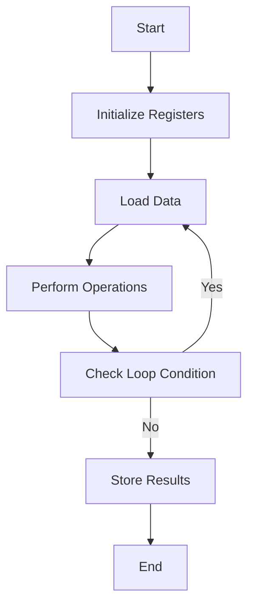

## 15.9 Low-Level Optimizations with Assembly

In the realm of systems programming, performance is often paramount. While high-level languages like D offer a plethora of features for efficient coding, there are scenarios where squeezing out every ounce of performance is necessary. This is where low-level optimizations using assembly language come into play. In this section, we will delve into how assembly can be used within D to optimize critical sections, leverage processor-specific enhancements, and explore practical use cases such as cryptography and compression.

### Understanding Inline Assembly in D

**Inline Assembly** allows developers to embed assembly language instructions directly within D code. This feature is particularly useful for optimizing performance-critical sections of code where the overhead of high-level abstractions can be avoided.

#### Critical Sections: Optimizing Performance Hotspots

Performance hotspots are sections of code where the majority of execution time is spent. Identifying and optimizing these sections can lead to significant performance improvements.

**Example: Optimizing a Loop with Inline Assembly**

Consider a scenario where we need to perform a simple arithmetic operation in a loop. Using inline assembly, we can optimize this operation:

```d
import std.stdio;

void main() {
    int result = 0;
    int iterations = 1000000;

    asm {
        mov EAX, 0; // Initialize result to 0
        mov ECX, iterations; // Set loop counter

    loop_start:
        add EAX, 1; // Increment result
        loop loop_start; // Decrement ECX and loop if not zero

        mov result, EAX; // Store the result
    }

    writeln("Result: ", result);
}
```

In this example, we use inline assembly to perform a simple addition operation in a loop. The `loop` instruction is used to efficiently decrement the counter and repeat the operation.

### Processor-Specific Enhancements

Modern CPUs come with a variety of features and instructions that can be leveraged for performance gains. These include SIMD (Single Instruction, Multiple Data) instructions, which allow for parallel processing of data.

#### Leveraging CPU Features: Utilizing Special Instructions

**Example: Using SIMD Instructions**

SIMD instructions can be used to perform operations on multiple data points simultaneously, which is particularly useful in applications such as image processing or numerical computations.

```d
import core.simd;
import std.stdio;

void main() {
    float[4] a = [1.0, 2.0, 3.0, 4.0];
    float[4] b = [5.0, 6.0, 7.0, 8.0];
    float[4] result;

    asm {
        movaps XMM0, a; // Load array a into XMM0
        movaps XMM1, b; // Load array b into XMM1
        addps XMM0, XMM1; // Add packed single-precision floating-point values
        movaps result, XMM0; // Store the result
    }

    writeln("Result: ", result);
}
```

In this example, we use SIMD instructions to add two arrays of floating-point numbers. The `addps` instruction performs the addition in parallel, resulting in a significant performance improvement over a scalar approach.

### Use Cases and Examples

Low-level optimizations with assembly are particularly beneficial in domains where performance is critical, such as cryptography and compression.

#### Cryptography: Accelerating Encryption Algorithms

Cryptographic algorithms often involve complex mathematical operations that can benefit from assembly-level optimizations.

**Example: Optimizing AES Encryption**

AES (Advanced Encryption Standard) is a widely used encryption algorithm. By using assembly, we can optimize its performance:

```d
import std.stdio;

void aesEncrypt(uint[] data, uint[] key) {
    asm {
        // Pseudocode for AES encryption using assembly
        // Load data and key into registers
        // Perform AES rounds
        // Store the encrypted data
    }
}

void main() {
    uint[] data = [0x00112233, 0x44556677, 0x8899aabb, 0xccddeeff];
    uint[] key = [0x00010203, 0x04050607, 0x08090a0b, 0x0c0d0e0f];

    aesEncrypt(data, key);
    writeln("Encrypted data: ", data);
}
```

In this example, we outline a pseudocode structure for AES encryption using assembly. The actual implementation would involve specific instructions for the AES rounds.

#### Compression: Enhancing Data Encoding Speed

Compression algorithms can also benefit from low-level optimizations, especially when dealing with large datasets.

**Example: Optimizing a Simple Compression Algorithm**

```d
import std.stdio;

void compressData(ubyte[] data) {
    asm {
        // Pseudocode for a simple compression algorithm using assembly
        // Load data into registers
        // Perform compression
        // Store the compressed data
    }
}

void main() {
    ubyte[] data = [0x01, 0x02, 0x03, 0x04, 0x05];
    compressData(data);
    writeln("Compressed data: ", data);
}
```

Here, we provide a pseudocode structure for a simple compression algorithm using assembly. The actual implementation would depend on the specific compression technique used.

### Visualizing Assembly Optimization

To better understand how assembly optimizations work, let's visualize the process of optimizing a loop using inline assembly.



**Diagram Description:** This flowchart illustrates the process of optimizing a loop using inline assembly. The loop involves initializing registers, loading data, performing operations, checking the loop condition, and storing results.

### Try It Yourself

Now that we've explored various aspects of low-level optimizations with assembly, it's time to experiment with the code examples provided. Try modifying the loop in the first example to perform a different arithmetic operation, or explore using different SIMD instructions in the second example.

### References and Further Reading

- [D Language Inline Assembly](https://dlang.org/spec/iasm.html)
- [SIMD Programming](https://en.wikipedia.org/wiki/SIMD)
- [AES Encryption](https://en.wikipedia.org/wiki/Advanced_Encryption_Standard)

### Knowledge Check

Before we conclude, let's reinforce our understanding with a few questions. Consider the following:

- What are the benefits of using inline assembly in performance-critical sections?
- How can SIMD instructions enhance performance in numerical computations?
- Why is assembly optimization particularly beneficial in cryptography and compression?

### Embrace the Journey

Remember, mastering low-level optimizations with assembly is a journey. As you continue to explore and experiment, you'll gain a deeper understanding of how to harness the full power of your hardware. Keep pushing the boundaries, stay curious, and enjoy the process of optimizing your code for maximum performance.

## Quiz Time!



### What is the primary benefit of using inline assembly in D?

- [x] Optimizing performance-critical sections
- [ ] Simplifying code readability
- [ ] Enhancing code portability
- [ ] Increasing code maintainability

> **Explanation:** Inline assembly is used to optimize performance-critical sections by allowing direct control over the CPU instructions executed.

### Which instruction set is commonly used for parallel processing in assembly?

- [ ] RISC
- [ ] CISC
- [x] SIMD
- [ ] VLIW

> **Explanation:** SIMD (Single Instruction, Multiple Data) instructions are used for parallel processing, allowing operations on multiple data points simultaneously.

### In the context of assembly, what does the `loop` instruction do?

- [x] Decrements a counter and repeats a block of code
- [ ] Increments a counter and exits a block of code
- [ ] Jumps to a specific memory address
- [ ] Loads data into a register

> **Explanation:** The `loop` instruction decrements a counter and repeats the block of code if the counter is not zero.

### What is a common use case for assembly optimization in cryptography?

- [ ] Simplifying algorithm design
- [x] Accelerating encryption algorithms
- [ ] Enhancing code readability
- [ ] Increasing algorithm complexity

> **Explanation:** Assembly optimization is used in cryptography to accelerate encryption algorithms by optimizing complex mathematical operations.

### How can SIMD instructions improve performance in numerical computations?

- [x] By performing operations on multiple data points simultaneously
- [ ] By simplifying the code structure
- [ ] By reducing the number of instructions
- [ ] By increasing memory usage

> **Explanation:** SIMD instructions improve performance by allowing operations on multiple data points simultaneously, which is beneficial in numerical computations.

### What is the role of registers in assembly language?

- [x] Storing data temporarily for fast access
- [ ] Defining data types
- [ ] Managing memory allocation
- [ ] Handling input/output operations

> **Explanation:** Registers are used in assembly language to store data temporarily for fast access during computations.

### Why is assembly optimization beneficial in compression algorithms?

- [x] It enhances data encoding speed
- [ ] It simplifies algorithm implementation
- [ ] It increases data redundancy
- [ ] It reduces memory usage

> **Explanation:** Assembly optimization enhances data encoding speed by optimizing the operations involved in compression algorithms.

### What does the `movaps` instruction do in SIMD?

- [x] Moves aligned packed single-precision floating-point values
- [ ] Moves unaligned packed integer values
- [ ] Moves scalar double-precision floating-point values
- [ ] Moves packed integer values

> **Explanation:** The `movaps` instruction moves aligned packed single-precision floating-point values in SIMD operations.

### What is the advantage of using processor-specific enhancements?

- [x] Leveraging CPU features for performance gains
- [ ] Increasing code portability
- [ ] Simplifying code maintenance
- [ ] Enhancing code readability

> **Explanation:** Processor-specific enhancements leverage CPU features for performance gains by utilizing special instructions available on modern CPUs.

### True or False: Inline assembly can be used to optimize high-level abstractions in D.

- [x] True
- [ ] False

> **Explanation:** True. Inline assembly can be used to optimize high-level abstractions by providing direct control over CPU instructions, thus improving performance in critical sections.



By mastering low-level optimizations with assembly, you can unlock the full potential of your applications, ensuring they run efficiently and effectively on modern hardware. Keep exploring and pushing the boundaries of what's possible with D and assembly!
