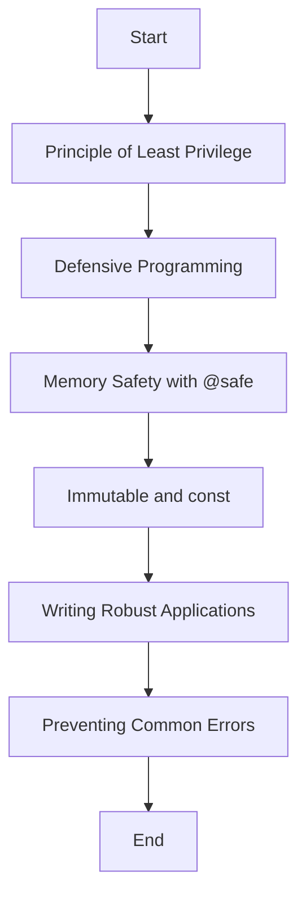

## 16.1 Secure Coding Practices in D

In the realm of systems programming, security is paramount. The D programming language offers a suite of features that, when used correctly, can significantly enhance the security of your software. This section will delve into secure coding practices in D, focusing on principles such as the Principle of Least Privilege, defensive programming, and leveraging D's language features like memory safety and immutability. We will also explore use cases and examples to illustrate how these practices can be applied to build robust and secure applications.

### Fundamentals of Security

#### Principle of Least Privilege

The Principle of Least Privilege (PoLP) is a fundamental security concept that involves granting only the necessary permissions to users and processes to perform their tasks. This minimizes the potential damage from accidents or malicious actions.

- **Implementation in D**: Ensure that your D applications run with the least privileges necessary. For instance, if a function only needs read access to a file, do not grant it write permissions.

```d
import std.stdio;

void readFile(string filename) {
    // Open the file in read-only mode
    File file = File(filename, "r");
    // Process the file
    writeln(file.readln());
}
```

In this example, the file is opened in read-only mode, adhering to the PoLP by not allowing write operations.

#### Defensive Programming

Defensive programming is about anticipating potential misuse and coding in a way that prevents it. This involves validating inputs, handling exceptions gracefully, and ensuring that your code can withstand unexpected conditions.

- **Input Validation**: Always validate inputs to prevent injection attacks and other vulnerabilities.

```d
import std.stdio;
import std.conv;

void processInput(string input) {
    try {
        int value = to!int(input);
        writeln("Processed value: ", value);
    } catch (Exception e) {
        writeln("Invalid input: ", e.msg);
    }
}
```

Here, we convert a string input to an integer, catching exceptions to handle invalid inputs gracefully.

### Language Features for Security

#### Memory Safety

Memory safety is crucial in preventing vulnerabilities such as buffer overflows and null pointer dereferences. D provides the `@safe` attribute to enforce memory safety.

- **Using `@safe`**: Mark functions with `@safe` to ensure they do not perform unsafe operations.

```d
@safe void safeFunction() {
    int[] array = [1, 2, 3];
    writeln(array[0]); // Safe access
}
```

In this function, `@safe` ensures that operations like array access are checked for safety.

#### Immutable and `const`

Using `immutable` and `const` in D can prevent unintended modifications to data, enhancing security by ensuring data integrity.

- **Immutable Data**: Declare data as `immutable` to prevent any changes after initialization.

```d
immutable int constantValue = 42;

void displayValue() {
    writeln("Constant value: ", constantValue);
}
```

The `constantValue` is immutable, ensuring it cannot be altered, which is useful for sensitive data.

### Use Cases and Examples

#### Writing Robust Applications

Building robust applications involves writing code that is resilient to attacks and unexpected conditions. This includes using D's features to enforce security and prevent common errors.

- **Preventing Buffer Overflows**: Use D's array bounds checking to prevent buffer overflows.

```d
void processArray(int[] data) {
    foreach (i, value; data) {
        writeln("Value at index ", i, ": ", value);
    }
}
```

D's array bounds checking ensures that accessing elements outside the array's bounds will result in a runtime error, preventing buffer overflows.

#### Preventing Common Errors

Avoiding common errors such as null pointer dereferences is critical for secure coding. D provides tools to help prevent these issues.

- **Null Pointer Checks**: Always check for null pointers before dereferencing.

```d
void processPointer(int* ptr) {
    if (ptr !is null) {
        writeln("Pointer value: ", *ptr);
    } else {
        writeln("Pointer is null");
    }
}
```

By checking for null, we prevent dereferencing a null pointer, which could lead to crashes or vulnerabilities.

### Visualizing Secure Coding Practices

To better understand how these practices fit together, let's visualize the flow of secure coding practices in D using a flowchart.



This flowchart illustrates the progression from fundamental security principles to specific language features and their application in writing secure code.

### References and Links

- [D Programming Language Documentation](https://dlang.org/)
- [OWASP Secure Coding Practices](https://owasp.org/www-project-secure-coding-practices-quick-reference-guide/)
- [Memory Safety in D](https://dlang.org/spec/memory-safe-d.html)

### Knowledge Check

- **Question**: What is the Principle of Least Privilege, and how can it be applied in D?
- **Exercise**: Modify the `processInput` function to handle additional types of input errors.

### Embrace the Journey

Remember, secure coding is an ongoing journey. As you continue to develop in D, keep exploring new ways to enhance security and stay updated with the latest practices. Keep experimenting, stay curious, and enjoy the journey!

## Quiz Time!



### What is the Principle of Least Privilege?

- [x] Minimizing access rights for users and processes
- [ ] Granting maximum permissions to all users
- [ ] Allowing unrestricted access to system resources
- [ ] Disabling all security features

> **Explanation:** The Principle of Least Privilege involves granting only the necessary permissions to users and processes to minimize potential damage.

### How does D ensure memory safety?

- [x] Using the `@safe` attribute
- [ ] Allowing unrestricted pointer arithmetic
- [ ] Disabling array bounds checking
- [ ] Ignoring null pointer dereferences

> **Explanation:** D uses the `@safe` attribute to enforce memory safety by preventing unsafe operations.

### What is the purpose of defensive programming?

- [x] Anticipating potential misuse and coding defensively
- [ ] Writing code without error handling
- [ ] Allowing all inputs without validation
- [ ] Disabling exception handling

> **Explanation:** Defensive programming involves anticipating potential misuse and coding in a way that prevents it, such as validating inputs and handling exceptions.

### How can you prevent buffer overflows in D?

- [x] Using array bounds checking
- [ ] Allowing unrestricted array access
- [ ] Disabling runtime checks
- [ ] Ignoring array size limits

> **Explanation:** D's array bounds checking ensures that accessing elements outside the array's bounds will result in a runtime error, preventing buffer overflows.

### What is the benefit of using `immutable` in D?

- [x] Preventing unintended modifications to data
- [ ] Allowing data to be changed at any time
- [ ] Disabling data integrity checks
- [ ] Ignoring data consistency

> **Explanation:** Using `immutable` in D prevents any changes to data after initialization, ensuring data integrity.

### What should you do before dereferencing a pointer in D?

- [x] Check for null
- [ ] Dereference immediately
- [ ] Ignore null checks
- [ ] Disable pointer validation

> **Explanation:** Always check for null pointers before dereferencing to prevent crashes or vulnerabilities.

### How can you handle invalid inputs in D?

- [x] Using exception handling
- [ ] Ignoring input validation
- [ ] Allowing all inputs without checks
- [ ] Disabling error messages

> **Explanation:** Use exception handling to catch and handle invalid inputs gracefully.

### What is the role of `const` in D?

- [x] Preventing modifications to data
- [ ] Allowing unrestricted data changes
- [ ] Disabling data validation
- [ ] Ignoring data consistency

> **Explanation:** `const` in D prevents modifications to data, ensuring data consistency.

### What is a common error to avoid in secure coding?

- [x] Null pointer dereferences
- [ ] Validating all inputs
- [ ] Using `@safe` code
- [ ] Checking for null pointers

> **Explanation:** Null pointer dereferences can lead to crashes or vulnerabilities, so they should be avoided.

### True or False: Secure coding is a one-time task.

- [ ] True
- [x] False

> **Explanation:** Secure coding is an ongoing journey that requires continuous learning and adaptation to new threats and practices.



By following these secure coding practices in D, you can build robust, secure applications that are resilient to attacks and vulnerabilities. Keep these principles in mind as you continue your journey in mastering design patterns and systems programming in D.
