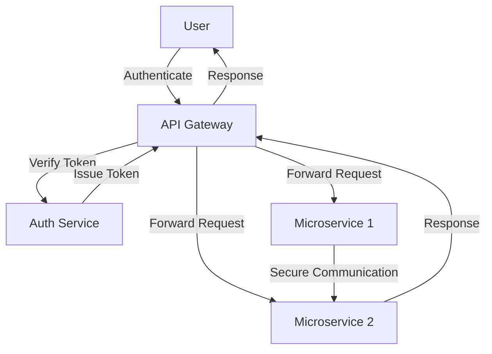

## 16.10 Security in Distributed Systems

In the realm of distributed systems, security is a paramount concern. As systems become more interconnected, the complexity of securing them increases. This section delves into the security challenges faced in distributed systems, explores trust models like Zero Trust Architecture, and provides practical use cases and examples, particularly focusing on microservices and cloud security. We will leverage the D programming language's unique features to address these challenges effectively.

### Distributed Security Challenges

Distributed systems present unique security challenges due to their inherent complexity and the need for components to communicate over potentially insecure networks. Let's explore some of these challenges:

#### Data Consistency

Ensuring data consistency across multiple systems is crucial for maintaining security. In distributed environments, data is often replicated across different nodes, which can lead to inconsistencies if not managed properly. Security measures must ensure that data remains consistent and tamper-proof across all nodes.

- **Challenge**: How do we ensure that data remains consistent and secure across distributed nodes?
- **Solution**: Implement cryptographic techniques such as hashing and digital signatures to verify data integrity. Use consensus algorithms like Paxos or Raft to maintain consistency across nodes.

#### Secure Communication

Protecting data in transit between services is essential to prevent unauthorized access and data breaches. In distributed systems, data often travels over public networks, making it vulnerable to interception.

- **Challenge**: How do we secure data as it moves between distributed components?
- **Solution**: Use encryption protocols such as TLS (Transport Layer Security) to encrypt data in transit. Implement mutual authentication to ensure both parties in a communication are verified.

### Trust Models

Trust models define how trust is established and maintained in a distributed system. One of the most effective models for modern distributed systems is the Zero Trust Architecture.

#### Zero Trust Architecture

Zero Trust Architecture operates on the principle of "never trust, always verify." It requires strict identity verification for every person and device trying to access resources on a private network, regardless of whether they are inside or outside the network perimeter.

- **Key Principles**:
  - **Authenticate Every Request**: Every access request should be authenticated and authorized.
  - **Least Privilege Access**: Users and devices should only have access to the resources necessary for their function.
  - **Micro-Segmentation**: Divide the network into smaller segments to limit the spread of potential breaches.

### Use Cases and Examples

Let's explore some practical use cases and examples of security in distributed systems, focusing on microservices and cloud security.

#### Microservices Security

Microservices architecture breaks down applications into smaller, independent services. While this offers flexibility and scalability, it also introduces security challenges.

- **Authentication and Authorization**: Implement OAuth2 or OpenID Connect for secure authentication and authorization across services.
- **Service-to-Service Communication**: Use mutual TLS to secure communication between microservices.
- **API Gateway**: Deploy an API gateway to manage and secure API requests, providing a single entry point for all services.

**Example Code: Securing Microservices with OAuth2**

```d
import std.stdio;
import std.net.curl;

void main() {
    // Example of using OAuth2 for authentication
    string token = getOAuth2Token("client_id", "client_secret", "auth_url");
    if (token.length > 0) {
        writeln("Successfully authenticated with token: ", token);
    } else {
        writeln("Authentication failed.");
    }
}

string getOAuth2Token(string clientId, string clientSecret, string authUrl) {
    // Simulate an OAuth2 token request
    auto response = HTTP("POST", authUrl, [
        "client_id": clientId,
        "client_secret": clientSecret,
        "grant_type": "client_credentials"
    ]);
    // Parse and return the token from the response
    return response.body; // Simplified for illustration
}
```

#### Cloud Security

Cloud environments offer scalability and flexibility but also introduce unique security challenges. Protecting assets in the cloud requires a comprehensive approach.

- **Data Encryption**: Encrypt data at rest and in transit using strong encryption algorithms.
- **Identity and Access Management (IAM)**: Implement robust IAM policies to control access to cloud resources.
- **Security Monitoring**: Use cloud-native security tools to monitor and respond to security incidents in real-time.

**Example Code: Encrypting Data in the Cloud**

```d
import std.stdio;
import std.digest.md;

void main() {
    string data = "Sensitive data to encrypt";
    string encryptedData = encryptData(data);
    writeln("Encrypted data: ", encryptedData);
}

string encryptData(string data) {
    // Use a simple hash function for illustration (not secure for real encryption)
    auto hash = md5Of(data);
    return hash.toHexString();
}
```

### Visualizing Security in Distributed Systems

To better understand the flow of security in distributed systems, let's visualize a typical architecture using a Zero Trust model.



**Diagram Description**: This diagram illustrates a Zero Trust architecture for a microservices-based application. The user authenticates through an API Gateway, which verifies the token with an Auth Service. The API Gateway then forwards requests to the appropriate microservices, ensuring secure communication between them.

### Knowledge Check

Before we conclude, let's reinforce our understanding with a few questions:

- What are the key challenges in securing distributed systems?
- How does Zero Trust Architecture enhance security in distributed environments?
- What are some best practices for securing microservices and cloud environments?

### Try It Yourself

Experiment with the code examples provided. Try modifying the OAuth2 authentication example to handle different grant types or implement a more secure encryption algorithm in the cloud security example. This hands-on practice will deepen your understanding of securing distributed systems.

### Embrace the Journey

Remember, mastering security in distributed systems is an ongoing journey. As you continue to explore and implement these concepts, you'll build more robust and secure applications. Stay curious, keep experimenting, and enjoy the process!

## Quiz Time!



### What is a key challenge in securing distributed systems?

- [x] Ensuring data consistency across nodes
- [ ] Implementing a single point of failure
- [ ] Reducing network latency
- [ ] Increasing system complexity

> **Explanation:** Ensuring data consistency across nodes is crucial for maintaining security in distributed systems.

### What does Zero Trust Architecture emphasize?

- [x] Authenticating every request
- [ ] Trusting internal network traffic
- [ ] Allowing unrestricted access
- [ ] Reducing authentication steps

> **Explanation:** Zero Trust Architecture emphasizes authenticating every request, regardless of its origin.

### Which protocol is commonly used to secure data in transit?

- [x] TLS (Transport Layer Security)
- [ ] FTP (File Transfer Protocol)
- [ ] HTTP (Hypertext Transfer Protocol)
- [ ] SMTP (Simple Mail Transfer Protocol)

> **Explanation:** TLS is commonly used to encrypt data in transit, ensuring secure communication.

### What is a benefit of using an API Gateway in microservices architecture?

- [x] Managing and securing API requests
- [ ] Increasing latency
- [ ] Reducing scalability
- [ ] Simplifying service discovery

> **Explanation:** An API Gateway manages and secures API requests, providing a single entry point for services.

### How can data be protected in cloud environments?

- [x] Encrypting data at rest and in transit
- [ ] Allowing unrestricted access
- [ ] Disabling security monitoring
- [ ] Using weak encryption algorithms

> **Explanation:** Encrypting data at rest and in transit is essential for protecting assets in cloud environments.

### What is a principle of Zero Trust Architecture?

- [x] Least Privilege Access
- [ ] Trusting all internal users
- [ ] Allowing unrestricted network access
- [ ] Disabling authentication

> **Explanation:** Least Privilege Access ensures users and devices only have access to necessary resources.

### What is a common method for securing service-to-service communication?

- [x] Mutual TLS
- [ ] Plain HTTP
- [ ] FTP
- [ ] SMTP

> **Explanation:** Mutual TLS is used to secure communication between microservices by verifying both parties.

### What is the role of Identity and Access Management (IAM) in cloud security?

- [x] Controlling access to cloud resources
- [ ] Increasing network latency
- [ ] Reducing encryption strength
- [ ] Disabling security features

> **Explanation:** IAM controls access to cloud resources, ensuring only authorized users can access them.

### What is a key feature of micro-segmentation in Zero Trust Architecture?

- [x] Dividing the network into smaller segments
- [ ] Allowing unrestricted access
- [ ] Increasing network complexity
- [ ] Reducing authentication steps

> **Explanation:** Micro-segmentation divides the network into smaller segments to limit the spread of breaches.

### True or False: Zero Trust Architecture allows unrestricted access to internal network traffic.

- [ ] True
- [x] False

> **Explanation:** Zero Trust Architecture does not allow unrestricted access; it requires strict verification for all access requests.


