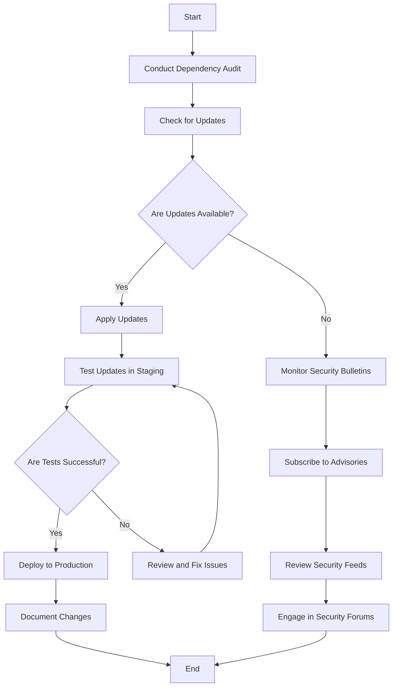

## 16.11 Keeping Up with Security Updates and Patches

In the realm of advanced systems programming, maintaining the security of your software is paramount. As expert software engineers and architects, it is crucial to stay vigilant and proactive in managing security updates and patches. This section will guide you through the essential practices for keeping your systems secure, focusing on dependency management, patch management, and monitoring security bulletins. We'll also explore use cases and examples to illustrate these concepts in action.

### Dependency Management

#### Updating Libraries

In modern software development, leveraging third-party libraries is a common practice to accelerate development and enhance functionality. However, these dependencies can introduce vulnerabilities if not managed properly. Here's how to ensure your libraries are up-to-date and secure:

1. **Regular Audits**: Conduct regular audits of your project's dependencies. Use tools like `dub` in D to list and manage dependencies. Regularly check for updates and security advisories related to these libraries.

2. **Version Control**: Use semantic versioning to understand the impact of updates. Major version changes might introduce breaking changes, while minor and patch updates typically include bug fixes and security patches.

3. **Automated Tools**: Employ automated tools such as Dependabot or Snyk to monitor your dependencies for vulnerabilities and suggest updates. These tools can integrate with your CI/CD pipeline to ensure continuous monitoring.

4. **Manual Review**: Even with automated tools, manual review of critical libraries is essential. Evaluate the change logs and commit history of libraries to understand the nature of updates.

5. **Community Engagement**: Engage with the community around the libraries you use. Participate in forums, mailing lists, or GitHub discussions to stay informed about potential issues and upcoming releases.

#### Code Example: Managing Dependencies with Dub

```d
// dub.json example for managing dependencies
{
    "name": "myproject",
    "dependencies": {
        "vibe-d": "~>0.9.3",
        "openssl": "~>1.1.6"
    }
}

// Command to update dependencies
// Run this command in your terminal to update dependencies
dub upgrade
```

### Patch Management

#### Timely Updates

Applying security patches promptly is critical to safeguarding your systems against known vulnerabilities. Here's a structured approach to effective patch management:

1. **Patch Policy**: Establish a patch management policy that outlines the frequency and process for applying patches. This policy should include testing procedures to ensure patches do not disrupt existing functionality.

2. **Prioritization**: Prioritize patches based on the severity of vulnerabilities and the criticality of affected systems. Use CVSS scores to assess the impact and urgency of patches.

3. **Testing Environment**: Maintain a staging environment to test patches before deploying them to production. This helps identify potential issues and ensures compatibility with your existing systems.

4. **Automated Deployment**: Use automation tools like Ansible or Puppet to streamline the deployment of patches across your infrastructure. Automation reduces the risk of human error and accelerates the patching process.

5. **Documentation**: Keep detailed records of applied patches, including the date, affected systems, and any issues encountered. This documentation is invaluable for audits and troubleshooting.

#### Code Example: Automating Patch Deployment

```bash
---
- name: Apply security patches
  hosts: all
  tasks:
    - name: Update package manager cache
      apt:
        update_cache: yes

    - name: Upgrade all packages
      apt:
        upgrade: dist
```

### Monitoring Security Bulletins

#### Community and Vendor Advisories

Staying informed about new threats and vulnerabilities is essential for proactive security management. Here's how to effectively monitor security bulletins:

1. **Subscribe to Advisories**: Subscribe to security advisories from vendors and relevant communities. This includes mailing lists, RSS feeds, and social media channels.

2. **Security Feeds**: Use security feeds like CVE Details or NVD to receive real-time updates on vulnerabilities. These platforms provide detailed information about vulnerabilities, including affected products and mitigation strategies.

3. **Security Forums**: Participate in security forums and discussion groups. Engaging with the community can provide insights into emerging threats and best practices for mitigation.

4. **Vendor Communication**: Maintain open communication with vendors for proprietary software. Vendors often provide patches and updates for their products, and staying informed ensures timely application.

5. **Internal Alerts**: Set up internal alert systems to notify your team of critical security updates. This can be integrated with your incident response plan to ensure swift action.

### Use Cases and Examples

#### Continuous Maintenance

Integrating updates into regular workflows ensures that security is a continuous process rather than a reactive measure. Here's how to achieve continuous maintenance:

1. **CI/CD Integration**: Integrate security checks into your CI/CD pipeline. This includes automated testing of dependencies and patches to ensure they do not introduce vulnerabilities.

2. **Regular Reviews**: Schedule regular security reviews to assess the effectiveness of your security measures. This includes reviewing patch management processes and dependency updates.

3. **Training and Awareness**: Conduct regular training sessions for your team to keep them informed about the latest security practices and threats. Awareness is key to maintaining a security-first mindset.

#### Risk Mitigation

Reducing exposure to known vulnerabilities is a critical aspect of risk mitigation. Here's how to effectively mitigate risks:

1. **Threat Modeling**: Conduct threat modeling exercises to identify potential vulnerabilities in your systems. This helps prioritize security efforts and focus on high-risk areas.

2. **Access Controls**: Implement strict access controls to limit exposure to vulnerabilities. This includes role-based access control (RBAC) and the principle of least privilege.

3. **Incident Response**: Develop and maintain an incident response plan to quickly address security breaches. This includes identifying key personnel, communication protocols, and recovery procedures.

4. **Regular Audits**: Conduct regular security audits to identify and address vulnerabilities. This includes code reviews, penetration testing, and vulnerability scanning.

### Visualizing the Process

To better understand the process of keeping up with security updates and patches, let's visualize the workflow using a flowchart.



### References and Links

- [OWASP Dependency-Check](https://owasp.org/www-project-dependency-check/): A tool for identifying project dependencies and checking for known vulnerabilities.
- [NVD - National Vulnerability Database](https://nvd.nist.gov/): A comprehensive source of vulnerability information.
- [CVE Details](https://www.cvedetails.com/): A platform for tracking vulnerabilities by CVE identifiers.

### Knowledge Check

To reinforce your understanding of keeping up with security updates and patches, consider the following questions and challenges:

- How can you automate the process of checking for dependency updates in your D projects?
- What are the key components of an effective patch management policy?
- How can you integrate security monitoring into your existing workflows?

### Embrace the Journey

Remember, maintaining secure software systems is an ongoing journey. By staying informed and proactive, you can protect your systems from emerging threats and vulnerabilities. Keep experimenting with new tools and techniques, stay curious, and enjoy the journey of mastering security in systems programming.

## Quiz Time!



### What is the primary purpose of conducting regular audits of project dependencies?

- [x] To identify outdated or vulnerable libraries
- [ ] To increase the number of dependencies
- [ ] To reduce the project's codebase
- [ ] To improve code readability

> **Explanation:** Regular audits help identify outdated or vulnerable libraries that may pose security risks.

### Which tool can be used to automate the monitoring of dependencies for vulnerabilities?

- [x] Dependabot
- [ ] GitHub Actions
- [ ] Docker
- [ ] Jenkins

> **Explanation:** Dependabot is a tool that automates the monitoring of dependencies for vulnerabilities and suggests updates.

### What is the role of a staging environment in patch management?

- [x] To test patches before deploying them to production
- [ ] To store backup copies of patches
- [ ] To deploy patches directly to users
- [ ] To automate the patching process

> **Explanation:** A staging environment is used to test patches before deploying them to production to ensure compatibility and stability.

### Why is it important to prioritize patches based on CVSS scores?

- [x] To assess the impact and urgency of patches
- [ ] To determine the cost of patches
- [ ] To decide which patches to ignore
- [ ] To automate the patching process

> **Explanation:** CVSS scores help assess the impact and urgency of patches, allowing for effective prioritization.

### What is a key benefit of integrating security checks into a CI/CD pipeline?

- [x] Ensures continuous monitoring and testing of security measures
- [ ] Reduces the need for manual testing
- [x] Automates the deployment of security patches
- [ ] Increases the complexity of the pipeline

> **Explanation:** Integrating security checks into a CI/CD pipeline ensures continuous monitoring and testing of security measures and automates the deployment of security patches.

### How can engaging with the community around a library help in dependency management?

- [x] Provides insights into potential issues and upcoming releases
- [ ] Increases the number of contributors to the library
- [ ] Reduces the need for documentation
- [ ] Automates the update process

> **Explanation:** Engaging with the community provides insights into potential issues and upcoming releases, aiding in effective dependency management.

### What is the purpose of maintaining detailed records of applied patches?

- [x] For audits and troubleshooting
- [ ] To increase the number of patches applied
- [x] To reduce the need for future patches
- [ ] To automate the patching process

> **Explanation:** Maintaining detailed records of applied patches is important for audits and troubleshooting.

### Which of the following is a benefit of using automated tools for patch deployment?

- [x] Reduces the risk of human error
- [ ] Increases the complexity of the deployment process
- [ ] Decreases the speed of deployment
- [ ] Eliminates the need for testing

> **Explanation:** Automated tools for patch deployment reduce the risk of human error and accelerate the patching process.

### What is the principle of least privilege?

- [x] Limiting access to only what is necessary for users
- [ ] Granting all users full access to systems
- [ ] Allowing users to choose their level of access
- [ ] Automating access control decisions

> **Explanation:** The principle of least privilege involves limiting access to only what is necessary for users to perform their tasks.

### True or False: Security is a one-time process that can be completed and forgotten.

- [ ] True
- [x] False

> **Explanation:** Security is an ongoing process that requires continuous monitoring and updates to protect against emerging threats.


