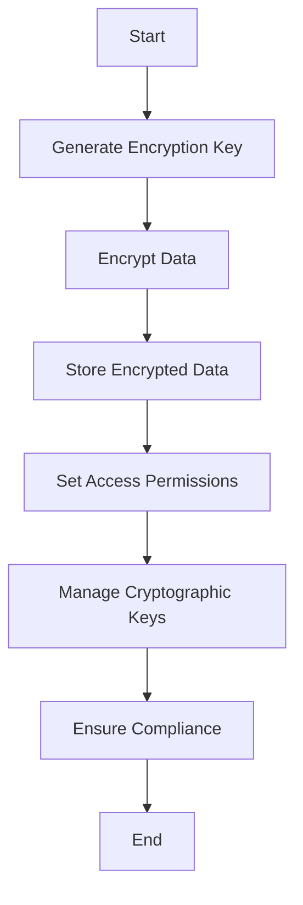

## 16.3 Managing Sensitive Data

In today's digital landscape, managing sensitive data is a critical aspect of systems programming. As software engineers and architects, we must ensure that sensitive information is protected from unauthorized access and breaches. This section delves into the best practices for managing sensitive data in the D programming language, focusing on encryption, secure storage, access controls, and compliance with regulatory standards.

### Data Protection

Data protection involves safeguarding data from unauthorized access and ensuring its confidentiality, integrity, and availability. Let's explore the key components of data protection in D.

#### Encryption

Encryption is the process of converting plaintext data into a coded form (ciphertext) to prevent unauthorized access. In D, we can leverage cryptographic libraries to implement encryption for data at rest and in transit.

##### Symmetric Encryption

Symmetric encryption uses the same key for both encryption and decryption. It is efficient for encrypting large amounts of data. Here's an example of symmetric encryption using the `crypto` library in D:

```d
import std.stdio;
import std.digest.digest;
import std.digest.hmac;
import std.digest.sha;
import std.random;
import std.string;
import crypto.aes;

void main() {
    // Generate a random key
    auto key = randomBytes(32); // 256-bit key for AES-256

    // Data to encrypt
    string data = "Sensitive information";

    // Encrypt the data
    auto cipher = new AES256(key);
    auto encryptedData = cipher.encrypt(data);

    writeln("Encrypted Data: ", encryptedData);

    // Decrypt the data
    auto decryptedData = cipher.decrypt(encryptedData);

    writeln("Decrypted Data: ", decryptedData);
}
```

In this example, we use AES-256, a widely used symmetric encryption algorithm, to encrypt and decrypt sensitive information.

##### Asymmetric Encryption

Asymmetric encryption uses a pair of keys: a public key for encryption and a private key for decryption. It is suitable for secure key exchange and digital signatures. Here's an example using the `crypto` library:

```d
import std.stdio;
import crypto.rsa;
import std.random;

void main() {
    // Generate RSA key pair
    auto keyPair = RSA.generateKeyPair(2048);

    // Data to encrypt
    string data = "Sensitive information";

    // Encrypt the data with the public key
    auto encryptedData = keyPair.publicKey.encrypt(data);

    writeln("Encrypted Data: ", encryptedData);

    // Decrypt the data with the private key
    auto decryptedData = keyPair.privateKey.decrypt(encryptedData);

    writeln("Decrypted Data: ", decryptedData);
}
```

Asymmetric encryption is more computationally intensive than symmetric encryption, but it provides enhanced security for key management.

#### Secure Storage

Secure storage involves protecting sensitive data at rest. This includes using encryption for files and databases, as well as implementing secure access controls.

##### File Encryption

Encrypting files ensures that sensitive data remains protected even if unauthorized individuals gain access to the storage medium. Here's an example of encrypting a file in D:

```d
import std.file;
import std.stdio;
import crypto.aes;
import std.random;

void encryptFile(string filePath, ubyte[] key) {
    auto data = cast(ubyte[]) read(filePath);
    auto cipher = new AES256(key);
    auto encryptedData = cipher.encrypt(data);
    write(filePath ~ ".enc", encryptedData);
}

void main() {
    string filePath = "sensitive_data.txt";
    auto key = randomBytes(32); // 256-bit key for AES-256

    encryptFile(filePath, key);
    writeln("File encrypted successfully.");
}
```

In this example, we read the contents of a file, encrypt it using AES-256, and save the encrypted data to a new file.

##### Database Encryption

For databases, encryption can be applied at the column level or the entire database level. This ensures that sensitive data remains protected even if the database is compromised.

### Access Controls

Access controls are mechanisms that restrict access to sensitive data based on user roles and permissions. Implementing robust access controls is crucial for preventing unauthorized access.

#### Permissions

Setting appropriate file and data permissions is a fundamental aspect of access control. In D, we can use the `std.file` module to manage file permissions:

```d
import std.file;
import std.stdio;

void setFilePermissions(string filePath, uint permissions) {
    chmod(filePath, permissions);
    writeln("Permissions set successfully.");
}

void main() {
    string filePath = "sensitive_data.txt";
    uint permissions = 0o600; // Owner read/write, no access for others

    setFilePermissions(filePath, permissions);
}
```

In this example, we set file permissions to allow only the owner to read and write the file, enhancing its security.

#### Key Management

Handling cryptographic keys safely is essential for maintaining data security. Key management involves generating, storing, and distributing keys securely.

##### Key Generation

Keys should be generated using a secure random number generator. Here's an example of generating a cryptographic key in D:

```d
import std.random;
import std.stdio;

void main() {
    auto key = randomBytes(32); // 256-bit key for AES-256
    writeln("Generated Key: ", key);
}
```

##### Key Storage

Keys should be stored securely, preferably in a hardware security module (HSM) or a secure key vault. Avoid hardcoding keys in source code or storing them in plaintext files.

### Use Cases and Examples

Let's explore some common use cases for managing sensitive data in D.

#### Credential Storage

Safeguarding user passwords and tokens is critical for protecting user accounts. Use hashing algorithms like SHA-256 or bcrypt to store passwords securely:

```d
import std.digest.digest;
import std.stdio;

void main() {
    string password = "user_password";

    // Hash the password using SHA-256
    auto hashedPassword = hashPassword(password);

    writeln("Hashed Password: ", hashedPassword);
}

string hashPassword(string password) {
    auto digest = new SHA256Digest();
    digest.put(cast(ubyte[]) password);
    return digest.finish().toHexString();
}
```

In this example, we hash a user password using SHA-256 before storing it in the database.

#### Compliance Requirements

Meeting compliance standards like GDPR and HIPAA is essential for organizations handling sensitive data. These standards mandate specific data protection measures, such as encryption and access controls.

##### GDPR Compliance

The General Data Protection Regulation (GDPR) requires organizations to protect personal data and ensure user privacy. Implementing encryption and access controls can help achieve GDPR compliance.

##### HIPAA Compliance

The Health Insurance Portability and Accountability Act (HIPAA) mandates the protection of health information. Encryption and secure storage are critical components of HIPAA compliance.

### Visualizing Data Protection and Access Control

To better understand the flow of data protection and access control, let's visualize the process using a flowchart.



**Figure 1: Data Protection and Access Control Flowchart**

This flowchart illustrates the key steps involved in managing sensitive data, from encryption to compliance.

### Try It Yourself

Now that we've covered the basics of managing sensitive data in D, let's encourage you to experiment with the code examples. Try modifying the encryption algorithms, key sizes, or file permissions to see how they affect data security. Remember, practice is key to mastering these concepts.

### Knowledge Check

Before we conclude, let's reinforce your understanding with a few questions:

- What is the difference between symmetric and asymmetric encryption?
- How can you securely store cryptographic keys?
- What are some common compliance standards for data protection?

### Embrace the Journey

Managing sensitive data is a critical skill for software engineers and architects. As you continue to explore the D programming language, remember to prioritize data security and stay informed about the latest best practices. Keep experimenting, stay curious, and enjoy the journey!

## Quiz Time!



### What is the primary purpose of encryption in data protection?

- [x] To convert plaintext data into a coded form to prevent unauthorized access
- [ ] To increase the size of the data
- [ ] To make data processing faster
- [ ] To compress data for storage

> **Explanation:** Encryption is used to convert plaintext data into a coded form, known as ciphertext, to prevent unauthorized access.

### Which encryption method uses the same key for both encryption and decryption?

- [x] Symmetric encryption
- [ ] Asymmetric encryption
- [ ] Hashing
- [ ] Digital signatures

> **Explanation:** Symmetric encryption uses the same key for both encryption and decryption, making it efficient for encrypting large amounts of data.

### What is a key advantage of asymmetric encryption over symmetric encryption?

- [x] Enhanced security for key management
- [ ] Faster encryption and decryption
- [ ] Simplicity of implementation
- [ ] Requires less computational power

> **Explanation:** Asymmetric encryption provides enhanced security for key management by using a pair of keys: a public key for encryption and a private key for decryption.

### What is the recommended way to store cryptographic keys securely?

- [x] In a hardware security module (HSM) or a secure key vault
- [ ] Hardcoded in source code
- [ ] In plaintext files
- [ ] In a database without encryption

> **Explanation:** Cryptographic keys should be stored securely in a hardware security module (HSM) or a secure key vault to prevent unauthorized access.

### Which hashing algorithm is commonly used for storing passwords securely?

- [x] SHA-256
- [ ] MD5
- [ ] DES
- [ ] RSA

> **Explanation:** SHA-256 is a commonly used hashing algorithm for storing passwords securely due to its strong security properties.

### What is the purpose of setting file permissions in access control?

- [x] To restrict access to sensitive data based on user roles
- [ ] To increase the file size
- [ ] To make files read-only
- [ ] To compress files for storage

> **Explanation:** Setting file permissions is a fundamental aspect of access control, restricting access to sensitive data based on user roles.

### Which compliance standard mandates the protection of health information?

- [x] HIPAA
- [ ] GDPR
- [ ] PCI DSS
- [ ] ISO 27001

> **Explanation:** HIPAA (Health Insurance Portability and Accountability Act) mandates the protection of health information.

### What is a common use case for asymmetric encryption?

- [x] Secure key exchange and digital signatures
- [ ] Encrypting large amounts of data
- [ ] Compressing data for storage
- [ ] Increasing data processing speed

> **Explanation:** Asymmetric encryption is commonly used for secure key exchange and digital signatures due to its enhanced security features.

### What is the role of a hardware security module (HSM) in key management?

- [x] To securely store and manage cryptographic keys
- [ ] To increase the speed of encryption
- [ ] To compress keys for storage
- [ ] To generate random numbers

> **Explanation:** A hardware security module (HSM) is used to securely store and manage cryptographic keys, ensuring their protection from unauthorized access.

### True or False: GDPR compliance requires organizations to protect personal data and ensure user privacy.

- [x] True
- [ ] False

> **Explanation:** True. The General Data Protection Regulation (GDPR) requires organizations to protect personal data and ensure user privacy.


