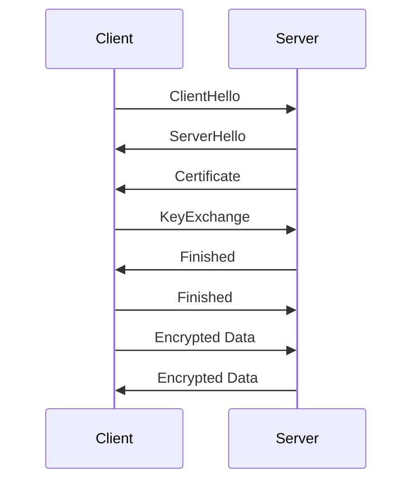

## 16.4 Cryptography and Secure Communication

In today's digital landscape, ensuring the confidentiality, integrity, and authenticity of data is paramount. Cryptography and secure communication protocols are essential tools in achieving these goals. In this section, we will explore how the D programming language facilitates cryptographic operations and secure communication. We will delve into the use of cryptographic libraries, secure protocols, and practical use cases to provide a comprehensive understanding of these critical concepts.

### Cryptographic Libraries in D

Cryptographic libraries provide the building blocks for implementing secure systems. In D, we have access to both the standard library's cryptographic functionalities and third-party libraries that offer more advanced features.

#### Using `std.crypto`

The `std.crypto` module in D's standard library offers a range of cryptographic functions. Let's explore how to use this module to perform basic cryptographic operations.

##### Implementing Cryptographic Functions

To demonstrate the use of `std.crypto`, let's implement a simple hashing function using SHA-256, a widely used cryptographic hash function.

```d
import std.crypto.digest;
import std.stdio;

void main() {
    // Input data to hash
    string data = "Hello, D Programming!";
    
    // Create a SHA-256 hasher
    auto hasher = new SHA256Digest();
    
    // Add data to the hasher
    hasher.put(data);
    
    // Finalize the hash and retrieve the result
    auto hash = hasher.finish();
    
    // Print the hash in hexadecimal format
    writeln("SHA-256 Hash: ", hash.toHexString());
}
```

In this example, we create a SHA-256 hasher, add data to it, and then finalize the hash to retrieve the result. The `toHexString()` method is used to convert the hash to a human-readable hexadecimal format.

##### Try It Yourself

Experiment with different hashing algorithms available in `std.crypto.digest`, such as SHA-1 or MD5. Modify the code to hash different types of data, such as files or binary data.

#### Third-Party Libraries

While `std.crypto` provides basic cryptographic functions, more complex requirements may necessitate the use of third-party libraries. Libraries like [CryptoD](https://github.com/etcimon/cryptod) offer a broader range of cryptographic algorithms and utilities.

##### Leveraging Established Cryptographic Tools

To use CryptoD, you need to add it as a dependency in your project's `dub.json` file:

```json
{
    "dependencies": {
        "cryptod": "~>0.2.0"
    }
}
```

Here's an example of using CryptoD to encrypt and decrypt data using AES (Advanced Encryption Standard):

```d
import cryptod.aes;
import cryptod.util;
import std.stdio;

void main() {
    // Secret key and initialization vector
    ubyte[] key = "thisisaverysecretkey!".dup;
    ubyte[] iv = "thisisaninitvector!".dup;
    
    // Data to encrypt
    ubyte[] data = "Sensitive data".dup;
    
    // Encrypt the data
    auto encrypted = aesEncrypt(key, iv, data);
    writeln("Encrypted Data: ", encrypted.toHexString());
    
    // Decrypt the data
    auto decrypted = aesDecrypt(key, iv, encrypted);
    writeln("Decrypted Data: ", cast(string)decrypted);
}
```

In this code, we use AES encryption to secure sensitive data. The `aesEncrypt` and `aesDecrypt` functions handle the encryption and decryption processes, respectively.

### Secure Protocols

Secure communication protocols ensure that data transmitted over networks remains confidential and tamper-proof. SSL/TLS are the most widely used protocols for securing internet communications.

#### SSL/TLS Implementation

SSL (Secure Sockets Layer) and TLS (Transport Layer Security) are cryptographic protocols designed to provide secure communication over a computer network. Implementing SSL/TLS in D involves using libraries that support these protocols, such as [vibe.d](https://vibed.org/), a popular web framework for D.

##### Ensuring Secure Communications

To set up a secure server using vibe.d, you need to configure SSL/TLS settings. Here's a basic example:

```d
import vibe.d;

void main() {
    auto settings = new HTTPServerSettings;
    settings.port = 443;
    settings.tlsContext = createTLSContext("cert.pem", "key.pem");
    
    listenHTTP(settings, (req, res) {
        res.writeBody("Secure connection established!");
    });
    
    runApplication();
}
```

In this example, we configure an HTTP server to use SSL/TLS by specifying the certificate and key files. The server listens on port 443, the default port for HTTPS.

##### Certificate Handling

Managing digital certificates is crucial for SSL/TLS communication. Certificates authenticate the server's identity and establish trust with clients. Ensure that your certificates are valid and up-to-date to prevent security vulnerabilities.

### Use Cases and Examples

Cryptography and secure communication are vital in various applications. Let's explore some practical use cases.

#### Secure APIs

APIs (Application Programming Interfaces) often handle sensitive data, making security a top priority. Implementing secure APIs involves encrypting data in transit and ensuring only authorized users can access the API.

##### Protecting Data in Client-Server Communication

Here's an example of a secure API endpoint using vibe.d:

```d
import vibe.d;

void main() {
    auto settings = new HTTPServerSettings;
    settings.port = 443;
    settings.tlsContext = createTLSContext("cert.pem", "key.pem");
    
    listenHTTP(settings, (req, res) {
        if (req.path == "/secure-data") {
            res.writeJson(["message": "This is secure data"]);
        } else {
            res.writeBody("Invalid endpoint");
        }
    });
    
    runApplication();
}
```

In this example, we create a secure API endpoint that returns JSON data. The use of SSL/TLS ensures that data transmitted between the client and server is encrypted.

#### Encrypted Messaging

Secure messaging applications rely on encryption to protect user communications. Implementing encrypted messaging involves encrypting messages before sending them and decrypting them upon receipt.

##### Developing Secure Messaging Applications

Here's a simple example of encrypting and decrypting messages using RSA (Rivest-Shamir-Adleman) encryption:

```d
import cryptod.rsa;
import std.stdio;

void main() {
    // Generate RSA key pair
    auto keyPair = generateRSAKeyPair(2048);
    
    // Message to encrypt
    string message = "Hello, secure world!";
    
    // Encrypt the message
    auto encrypted = rsaEncrypt(keyPair.publicKey, cast(ubyte[])message);
    writeln("Encrypted Message: ", encrypted.toHexString());
    
    // Decrypt the message
    auto decrypted = rsaDecrypt(keyPair.privateKey, encrypted);
    writeln("Decrypted Message: ", cast(string)decrypted);
}
```

In this example, we generate an RSA key pair and use it to encrypt and decrypt a message. RSA is a widely used asymmetric encryption algorithm that provides strong security.

### Visualizing Secure Communication

To better understand the flow of secure communication, let's visualize the process using a sequence diagram.



This diagram illustrates the SSL/TLS handshake process, where the client and server exchange messages to establish a secure connection. The handshake involves several steps, including exchanging certificates and keys, to ensure both parties can communicate securely.

### References and Links

For further reading on cryptography and secure communication, consider the following resources:

- [MDN Web Docs on Web Cryptography API](https://developer.mozilla.org/en-US/docs/Web/API/Web_Crypto_API)
- [OpenSSL Documentation](https://www.openssl.org/docs/)
- [OWASP Cryptographic Storage Cheat Sheet](https://cheatsheetseries.owasp.org/cheatsheets/Cryptographic_Storage_Cheat_Sheet.html)

### Knowledge Check

To reinforce your understanding of cryptography and secure communication, consider the following questions:

- What are the key differences between symmetric and asymmetric encryption?
- How does SSL/TLS ensure the confidentiality and integrity of data?
- What are the potential risks of using outdated cryptographic algorithms?

### Embrace the Journey

Remember, mastering cryptography and secure communication is a journey. As you continue to explore these topics, you'll gain a deeper understanding of how to protect data and ensure secure communications. Keep experimenting, stay curious, and enjoy the journey!

## Quiz Time!



### What is the primary purpose of cryptographic hash functions?

- [x] To ensure data integrity
- [ ] To encrypt data
- [ ] To decrypt data
- [ ] To generate random numbers

> **Explanation:** Cryptographic hash functions are used to ensure data integrity by producing a fixed-size hash value from input data.

### Which D module provides basic cryptographic functions?

- [x] std.crypto
- [ ] std.math
- [ ] std.io
- [ ] std.net

> **Explanation:** The `std.crypto` module in D's standard library provides basic cryptographic functions.

### What is the role of SSL/TLS in secure communication?

- [x] To encrypt data transmitted over networks
- [ ] To compress data
- [ ] To authenticate users
- [ ] To manage databases

> **Explanation:** SSL/TLS encrypts data transmitted over networks to ensure secure communication.

### Which library can be used for advanced cryptographic operations in D?

- [x] CryptoD
- [ ] Vibe.d
- [ ] Phobos
- [ ] Tango

> **Explanation:** CryptoD is a third-party library that provides advanced cryptographic operations in D.

### What is the default port for HTTPS?

- [x] 443
- [ ] 80
- [ ] 8080
- [ ] 21

> **Explanation:** Port 443 is the default port for HTTPS, which uses SSL/TLS for secure communication.

### What is the purpose of digital certificates in SSL/TLS?

- [x] To authenticate the server's identity
- [ ] To encrypt data
- [ ] To compress data
- [ ] To manage user sessions

> **Explanation:** Digital certificates authenticate the server's identity in SSL/TLS communication.

### Which encryption algorithm is used in the provided AES example?

- [x] AES
- [ ] RSA
- [ ] SHA-256
- [ ] MD5

> **Explanation:** The provided example uses AES (Advanced Encryption Standard) for encryption.

### What is the primary benefit of using RSA encryption?

- [x] Strong security through asymmetric encryption
- [ ] Fast encryption and decryption
- [ ] Low computational overhead
- [ ] Simple implementation

> **Explanation:** RSA provides strong security through asymmetric encryption, making it suitable for secure communications.

### What is the first step in the SSL/TLS handshake process?

- [x] ClientHello
- [ ] ServerHello
- [ ] Certificate exchange
- [ ] KeyExchange

> **Explanation:** The SSL/TLS handshake process begins with the ClientHello message from the client.

### True or False: Symmetric encryption uses the same key for encryption and decryption.

- [x] True
- [ ] False

> **Explanation:** Symmetric encryption uses the same key for both encryption and decryption, making it efficient for secure communication.


