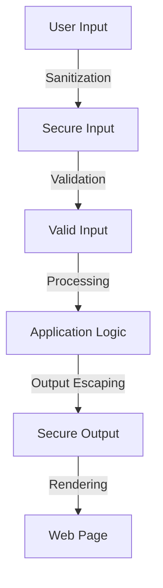

## 16.5 Preventing Common Vulnerabilities

In the realm of systems programming, security is paramount. As expert developers and architects, understanding and mitigating common vulnerabilities is crucial to building robust and secure applications. This section delves into preventing common vulnerabilities such as buffer overflows, injection attacks, and race conditions, with a focus on the D programming language. We will explore strategies, best practices, and code examples to fortify your applications against these threats.

### Buffer Overflows

Buffer overflows occur when data exceeds the allocated memory buffer, leading to unpredictable behavior, crashes, or security breaches. In D, we can leverage its memory safety features to prevent such vulnerabilities.

#### Memory Safety Checks

D provides several mechanisms to enhance memory safety, including bounds checking and safe memory operations. Let's explore these features:

- **Bounds Checking**: D performs automatic bounds checking on arrays, preventing out-of-bounds access.

```d
void safeArrayAccess() {
    int[] numbers = [1, 2, 3, 4, 5];
    foreach (i; 0 .. numbers.length) {
        writeln(numbers[i]); // Safe access within bounds
    }
}
```

- **Safe Memory Operations**: Use `@safe` functions to enforce memory safety.

```d
@safe void processBuffer(char[] buffer) {
    // Safe operations on buffer
    foreach (char c; buffer) {
        // Process each character safely
    }
}
```

- **Avoiding Manual Memory Management**: Prefer high-level constructs like slices and arrays over manual memory management to reduce the risk of buffer overflows.

#### Try It Yourself

Experiment with the above code by attempting to access an out-of-bounds index and observe how D's runtime catches the error. Modify the buffer size and see how D handles memory safety.

### Injection Attacks

Injection attacks occur when untrusted data is executed as code. Common types include code injection and cross-site scripting (XSS). Let's explore how to prevent these vulnerabilities in D.

#### Code Injection

Prevent code injection by validating and sanitizing inputs. Avoid executing untrusted code directly.

- **Input Validation**: Ensure inputs conform to expected formats.

```d
bool isValidInput(string input) {
    return input.length > 0 && input.length < 100; // Example validation
}
```

- **Sanitization**: Remove or escape harmful characters from inputs.

```d
string sanitizeInput(string input) {
    return input.replace("&", "&amp;").replace("<", "&lt;").replace(">", "&gt;");
}
```

#### Cross-Site Scripting (XSS)

XSS attacks involve injecting malicious scripts into web applications. Mitigate XSS by escaping outputs and using secure frameworks.

- **Output Escaping**: Escape HTML characters in outputs.

```d
string escapeHtml(string input) {
    return input.replace("&", "&amp;").replace("<", "&lt;").replace(">", "&gt;");
}
```

- **Secure Frameworks**: Use frameworks like Vibe.d that provide built-in protection against XSS.

#### Try It Yourself

Create a simple web application using Vibe.d and test it against XSS attacks. Implement input validation and output escaping to secure your application.

### Race Conditions

Race conditions occur when multiple threads access shared resources concurrently, leading to inconsistent states. Ensuring thread safety is crucial in concurrent programming.

#### Thread Safety

Synchronize access to shared resources to prevent race conditions.

- **Mutexes**: Use mutexes to lock shared resources.

```d
import core.sync.mutex;

void safeIncrement(ref int counter) {
    Mutex mutex;
    synchronized (mutex) {
        counter++;
    }
}
```

- **Atomic Operations**: Use atomic operations for simple shared data.

```d
import core.atomic;

void atomicIncrement(ref int counter) {
    atomicOp!"+="(counter, 1);
}
```

#### Try It Yourself

Implement a multi-threaded application that increments a shared counter. Experiment with and without synchronization to observe race conditions and their prevention.

### Use Cases and Examples

#### Secure Services

Building secure services involves implementing robust security measures to withstand attacks.

- **Authentication and Authorization**: Implement strong authentication and authorization mechanisms.

```d
bool authenticateUser(string username, string password) {
    // Validate credentials
    return username == "admin" && password == "securePassword";
}
```

- **Data Encryption**: Use encryption to protect sensitive data.

```d
import std.digest.md;

string hashPassword(string password) {
    return password.digest!SHA256().toHexString();
}
```

#### Code Audits

Regularly review code for vulnerabilities to maintain security.

- **Static Analysis**: Use static analysis tools to detect potential vulnerabilities.

- **Code Reviews**: Conduct code reviews to identify and fix security issues.

### Visualizing Vulnerabilities

To better understand the flow of vulnerabilities and their prevention, let's visualize a typical attack scenario and the corresponding defense mechanisms.



**Figure 1**: Visualizing the flow of input sanitization, validation, and output escaping to prevent injection attacks.

### References and Links

- [OWASP Top Ten](https://owasp.org/www-project-top-ten/): A list of the most critical web application security risks.
- [D Programming Language](https://dlang.org/): Official D language documentation.
- [Vibe.d](https://vibed.org/): A high-performance web framework for D.

### Knowledge Check

- What are buffer overflows, and how can they be prevented in D?
- How does input validation help prevent code injection attacks?
- What is the role of mutexes in preventing race conditions?

### Embrace the Journey

Remember, security is an ongoing journey. As you build more complex systems, continue to apply these principles and stay informed about emerging threats. Keep experimenting, stay curious, and enjoy the journey of mastering secure systems programming in D.

## Quiz Time!



### What is a buffer overflow?

- [x] When data exceeds the allocated memory buffer
- [ ] When data is correctly stored in memory
- [ ] When data is encrypted
- [ ] When data is validated

> **Explanation:** A buffer overflow occurs when data exceeds the allocated memory buffer, leading to potential security vulnerabilities.

### How can buffer overflows be prevented in D?

- [x] Using bounds checking and safe memory operations
- [ ] By ignoring memory safety
- [ ] By using manual memory management
- [ ] By avoiding arrays

> **Explanation:** Buffer overflows can be prevented in D by using bounds checking and safe memory operations, which ensure memory safety.

### What is code injection?

- [x] Executing untrusted code
- [ ] Validating user input
- [ ] Encrypting data
- [ ] Using atomic operations

> **Explanation:** Code injection involves executing untrusted code, which can lead to security vulnerabilities.

### How can cross-site scripting (XSS) be mitigated?

- [x] By escaping HTML characters in outputs
- [ ] By ignoring user input
- [ ] By using manual memory management
- [ ] By avoiding web applications

> **Explanation:** Cross-site scripting (XSS) can be mitigated by escaping HTML characters in outputs, preventing malicious scripts from being executed.

### What is a race condition?

- [x] When multiple threads access shared resources concurrently
- [ ] When data is encrypted
- [ ] When data is validated
- [ ] When data is stored in memory

> **Explanation:** A race condition occurs when multiple threads access shared resources concurrently, leading to inconsistent states.

### How can race conditions be prevented?

- [x] By synchronizing access to shared resources
- [ ] By ignoring thread safety
- [ ] By using manual memory management
- [ ] By avoiding concurrency

> **Explanation:** Race conditions can be prevented by synchronizing access to shared resources, ensuring thread safety.

### What is the role of mutexes in preventing race conditions?

- [x] To lock shared resources
- [ ] To encrypt data
- [ ] To validate user input
- [ ] To escape HTML characters

> **Explanation:** Mutexes are used to lock shared resources, preventing race conditions by ensuring only one thread accesses the resource at a time.

### What is the purpose of input validation?

- [x] To ensure inputs conform to expected formats
- [ ] To execute untrusted code
- [ ] To encrypt data
- [ ] To ignore user input

> **Explanation:** Input validation ensures inputs conform to expected formats, preventing injection attacks by rejecting malicious inputs.

### How can data encryption enhance security?

- [x] By protecting sensitive data
- [ ] By ignoring user input
- [ ] By using manual memory management
- [ ] By avoiding concurrency

> **Explanation:** Data encryption enhances security by protecting sensitive data, ensuring it cannot be easily accessed by unauthorized parties.

### True or False: Regular code audits are unnecessary for maintaining security.

- [ ] True
- [x] False

> **Explanation:** Regular code audits are essential for maintaining security, as they help identify and fix potential vulnerabilities.


