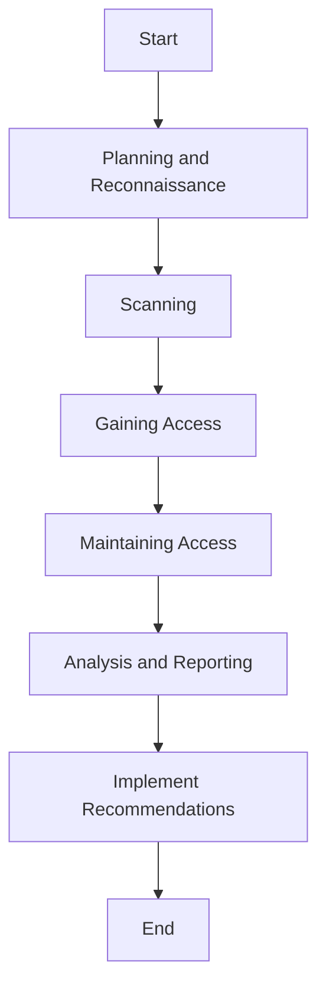

## 16.6 Security Testing and Auditing

In the realm of advanced systems programming, security testing and auditing are paramount to ensuring the robustness and reliability of software systems. As expert software engineers and architects, it's crucial to integrate security practices into every phase of the software development lifecycle. This section delves into various methodologies and tools for security testing and auditing, specifically tailored for the D programming language, to help you build secure and resilient applications.

### Penetration Testing

Penetration testing, often referred to as ethical hacking, involves simulating attacks on a system to identify vulnerabilities before malicious actors can exploit them. This proactive approach is essential for uncovering security weaknesses and fortifying your applications against potential threats.

#### Simulating Attacks

To effectively simulate attacks, it's important to understand the types of threats your application may face. These can range from SQL injection and cross-site scripting (XSS) to buffer overflows and denial-of-service (DoS) attacks. By mimicking these threats, penetration testers can evaluate the security posture of an application and provide actionable insights for improvement.

**Steps for Conducting Penetration Testing:**

1. **Planning and Reconnaissance**: Define the scope and objectives of the test. Gather information about the target system, such as network topology, operating systems, and applications in use.

2. **Scanning**: Use tools like Nmap or Nessus to identify open ports, services, and potential vulnerabilities.

3. **Gaining Access**: Attempt to exploit identified vulnerabilities to gain unauthorized access to the system. This step often involves using tools like Metasploit.

4. **Maintaining Access**: Simulate advanced persistent threats (APTs) by establishing backdoors or other methods to maintain access over time.

5. **Analysis and Reporting**: Document the findings, including vulnerabilities discovered, data accessed, and recommendations for remediation.

**Example Code Snippet:**

```d
// Example of a simple buffer overflow vulnerability in D
void vulnerableFunction(char[] input) {
    char[10] buffer;
    // Potential buffer overflow if input is larger than buffer
    buffer[] = input[];
}

void main() {
    char[] maliciousInput = "AAAAAAAAAAAAAAAAAAAA"; // 20 'A's
    vulnerableFunction(maliciousInput);
}
```

**Try It Yourself**: Modify the `vulnerableFunction` to include proper bounds checking to prevent buffer overflow.

### Static Code Analysis

Static code analysis involves examining the source code for potential vulnerabilities without executing the program. This method is highly effective for identifying security flaws early in the development process.

#### Automated Tools

Automated tools for static code analysis can significantly enhance the efficiency and accuracy of security testing. These tools scan the codebase for known vulnerabilities, coding errors, and adherence to security best practices.

**Popular Static Code Analysis Tools:**

- **SonarQube**: Provides comprehensive analysis for various programming languages, including D, with plugins.
- **Coverity**: Offers deep static analysis capabilities to detect critical security defects.
- **Flawfinder**: Focuses on identifying potential security flaws in C/C++ code, which can be adapted for D.

**Example Code Snippet:**

```d
// Example of a potential security flaw detected by static analysis
void processData(char[] data) {
    if (data.length > 0) {
        // Potential null pointer dereference
        char firstChar = data[0];
    }
}
```

**Try It Yourself**: Use a static analysis tool to identify and fix potential security issues in your D codebase.

### Audit Practices

Security audits involve a thorough examination of an application's code, architecture, and processes to ensure compliance with security standards and best practices. Regular audits are crucial for maintaining a secure software environment.

#### Code Reviews

Code reviews are an integral part of the audit process, where peers examine code changes for security implications. This collaborative approach helps identify potential vulnerabilities and ensures adherence to security standards.

**Best Practices for Code Reviews:**

- **Define Security Guidelines**: Establish clear security guidelines and checklists for reviewers to follow.
- **Use Automated Tools**: Integrate automated code review tools to assist in identifying common security issues.
- **Encourage Open Communication**: Foster an environment where developers feel comfortable discussing security concerns.

#### Security Checklists

Security checklists serve as a valuable tool for ensuring that all security aspects are considered during development and auditing. These checklists can include items such as input validation, authentication mechanisms, and encryption standards.

**Example Security Checklist:**

- Validate all user inputs to prevent injection attacks.
- Use strong, industry-standard encryption algorithms for data protection.
- Implement proper authentication and authorization mechanisms.
- Regularly update and patch software dependencies.

### Use Cases and Examples

#### Continuous Security

Integrating security into the development workflow is essential for maintaining a secure application environment. Continuous security involves incorporating security practices into continuous integration and continuous deployment (CI/CD) pipelines.

**Example CI/CD Security Integration:**

- **Automated Security Testing**: Include security tests in the CI/CD pipeline to catch vulnerabilities early.
- **Dependency Scanning**: Use tools like OWASP Dependency-Check to identify vulnerable dependencies.
- **Infrastructure as Code (IaC) Security**: Scan IaC configurations for security misconfigurations.

#### Incident Response

Despite best efforts, security breaches can still occur. Having a well-defined incident response plan is crucial for minimizing damage and recovering quickly.

**Key Components of an Incident Response Plan:**

- **Preparation**: Establish an incident response team and define roles and responsibilities.
- **Detection and Analysis**: Implement monitoring tools to detect security incidents promptly.
- **Containment, Eradication, and Recovery**: Develop strategies to contain the breach, eradicate the threat, and recover affected systems.
- **Post-Incident Review**: Conduct a thorough review to identify lessons learned and improve future response efforts.

### Visualizing Security Processes

To better understand the security testing and auditing process, let's visualize the workflow using a Mermaid.js flowchart.



**Diagram Description**: This flowchart illustrates the typical steps involved in a penetration testing process, from planning and reconnaissance to analysis and reporting.

### References and Links

- [OWASP Testing Guide](https://owasp.org/www-project-web-security-testing-guide/): A comprehensive guide to web application security testing.
- [NIST Cybersecurity Framework](https://www.nist.gov/cyberframework): A framework for improving critical infrastructure cybersecurity.
- [SANS Institute](https://www.sans.org/): Offers resources and training for information security professionals.

### Knowledge Check

To reinforce your understanding of security testing and auditing, consider the following questions:

1. What are the key steps involved in penetration testing?
2. How can static code analysis tools help improve software security?
3. Why are code reviews important in the audit process?
4. What should be included in a security checklist?
5. How can continuous security be integrated into CI/CD pipelines?

### Embrace the Journey

Remember, mastering security testing and auditing is an ongoing journey. As you continue to build and refine your skills, you'll become more adept at identifying and mitigating security risks. Stay curious, keep learning, and embrace the challenge of creating secure software systems.

## Quiz Time!



### What is the primary goal of penetration testing?

- [x] To identify vulnerabilities by simulating attacks
- [ ] To fix all existing vulnerabilities
- [ ] To replace static code analysis
- [ ] To automate security testing

> **Explanation:** Penetration testing aims to identify vulnerabilities by simulating real-world attacks on the system.

### Which tool is commonly used for scanning open ports and services?

- [x] Nmap
- [ ] SonarQube
- [ ] Coverity
- [ ] Flawfinder

> **Explanation:** Nmap is a popular tool used for network scanning to identify open ports and services.

### What is a key benefit of static code analysis?

- [x] Identifying vulnerabilities without executing the program
- [ ] Replacing the need for code reviews
- [ ] Automating penetration testing
- [ ] Ensuring code is free of syntax errors

> **Explanation:** Static code analysis helps identify vulnerabilities by examining the source code without executing it.

### Why are code reviews important in security audits?

- [x] They help identify potential vulnerabilities and ensure adherence to security standards
- [ ] They replace the need for static code analysis
- [ ] They automate the security testing process
- [ ] They are only necessary for large codebases

> **Explanation:** Code reviews are crucial for identifying potential vulnerabilities and ensuring adherence to security standards.

### What should be included in a security checklist?

- [x] Input validation, encryption standards, authentication mechanisms
- [ ] Only input validation
- [ ] Only encryption standards
- [ ] Only authentication mechanisms

> **Explanation:** A comprehensive security checklist should include input validation, encryption standards, and authentication mechanisms.

### How can continuous security be integrated into CI/CD pipelines?

- [x] By including security tests and dependency scanning
- [ ] By removing all security checks
- [ ] By only focusing on performance testing
- [ ] By automating code reviews

> **Explanation:** Continuous security involves integrating security tests and dependency scanning into CI/CD pipelines.

### What is a key component of an incident response plan?

- [x] Preparation and defining roles
- [ ] Only detection and analysis
- [ ] Only containment strategies
- [ ] Only post-incident review

> **Explanation:** Preparation, including defining roles and responsibilities, is a key component of an incident response plan.

### What is the purpose of a post-incident review?

- [x] To identify lessons learned and improve future response efforts
- [ ] To replace the need for incident response
- [ ] To automate security testing
- [ ] To ensure no vulnerabilities exist

> **Explanation:** A post-incident review helps identify lessons learned and improve future response efforts.

### Which of the following is NOT a step in penetration testing?

- [ ] Planning and Reconnaissance
- [ ] Scanning
- [ ] Gaining Access
- [x] Automated Code Review

> **Explanation:** Automated code review is not a step in penetration testing; it is part of static code analysis.

### True or False: Static code analysis can replace the need for penetration testing.

- [ ] True
- [x] False

> **Explanation:** Static code analysis cannot replace penetration testing as they serve different purposes in identifying vulnerabilities.


