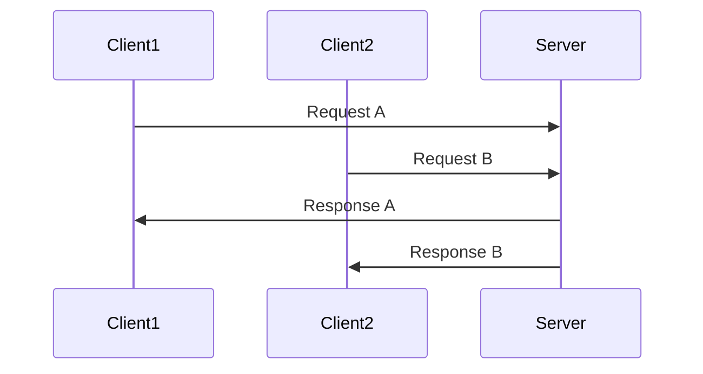

## 16.7 Concurrency and Security Considerations

Concurrency in software development allows multiple computations to happen simultaneously, which can significantly improve the performance and responsiveness of applications. However, it also introduces complex challenges, particularly in ensuring the security and integrity of data. In this section, we will delve into the concurrency risks such as data races and deadlocks, explore secure concurrency patterns like immutable data structures and thread-local storage, and provide practical use cases and examples to illustrate these concepts in the D programming language.

### Understanding Concurrency Risks

Concurrency risks are inherent in systems where multiple threads or processes operate simultaneously. These risks can lead to unpredictable behavior and security vulnerabilities if not properly managed.

#### Data Races

A data race occurs when two or more threads access shared data simultaneously, and at least one of the accesses is a write. This can lead to inconsistent or incorrect data states, causing unpredictable behavior in the application.

**Example of a Data Race:**

```d
import std.stdio;
import core.thread;

int sharedCounter = 0;

void incrementCounter() {
    for (int i = 0; i < 1000; ++i) {
        // Potential data race
        sharedCounter++;
    }
}

void main() {
    Thread t1 = new Thread(&incrementCounter);
    Thread t2 = new Thread(&incrementCounter);
    t1.start();
    t2.start();
    t1.join();
    t2.join();
    writeln("Final counter value: ", sharedCounter);
}
```

In this example, two threads increment a shared counter without synchronization, leading to a data race. The final value of `sharedCounter` is unpredictable.

#### Deadlocks

A deadlock occurs when two or more threads are blocked forever, each waiting for the other to release a resource. This can halt the progress of an application and degrade its performance.

**Example of a Deadlock:**

```d
import std.stdio;
import core.sync.mutex;
import core.thread;

Mutex mutex1;
Mutex mutex2;

void thread1() {
    synchronized(mutex1) {
        Thread.sleep(1.seconds);
        synchronized(mutex2) {
            writeln("Thread 1 acquired both mutexes");
        }
    }
}

void thread2() {
    synchronized(mutex2) {
        Thread.sleep(1.seconds);
        synchronized(mutex1) {
            writeln("Thread 2 acquired both mutexes");
        }
    }
}

void main() {
    Thread t1 = new Thread(&thread1);
    Thread t2 = new Thread(&thread2);
    t1.start();
    t2.start();
    t1.join();
    t2.join();
}
```

In this example, `thread1` and `thread2` each lock one mutex and then attempt to lock the other, resulting in a deadlock.

### Secure Concurrency Patterns

To mitigate concurrency risks, developers can employ secure concurrency patterns that ensure data integrity and application stability.

#### Immutable Data Structures

Immutable data structures are those that cannot be modified after they are created. By using immutable data, we can avoid data races because threads cannot alter the state of shared data.

**Example of Immutable Data Structures:**

```d
import std.stdio;

struct ImmutablePoint {
    immutable int x;
    immutable int y;

    this(int x, int y) {
        this.x = x;
        this.y = y;
    }
}

void main() {
    ImmutablePoint point = ImmutablePoint(10, 20);
    writeln("Point coordinates: (", point.x, ", ", point.y, ")");
}
```

In this example, `ImmutablePoint` is a structure with immutable fields, ensuring that once a point is created, its coordinates cannot be changed.

#### Thread-Local Storage

Thread-local storage (TLS) allows data to be stored separately for each thread, preventing data races by ensuring that each thread has its own copy of the data.

**Example of Thread-Local Storage:**

```d
import std.stdio;
import core.thread;

__gshared int globalCounter = 0;

void threadFunction() {
    static __thread int localCounter = 0;
    for (int i = 0; i < 1000; ++i) {
        localCounter++;
    }
    synchronized {
        globalCounter += localCounter;
    }
}

void main() {
    Thread[] threads;
    foreach (i; 0 .. 10) {
        threads ~= new Thread(&threadFunction);
        threads[$-1].start();
    }
    foreach (t; threads) {
        t.join();
    }
    writeln("Global counter value: ", globalCounter);
}
```

In this example, each thread maintains its own `localCounter`, which prevents data races. The final result is accumulated in `globalCounter` using synchronization.

### Use Cases and Examples

Let's explore some real-world use cases where secure concurrency patterns are crucial.

#### Banking Applications

In banking applications, ensuring transaction integrity is paramount. Concurrency risks can lead to incorrect account balances or unauthorized transactions.

**Example:**

```d
import std.stdio;
import core.sync.mutex;

class BankAccount {
    private double balance;
    private Mutex mutex;

    this(double initialBalance) {
        balance = initialBalance;
    }

    void deposit(double amount) {
        synchronized(mutex) {
            balance += amount;
        }
    }

    bool withdraw(double amount) {
        synchronized(mutex) {
            if (balance >= amount) {
                balance -= amount;
                return true;
            }
            return false;
        }
    }

    double getBalance() {
        synchronized(mutex) {
            return balance;
        }
    }
}

void main() {
    auto account = new BankAccount(1000.0);
    account.deposit(500.0);
    if (account.withdraw(200.0)) {
        writeln("Withdrawal successful. Remaining balance: ", account.getBalance());
    } else {
        writeln("Insufficient funds.");
    }
}
```

In this example, a `BankAccount` class uses a mutex to synchronize access to the account balance, ensuring that deposits and withdrawals are thread-safe.

#### Multithreaded Servers

Multithreaded servers handle multiple client requests concurrently. Ensuring security under concurrent loads is essential to prevent data leaks or unauthorized access.

**Example:**

```d
import std.stdio;
import std.socket;
import core.thread;

void handleClient(Socket client) {
    scope(exit) client.close();
    auto buffer = new char[1024];
    auto bytesRead = client.receive(buffer);
    writeln("Received: ", buffer[0 .. bytesRead]);
    client.send("Response from server");
}

void main() {
    auto server = new TcpSocket();
    server.bind(new InternetAddress(8080));
    server.listen(10);
    writeln("Server listening on port 8080");

    while (true) {
        auto client = server.accept();
        auto thread = new Thread(() => handleClient(client));
        thread.start();
    }
}
```

In this example, a simple multithreaded server accepts client connections and handles each in a separate thread, ensuring that concurrent requests are processed securely.

### Visualizing Concurrency and Security

To better understand the interaction between concurrency and security, let's visualize a typical scenario using a sequence diagram.



This diagram illustrates how a server handles multiple client requests concurrently, ensuring that each request is processed independently and securely.

### Key Takeaways

- **Data Races**: Avoid simultaneous access to shared data by using synchronization mechanisms.
- **Deadlocks**: Prevent deadlocks by carefully managing resource acquisition order.
- **Immutable Data Structures**: Use immutable data to reduce concurrency risks.
- **Thread-Local Storage**: Isolate data per thread to prevent data races.
- **Practical Use Cases**: Apply secure concurrency patterns in banking applications and multithreaded servers to ensure data integrity and security.

### References and Further Reading

- [D Programming Language Documentation](https://dlang.org/)
- [Concurrency in D](https://dlang.org/library/std/concurrency.html)
- [Secure Coding Practices](https://owasp.org/www-project-secure-coding-practices-quick-reference-guide/)

### Embrace the Journey

Remember, mastering concurrency and security in D programming is a journey. As you progress, you'll build more robust and secure applications. Keep experimenting, stay curious, and enjoy the journey!

## Quiz Time!



### What is a data race?

- [x] A situation where two or more threads access shared data simultaneously, and at least one access is a write.
- [ ] A situation where a thread waits indefinitely for a resource.
- [ ] A method to synchronize data between threads.
- [ ] A technique to improve application performance.

> **Explanation:** A data race occurs when two or more threads access shared data simultaneously, and at least one of the accesses is a write, leading to unpredictable behavior.

### How can deadlocks be prevented?

- [x] By carefully managing resource acquisition order.
- [ ] By using more threads.
- [ ] By increasing the number of mutexes.
- [ ] By avoiding the use of locks altogether.

> **Explanation:** Deadlocks can be prevented by carefully managing the order in which resources are acquired, ensuring that circular wait conditions do not occur.

### What is the benefit of using immutable data structures?

- [x] They reduce concurrency risks by avoiding mutable shared state.
- [ ] They increase the complexity of the code.
- [ ] They allow threads to modify shared data safely.
- [ ] They are slower than mutable data structures.

> **Explanation:** Immutable data structures reduce concurrency risks by ensuring that data cannot be modified once created, thus avoiding data races.

### What is thread-local storage?

- [x] A mechanism to store data separately for each thread.
- [ ] A method to share data between threads.
- [ ] A technique to improve thread performance.
- [ ] A way to synchronize threads.

> **Explanation:** Thread-local storage allows data to be stored separately for each thread, preventing data races by ensuring each thread has its own copy of the data.

### In the banking application example, what ensures thread safety?

- [x] The use of a mutex to synchronize access to the account balance.
- [ ] The use of multiple threads.
- [ ] The use of immutable data structures.
- [ ] The use of thread-local storage.

> **Explanation:** The use of a mutex ensures thread safety by synchronizing access to the account balance, preventing data races.

### What is a common use case for multithreaded servers?

- [x] Handling multiple client requests concurrently.
- [ ] Improving single-threaded performance.
- [ ] Reducing server load.
- [ ] Simplifying server architecture.

> **Explanation:** Multithreaded servers handle multiple client requests concurrently, improving responsiveness and performance.

### How does the sequence diagram help in understanding concurrency?

- [x] It visually represents the interaction between clients and the server.
- [ ] It shows the internal state of the server.
- [ ] It displays the code execution flow.
- [ ] It highlights the server's performance metrics.

> **Explanation:** The sequence diagram visually represents the interaction between clients and the server, helping to understand how concurrent requests are handled.

### What is the primary goal of secure concurrency patterns?

- [x] To ensure data integrity and application stability.
- [ ] To increase the number of threads.
- [ ] To reduce code complexity.
- [ ] To improve application performance.

> **Explanation:** The primary goal of secure concurrency patterns is to ensure data integrity and application stability by mitigating concurrency risks.

### Which of the following is NOT a concurrency risk?

- [ ] Data races
- [ ] Deadlocks
- [x] Immutable data structures
- [ ] Starvation

> **Explanation:** Immutable data structures are not a concurrency risk; they are a pattern used to reduce concurrency risks.

### True or False: Concurrency always improves application performance.

- [ ] True
- [x] False

> **Explanation:** False. While concurrency can improve performance, it also introduces complexity and risks that must be managed to avoid issues like data races and deadlocks.


