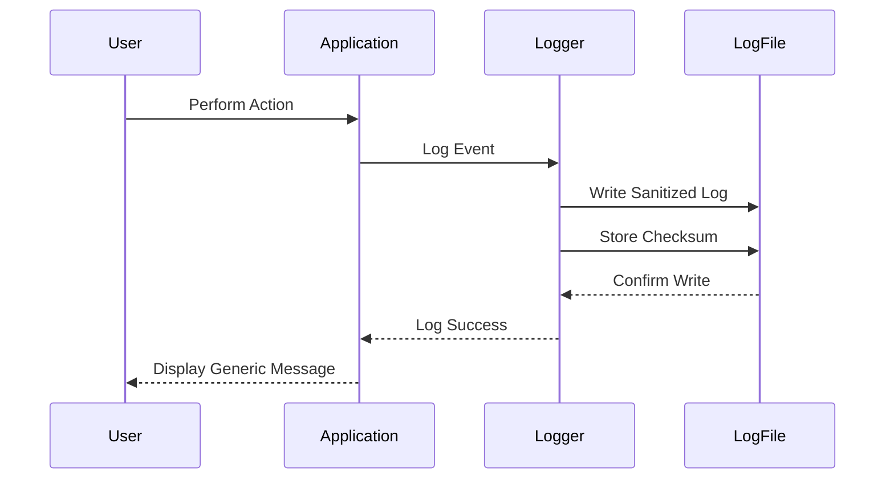

## 16.8 Secure Error Handling and Logging

In the realm of advanced systems programming, secure error handling and logging are critical components that ensure the robustness and security of software systems. In this section, we will delve into best practices for handling errors securely and implementing effective logging mechanisms in the D programming language. Our focus will be on preventing information leakage, maintaining log integrity, and utilizing logs for compliance and security monitoring.

### Error Disclosure

#### Avoiding Information Leakage

One of the primary concerns in error handling is the inadvertent disclosure of sensitive information. When an error occurs, it is crucial to ensure that the error messages do not reveal details that could be exploited by malicious actors. This includes stack traces, database queries, or any internal logic that could provide insights into the system's architecture.

**Best Practices for Avoiding Information Leakage:**

1. **Generic Error Messages**: Provide users with generic error messages that do not expose internal details. For example, instead of displaying "SQL syntax error near 'SELECT * FROM users'", use a message like "An error occurred. Please try again later."

2. **Custom Error Handling**: Implement custom error handlers that catch exceptions and log detailed information internally while presenting a sanitized message to the user.

3. **Use of `@safe` and `@trusted`**: Leverage D's attributes to ensure that code is memory-safe and does not inadvertently expose sensitive data.

4. **Error Codes**: Use error codes instead of detailed messages to indicate the type of error. This allows for easier tracking and resolution without exposing sensitive information.

#### Code Example: Secure Error Handling

```d
import std.stdio;
import std.exception;

void processRequest() {
    try {
        // Simulate a function that may throw an exception
        riskyOperation();
    } catch (Exception e) {
        // Log detailed error internally
        logError(e.msg);

        // Provide a generic error message to the user
        writeln("An error occurred. Please contact support.");
    }
}

void riskyOperation() {
    // Simulate an error
    throw new Exception("Database connection failed.");
}

void logError(string message) {
    // Log the error message to a secure location
    writeln("Logging error: ", message);
}

void main() {
    processRequest();
}
```

### Logging Practices

#### Secure Logging

Secure logging involves recording necessary information without compromising security. Logs should be comprehensive enough to aid in debugging and monitoring but should not contain sensitive information like passwords, personal data, or cryptographic keys.

**Key Considerations for Secure Logging:**

1. **Data Redaction**: Ensure sensitive data is redacted or masked in logs. For example, mask credit card numbers or personal identifiers.

2. **Log Rotation and Retention**: Implement log rotation to manage disk space and ensure logs are retained for an appropriate period based on compliance requirements.

3. **Access Control**: Restrict access to log files to authorized personnel only. Use file permissions and access control lists (ACLs) to enforce this.

4. **Encryption**: Encrypt log files to protect them from unauthorized access, especially if they are stored in insecure locations.

5. **Integrity Checks**: Use checksums or digital signatures to verify the integrity of log files and detect tampering.

#### Code Example: Secure Logging

```d
import std.stdio;
import std.file;
import std.digest.md5;

void logSecurely(string message) {
    // Mask sensitive information
    string sanitizedMessage = message.replaceAll("password=.*", "password=****");

    // Write to log file
    string logFile = "secure_log.txt";
    append(logFile, sanitizedMessage ~ "\n");

    // Compute and store checksum for integrity
    ubyte[] checksum = md5Of(sanitizedMessage);
    append(logFile, "Checksum: " ~ checksum.toHexString() ~ "\n");
}

void main() {
    logSecurely("User login attempt: username=admin, password=secret");
}
```

### Log Management

#### Protecting Log Files from Unauthorized Access

Log management is crucial for maintaining the security and integrity of log data. Proper log management practices ensure that logs are accessible for auditing and monitoring while being protected from unauthorized access.

**Strategies for Effective Log Management:**

1. **Centralized Logging**: Use centralized logging solutions to aggregate logs from multiple sources. This simplifies monitoring and analysis.

2. **Audit Trails**: Maintain audit trails for log access and modifications. This helps in tracking who accessed the logs and when.

3. **Backup and Recovery**: Regularly back up log files and have a recovery plan in place to prevent data loss.

4. **Compliance and Legal Considerations**: Ensure log management practices comply with relevant legal and regulatory requirements, such as GDPR or HIPAA.

### Use Cases and Examples

#### Compliance Auditing

Logs play a vital role in compliance auditing by providing a record of system activities. They can be used to demonstrate compliance with regulations and standards.

**Example: Compliance Auditing with Logs**

```d
import std.stdio;
import std.datetime;

void logComplianceEvent(string eventDescription) {
    // Log compliance-related events with timestamps
    auto timestamp = Clock.currTime().toISOExtString();
    writeln("Compliance Event [", timestamp, "]: ", eventDescription);
}

void main() {
    logComplianceEvent("User data export completed.");
}
```

#### Intrusion Detection

Logs are invaluable for intrusion detection, allowing security teams to monitor for suspicious activities and respond promptly.

**Example: Intrusion Detection with Logs**

```d
import std.stdio;
import std.datetime;

void logIntrusionAttempt(string ipAddress) {
    // Log potential intrusion attempts
    auto timestamp = Clock.currTime().toISOExtString();
    writeln("Intrusion Attempt [", timestamp, "]: IP Address - ", ipAddress);
}

void main() {
    logIntrusionAttempt("192.168.1.100");
}
```

### Visualizing Secure Logging Practices

To better understand the flow of secure logging practices, let's visualize the process using a sequence diagram.



### Knowledge Check

To reinforce your understanding of secure error handling and logging, consider the following questions:

1. Why is it important to avoid detailed error messages in production environments?
2. What are some techniques to ensure log file integrity?
3. How can centralized logging improve security monitoring?

### Try It Yourself

Experiment with the code examples provided by modifying the error messages and log entries. Try implementing additional security measures, such as encrypting log files or adding more detailed logging for compliance purposes.

### Embrace the Journey

Remember, mastering secure error handling and logging is a journey. As you continue to develop your skills, you'll build more secure and robust systems. Keep experimenting, stay curious, and enjoy the process of learning and improving your software's security posture.

## Quiz Time!



### Why is it important to avoid detailed error messages in production environments?

- [x] To prevent information leakage
- [ ] To improve user experience
- [ ] To reduce server load
- [ ] To comply with GDPR

> **Explanation:** Detailed error messages can reveal sensitive information about the system, which can be exploited by attackers.

### What is a key benefit of using error codes instead of detailed messages?

- [x] Easier tracking and resolution
- [ ] Improved performance
- [ ] Enhanced user interface
- [ ] Reduced memory usage

> **Explanation:** Error codes allow developers to track and resolve issues without exposing sensitive information.

### Which attribute in D helps ensure memory safety?

- [x] `@safe`
- [ ] `@trusted`
- [ ] `@system`
- [ ] `@nogc`

> **Explanation:** The `@safe` attribute in D ensures that code is memory-safe, preventing common vulnerabilities.

### What should be done to protect log files from unauthorized access?

- [x] Restrict access using file permissions
- [ ] Store logs in plain text
- [ ] Disable logging
- [ ] Use verbose logging

> **Explanation:** Restricting access using file permissions ensures that only authorized personnel can access log files.

### How can log file integrity be verified?

- [x] Using checksums or digital signatures
- [ ] By storing logs in a database
- [ ] By encrypting logs
- [ ] By compressing logs

> **Explanation:** Checksums or digital signatures can be used to verify that log files have not been tampered with.

### What is a primary use of logs in compliance auditing?

- [x] Providing a record of system activities
- [ ] Improving system performance
- [ ] Enhancing user experience
- [ ] Reducing server load

> **Explanation:** Logs provide a detailed record of system activities, which is essential for demonstrating compliance with regulations.

### How can centralized logging improve security monitoring?

- [x] By aggregating logs from multiple sources
- [ ] By reducing log file size
- [ ] By encrypting log files
- [ ] By disabling verbose logging

> **Explanation:** Centralized logging aggregates logs from multiple sources, making it easier to monitor and analyze security events.

### What is a potential risk of not encrypting log files?

- [x] Unauthorized access to sensitive information
- [ ] Increased disk usage
- [ ] Slower log processing
- [ ] Reduced log retention

> **Explanation:** Without encryption, log files can be accessed by unauthorized individuals, exposing sensitive information.

### Which of the following is a best practice for handling errors securely?

- [x] Implementing custom error handlers
- [ ] Displaying detailed error messages
- [ ] Logging passwords
- [ ] Using verbose logging

> **Explanation:** Custom error handlers allow for detailed logging internally while presenting sanitized messages to users.

### True or False: Log rotation is important for managing disk space and ensuring logs are retained appropriately.

- [x] True
- [ ] False

> **Explanation:** Log rotation helps manage disk space and ensures that logs are retained for the appropriate period.


