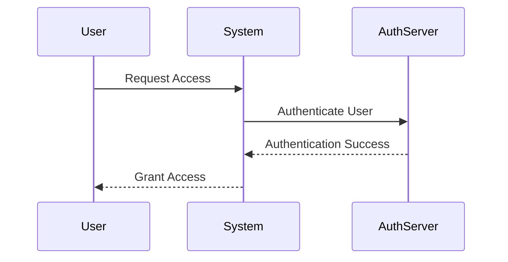

## 16.9 Access Control and Authorization

In the realm of systems programming, securing applications is paramount. Access control and authorization are critical components of a robust security strategy. In this section, we will delve into the mechanisms and patterns used to implement access control and authorization in D programming. We will explore authentication mechanisms, role-based access control (RBAC), and provide practical use cases and examples to illustrate these concepts.

### Authentication Mechanisms

Authentication is the process of verifying the identity of a user or system. It is the first line of defense in securing applications. Let's explore some common authentication mechanisms and how they can be implemented in D.

#### Password Management

Passwords are the most common form of authentication. Implementing secure password management is crucial to prevent unauthorized access.

- **Hashing Passwords**: Always store passwords as hashes, not plain text. Use a strong hashing algorithm like bcrypt or Argon2. D's `std.digest` module can be used for hashing.

```d
import std.digest.digest;
import std.digest.sha;

void main() {
    auto password = "securePassword";
    auto hash = sha256Of(password);
    writeln("Hashed Password: ", hash);
}
```

- **Salting**: Add a unique salt to each password before hashing to prevent rainbow table attacks.

```d
import std.random;
import std.digest.digest;
import std.digest.sha;

void main() {
    auto password = "securePassword";
    auto salt = uniform(0, 1000000).to!string;
    auto saltedPassword = salt ~ password;
    auto hash = sha256Of(saltedPassword);
    writeln("Salted and Hashed Password: ", hash);
}
```

- **Password Policies**: Enforce strong password policies, such as minimum length, complexity, and expiration.

#### Multi-Factor Authentication (MFA)

MFA adds an additional layer of security by requiring more than one form of verification. This can include something the user knows (password), something the user has (a mobile device), or something the user is (biometric data).

- **Implementing MFA**: Combine password authentication with a second factor, such as a one-time password (OTP) sent to the user's mobile device.

```d
import std.random;
import std.datetime;

string generateOTP() {
    auto rng = Random(unpredictableSeed);
    return uniform(100000, 999999, rng).to!string;
}

void main() {
    auto otp = generateOTP();
    writeln("Your OTP is: ", otp);
    // Send OTP to user's mobile device
}
```

### Role-Based Access Control (RBAC)

RBAC is a method of restricting access based on the roles of individual users within an organization. It simplifies management by assigning permissions to roles rather than individuals.

#### Defining Roles and Permissions

- **Roles**: Define roles based on job functions, such as admin, user, and guest.
- **Permissions**: Assign permissions to roles, such as read, write, and execute.

```d
enum Role { Admin, User, Guest }

struct Permission {
    bool read;
    bool write;
    bool execute;
}

Permission getPermissions(Role role) {
    switch (role) {
        case Role.Admin:
            return Permission(true, true, true);
        case Role.User:
            return Permission(true, true, false);
        case Role.Guest:
            return Permission(true, false, false);
    }
    return Permission(false, false, false);
}

void main() {
    auto adminPermissions = getPermissions(Role.Admin);
    writeln("Admin Permissions: ", adminPermissions);
}
```

### Use Cases and Examples

#### Enterprise Applications

In enterprise applications, managing user access and privileges is crucial for maintaining security and compliance.

- **User Management**: Implement user management systems that allow administrators to assign roles and permissions.

```d
struct User {
    string username;
    Role role;
}

void assignRole(User user, Role role) {
    user.role = role;
    writeln("Assigned role ", role, " to user ", user.username);
}

void main() {
    User user = User("john_doe", Role.User);
    assignRole(user, Role.Admin);
}
```

- **Audit Logs**: Maintain audit logs to track changes in user roles and permissions.

#### API Security

APIs are often the gateway to services and data. Securing APIs is essential to prevent unauthorized access.

- **Token-Based Authentication**: Use tokens to authenticate API requests. Tokens can be generated using JWT (JSON Web Tokens).

```d
import std.json;
import std.random;

string generateToken(string username) {
    auto rng = Random(unpredictableSeed);
    auto token = uniform(100000, 999999, rng).to!string;
    return token;
}

void main() {
    auto token = generateToken("john_doe");
    writeln("Generated Token: ", token);
    // Use token for API authentication
}
```

- **Rate Limiting**: Implement rate limiting to prevent abuse of API endpoints.

### Visualizing Access Control and Authorization

To better understand the flow of access control and authorization, let's visualize the process using a sequence diagram.



This diagram illustrates the interaction between a user, the system, and an authentication server during the access control process.

### Knowledge Check

- **Question**: What is the primary purpose of salting passwords?
  - **Answer**: To prevent rainbow table attacks by adding uniqueness to each password hash.

- **Question**: How does MFA enhance security?
  - **Answer**: By requiring multiple forms of verification, making it harder for attackers to gain unauthorized access.

### Try It Yourself

Experiment with the code examples provided. Try modifying the password hashing example to use a different hashing algorithm or implement a simple user management system using RBAC.

### References and Links

- [OWASP Authentication Cheat Sheet](https://cheatsheetseries.owasp.org/cheatsheets/Authentication_Cheat_Sheet.html)
- [D Programming Language Documentation](https://dlang.org/documentation.html)

### Embrace the Journey

Remember, mastering access control and authorization is a continuous journey. Keep exploring, experimenting, and enhancing your skills. Security is an ever-evolving field, and staying informed is key to building secure applications.

## Quiz Time!



### What is the primary purpose of salting passwords?

- [x] To prevent rainbow table attacks by adding uniqueness to each password hash.
- [ ] To increase the length of the password.
- [ ] To make passwords easier to remember.
- [ ] To encrypt the password.

> **Explanation:** Salting adds uniqueness to each password hash, preventing attackers from using precomputed tables (rainbow tables) to crack passwords.

### How does MFA enhance security?

- [x] By requiring multiple forms of verification.
- [ ] By using longer passwords.
- [ ] By encrypting passwords.
- [ ] By storing passwords in plain text.

> **Explanation:** MFA requires multiple forms of verification, making it harder for attackers to gain unauthorized access.

### What is the role of RBAC in access control?

- [x] To restrict access based on user roles.
- [ ] To encrypt data.
- [ ] To store passwords.
- [ ] To manage network traffic.

> **Explanation:** RBAC restricts access based on user roles, simplifying management by assigning permissions to roles rather than individuals.

### Which of the following is a common authentication mechanism?

- [x] Password management.
- [ ] Data encryption.
- [ ] Network monitoring.
- [ ] File compression.

> **Explanation:** Password management is a common authentication mechanism used to verify user identity.

### What is a benefit of using token-based authentication for APIs?

- [x] It allows stateless authentication.
- [ ] It requires storing passwords in plain text.
- [ ] It increases network traffic.
- [ ] It simplifies password management.

> **Explanation:** Token-based authentication allows stateless authentication, meaning the server does not need to store session information.

### What is the purpose of rate limiting in API security?

- [x] To prevent abuse of API endpoints.
- [ ] To increase the speed of API responses.
- [ ] To encrypt API data.
- [ ] To store API requests.

> **Explanation:** Rate limiting prevents abuse of API endpoints by limiting the number of requests a user can make in a given time period.

### Which of the following is a component of MFA?

- [x] Something the user knows.
- [ ] Data encryption.
- [x] Something the user has.
- [ ] Network monitoring.

> **Explanation:** MFA includes something the user knows (e.g., password) and something the user has (e.g., mobile device).

### What is a key feature of RBAC?

- [x] Assigning permissions to roles.
- [ ] Encrypting data.
- [ ] Monitoring network traffic.
- [ ] Compressing files.

> **Explanation:** RBAC assigns permissions to roles, simplifying access management.

### What is the purpose of audit logs in enterprise applications?

- [x] To track changes in user roles and permissions.
- [ ] To encrypt user data.
- [ ] To monitor network traffic.
- [ ] To compress files.

> **Explanation:** Audit logs track changes in user roles and permissions, providing a record of access control changes.

### True or False: Tokens used in token-based authentication should be stored in plain text.

- [ ] True
- [x] False

> **Explanation:** Tokens should not be stored in plain text; they should be securely stored and transmitted to prevent unauthorized access.


